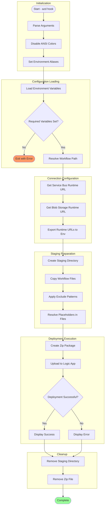

# deploy-workflow

## Overview

Deploys Logic Apps Standard workflow definitions from the local OrdersManagement project to Azure, resolving environment variable placeholders and configuring API connections.

## Description

This script handles the deployment of Azure Logic Apps Standard workflows as part of the Azure Developer CLI (azd) predeploy hook. It packages workflow definitions, resolves environment variable placeholders in configuration files, and deploys the complete workflow package to Azure using zip deployment.

The script performs several sophisticated operations: setting up environment variable aliases to ensure compatibility between azd environment variables and Logic Apps connection configuration formats, resolving `${VARIABLE}` placeholders in workflow JSON files and connections.json with actual values, retrieving runtime URLs for API connections from Azure, creating a staging directory with properly configured workflow files, and performing zip deployment to the target Logic App.

Files matching patterns defined in `.funcignore` (debug files, local settings, test files, etc.) are excluded from the deployment package to minimize deployment size and prevent accidental deployment of development artifacts.

## Workflow Diagram



## Prerequisites

| Category | Requirement | Version | Verification Command | Required |
|----------|-------------|---------|---------------------|----------|
| Runtime | PowerShell Core | >= 7.0 | `$PSVersionTable.PSVersion` | Yes |
| Runtime | Bash | >= 4.0 | `bash --version` | Yes |
| CLI Tool | Azure CLI | >= 2.50 | `az --version` | Yes |
| CLI Tool | jq (Bash only) | Latest | `jq --version` | Yes (Bash) |
| CLI Tool | zip (Bash only) | Latest | `zip --version` | Yes (Bash) |
| Environment Variable | AZURE_SUBSCRIPTION_ID | N/A | `echo $AZURE_SUBSCRIPTION_ID` | Yes |
| Environment Variable | AZURE_RESOURCE_GROUP | N/A | `echo $AZURE_RESOURCE_GROUP` | Yes |
| Environment Variable | LOGIC_APP_NAME | N/A | `echo $LOGIC_APP_NAME` | Yes |

### Installation Commands

```bash
# Install jq and zip (Bash dependencies)
# macOS
brew install jq zip

# Ubuntu/Debian
sudo apt-get install jq zip

# RHEL/CentOS
sudo yum install jq zip
```

## Parameters/Arguments

### PowerShell Parameters

| Parameter | Type | Required | Default | Description |
|-----------|------|----------|---------|-------------|
| `-WorkflowPath` | `[string]` | No | `../workflows/OrdersManagement/OrdersManagementLogicApp` | Path to workflow project directory |

### Bash Arguments

| Position/Flag | Type | Required | Default | Description |
|---------------|------|----------|---------|-------------|
| `$1` (positional) | string | No | `../workflows/OrdersManagement/OrdersManagementLogicApp` | Path to workflow project directory |

## Input/Output Specifications

### Inputs

**Environment Variables Read (set by azd):**

| Variable | Required | Description |
|----------|----------|-------------|
| `AZURE_SUBSCRIPTION_ID` | Yes | Azure subscription GUID |
| `AZURE_RESOURCE_GROUP` | Yes | Resource group containing Logic App |
| `AZURE_LOCATION` | No | Azure region (default: westus3) |
| `LOGIC_APP_NAME` | Yes | Name of target Logic App |
| `SERVICE_BUS_CONNECTION_RUNTIME_URL` | No | Pre-configured Service Bus URL |
| `AZURE_BLOB_CONNECTION_RUNTIME_URL` | No | Pre-configured Blob Storage URL |
| `MANAGED_IDENTITY_NAME` | No | Managed identity for connections |

**Files/Paths Expected:**

- Workflow directory with `host.json`, `connections.json`, workflow folders

**Exclude Patterns (from .funcignore):**

- `.debug`, `.git*`, `.vscode`
- `__azurite*`, `__blobstorage__`, `__queuestorage__`
- `local.settings.json`, `test`, `workflow-designtime`

### Outputs

**Exit Codes:**

| Exit Code | Meaning |
|-----------|---------|
| 0 | Success - Workflow deployed |
| 1 | Error - Deployment failed |

**stdout Output:**

- Deployment progress messages
- Environment variable resolution status
- Deployment result summary

**Azure Resources Modified:**

- Logic App workflow definitions updated

## Usage Examples

### Basic Usage

```powershell
# PowerShell: Deploy with default workflow path (called by azd)
.\deploy-workflow.ps1
```

```bash
# Bash: Deploy with default workflow path (called by azd)
./deploy-workflow.sh
```

### Advanced Usage

```powershell
# PowerShell: Deploy from custom path
.\deploy-workflow.ps1 -WorkflowPath "C:\MyWorkflows\OrdersLogicApp"
```

```bash
# Bash: Deploy from custom path
./deploy-workflow.sh "/home/user/workflows/OrdersLogicApp"
```

### CI/CD Pipeline Usage

```yaml
# Azure DevOps Pipeline
- task: AzureCLI@2
  displayName: 'Deploy Logic App workflows'
  inputs:
    azureSubscription: 'Azure-Connection'
    scriptType: 'pscore'
    scriptLocation: 'scriptPath'
    scriptPath: '$(System.DefaultWorkingDirectory)/hooks/deploy-workflow.ps1'
  env:
    AZURE_SUBSCRIPTION_ID: $(AZURE_SUBSCRIPTION_ID)
    AZURE_RESOURCE_GROUP: $(AZURE_RESOURCE_GROUP)
    AZURE_LOCATION: $(AZURE_LOCATION)
    LOGIC_APP_NAME: $(LOGIC_APP_NAME)

# GitHub Actions
- name: Deploy Logic App workflows
  shell: bash
  run: |
    chmod +x ./hooks/deploy-workflow.sh
    ./deploy-workflow.sh
  env:
    AZURE_SUBSCRIPTION_ID: ${{ secrets.AZURE_SUBSCRIPTION_ID }}
    AZURE_RESOURCE_GROUP: ${{ vars.AZURE_RESOURCE_GROUP }}
    LOGIC_APP_NAME: ${{ vars.LOGIC_APP_NAME }}
```

## Error Handling and Exit Codes

| Exit Code | Meaning | Recovery Action |
|-----------|---------|-----------------|
| 0 | Success | N/A |
| 1 | Deployment error | Check Azure CLI auth, verify Logic App exists |

### Error Handling Approach

**PowerShell:**

- `Set-StrictMode -Version Latest`
- `$ErrorActionPreference = 'Stop'`
- Validation of required environment variables
- Warning messages for unresolved placeholders
- Cleanup in finally block

**Bash:**

- `set -euo pipefail`
- Cleanup trap for staging/zip files
- Dependency validation (jq, zip)
- Detailed error logging

## Security Considerations

### Credential Handling

- [x] No hardcoded secrets
- [x] Connection strings resolved from environment
- [x] Runtime URLs obtained via Azure CLI session
- [x] ANSI colors disabled to prevent JSON parsing issues

### Required Permissions

| Permission/Role | Scope | Justification |
|-----------------|-------|---------------|
| Logic App Contributor | Resource Group | Deploy workflow definitions |
| API Connections Reader | Resource Group | Retrieve connection runtime URLs |

### Network Security

- **Endpoints accessed:** Azure Resource Manager, Logic App deployment endpoint
- **TLS requirements:** TLS 1.2+
- **Firewall rules needed:** Outbound HTTPS (443)

### Logging Security

- **Sensitive data masking:** Connection strings resolved but not logged in full
- **Audit trail:** Deployment logs with timestamps

## Known Limitations

- Placeholder resolution only supports `${VARIABLE}` format
- Unresolved placeholders generate warnings but don't fail deployment
- Zip deployment may timeout for large workflow packages
- Connection runtime URL retrieval requires existing API connections
- Environment aliases may not cover all custom variable names

## Related Scripts

| Script | Relationship | Description |
|--------|--------------|-------------|
| [postprovision.md](postprovision.md) | Precedes | Sets up environment variables used by this script |
| [preprovision.md](preprovision.md) | Related | Validates prerequisites before deployment |

## Changelog

| Version | Date | Changes |
|---------|------|---------|
| 2.0.1 | 2026-01-06 | Added ANSI color disable for CI compatibility |
| 2.0.0 | 2025-12-01 | Complete rewrite with environment aliasing |
| 1.0.0 | 2025-06-01 | Initial release |
