# 🚀 deploy-workflow

> [!NOTE]
> **Target Audience**: DevOps Engineers, Logic Apps Developers  
> **Reading Time**: ~12 minutes

<details>
<summary>📖 Navigation</summary>

| Previous | Index | Next |
|:---------|:-----:|-----:|
| [postinfradelete](postinfradelete.md) | [📚 Index](README.md) | [clean-secrets](clean-secrets.md) |

</details>

Deploys Logic Apps Standard workflows to Azure.

## 📑 Table of Contents

- [📋 Overview](#-overview)
- [⚙️ Prerequisites](#️-prerequisites)
- [🎯 Parameters](#-parameters)
- [🌐 Environment Variables](#-environment-variables)
- [⚙️ Functionality](#️-functionality)
- [📖 Usage Examples](#-usage-examples)
- [💻 Platform Differences](#-platform-differences)
- [🚪 Exit Codes](#-exit-codes)
- [🔗 Related Hooks](#-related-hooks)

## 📋 Overview

Deploys workflow definitions from OrdersManagement Logic App to Azure. This script runs as an `azd` predeploy hook, meaning environment variables are automatically loaded during the provisioning process.

### 🔑 Key Operations

- Resolves environment variable placeholders in workflow files
- Maps `AZURE_*` variables to `WORKFLOWS_*` equivalents for connections.json compatibility
- Packages workflow files (excluding debug/test files)
- Deploys workflows via Azure CLI zip deployment

### 📅 When Executed

- **Automatically**: Before application deployment during `azd deploy` or `azd up`
- **Manually**: When needing to update workflow definitions without full redeployment

## ⚙️ Prerequisites

### 🔧 Required Tools

| Tool | Minimum Version | Purpose |
|:-----|:---------------:|:--------|
| PowerShell Core | 7.0+ | Script execution (PowerShell version) |
| Bash | 4.0+ | Script execution (Bash version) |
| Azure CLI (az) | 2.50+ | Workflow deployment |
| jq | Latest | JSON manipulation (Bash version) |
| zip | Latest | Package creation (Bash version) |

### 🔐 Required Permissions

- **Azure CLI**: Must be authenticated (`az login`)
- **Logic App**: Contributor access on the Logic App resource
- **Storage**: Access to retrieve connection runtime URLs

## 🎯 Parameters

### PowerShell Parameters

| Parameter | Type | Required | Default | Description |
|:----------|:----:|:--------:|:-------:|:------------|
| `WorkflowPath` | String | No | `../workflows/OrdersManagement/OrdersManagementLogicApp` | Path to workflow project directory |

### Bash Parameters

| Parameter | Type | Required | Default | Description |
|:----------|:----:|:--------:|:-------:|:------------|
| `workflow_path` (positional) | String | No | `../workflows/OrdersManagement/OrdersManagementLogicApp` | Path to workflow project directory |

## 🌐 Environment Variables

### Variables Read (Required)

| Variable | Description | Set By |
|:---------|:------------|:------:|
| `AZURE_SUBSCRIPTION_ID` | Azure subscription GUID | azd |
| `AZURE_RESOURCE_GROUP` | Resource group containing Logic App | azd |
| `AZURE_LOCATION` | Azure region | azd |
| `LOGIC_APP_NAME` | Target Logic App name | azd |

### Variables Read (Optional)

| Variable | Description | Default |
|:---------|:------------|:-------:|
| `MANAGED_IDENTITY_NAME` | Managed identity for connections | None |
| `SERVICE_BUS_CONNECTION_NAME` | Service Bus API connection name | None |
| `SERVICE_BUS_NAMESPACE` | Service Bus namespace | None |
| `STORAGE_CONNECTION_NAME` | Storage API connection name | None |
| `SQL_CONNECTION_NAME` | SQL API connection name | None |

### Variable Mapping

The script maps `AZURE_*` variables to `WORKFLOWS_*` for connections.json compatibility:

| Source Variable | Target Variable |
|:----------------|:----------------|
| `AZURE_SUBSCRIPTION_ID` | `WORKFLOWS_SUBSCRIPTION_ID` |
| `AZURE_RESOURCE_GROUP` | `WORKFLOWS_RESOURCE_GROUP_NAME` |
| `AZURE_LOCATION` | `WORKFLOWS_LOCATION_NAME` |

### Variables Set

Environment aliases are set temporarily during execution for placeholder resolution.

## ⚙️ Functionality

### 🔄 Execution Flow

```mermaid
---
title: deploy-workflow Execution Flow
---
flowchart TD
    %% ===== CLASS DEFINITIONS =====
    classDef primary fill:#4F46E5,stroke:#3730A3,color:#FFFFFF
    classDef secondary fill:#10B981,stroke:#059669,color:#FFFFFF
    classDef datastore fill:#F59E0B,stroke:#D97706,color:#000000
    classDef external fill:#6B7280,stroke:#4B5563,color:#FFFFFF,stroke-dasharray:5 5
    classDef failed fill:#F44336,stroke:#C62828,color:#FFFFFF
    classDef trigger fill:#818CF8,stroke:#4F46E5,color:#FFFFFF
    classDef decision fill:#FFFBEB,stroke:#F59E0B,color:#000000
    classDef input fill:#F3F4F6,stroke:#6B7280,color:#000000

    %% ===== INITIALIZATION =====
    A([Start]) -->|begin| B[Parse Arguments]
    B -->|configure| C[Disable ANSI Colors]
    C -->|display| D[Display Banner]
    
    %% ===== ENVIRONMENT SETUP =====
    subgraph EnvSetup["Environment Setup"]
        D -->|map| E[Set Workflow Environment Aliases]
        E -->|load| F[Load Configuration from Environment]
        F -->|validate| G{Required Variables<br/>Present?}
        G -->|No| H[Error: Missing Variables]
        H -->|terminate| I([Exit 1])
        G -->|Yes| J[Log Target Configuration]
    end
    
    %% ===== WORKFLOW DISCOVERY =====
    subgraph WorkflowDiscovery["Workflow Discovery"]
        J -->|check| K{Custom Workflow<br/>Path Provided?}
        K -->|Yes| L[Use Custom Path]
        K -->|No| M[Search Default Path]
        M -->|verify| N{Path<br/>Exists?}
        N -->|No| O[Error: Project Not Found]
        O -->|terminate| I
        N -->|Yes| P[Resolve Full Path]
        L -->|resolve| P
        
        P -->|scan| Q[Scan for Workflow Folders]
        Q -->|filter| R[Filter by workflow.json]
        R -->|exclude| S[Apply Exclude Patterns]
        S -->|verify| T{Workflows<br/>Found?}
        T -->|No| U[Error: No Workflows]
        U -->|terminate| I
        T -->|Yes| V[Log Discovered Workflows]
    end
    
    %% ===== CONNECTION SETUP =====
    subgraph ConnectionSetup["Connection Setup"]
        V -->|check| W{Service Bus URL<br/>in Environment?}
        W -->|No| X[Fetch from Azure REST API]
        W -->|Yes| Y[Use Environment Value]
        X -->|verify| Z{Fetch<br/>Successful?}
        Z -->|No| AA[Warning: URL Not Found]
        Z -->|Yes| AB[Store Runtime URL]
        Y -->|store| AB
        AA -->|continue| AB
        
        AB -->|check| AC{Blob URL<br/>in Environment?}
        AC -->|No| AD[Fetch from Azure REST API]
        AC -->|Yes| AE[Use Environment Value]
        AD -->|verify| AF{Fetch<br/>Successful?}
        AF -->|No| AG[Warning: URL Not Found]
        AF -->|Yes| AH[Store Runtime URL]
        AE -->|store| AH
        AG -->|continue| AH
    end
    
    %% ===== STAGING =====
    subgraph Staging["Staging"]
        AH -->|create| AI[Create Staging Directory]
        AI -->|copy| AJ[Copy host.json]
        AJ -->|process| AK[Process connections.json]
        AK -->|resolve| AL[Resolve Placeholders]
        AL -->|process| AM[Process parameters.json]
        AM -->|resolve| AN[Resolve Placeholders]
        
        AN -->|iterate| AO[For Each Workflow]
        AO -->|create| AP[Create Workflow Directory]
        AP -->|process| AQ[Process workflow.json]
        AQ -->|resolve| AR[Resolve Placeholders]
        AR -->|check| AS{More<br/>Workflows?}
        AS -->|Yes| AO
        AS -->|No| AT[Staging Complete]
    end
    
    %% ===== PACKAGING =====
    subgraph Packaging["Packaging"]
        AT -->|compress| AU[Create Zip Archive]
        AU -->|report| AV[Log Package Size]
    end
    
    %% ===== DEPLOYMENT =====
    subgraph Deployment["Deployment"]
        AV -->|configure| AW[Update App Settings]
        AW -->|verify| AX{Settings<br/>Updated?}
        AX -->|No| AY[Warning: Settings Failed]
        AX -->|Yes| AZ[Settings Updated ✓]
        AY -->|continue| AZ
        
        AZ -->|record| BA[Record Start Time]
        BA -->|deploy| BB[Deploy via az functionapp]
        BB -->|verify| BC{Deployment<br/>Successful?}
        BC -->|No| BD[Error: Deployment Failed]
        BD -->|fetch| BE[Fetch Deployment Logs]
        BE -->|terminate| I
        BC -->|Yes| BF[Calculate Duration]
    end
    
    %% ===== CLEANUP =====
    subgraph Cleanup["Cleanup"]
        BF -->|remove| BG[Remove Staging Directory]
        BG -->|remove| BH[Remove Zip File]
        BH -->|display| BI[Display Success Banner]
    end
    
    BI -->|complete| BJ([Exit 0])

    %% ===== SUBGRAPH STYLES =====
    style EnvSetup fill:#EEF2FF,stroke:#4F46E5,stroke-width:2px
    style WorkflowDiscovery fill:#ECFDF5,stroke:#10B981,stroke-width:2px
    style ConnectionSetup fill:#E0E7FF,stroke:#4F46E5,stroke-width:2px
    style Staging fill:#FEF3C7,stroke:#F59E0B,stroke-width:2px
    style Packaging fill:#D1FAE5,stroke:#10B981,stroke-width:1px
    style Deployment fill:#F3F4F6,stroke:#6B7280,stroke-width:2px
    style Cleanup fill:#FEE2E2,stroke:#F44336,stroke-width:2px

    %% ===== NODE CLASS ASSIGNMENTS =====
    class A,BJ trigger
    class B,C,D,E,F,J,Q,R,S,V,AI,AJ,AK,AL,AM,AN,AO,AP,AQ,AR,AU,AV,AW,BA,BB,BF,BG,BH,BI primary
    class AT,AZ secondary
    class G,K,N,T,W,Z,AC,AF,AS,AX,BC decision
    class H,O,U,AA,AG,AY,BD,BE input
    class L,M,P,X,Y,AB,AD,AE,AH external
    class I failed
```



### 🔄 Placeholder Pattern

The script resolves placeholders in the format `${VARIABLE_NAME}`:

```json
// Before resolution
{
  "subscriptionId": "${AZURE_SUBSCRIPTION_ID}",
  "resourceGroup": "${AZURE_RESOURCE_GROUP}"
}

// After resolution
{
  "subscriptionId": "xxxxxxxx-xxxx-xxxx-xxxx-xxxxxxxxxxxx",
  "resourceGroup": "rg-logicapps-monitoring-dev"
}
```

### 🚫 Excluded Files

Files matching these patterns are excluded from deployment (per `.funcignore`):

| Pattern | Description |
|:--------|:------------|
| `.debug` | Debug configuration |
| `.git*` | Git metadata |
| `.vscode` | VS Code settings |
| `__azurite*` | Local Azurite data |
| `__blobstorage__` | Local blob storage |
| `__queuestorage__` | Local queue storage |
| `local.settings.json` | Local settings (secrets) |
| `test` | Test files |
| `workflow-designtime` | Design-time artifacts |

### 🔗 Connection Runtime URL Retrieval

For API connections, the script retrieves runtime URLs via:

```http
POST https://management.azure.com/subscriptions/{sub}/resourceGroups/{rg}/providers/Microsoft.Web/connections/{connectionName}/listConnectionKeys?api-version=2016-06-01
```

## 📖 Usage Examples

### PowerShell

```powershell
# Deploy using default workflow path
.\deploy-workflow.ps1

# Deploy from custom path
.\deploy-workflow.ps1 -WorkflowPath "C:\MyWorkflows\LogicApp"
```

### Bash

```bash
# Deploy using default workflow path
./deploy-workflow.sh

# Deploy from custom path
./deploy-workflow.sh "/path/to/workflows"
```

### 📝 Sample Output

```
11:23:45 [i] Starting workflow deployment...
11:23:45 [i] Workflow path: ../workflows/OrdersManagement/OrdersManagementLogicApp
11:23:45 [i] Target Logic App: logic-orders-management-dev

11:23:45 [i] Setting environment aliases...
11:23:45 [✓] Set WORKFLOWS_SUBSCRIPTION_ID=xxxxxxxx-xxxx-xxxx-xxxx-xxxxxxxxxxxx
11:23:45 [✓] Set WORKFLOWS_RESOURCE_GROUP_NAME=rg-logicapps-monitoring-dev
11:23:45 [✓] Set WORKFLOWS_LOCATION_NAME=eastus2

11:23:46 [i] Resolving placeholders in workflow files...
11:23:46 [✓] Resolved ${AZURE_SUBSCRIPTION_ID} in connections.json
11:23:46 [✓] Resolved ${AZURE_RESOURCE_GROUP} in connections.json
11:23:46 [✓] Resolved ${SERVICE_BUS_NAMESPACE} in connections.json
11:23:46 [!] Unresolved in workflow.json: CUSTOM_VAR

11:23:47 [i] Retrieving connection runtime URLs...
11:23:48 [✓] Retrieved runtime URL for sb-connection

11:23:49 [i] Creating deployment package...
11:23:49 [i] Excluded: local.settings.json, .debug, workflow-designtime

11:23:50 [i] Deploying to Azure...
11:23:55 [✓] Deployment completed successfully

11:23:55 [✓] Workflow deployment complete
```

## 💻 Platform Differences

| Aspect | PowerShell | Bash |
|:-------|:-----------|:-----|
| Regex replacement | `-replace` operator | `sed` or Bash substitution |
| Zip creation | `Compress-Archive` | `zip` command |
| JSON manipulation | `ConvertFrom-Json` / `ConvertTo-Json` | `jq` |
| Temp directory | `$env:TEMP` | `/tmp` |

## 🚪 Exit Codes

| Code | Meaning |
|:----:|:--------|
| `0` | Success - workflows deployed successfully |
| `1` | Error - deployment failed or configuration error |
| `130` | Script interrupted by user (SIGINT) |

## 🔗 Related Hooks

| Hook | Relationship |
|:-----|:-------------|
| [postprovision](postprovision.md) | Configures secrets; runs before this hook deploys workflows |
| [preprovision](preprovision.md) | Validates environment; ensures azd context is available |

## 🔧 Troubleshooting

### ⚠️ Common Issues

1. **"Unresolved placeholders" warnings**
   - Ensure all required environment variables are exported by azd
   - Check for typos in placeholder names

2. **"Failed to retrieve connection runtime URL"**
   - Verify the API connection resource exists
   - Check permissions on the resource group

3. **"Deployment failed"**
   - Review Azure CLI output for specific error
   - Verify Logic App exists and is running
   - Check for workflow definition validation errors

4. **"Connection authentication failed"**
   - Run `az login` to refresh credentials
   - Verify managed identity is properly configured

### 🐛 Debugging Tips

- Check `connections.json` after resolution to verify placeholders were replaced
- Use `az webapp log tail` to monitor Logic App deployment logs
- Verify workflow definitions are valid JSON before deployment

---

<div align="center">

**[← postinfradelete](postinfradelete.md)** · **[⬆️ Back to Top](#-deploy-workflow)** · **[clean-secrets →](clean-secrets.md)**

</div>

**Version**: 2.0.1  
**Author**: Azure Logic Apps Monitoring Team  
**Last Modified**: January 2026
