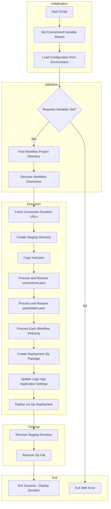

# Deploy Logic Apps Standard Workflows to Azure

## Overview

> [!NOTE]
> This script automatically runs as an `azd predeploy` hook. Manual execution is also supported.

This script deploys workflow definitions from the OrdersManagement Logic App to Azure. It packages workflow files (`workflow.json`, `connections.json`, `parameters.json`, `host.json`), resolves environment variable placeholders, and deploys via zip deployment to Azure Logic Apps Standard.

The script is designed to run as an **Azure Developer CLI (azd) predeploy hook**, where environment variables are automatically loaded from the azd environment.

The script is implemented in **both PowerShell and Bash** to support cross-platform deployment scenarios.

## Script Classification

| Attribute | Value |
|-----------|-------|
| **Category** | azd Lifecycle Hook |
| **Trigger Mechanism** | azd hook (predeploy) or manual execution |
| **azd Hook** | Yes - `predeploy` |
| **azd Command** | `azd deploy` |

## Supported Environments

### Shells

| Shell | Minimum Version |
|-------|-----------------|
| PowerShell | 7.0+ |
| Bash | 4.0+ |

### Operating Systems

| OS | Supported |
|----|-----------|
| Windows | ✓ |
| Linux | ✓ |
| macOS | ✓ |

## Prerequisites

| Prerequisite | Required | Description |
|--------------|----------|-------------|
| Azure CLI | Yes | Version 2.50+ for deployment commands |
| jq | Yes (Bash only) | JSON processor for parsing Azure CLI output |
| zip | Yes (Bash only) | Archive utility for creating deployment packages |
| Azure Authentication | Yes | Must be logged in with appropriate permissions |

### Required Environment Variables

> [!WARNING]
> Deployment will fail if these environment variables are not set. When running via `azd deploy`, they are set automatically.

| Variable | Required | Description |
|----------|----------|-------------|
| `AZURE_SUBSCRIPTION_ID` | Yes | Azure subscription ID for deployment |
| `AZURE_RESOURCE_GROUP` | Yes | Resource group containing the Logic App |
| `LOGIC_APP_NAME` | Yes | Name of the Logic App Standard resource |

### Optional Environment Variables

| Variable | Default | Description |
|----------|---------|-------------|
| `AZURE_LOCATION` | `westus3` | Azure region |
| `SERVICE_BUS_CONNECTION_RUNTIME_URL` | Auto-fetched | Runtime URL for Service Bus connection |
| `AZURE_BLOB_CONNECTION_RUNTIME_URL` | Auto-fetched | Runtime URL for Azure Blob connection |
| `WORKFLOWS_SUBSCRIPTION_ID` | Mapped from `AZURE_SUBSCRIPTION_ID` | Alias for connections.json compatibility |
| `WORKFLOWS_RESOURCE_GROUP_NAME` | Mapped from `AZURE_RESOURCE_GROUP` | Alias for connections.json compatibility |
| `WORKFLOWS_LOCATION_NAME` | Mapped from `AZURE_LOCATION` | Alias for connections.json compatibility |

## Files

| File | Description |
|------|-------------|
| `deploy-workflow.ps1` | PowerShell implementation |
| `deploy-workflow.sh` | Bash implementation |

## High-Level Script Flow



## Usage

### PowerShell

```powershell
# Deploy using default path and azd environment variables
./deploy-workflow.ps1

# Deploy from a custom workflow path
./deploy-workflow.ps1 -WorkflowPath "C:\MyWorkflows\LogicApp"

# Deploy with manually set environment variables
$env:AZURE_SUBSCRIPTION_ID = "00000000-0000-0000-0000-000000000000"
$env:AZURE_RESOURCE_GROUP = "my-rg"
$env:LOGIC_APP_NAME = "my-logic-app"
./deploy-workflow.ps1
```

### Bash

```bash
# Deploy using default path and azd environment variables
./deploy-workflow.sh

# Deploy from a custom workflow path
./deploy-workflow.sh "/path/to/workflows/LogicApp"

# Deploy with manually set environment variables
export AZURE_SUBSCRIPTION_ID="00000000-0000-0000-0000-000000000000"
export AZURE_RESOURCE_GROUP="my-rg"
export LOGIC_APP_NAME="my-logic-app"
./deploy-workflow.sh
```

## Parameters

| Logical Parameter | PowerShell Name | Bash Name | Required | Description |
|-------------------|-----------------|-----------|----------|-------------|
| Workflow Path | `-WorkflowPath` | Positional argument | No | Path to workflow project directory. Defaults to `../workflows/OrdersManagement/OrdersManagementLogicApp` |

## Examples

### Deploy Using azd Environment

**PowerShell:**

```powershell
./deploy-workflow.ps1
```

**Bash:**

```bash
./deploy-workflow.sh
```

### Deploy from Custom Path

**PowerShell:**

```powershell
./deploy-workflow.ps1 -WorkflowPath "C:\MyWorkflows\LogicApp"
```

**Bash:**

```bash
./deploy-workflow.sh "/path/to/workflows/LogicApp"
```

## Error Handling & Exit Codes

| Exit Code | Description |
|-----------|-------------|
| 0 | Deployment completed successfully |
| 1 | Missing dependencies, environment variables, or deployment failure |

### Error Behavior

- **PowerShell**: Uses `$ErrorActionPreference = 'Stop'` for strict error handling. Errors are caught and logged with stack traces in verbose mode.
- **Bash**: Uses `set -euo pipefail` for strict error handling. Cleanup trap ensures temporary files are removed on exit.

## Logging & Output

| Output Type | Description |
|-------------|-------------|
| stdout | Status messages, workflow discovery, deployment progress |
| stderr | Error messages, warnings for unresolved placeholders |
| Color-coded output | Visual distinction using ASCII box characters and colors |

### Log Levels

| Level | Prefix | Color | Description |
|-------|--------|-------|-------------|
| Info | `[i]` | Cyan | General progress information |
| Success | `[✓]` | Green | Successful operations |
| Warning | `[!]` | Yellow | Non-fatal issues (e.g., unresolved placeholders) |
| Error | `[✗]` | Red | Fatal errors |

## Security Considerations

- Uses Azure CLI authentication for Azure resource access
- Connection runtime URLs are fetched via Azure REST API
- Environment variable placeholders (`${VARIABLE}`) are resolved at deployment time
- ANSI colors are disabled (`AZURE_CORE_NO_COLOR=true`) to prevent JSON parsing errors in CI
- Temporary staging directory and zip files are cleaned up after deployment

## Troubleshooting

| Issue | Resolution |
|-------|------------|
| `Missing environment variables` | Ensure `AZURE_SUBSCRIPTION_ID`, `AZURE_RESOURCE_GROUP`, and `LOGIC_APP_NAME` are set |
| `Workflow project not found` | Verify the workflow path exists and contains `host.json` |
| `No workflows found` | Ensure workflow directories contain `workflow.json` files |
| `Unresolved placeholders` | Set the missing environment variables or check for typos |
| `Deployment failed` | Check Azure CLI authentication and Logic App permissions |
| `jq is required but not installed` (Bash) | Install jq: `brew install jq` (macOS), `apt-get install jq` (Ubuntu) |

### Excluded Patterns

> [!TIP]
> These patterns are excluded from the deployment package. Modify `.funcignore` to customize exclusions.

The following patterns are excluded from deployment (per `.funcignore`):

- `.debug`
- `.git*`
- `.vscode`
- `__azurite*`
- `__blobstorage__`
- `__queuestorage__`
- `local.settings.json`
- `test`
- `workflow-designtime`

## Development Notes

- Script version: `2.0.1` for both implementations
- Placeholder pattern: `${VARIABLE_NAME}` (uppercase letters, numbers, and underscores)
- Environment aliases are automatically set for `WORKFLOWS_*` variables
- Connection runtime URLs are fetched from Azure if not provided in environment

## License & Ownership

| Attribute | Value |
|-----------|-------|
| Version | 2.0.1 |
| Requires | Azure CLI 2.50+, PowerShell 7.0+ / Bash 4.0+, jq (Bash), zip (Bash) |
| Repository | [Azure-LogicApps-Monitoring](https://github.com/Evilazaro/Azure-LogicApps-Monitoring) |

## Related Links

- [Azure Logic Apps Documentation](https://learn.microsoft.com/azure/logic-apps/)
- [Azure Developer CLI Documentation](https://learn.microsoft.com/azure/developer/azure-developer-cli/)
