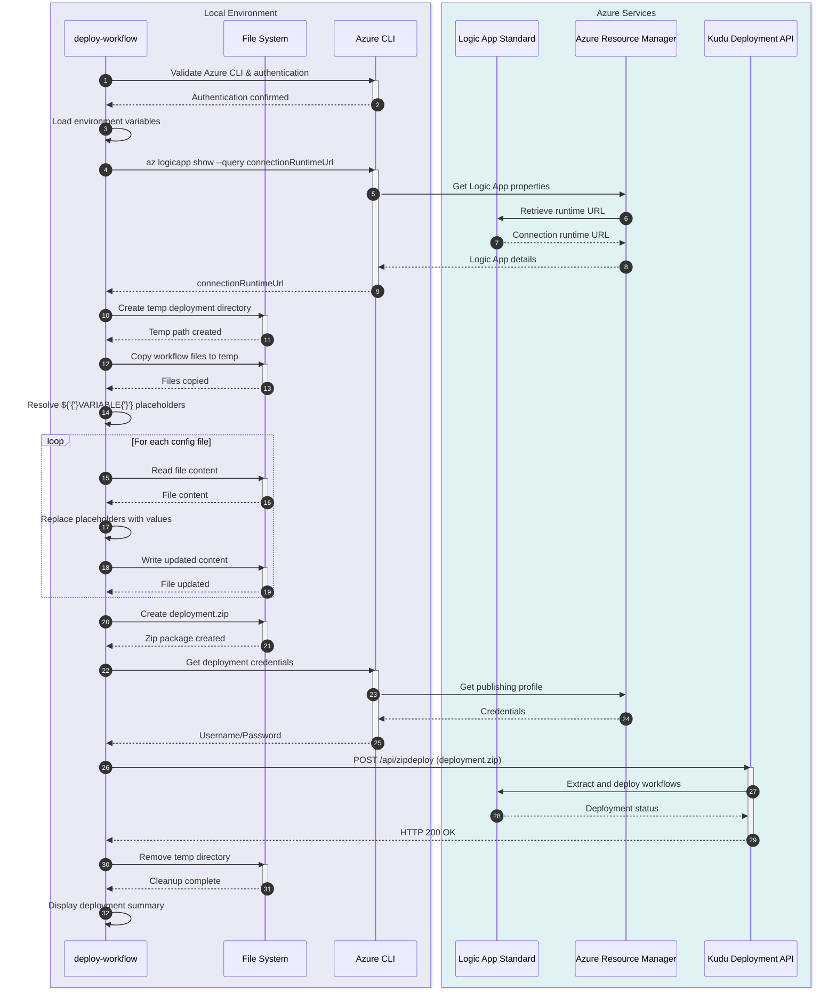

# deploy-workflow

[Home](../../README.md) > [Docs](..) > [Hooks](README.md) > deploy-workflow

> 🚀 Deploys Azure Logic Apps Standard workflows to Azure using zip deployment mechanism

---

## Table of Contents

- [Overview](#overview)
- [Compatibility](#compatibility)
- [Prerequisites](#prerequisites)
- [Parameters](#parameters)
- [Script Flow](#script-flow)
- [Sequence Diagram](#sequence-diagram)
- [Functions](#functions)
- [Usage](#usage)
- [Environment Variables](#environment-variables)
- [Exit Codes](#exit-codes)
- [Error Handling](#error-handling)
- [Notes](#notes)
- [See Also](#see-also)

---

## Overview

This script deploys Azure Logic Apps Standard workflows to Azure using the zip deployment mechanism. It packages workflow definitions, resolves placeholder variables in configuration files, and deploys to the target Logic App.

The script supports variable placeholder resolution using the `${VARIABLE}` syntax, allowing workflow definitions to reference environment-specific values that are substituted at deployment time.

**Operations Performed:**

1. Validates Azure CLI installation and authentication
2. Retrieves Logic App connection runtime URL
3. Resolves `${VARIABLE}` placeholders in workflow configuration files
4. Creates deployment zip package
5. Deploys to Azure Logic Apps using kudu zip deployment API
6. Validates deployment success

---

## Compatibility

| Platform    | Script                 | Status |
|:------------|:-----------------------|:------:|
| Windows     | `deploy-workflow.ps1`  |   ✅   |
| Linux/macOS | `deploy-workflow.sh`   |   ✅   |

---

## Prerequisites

| Requirement | Details | Installation Guide |
|:------------|:--------|:-------------------|
| **PowerShell** | Version 7.0 or higher | [Install PowerShell](https://docs.microsoft.com/powershell/scripting/install/installing-powershell) |
| **Bash** | Version 4.0 or higher | Pre-installed on Linux/macOS |
| **Azure CLI** | Version 2.60.0 or higher | [Install Azure CLI](https://docs.microsoft.com/cli/azure/install-azure-cli) |
| **zip utility** | Required for creating deployment packages | Pre-installed on most systems |

---

## Parameters

### PowerShell

| Parameter | Type | Required | Default | Description |
|:----------|:----:|:--------:|:-------:|:------------|
| `-WorkflowPath` | String | No | Auto-detected | Path to workflow directory to deploy |
| `-Verbose` | Switch | No | `$false` | Display detailed diagnostic information |

### Bash

| Parameter | Type | Required | Default | Description |
|:----------|:----:|:--------:|:-------:|:------------|
| `--workflow-path` | String | No | Auto-detected | Path to workflow directory to deploy |
| `-v, --verbose` | Flag | No | `false` | Display detailed diagnostic information |
| `-h, --help` | Flag | No | N/A | Display help message and exit |

---

## Script Flow

### Execution Flow

```mermaid
%%{init: {'flowchart': {'nodeSpacing': 30, 'rankSpacing': 40, 'curve': 'basis'}}}%%
flowchart TD
    subgraph INIT["🔧 Initialization"]
        direction TB
        A([▶️ Start]):::startNode
        A --> B[🔧 Set Strict Mode]:::config
        B --> C[📋 Parse Arguments]:::data
        C --> D[📋 Load Environment Variables]:::data
    end

    subgraph VALIDATE["✅ Validation Phase"]
        direction TB
        E{🔍 Azure CLI available?}:::validation
        E -->|❌ No| F[❗ Error: Azure CLI not found]:::error
        E -->|✅ Yes| G{🔍 Required env vars set?}:::validation
        G -->|❌ No| H[❗ Error: Missing env vars]:::error
        G -->|✅ Yes| I{🔍 Workflow path exists?}:::validation
        I -->|❌ No| J[❗ Error: Path not found]:::error
        I -->|✅ Yes| K[📋 Validate workflow structure]:::data
    end

    subgraph EXECUTE["⚡ Execution Phase"]
        direction TB
        L[🔎 Get Logic App connection runtime URL]:::execution
        L --> M[📋 Create temp deployment directory]:::data
        M --> N[📋 Copy workflow files]:::data
        N --> O[🔄 Resolve ${'{'}VARIABLE{'}'} placeholders]:::execution
        O --> P[📦 Create deployment zip package]:::execution
        P --> Q[⚡ Deploy via kudu zip API]:::execution
        Q --> R{🔍 Deployment successful?}:::validation
        R -->|❌ No| S[❗ Error: Deployment failed]:::error
        R -->|✅ Yes| T[✅ Workflow deployed]:::execution
    end

    subgraph CLEANUP["🧹 Cleanup Phase"]
        direction TB
        U[🗑️ Remove temp directory]:::cleanup
        V[📋 Display deployment summary]:::logging
    end

    subgraph EXIT["🚪 Exit Handling"]
        direction TB
        W([❌ Exit 1]):::errorExit
        X([✅ Exit 0]):::successExit
    end

    %% Cross-subgraph connections
    D --> E
    F --> W
    H --> W
    J --> W
    K --> L
    S --> U
    T --> U
    U --> V
    V --> X

    %% Subgraph styles
    style INIT fill:#e8eaf6,stroke:#303f9f,stroke-width:2px,color:#1a237e
    style VALIDATE fill:#fff8e1,stroke:#ffa000,stroke-width:2px,color:#ff6f00
    style EXECUTE fill:#e0f2f1,stroke:#00796b,stroke-width:2px,color:#004d40
    style CLEANUP fill:#ede7f6,stroke:#512da8,stroke-width:2px,color:#311b92
    style EXIT fill:#eceff1,stroke:#455a64,stroke-width:2px,color:#263238

    classDef startNode fill:#b3e5fc,stroke:#0288d1,stroke-width:3px,color:#01579b
    classDef successExit fill:#c8e6c9,stroke:#388e3c,stroke-width:3px,color:#1b5e20
    classDef errorExit fill:#ffcdd2,stroke:#d32f2f,stroke-width:3px,color:#b71c1c
    classDef config fill:#c5cae9,stroke:#3949ab,stroke-width:2px,color:#1a237e
    classDef data fill:#f0f4c3,stroke:#9e9d24,stroke-width:2px,color:#827717
    classDef validation fill:#fff9c4,stroke:#f9a825,stroke-width:2px,color:#f57f17
    classDef execution fill:#b2dfdb,stroke:#00796b,stroke-width:2px,color:#004d40
    classDef error fill:#ffebee,stroke:#e53935,stroke-width:2px,color:#c62828
    classDef cleanup fill:#e1bee7,stroke:#7b1fa2,stroke-width:2px,color:#4a148c
    classDef logging fill:#d7ccc8,stroke:#6d4c41,stroke-width:2px,color:#3e2723
```

---

## Sequence Diagram



---

## Functions

### PowerShell

| Function | Purpose |
|:---------|:--------|
| `Test-AzureCliAvailable` | Validates Azure CLI installation |
| `Test-RequiredEnvironmentVariables` | Validates required environment variables are set |
| `Get-ConnectionRuntimeUrl` | Retrieves Logic App connection runtime URL |
| `Resolve-Placeholders` | Replaces `${VARIABLE}` placeholders in files |
| `New-DeploymentPackage` | Creates zip package for deployment |
| `Publish-Workflow` | Deploys workflow to Logic App via kudu API |

### Bash

| Function | Purpose |
|:---------|:--------|
| `cleanup` | Performs cleanup operations on script exit |
| `handle_interrupt` | Handles SIGINT/SIGTERM signals gracefully |
| `log_verbose` | Outputs verbose messages when enabled |
| `log_error` | Outputs error messages to stderr |
| `log_info` | Outputs informational messages |
| `log_success` | Outputs success messages with formatting |
| `show_help` | Displays comprehensive help information |
| `check_azure_cli` | Validates Azure CLI installation |
| `check_required_env_vars` | Validates required environment variables |
| `get_connection_runtime_url` | Retrieves Logic App runtime URL |
| `resolve_placeholders` | Replaces placeholders in configuration files |
| `create_deployment_zip` | Creates deployment package |
| `deploy_workflow` | Deploys to Logic App via kudu API |
| `main` | Main execution function orchestrating all operations |

---

## Usage

### PowerShell

```powershell
# Deploy workflow from default location
.\deploy-workflow.ps1

# Deploy workflow from specific path
.\deploy-workflow.ps1 -WorkflowPath ".\workflows\OrdersManagement"

# Deploy with verbose output
.\deploy-workflow.ps1 -Verbose
```

### Bash

```bash
# Deploy workflow from default location
./deploy-workflow.sh

# Deploy workflow from specific path
./deploy-workflow.sh --workflow-path "./workflows/OrdersManagement"

# Deploy with verbose output
./deploy-workflow.sh --verbose

# Display help
./deploy-workflow.sh --help
```

---

## Environment Variables

| Variable | Description | Required | Default |
|:---------|:------------|:--------:|:-------:|
| `AZURE_SUBSCRIPTION_ID` | Azure subscription ID for deployment | **Yes** | N/A |
| `AZURE_RESOURCE_GROUP` | Resource group containing the Logic App | **Yes** | N/A |
| `LOGIC_APP_NAME` | Name of the Logic App Standard instance | **Yes** | N/A |
| `SERVICE_BUS_CONNECTION_STRING` | Service Bus connection string (placeholder) | No | N/A |
| `SQL_CONNECTION_STRING` | SQL Database connection string (placeholder) | No | N/A |

> ℹ️ **Note**: Environment variables are used both for Azure resource targeting and for placeholder resolution in workflow configurations.

---

## Exit Codes

| Code | Meaning |
|-----:|:--------|
| 0 | ✅ Workflow deployed successfully |
| 1 | ❌ Azure CLI not found or not installed |
| 1 | ❌ Required environment variable not set |
| 1 | ❌ Workflow path does not exist |
| 1 | ❌ Failed to retrieve Logic App runtime URL |
| 1 | ❌ Failed to create deployment package |
| 1 | ❌ Deployment to Logic App failed |
| 130 | ❌ Script interrupted by user (SIGINT) |

---

## Error Handling

The script implements comprehensive error handling:

- **Strict Mode**: PowerShell uses `Set-StrictMode -Version Latest`; Bash uses `set -euo pipefail`
- **Environment Validation**: Checks all required environment variables before proceeding
- **Resource Validation**: Validates workflow path and file structure
- **Azure API Error Handling**: Captures and reports Azure CLI errors with context
- **Cleanup on Failure**: Removes temporary files even on error
- **Signal Handling**: Bash version handles SIGINT and SIGTERM gracefully

---

## Notes

| Item | Details |
|:-----|:--------|
| **Script Version** | 2.0.1 |
| **Author** | Evilazaro \| Principal Cloud Solution Architect \| Microsoft |
| **Last Modified** | 2025-01-07 |
| **Placeholder Syntax** | `${VARIABLE_NAME}` |

> ℹ️ **Note**: The script uses kudu zip deployment which is the recommended method for Logic Apps Standard deployment.

> 💡 **Tip**: Use environment-specific values in your workflow configurations using `${VARIABLE}` placeholders. The script will substitute these with actual environment variable values at deployment time.

> ⚠️ **Important**: Ensure all placeholder variables are defined as environment variables before running the deployment script.

---

## See Also

- [postprovision.md](postprovision.md) — Post-provisioning configuration
- [Azure Logic Apps Deployment](https://docs.microsoft.com/azure/logic-apps/logic-apps-azure-resource-manager-templates-overview)
- [README.md](README.md) — Hooks documentation overview

---

[← Back to Hooks Documentation](README.md)
