# 🚀 deploy-workflow

> Deploys Logic Apps Standard workflows to Azure.

> [!NOTE]
> **Target Audience:** DevOps Engineers and Cloud Administrators  
> **Reading Time:** ~8 minutes

<details>
<summary>📍 Navigation</summary>

| Previous                                |         Index          |                                                                  Next |
| :-------------------------------------- | :--------------------: | --------------------------------------------------------------------: |
| [Generate-Orders](./Generate-Orders.md) | [🪝 Hooks](./index.md) | [configure-federated-credential](./configure-federated-credential.md) |

</details>

---

## 📋 Overview

This script deploys workflow definitions from the OrdersManagement Logic App to Azure. It runs as an azd predeploy hook where environment variables are already loaded.

The script performs the following operations:

- Sets up environment variable aliases for connections.json compatibility
- Resolves placeholders in workflow files (`${VARIABLE}` syntax)
- Retrieves connection runtime URLs from Azure
- Creates a deployment package excluding development files
- Deploys workflows to Azure Logic Apps Standard using zip deployment

---

## 📑 Table of Contents

- [📌 Script Metadata](#-script-metadata)
- [🔧 Prerequisites](#-prerequisites)
- [📥 Parameters](#-parameters)
- [🌐 Environment Variables](#-environment-variables)
- [📁 Excluded Files](#-excluded-files)
- [🔄 Execution Flow](#-execution-flow)
- [📝 Usage Examples](#-usage-examples)
- [⚠️ Exit Codes](#%EF%B8%8F-exit-codes)
- [🔧 Placeholder Resolution](#-placeholder-resolution)
- [📚 Related Scripts](#-related-scripts)
- [📜 Version History](#-version-history)

[⬅️ Back to Index](./index.md)

> [!TIP]
> Environment variables are automatically set by `azd` during deployment hooks—no manual configuration needed.

---

## 📌 Script Metadata

| Property          | PowerShell            | Bash                 |
| ----------------- | --------------------- | -------------------- |
| **File Name**     | `deploy-workflow.ps1` | `deploy-workflow.sh` |
| **Version**       | 2.0.1                 | 2.0.1                |
| **Last Modified** | —                     | —                    |
| **Author**        | Azure Developer CLI   | Azure Developer CLI  |

---

## 🔧 Prerequisites

| Requirement     | Minimum Version | Notes                                                   |
| --------------- | --------------- | ------------------------------------------------------- |
| PowerShell Core | 7.0             | Required for `.ps1` script                              |
| Bash            | 4.0             | Required for `.sh` script                               |
| Azure CLI       | 2.50+           | For Azure authentication and deployments                |
| jq              | Any             | Required for Bash script (JSON parsing)                 |
| zip             | Any             | Required for Bash script (creating deployment packages) |

---

## 📥 Parameters

### PowerShell (`deploy-workflow.ps1`)

| Parameter      | Type   | Required | Default                                                  | Description                            |
| -------------- | ------ | -------- | -------------------------------------------------------- | -------------------------------------- |
| `WorkflowPath` | String | No       | `../workflows/OrdersManagement/OrdersManagementLogicApp` | Path to the workflow project directory |

### Bash (`deploy-workflow.sh`)

| Parameter       | Type       | Required | Default                                                  | Description                            |
| --------------- | ---------- | -------- | -------------------------------------------------------- | -------------------------------------- |
| `workflow_path` | Positional | No       | `../workflows/OrdersManagement/OrdersManagementLogicApp` | Path to the workflow project directory |

---

## 🌐 Environment Variables

### Required Variables (Set by azd)

| Variable                | Source      | Description                                  |
| ----------------------- | ----------- | -------------------------------------------- |
| `AZURE_SUBSCRIPTION_ID` | azd outputs | Azure subscription GUID                      |
| `AZURE_RESOURCE_GROUP`  | azd outputs | Resource group containing deployed resources |
| `LOGIC_APP_NAME`        | azd outputs | Name of the Logic App Standard resource      |

### Optional Variables

| Variable                             | Source      | Description                        |
| ------------------------------------ | ----------- | ---------------------------------- |
| `AZURE_LOCATION`                     | azd outputs | Azure region (default: `westus3`)  |
| `SERVICE_BUS_CONNECTION_RUNTIME_URL` | azd outputs | Service Bus connection runtime URL |
| `AZURE_BLOB_CONNECTION_RUNTIME_URL`  | azd outputs | Azure Blob connection runtime URL  |
| `MANAGED_IDENTITY_NAME`              | azd outputs | Managed identity for connections   |

### Environment Variable Aliases

The script automatically maps `AZURE_*` variables to `WORKFLOWS_*` equivalents for connections.json compatibility:

| Source Variable         | Target Variable                 |
| ----------------------- | ------------------------------- |
| `AZURE_SUBSCRIPTION_ID` | `WORKFLOWS_SUBSCRIPTION_ID`     |
| `AZURE_RESOURCE_GROUP`  | `WORKFLOWS_RESOURCE_GROUP_NAME` |
| `AZURE_LOCATION`        | `WORKFLOWS_LOCATION_NAME`       |

---

## 📁 Excluded Files

The following patterns are excluded from deployment (per `.funcignore`):

- `.debug`
- `.git*`
- `.vscode`
- `__azurite*`
- `__blobstorage__`
- `__queuestorage__`
- `local.settings.json`
- `test`
- `workflow-designtime`

---

## 🔄 Execution Flow

```mermaid
flowchart TD
    A[🚀 Start deploy-workflow] --> B[Disable ANSI Colors]
    B --> C[Set Environment Variable Aliases]

    C --> D[Load Configuration from Environment]
    D --> E{Validate Required Variables}

    E -->|Missing| Z[❌ Exit with Error]
    E -->|Valid| F{Connection Runtime URLs Set?}

    F -->|No| G[Retrieve Runtime URLs from Azure]
    F -->|Yes| H[Use Existing URLs]

    G --> H
    H --> I[Create Staging Directory]

    I --> J[Copy Workflow Files]
    J --> K[Resolve Placeholders in Files]

    K --> L[Process connections.json]
    L --> M[Process parameters.json]
    M --> N[Process host.json]

    N --> O[Create Deployment ZIP]
    O --> P[Deploy to Logic App via az webapp deployment]

    P --> Q{Deployment Success?}
    Q -->|No| R[❌ Log Error]
    Q -->|Yes| S[✅ Log Success]

    R --> T[Cleanup Staging Directory]
    S --> T

    T --> U[🏁 End]
```



---

## 📝 Usage Examples

### PowerShell

```powershell
# Deploy workflows using default path and environment variables from azd
./deploy-workflow.ps1

# Deploy workflows from a custom path
./deploy-workflow.ps1 -WorkflowPath "C:\MyWorkflows\LogicApp"
```

### Bash

```bash
# Deploy workflows using default path and environment variables from azd
./deploy-workflow.sh

# Deploy workflows from a custom path
./deploy-workflow.sh "/path/to/my/workflows"
```

---

## ⚠️ Exit Codes

| Code | Meaning                                                                |
| ---- | ---------------------------------------------------------------------- |
| `0`  | Success - workflows deployed successfully                              |
| `1`  | Error - missing required dependencies, variables, or deployment failed |

---

## 🔧 Placeholder Resolution

The script resolves `${VARIABLE}` placeholders in workflow files by replacing them with corresponding environment variable values. If a placeholder cannot be resolved (environment variable not set), a warning is logged.

### Example

**Before:**

```json
{
  "subscriptionId": "${AZURE_SUBSCRIPTION_ID}",
  "resourceGroup": "${AZURE_RESOURCE_GROUP}"
}
```

**After:**

```json
{
  "subscriptionId": "12345678-1234-1234-1234-123456789012",
  "resourceGroup": "rg-logicapps-dev"
}
```

---

## 📚 Related Scripts

| Script                              | Purpose                                        |
| ----------------------------------- | ---------------------------------------------- |
| [postprovision](./postprovision.md) | Sets environment variables used by this script |

---

## 📜 Version History

| Version | Date | Changes                                                                   |
| ------- | ---- | ------------------------------------------------------------------------- |
| 2.0.1   | N/A  | Disabled ANSI colors for CI compatibility, enhanced runtime URL retrieval |
| 2.0.0   | N/A  | Major refactor with placeholder resolution                                |
| 1.0.0   | N/A  | Initial release                                                           |

---

> [!IMPORTANT]
> Ensure all required environment variables are set before deployment. Missing variables will cause placeholder resolution to fail.

## 🔗 Links

- [Repository](https://github.com/Evilazaro/Azure-LogicApps-Monitoring)
- [Azure Logic Apps Standard Documentation](https://learn.microsoft.com/azure/logic-apps/logic-apps-overview)
- [Azure CLI webapp deployment](https://learn.microsoft.com/cli/azure/webapp/deployment)

---

<div align="center">

**[⬆️ Back to Top](#-deploy-workflow)** · **[← Generate-Orders](./Generate-Orders.md)** · **[configure-federated-credential →](./configure-federated-credential.md)**

</div>
