# deploy-workflow

[Home](../../README.md) > [Docs](..) > [Hooks](README.md) > deploy-workflow

> 🚀 Deploys Logic Apps Standard workflows to Azure

---

## Table of Contents

- [Overview](#overview)
- [Compatibility](#compatibility)
- [Prerequisites](#prerequisites)
- [Parameters](#parameters)
- [Script Flow](#script-flow)
- [External Interactions](#external-interactions)
- [Functions](#functions)
- [Usage](#usage)
- [Environment Variables](#environment-variables)
- [Exit Codes](#exit-codes)
- [Error Handling](#error-handling)
- [Notes](#notes)
- [See Also](#see-also)

---

## Overview

This script deploys workflow definitions from the OrdersManagement Logic App to Azure. It is designed to run as an Azure Developer CLI (azd) predeploy hook, where environment variables are automatically loaded from the azd environment.

**Operations Performed:**

1. Validates required environment variables (AZURE_SUBSCRIPTION_ID, AZURE_RESOURCE_GROUP, LOGIC_APP_NAME)
2. Discovers workflow directories containing `workflow.json` files
3. Resolves `${VARIABLE}` placeholders in `connections.json`, `parameters.json`, and `workflow.json` files
4. Fetches connection runtime URLs for Service Bus and Azure Blob connections if not provided
5. Creates a deployment package (zip) with processed files
6. Updates Logic App application settings with connection runtime URLs
7. Deploys the package using Azure CLI zip deployment

---

## Compatibility

| Platform | Script | Status |
|:---------|:-------|:------:|
| Windows | `deploy-workflow.ps1` | ✅ |
| Linux/macOS | `deploy-workflow.sh` | ✅ |

---

## Prerequisites

| Requirement | Details | Installation Guide |
|:------------|:--------|:-------------------|
| **PowerShell** | 7.0 or higher | [Install PowerShell](https://docs.microsoft.com/powershell/scripting/install/installing-powershell) |
| **Bash** | 4.0 or higher | Pre-installed on Linux/macOS |
| **Azure CLI** | 2.50 or higher | [Install Azure CLI](https://docs.microsoft.com/cli/azure/install-azure-cli) |
| **jq** | JSON processor (Bash only) | [Install jq](https://stedolan.github.io/jq/download/) |
| **zip** | Archive utility | Pre-installed or `apt install zip` |

---

## Parameters

| Parameter | Type | Required | Default | Description |
|:----------|:----:|:--------:|:-------:|:------------|
| `-WorkflowPath` / `$1` | String | No | `../workflows/OrdersManagement/OrdersManagementLogicApp` | Path to the workflow project directory |

---

## Script Flow

### Execution Flow

```mermaid
%%{init: {'flowchart': {'nodeSpacing': 30, 'rankSpacing': 40, 'curve': 'basis'}}}%%
flowchart TD
    subgraph INIT["🔧 Initialization"]
        direction TB
        A([▶️ Start]):::startNode
        A --> B[🔧 Parse Arguments]:::config
        B --> C[🔧 Set Environment Aliases]:::config
        C --> D[📋 Display Banner]:::logging
    end

    subgraph VALIDATE["✅ Validation Phase"]
        direction TB
        E{🔍 AZURE_SUBSCRIPTION_ID?}:::validation
        E -->|❌ Missing| F1[❗ Missing Env Var]:::error
        E -->|✅ Set| F{🔍 AZURE_RESOURCE_GROUP?}:::validation
        F -->|❌ Missing| F1
        F -->|✅ Set| G{🔍 LOGIC_APP_NAME?}:::validation
        G -->|❌ Missing| F1
        G -->|✅ Set| H{🔍 host.json Exists?}:::validation
        H -->|❌ No| F2[❗ Invalid Workflow Path]:::error
        H -->|✅ Yes| I[✅ Validation Complete]:::logging
    end

    subgraph DISCOVER["🔍 Discovery Phase"]
        direction TB
        J[🔍 Find workflow.json Files]:::data
        J --> K{📋 Workflows Found?}:::decision
        K -->|No| L[❗ No Workflows]:::error
        K -->|Yes| M[📋 List Workflows]:::logging
    end

    subgraph CONNECTIONS["🔗 Connection URLs"]
        direction TB
        N{🔍 Service Bus URL Set?}:::decision
        N -->|No| O[🌐 Fetch SB Runtime URL]:::external
        N -->|Yes| P[📋 Use Existing]:::logging
        O --> Q{🔍 Blob URL Set?}:::decision
        P --> Q
        Q -->|No| R[🌐 Fetch Blob Runtime URL]:::external
        Q -->|Yes| S[📋 Use Existing]:::logging
    end

    subgraph EXECUTE["⚡ Execution Phase"]
        direction TB
        T[📦 Create Temp Directory]:::data
        T --> U[🔄 Resolve Placeholders]:::config
        U --> V[📦 Copy Processed Files]:::data
        V --> W[📦 Create ZIP Package]:::data
        W --> X[🔧 Update App Settings]:::config
        X --> Y[🚀 Deploy ZIP Package]:::execution
    end

    subgraph CLEANUP["🧹 Cleanup Phase"]
        direction TB
        Z[🧹 Remove Temp Files]:::cleanup
        Z --> AA[📋 Display Summary]:::logging
    end

    subgraph EXIT["🚪 Exit Handling"]
        direction TB
        AB([❌ Exit 1]):::errorExit
        AC([✅ Exit 0]):::successExit
    end

    %% Cross-subgraph connections
    D --> E
    F1 --> AB
    F2 --> AB
    I --> J
    L --> AB
    M --> N
    R --> T
    S --> T
    Y --> Z
    AA --> AC

    %% Subgraph styles
    style INIT fill:#e8eaf6,stroke:#303f9f,stroke-width:2px,color:#1a237e
    style VALIDATE fill:#fff8e1,stroke:#ffa000,stroke-width:2px,color:#ff6f00
    style DISCOVER fill:#e3f2fd,stroke:#1976d2,stroke-width:2px,color:#0d47a1
    style CONNECTIONS fill:#fce4ec,stroke:#c2185b,stroke-width:2px,color:#880e4f
    style EXECUTE fill:#e0f2f1,stroke:#00796b,stroke-width:2px,color:#004d40
    style CLEANUP fill:#ede7f6,stroke:#512da8,stroke-width:2px,color:#311b92
    style EXIT fill:#eceff1,stroke:#455a64,stroke-width:2px,color:#263238

    %% Node class definitions
    classDef startNode fill:#b3e5fc,stroke:#0288d1,stroke-width:3px,color:#01579b
    classDef successExit fill:#c8e6c9,stroke:#388e3c,stroke-width:3px,color:#1b5e20
    classDef errorExit fill:#ffcdd2,stroke:#d32f2f,stroke-width:3px,color:#b71c1c
    classDef decision fill:#ffe0b2,stroke:#f57c00,stroke-width:2px,color:#e65100
    classDef validation fill:#fff9c4,stroke:#f9a825,stroke-width:2px,color:#f57f17
    classDef execution fill:#b2dfdb,stroke:#00796b,stroke-width:2px,color:#004d40
    classDef external fill:#bbdefb,stroke:#1976d2,stroke-width:2px,color:#0d47a1
    classDef error fill:#ffebee,stroke:#e53935,stroke-width:2px,color:#c62828
    classDef cleanup fill:#e1bee7,stroke:#7b1fa2,stroke-width:2px,color:#4a148c
    classDef logging fill:#d7ccc8,stroke:#6d4c41,stroke-width:2px,color:#3e2723
    classDef config fill:#c5cae9,stroke:#3949ab,stroke-width:2px,color:#1a237e
    classDef data fill:#f0f4c3,stroke:#9e9d24,stroke-width:2px,color:#827717
```



### External Interactions

```mermaid
%%{init: {'sequence': {'mirrorActors': false, 'boxMargin': 10, 'boxTextMargin': 5}}}%%
sequenceDiagram
    box rgb(227, 242, 253) Local Environment
        participant Script as 🖥️ deploy-workflow
        participant FS as 📁 File System
    end
    
    box rgb(232, 245, 233) Azure Services
        participant AzCLI as 🔐 Azure CLI
        participant ARM as 🌐 Azure Resource Manager
        participant LogicApp as ⚡ Logic App
    end

    Script->>FS: 🔍 Read workflow files
    FS-->>Script: 📋 workflow.json, connections.json
    
    Script->>Script: 🔄 Resolve ${VARIABLE} placeholders
    
    alt Connection URL Not Provided
        Script->>AzCLI: 🌐 az rest POST listConnectionKeys
        AzCLI->>ARM: Get Connection Runtime URL
        ARM-->>AzCLI: 🔗 Runtime URL
        AzCLI-->>Script: 🔗 Service Bus/Blob URL
    end
    
    Script->>FS: 📦 Create ZIP package
    FS-->>Script: ✅ Package created
    
    Script->>AzCLI: 🔧 az functionapp config appsettings set
    AzCLI->>LogicApp: Update App Settings
    LogicApp-->>AzCLI: ✅ Settings Updated
    AzCLI-->>Script: ✅ Success
    
    Script->>AzCLI: 🚀 az functionapp deployment source config-zip
    AzCLI->>LogicApp: Deploy ZIP Package
    LogicApp-->>AzCLI: ✅ Deployment Complete
    AzCLI-->>Script: ✅ Deployment Success
    
    Script->>FS: 🧹 Remove temp files
```



---

## Functions

### PowerShell Functions

| Function | Purpose |
|:---------|:--------|
| `Write-Log` | Writes formatted log messages with levels |
| `Get-EnvironmentValue` | Gets environment variable with default |
| `Set-WorkflowEnvironmentAliases` | Maps WORKFLOWS_*to AZURE_* variables |
| `Resolve-Placeholders` | Resolves ${VARIABLE} placeholders in content |
| `Get-ConnectionRuntimeUrl` | Fetches connection runtime URL from Azure |

### Bash Functions

| Function | Purpose |
|:---------|:--------|
| `write_log` | Writes formatted log messages |
| `get_environment_value` | Gets environment variable with default |
| `set_workflow_environment_aliases` | Sets WORKFLOWS_* aliases |
| `resolve_placeholders` | Resolves ${VARIABLE} placeholders |
| `get_connection_runtime_url` | Fetches connection runtime URL |

---

## Usage

### PowerShell

```powershell
# Deploy workflows using default path
.\deploy-workflow.ps1

# Deploy workflows from a custom path
.\deploy-workflow.ps1 -WorkflowPath "C:\MyWorkflows\LogicApp"

# Deploy with manually set environment variables
$env:AZURE_SUBSCRIPTION_ID = "00000000-0000-0000-0000-000000000000"
$env:AZURE_RESOURCE_GROUP = "my-rg"
$env:LOGIC_APP_NAME = "my-logic-app"
.\deploy-workflow.ps1
```

### Bash

```bash
# Deploy workflows using default path
./deploy-workflow.sh

# Deploy workflows from a custom path
./deploy-workflow.sh "/path/to/workflows"

# Deploy with manually set environment variables
export AZURE_SUBSCRIPTION_ID="00000000-0000-0000-0000-000000000000"
export AZURE_RESOURCE_GROUP="my-rg"
export LOGIC_APP_NAME="my-logic-app"
./deploy-workflow.sh
```

---

## Environment Variables

| Variable | Description | Required | Default |
|:---------|:------------|:--------:|:-------:|
| `AZURE_SUBSCRIPTION_ID` | Azure subscription ID | ✅ Yes | N/A |
| `AZURE_RESOURCE_GROUP` | Target resource group name | ✅ Yes | N/A |
| `LOGIC_APP_NAME` | Name of the Logic App Standard resource | ✅ Yes | N/A |
| `AZURE_LOCATION` | Azure region | No | `westus3` |
| `SERVICE_BUS_CONNECTION_RUNTIME_URL` | Pre-fetched Service Bus runtime URL | No | Auto-fetched |
| `AZURE_BLOB_CONNECTION_RUNTIME_URL` | Pre-fetched Azure Blob runtime URL | No | Auto-fetched |
| `WORKFLOWS_SUBSCRIPTION_ID` | Alias for AZURE_SUBSCRIPTION_ID | No | Auto-set |
| `WORKFLOWS_RESOURCE_GROUP_NAME` | Alias for AZURE_RESOURCE_GROUP | No | Auto-set |
| `WORKFLOWS_LOCATION_NAME` | Alias for AZURE_LOCATION | No | Auto-set |

---

## Exit Codes

| Code | Meaning |
|-----:|:--------|
| 0 | ✅ Deployment completed successfully |
| 1 | ❌ Missing dependencies, environment variables, or deployment failure |

---

## Error Handling

The script implements robust error handling:

- **Dependency Validation**: Checks for jq and zip utilities (Bash)
- **Environment Validation**: Verifies all required environment variables
- **Path Validation**: Confirms workflow directory and host.json exist
- **Placeholder Warnings**: Reports unresolved placeholders
- **API Error Handling**: Gracefully handles connection URL fetch failures
- **Deployment Verification**: Reports deployment success/failure status

---

## Notes

| Item | Details |
|:-----|:--------|
| **Version** | 2.0.1 |
| **Default Workflow Path** | `../workflows/OrdersManagement/OrdersManagementLogicApp` |

**Files Excluded from Deployment:**

The following patterns are excluded per `.funcignore`:

| Pattern | Reason |
|:--------|:-------|
| `.debug` | Debug artifacts |
| `.git*` | Git metadata |
| `.vscode` | VS Code settings |
| `__azurite*` | Local storage emulator |
| `__blobstorage__` | Local blob storage |
| `__queuestorage__` | Local queue storage |
| `local.settings.json` | Local configuration |
| `test` | Test files |
| `workflow-designtime` | Design-time artifacts |

> ℹ️ **Note**: Environment variable aliases (WORKFLOWS_*) are automatically set up to map from AZURE_* equivalents for `connections.json` compatibility.

> 💡 **Tip**: If connection runtime URLs are not provided, the script will automatically fetch them from Azure using the Azure REST API.

---

## See Also

- [postprovision.md](postprovision.md) — Post-provisioning configuration
- [postinfradelete.md](postinfradelete.md) — Logic App cleanup after deletion
- [README.md](README.md) — Hooks documentation overview

---

[← Back to Hooks Documentation](README.md)
