# deploy-workflow (.ps1 / .sh)


## 📋 Overview

The `deploy-workflow` scripts are comprehensive deployment utilities for Azure Logic Apps Standard workflows that automate the complete deployment lifecycle. Available in both PowerShell and Bash implementations, they integrate with Azure Developer CLI (azd) to handle environment configuration, placeholder replacement, and Azure CLI zip deployment in a single, streamlined operation.

These scripts perform intelligent placeholder replacement in both workflow.json and connections.json files **in memory only**, substituting environment variable tokens with actual values from the active azd environment. The original source files retain their placeholders for future deployments. They then package the workflow artifacts and deploy them to Azure Logic Apps Standard using the reliable zip deployment method, ensuring consistent and reproducible deployments across development, staging, and production environments.

With built-in WhatIf/dry-run mode for deployment previews, comprehensive error handling, and detailed progress reporting across five distinct phases, the scripts typically complete in 30-60 seconds. They support both automated CI/CD pipeline integration and manual execution, providing flexibility for various deployment workflows while maintaining a Zero Trust security approach through managed identity authentication.

## 📑 Table of Contents

- [📋 Overview](#-overview)
- [🎯 Purpose](#-purpose)
- [📦 Placeholders Replaced](#-placeholders-replaced)
  - [🔄 Workflow Placeholders](#workflow-placeholders-workflowjson)
  - [🔗 Connection Placeholders](#connection-placeholders-connectionsjson)
- [🚀 Usage](#-usage)
  - [💻 Basic Usage](#basic-usage)
  - [⚡ Force Mode](#force-mode)
  - [👁️ Preview Mode (WhatIf)](#preview-mode-whatif)
  - [📝 Verbose Mode](#verbose-mode)
  - [🔀 Skip Placeholder Replacement](#skip-placeholder-replacement)
- [🔧 Parameters](#-parameters)
- [📚 Examples](#-examples)
  - [✅ Example 1: Standard Deployment](#example-1-standard-deployment)
  - [🔁 Example 2: CI/CD Integration](#example-2-cicd-integration)
- [🛠️ How It Works](#️-how-it-works)
  - [📊 Workflow Diagram](#workflow-diagram)
  - [🔗 Integration Points](#integration-points)
  - [🏗️ Deployment Process](#deployment-process)
- [📋 Prerequisites](#-prerequisites)
  - [🔧 Required Tools](#required-tools)
  - [🔑 Authentication](#authentication)
  - [📝 Required Environment Variables](#required-environment-variables)
- [🐛 Troubleshooting](#-troubleshooting)
  - [❓ Common Issues](#common-issues)
  - [🔧 Debug Mode](#debug-mode)
- [📖 Related Documentation](#-related-documentation)
- [🔐 Security Considerations](#-security-considerations)
  - [✅ Safe Operations](#safe-operations)
  - [🔑 Authentication Security](#authentication-security)
- [🎓 Best Practices](#-best-practices)
  - [📋 When to Use This Script](#when-to-use-this-script)
  - [🔄 Development Workflow Integration](#development-workflow-integration)
- [📊 Performance](#-performance)
  - [⚡ Performance Characteristics](#performance-characteristics)
- [📜 Version History](#-version-history)

---

## 🎯 Purpose

This script helps developers and operators:

- ✅ **Deploy Workflows**: Deploy Logic Apps Standard workflows using Azure CLI zip deployment
- ✅ **Replace Placeholders**: Automatically substitute placeholder tokens with environment values
- ✅ **Load azd Environment**: Automatically load variables from the active azd environment
- ✅ **Validate Configuration**: Ensure Azure CLI connection and environment variables before deployment
- ✅ **Preview Deployments**: Use WhatIf mode to see changes without deploying
- ✅ **CI/CD Integration**: Seamlessly integrate with automated deployment pipelines

---

## 📦 Placeholders Replaced

### Workflow Placeholders (workflow.json)

| Placeholder                              | Environment Variable                  | Description                        |
| ---------------------------------------- | ------------------------------------- | ---------------------------------- |
| `${ORDERS_API_URL}`                      | `ORDERS_API_URL`                      | Orders API endpoint URL            |
| `${AZURE_STORAGE_ACCOUNT_NAME_WORKFLOW}` | `AZURE_STORAGE_ACCOUNT_NAME_WORKFLOW` | Storage account for workflow state |

### Connection Placeholders (connections.json)

| Placeholder                             | Environment Variable                 | Description                             |
| --------------------------------------- | ------------------------------------ | --------------------------------------- |
| `${AZURE_SUBSCRIPTION_ID}`              | `AZURE_SUBSCRIPTION_ID`              | Azure subscription ID                   |
| `${AZURE_RESOURCE_GROUP}`               | `AZURE_RESOURCE_GROUP`               | Azure resource group name               |
| `${MANAGED_IDENTITY_NAME}`              | `MANAGED_IDENTITY_NAME`              | User-assigned managed identity name     |
| `${SERVICE_BUS_CONNECTION_RUNTIME_URL}` | `SERVICE_BUS_CONNECTION_RUNTIME_URL` | Service Bus API connection runtime URL  |
| `${AZURE_BLOB_CONNECTION_RUNTIME_URL}`  | `AZURE_BLOB_CONNECTION_RUNTIME_URL`  | Blob Storage API connection runtime URL |

---

## 🚀 Usage

### Basic Usage

**PowerShell (Windows/Linux/macOS):**

### PowerShell

```powershell
# Deploy using environment variables from azd
.\deploy-workflow.ps1
```

### Bash

```bash
# Deploy using environment variables from azd
./deploy-workflow.sh
```

### Force Mode

**PowerShell:**

```powershell
# Skip confirmation prompts
.\deploy-workflow.ps1 -Confirm:$false
```

**Bash:**

```bash
# Bash does not prompt for confirmation by default
./deploy-workflow.sh
```

### Preview Mode (WhatIf / Dry-Run)

**PowerShell:**

```powershell
# Preview deployment without making changes
.\deploy-workflow.ps1 -WhatIf
```

**Bash:**

```bash
# Preview deployment without making changes
./deploy-workflow.sh --dry-run
```

**Output:**

```
What if: Performing operation "Deploy workflow via zip deploy" on target "logic-app-dev/ProcessingOrdersPlaced"

  Configuration:
    Logic App: logic-app-dev
    Resource Group: rg-logicapps-dev
    Workflow: ProcessingOrdersPlaced

  Files to Process:
    • workflow.json (2 placeholders)
    • connections.json (5 placeholders)

  Operations:
    1. Load azd environment variables
    2. Validate Azure CLI connection
    3. Replace placeholders in workflow files
    4. Create deployment package
    5. Deploy via az logicapp deployment source config-zip

No changes were made. This was a simulation.
```

### Verbose Mode

**PowerShell:**

```powershell
# Enable detailed logging
.\deploy-workflow.ps1 -Verbose
```

**Bash:**

```bash
# Enable detailed logging
./deploy-workflow.sh --verbose
```

### Skip Placeholder Replacement

**PowerShell:**

```powershell
# Skip placeholder replacement (files already processed)
.\deploy-workflow.ps1 -SkipPlaceholderReplacement
```

**Bash:**

```bash
# Skip placeholder replacement (files already processed)
./deploy-workflow.sh --skip-placeholder
```

### Custom Deployment

**PowerShell:**

```powershell
# Deploy to specific Logic App and Resource Group
.\deploy-workflow.ps1 -LogicAppName "my-logic-app" -ResourceGroupName "my-rg"

# Deploy a specific workflow
.\deploy-workflow.ps1 -WorkflowName "MyCustomWorkflow"

# Specify custom workflow base path
.\deploy-workflow.ps1 -WorkflowBasePath "./custom/path"
```

**Bash:**

```bash
# Deploy to specific Logic App and Resource Group
./deploy-workflow.sh --logic-app-name 'my-logic-app' --resource-group 'my-rg'

# Deploy a specific workflow
./deploy-workflow.sh --workflow-name 'MyCustomWorkflow'

# Specify custom workflow base path
./deploy-workflow.sh --workflow-base-path './custom/path'
```

---

## 🔧 Parameters

### PowerShell Parameters

| Parameter                     | Type   | Required | Default                             | Description                                         |
| ----------------------------- | ------ | -------- | ----------------------------------- | --------------------------------------------------- |
| `-LogicAppName`               | String | No       | From `LOGIC_APP_NAME` env var       | The name of the Azure Logic Apps Standard resource  |
| `-ResourceGroupName`          | String | No       | From `AZURE_RESOURCE_GROUP` env var | The name of the Azure resource group                |
| `-WorkflowName`               | String | No       | `ProcessingOrdersPlaced`            | The name of the workflow to deploy                  |
| `-WorkflowBasePath`           | String | No       | `../workflows/OrdersManagement/...` | Base path to the Logic App workflow files           |
| `-SkipPlaceholderReplacement` | Switch | No       | -                                   | Skip placeholder replacement if files are processed |
| `-WhatIf`                     | Switch | No       | -                                   | Shows what changes would be made without deploying  |

### Bash Options

| Option                        | Short  | Required | Default                             | Description                                         |
| ----------------------------- | ------ | -------- | ----------------------------------- | --------------------------------------------------- |
| `--logic-app-name <name>`     | `-l`   | No       | From `LOGIC_APP_NAME` env var       | The name of the Azure Logic Apps Standard resource  |
| `--resource-group <name>`     | `-g`   | No       | From `AZURE_RESOURCE_GROUP` env var | The name of the Azure resource group                |
| `--workflow-name <name>`      | `-w`   | No       | `ProcessingOrdersPlaced`            | The name of the workflow to deploy                  |
| `--workflow-base-path <path>` | `-p`   | No       | `../workflows/OrdersManagement/...` | Base path to the Logic App workflow files           |
| `--skip-placeholder`          | `-s`   | No       | -                                   | Skip placeholder replacement if files are processed |
| `--dry-run`                   | `-n`   | No       | -                                   | Shows what changes would be made without deploying  |
| `--verbose`                   | `-v`   | No       | -                                   | Enable detailed diagnostic output                   |
| `--help`                      | `-h`   | No       | -                                   | Display help message and exit                       |
| `-Confirm`                    | Switch | No       | -                                   | Prompts for confirmation before deploying           |
| `-Verbose`                    | Switch | No       | -                                   | Enables detailed logging                            |

---

## 📚 Examples

### Example 1: Standard Deployment

```powershell
.\deploy-workflow.ps1
```

**Output:**

```
╔══════════════════════════════════════════════════════════════╗
║     Azure Logic Apps Workflow Deployment Script              ║
║     Version: 1.3.0                                          ║
║     (Using Azure CLI and Azure Developer CLI)                ║
╚══════════════════════════════════════════════════════════════╝

[1/5] Loading azd environment...
  Loading azd environment variables...
  Loaded 15 environment variables from azd.
  Using Logic App from environment: logic-app-dev
  Using Resource Group from environment: rg-logicapps-dev

[2/5] Validating Azure CLI connection...
  ✓ Connected as: user@domain.com
  ✓ Subscription: My Subscription (12345678-1234-1234-1234-123456789012)

[3/5] Validating environment variables...
  ✓ All required environment variables are set.

=== Environment Variables Summary ===
  Workflow Variables:
    ORDERS_API_URL: https://orders-api-****
    AZURE_STORAGE_ACCOUNT_NAME_WORKFLOW: stlogicappdev
  Connection Variables:
    AZURE_SUBSCRIPTION_ID: 12345678-****
    AZURE_RESOURCE_GROUP: rg-logicapps-dev
    MANAGED_IDENTITY_NAME: id-logicapps-dev
    SERVICE_BUS_CONNECTION_RUNTIME_URL: https://servicebus-****
    AZURE_BLOB_CONNECTION_RUNTIME_URL: https://blob-****

[4/5] Processing workflow files...
  Workflow file: D:\app\workflows\...\ProcessingOrdersPlaced\workflow.json
  Connections file: D:\app\workflows\...\connections.json
  ✓ Replacing placeholders in workflow.json...
  ✓ Replacing placeholders in connections.json...
  ✓ Files processed successfully.

[5/5] Deploying workflow to Azure Logic Apps via zip deploy...
  Logic App: logic-app-dev
  Resource Group: rg-logicapps-dev
  Workflow: ProcessingOrdersPlaced
  Creating deployment package...
  Deploying to Logic App via zip deploy...
  ✓ Workflow deployed successfully!

=== Post-Deployment Notes ===
  - Connections are configured in connections.json
  - Ensure API connections are authorized in Azure Portal
  - Verify managed identity has required permissions

╔══════════════════════════════════════════════════════════════╗
║              Deployment Completed Successfully!              ║
╚══════════════════════════════════════════════════════════════╝
```

### Example 2: CI/CD Integration

**GitHub Actions:**

```yaml
jobs:
  deploy:
    runs-on: ubuntu-latest
    steps:
      - uses: actions/checkout@v4

      - name: Azure Login
        uses: azure/login@v1
        with:
          creds: ${{ secrets.AZURE_CREDENTIALS }}

      - name: Deploy Logic App Workflow
        run: |
          pwsh -NoProfile -File ./hooks/deploy-workflow.ps1 `
            -LogicAppName "${{ vars.LOGIC_APP_NAME }}" `
            -ResourceGroupName "${{ vars.AZURE_RESOURCE_GROUP }}" `
            -Confirm:$false
        env:
          ORDERS_API_URL: ${{ vars.ORDERS_API_URL }}
          AZURE_SUBSCRIPTION_ID: ${{ secrets.AZURE_SUBSCRIPTION_ID }}
```

**Azure DevOps:**

```yaml
steps:
  - task: AzureCLI@2
    displayName: "Deploy Logic App Workflow"
    inputs:
      azureSubscription: "AzureServiceConnection"
      scriptType: "pscore"
      scriptLocation: "scriptPath"
      scriptPath: "./hooks/deploy-workflow.ps1"
      arguments: "-Confirm:$false"
```

---

## 🛠️ How It Works

### Workflow Diagram

```mermaid
flowchart LR
    subgraph Init["1️⃣ Initialization"]
        A[Start] --> B[Load azd Environment]
        B -->|Failed| C[Error: azd not configured]
        B -->|Success| D[Variables Loaded]
    end

    subgraph Auth["2️⃣ Authentication"]
        D --> E[Validate Azure CLI]
        E -->|Not Connected| F[Error: Run az login]
        E -->|Connected| G[Auth Validated]
    end

    subgraph Validate["3️⃣ Validation"]
        G --> H[Check Environment Variables]
        H -->|Missing| I[Error: Variables Missing]
        H -->|All Set| J[Validation Passed]
    end

    subgraph Process["4️⃣ Processing"]
        J --> K[Read workflow.json]
        K --> L[Replace Placeholders]
        L --> M[Read connections.json]
        M --> N[Replace Placeholders]
    end

    subgraph Deploy["5️⃣ Deployment"]
        N --> O{WhatIf Mode?}
        O -->|Yes| P[Display Preview]
        O -->|No| Q[Create Zip Package]
        Q --> R[Deploy via az logicapp]
        R --> S[Cleanup Temp Files]
    end

    subgraph Result["Result"]
        P --> T[Exit - No Changes]
        S --> U[Display Summary]
        U --> V[Exit - Success]
        C --> W[Exit - Error]
        F --> W
        I --> W
    end

    classDef initClass fill:#e1f5fe,stroke:#0288d1,stroke-width:2px,color:#01579b
    classDef authClass fill:#fff3e0,stroke:#f57c00,stroke-width:2px,color:#e65100
    classDef validateClass fill:#f3e5f5,stroke:#7b1fa2,stroke-width:2px,color:#4a148c
    classDef processClass fill:#e8f5e9,stroke:#388e3c,stroke-width:2px,color:#1b5e20
    classDef deployClass fill:#fff8e1,stroke:#fbc02d,stroke-width:2px,color:#f57f17
    classDef errorClass fill:#ffcdd2,stroke:#d32f2f,stroke-width:2px,color:#b71c1c
    classDef successClass fill:#c8e6c9,stroke:#388e3c,stroke-width:2px,color:#1b5e20

    class A,B,D initClass
    class E,G authClass
    class H,J validateClass
    class K,L,M,N processClass
    class O,P,Q,R,S deployClass
    class T,U,V successClass
    class C,F,I,W errorClass
```



### Integration Points

| Integration   | Description                                                |
| ------------- | ---------------------------------------------------------- |
| **azd Hooks** | Can be configured as a predeploy/postdeploy hook           |
| **CI/CD**     | Supports GitHub Actions, Azure DevOps, Jenkins             |
| **Azure CLI** | Uses `az logicapp deployment source config-zip` for deploy |
| **Local Dev** | Manual execution for local testing and development         |

### Deployment Process

The script uses a **zip deployment** approach:

1. **Create Temporary Directory**: Staging area for deployment artifacts
2. **Copy workflow.json**: Placed in `<WorkflowName>/workflow.json`
3. **Copy connections.json**: Placed at root level
4. **Copy host.json**: If present in workflow base path
5. **Create Zip Archive**: Package all files for deployment
6. **Deploy via Azure CLI**: Uses `az logicapp deployment source config-zip`
7. **Cleanup**: Remove temporary files after deployment

This approach is reliable and consistent with Azure Logic Apps Standard deployment patterns.

---

## 📋 Prerequisites

### Required Tools

| Tool                    | Version | Purpose                         | Installation                          |
| ----------------------- | ------- | ------------------------------- | ------------------------------------- |
| **PowerShell Core**     | 7.0+    | Script execution                | `winget install Microsoft.PowerShell` |
| **Azure CLI**           | 2.60+   | Azure resource management       | `winget install Microsoft.AzureCLI`   |
| **Azure Developer CLI** | Latest  | Environment variable management | `winget install Microsoft.Azd`        |

### Authentication

Before running the script:

```powershell
# 1. Login to Azure CLI
az login

# 2. Select subscription
az account set --subscription "<subscription-id>"

# 3. Initialize azd environment
azd env select <env-name>
```

### Required Environment Variables

The following environment variables must be set (via azd or manually):

| Variable                              | Description                               | Required |
| ------------------------------------- | ----------------------------------------- | -------- |
| `AZURE_ENV_NAME`                      | azd environment name for variable loading | No\*     |
| `LOGIC_APP_NAME`                      | Logic App resource name (or parameter)    | Yes\*    |
| `AZURE_RESOURCE_GROUP`                | Resource group name (or parameter)        | Yes\*    |
| `ORDERS_API_URL`                      | Orders API endpoint URL                   | Yes      |
| `AZURE_STORAGE_ACCOUNT_NAME_WORKFLOW` | Storage account for workflow state        | Yes      |
| `AZURE_SUBSCRIPTION_ID`               | Azure subscription GUID                   | Yes      |
| `MANAGED_IDENTITY_NAME`               | Managed identity display name             | Yes      |
| `SERVICE_BUS_CONNECTION_RUNTIME_URL`  | Service Bus API connection runtime URL    | Yes      |
| `AZURE_BLOB_CONNECTION_RUNTIME_URL`   | Blob Storage API connection runtime URL   | Yes      |

\*Can be passed as parameters instead of environment variables.
\*\*If `AZURE_ENV_NAME` is set, the script will load variables from that specific azd environment.

---

## 🐛 Troubleshooting

### Common Issues

#### "Not connected to Azure. Please run 'az login' first."

**Symptoms:** Script fails at Azure CLI validation.

**Solutions:**

```powershell
# Login to Azure
az login

# Verify connection
az account show

# Set correct subscription
az account set --subscription "<subscription-id>"
```

#### "Could not load azd environment variables"

**Symptoms:** Script fails at initialization with azd-related error.

**Solutions:**

```powershell
# Verify azd is installed
azd version

# List available environments
azd env list

# Select an environment
azd env select <env-name>

# Verify environment variables
azd env get-values
```

#### "LogicAppName parameter is required"

**Symptoms:** Script fails with missing Logic App name.

**Solutions:**

```powershell
# Option 1: Pass as parameter
.\deploy-workflow.ps1 -LogicAppName "my-logic-app"

# Option 2: Set via azd
azd env set LOGIC_APP_NAME "my-logic-app"
```

#### "Deployment failed"

**Symptoms:** Azure CLI zip deployment returns error.

**Solutions:**

```powershell
# Check Azure CLI version
az --version

# Verify Logic App exists
az logicapp list --resource-group "rg-name" --output table

# Check deployment logs in Azure Portal
# Navigate to: Logic App → Deployment Center → Logs
```

#### "Workflow file not found"

**Symptoms:** Script cannot locate workflow.json.

**Solutions:**

```powershell
# Verify workflow path
Test-Path "../workflows/OrdersManagement/OrdersManagementLogicApp/ProcessingOrdersPlaced/workflow.json"

# Specify custom base path
.\deploy-workflow.ps1 -WorkflowBasePath "./custom/path"
```

### Debug Mode

```powershell
# Enable verbose output for detailed logging
.\deploy-workflow.ps1 -Verbose

# Combine with WhatIf for full diagnostic
.\deploy-workflow.ps1 -WhatIf -Verbose
```

---

## 📖 Related Documentation

- [Azure Logic Apps Standard Deployment](https://learn.microsoft.com/azure/logic-apps/set-up-devops-deployment-single-tenant-azure-logic-apps)
- [Azure CLI Logic Apps Commands](https://learn.microsoft.com/cli/azure/logicapp)
- [Azure Developer CLI Hooks](https://learn.microsoft.com/azure/developer/azure-developer-cli/azd-extensibility)
- [📄 Replace-ConnectionPlaceholders.md](./Replace-ConnectionPlaceholders.md) - Connection placeholder replacement
- [📄 postprovision.md](./postprovision.md) - Post-provisioning configuration

---

## 🔐 Security Considerations

### Safe Operations

The script performs safe deployment operations:

- ✅ **WhatIf Mode**: Preview deployment without making changes
- ✅ **Confirmation Support**: `-Confirm` parameter for interactive approval
- ✅ **Temporary Files**: Cleaned up after deployment
- ✅ **No Credential Storage**: Uses Azure CLI authentication context
- ✅ **Masked Output**: Sensitive values are masked in console output

### Authentication Security

- **Azure CLI Context**: Uses existing Azure CLI authentication
- **Managed Identity**: Deployed workflows use managed identity for connections
- **No Secrets in Code**: All sensitive values come from environment variables
- **Zero Trust Approach**: Each component authenticates independently

---

## 🎓 Best Practices

### When to Use This Script

| Scenario                | Recommendation                                     |
| ----------------------- | -------------------------------------------------- |
| **After azd provision** | Deploy workflows to newly provisioned Logic App    |
| **CI/CD Pipeline**      | Include in deployment steps with `-Confirm:$false` |
| **Workflow Updates**    | Deploy changes to workflow definitions             |
| **Environment Switch**  | Run after `azd env select <env-name>`              |
| **Troubleshooting**     | Use `-WhatIf -Verbose` for detailed diagnostics    |

### Development Workflow Integration


**Recommended Workflow:**

1. Run `azd provision` to create Azure resources
2. `postprovision.ps1` runs automatically to configure secrets
3. Run `deploy-workflow.ps1` to deploy the workflow
4. Verify workflow in Azure Portal
5. Authorize API connections if needed

---

## 📊 Performance

### Performance Characteristics

| Metric               | Value          | Notes                              |
| -------------------- | -------------- | ---------------------------------- |
| **Typical Duration** | 30-60 seconds  | Includes zip upload and deployment |
| **Network I/O**      | ~50-200 KB     | Zip package upload                 |
| **Local Processing** | < 5 seconds    | Placeholder replacement            |
| **Azure Operations** | ~25-50 seconds | Deployment and validation          |

## 📜 Version History

| Version | Date       | Author                                                  | Changes                                                                                                                                                                                                                                                                                                                                             |
| ------- | ---------- | ------------------------------------------------------- | --------------------------------------------------------------------------------------------------------------------------------------------------------------------------------------------------------------------------------------------------------------------------------------------------------------------------------------------------- |
| 1.0.0   | 2025-12-20 | Evilazaro \| Principal Cloud Solution Architect         | • Initial release<br/>• Basic workflow deployment with placeholder replacement<br/>• Azure CLI zip deployment integration                                                                                                                                                                                                                          |
| 1.1.0   | 2026-01-06 | Evilazaro \| Principal Cloud Solution Architect         | • Added WhatIf/Confirm support<br/>• Enhanced environment variable validation<br/>• Improved error handling and logging<br/>• Added OutputType attribute for best practices compliance                                                                                                                                                             |
| 1.2.0   | 2026-01-06 | Evilazaro \| Principal Cloud Solution Architect         | • Added AZURE_ENV_NAME support for azd environment selection<br/>• Improved regex matching for environment variable parsing<br/>• Enhanced JSON parsing with jq fallback in Bash<br/>• Fixed PowerShell best practices compliance<br/>• Improved error handling and documentation                                                                  |
| 1.3.0   | 2026-01-06 | Evilazaro \| Principal Cloud Solution Architect         | • Applied PowerShell best practices (PSScriptAnalyzer compliance)<br/>• Changed to `Write-Information` for informational messages<br/>• Improved environment variable parsing with proper quote handling<br/>• Added `try/finally` for cleanup reliability<br/>• Used GUID for unique temp file naming<br/>• Enhanced function documentation in Bash |

---

<div align="center">

**Made with ❤️ by Evilazaro | Principal Cloud Solution Architect | Microsoft**

[⬆ Back to Top](#deploy-workflow-ps1--sh)

</div>
