# 🚀 deploy-workflow

> [!NOTE]
> **Target Audience:** DevOps Engineers, Cloud Architects, Developers  
> **Estimated Reading Time:** 10 minutes

<details>
<summary>📍 <strong>Navigation</strong></summary>
<br>

| Previous | Index | Next |
|:---------|:-----:|-----:|
| [configure-federated-credential](configure-federated-credential.md) | [📑 Index](README.md) | [Generate-Orders](Generate-Orders.md) |

</details>

---

## 📑 Table of Contents

- [📋 Overview](#-overview)
- [📝 Description](#-description)
- [📊 Workflow Diagram](#-workflow-diagram)
- [✅ Prerequisites](#-prerequisites)
- [⚙️ Parameters/Arguments](#️-parametersarguments)
- [📥 Input/Output Specifications](#-inputoutput-specifications)
- [💻 Usage Examples](#-usage-examples)
- [⚠️ Error Handling and Exit Codes](#️-error-handling-and-exit-codes)
- [🔒 Security Considerations](#-security-considerations)
- [🚧 Known Limitations](#-known-limitations)
- [🔗 Related Scripts](#-related-scripts)
- [📜 Changelog](#-changelog)

---

## 📋 Overview

Deploys Logic Apps Standard workflow definitions from the local OrdersManagement project to Azure, resolving environment variable placeholders and configuring API connections.

[⬆️ Back to top](#-deploy-workflow)

---

## 📝 Description

This script handles the deployment of Azure Logic Apps Standard workflows as part of the Azure Developer CLI (azd) predeploy hook. It packages workflow definitions, resolves environment variable placeholders in configuration files, and deploys the complete workflow package to Azure using zip deployment.

The script performs several sophisticated operations: setting up environment variable aliases to ensure compatibility between azd environment variables and Logic Apps connection configuration formats, resolving `${VARIABLE}` placeholders in workflow JSON files and connections.json with actual values, retrieving runtime URLs for API connections from Azure, creating a staging directory with properly configured workflow files, and performing zip deployment to the target Logic App.

Files matching patterns defined in `.funcignore` (debug files, local settings, test files, etc.) are excluded from the deployment package to minimize deployment size and prevent accidental deployment of development artifacts.

[⬆️ Back to top](#-deploy-workflow)

---

## 📊 Workflow Diagram

```mermaid
---
title: Deploy Workflow Script Execution Flow
---
flowchart TD
    %% ===== INITIALIZATION PHASE =====
    subgraph Initialization["🚀 Initialization"]
        direction TB
        Start(["▶️ Start - azd hook"]) -->|parses| ParseArgs["Parse Arguments"]
        ParseArgs -->|disables| DisableAnsi["Disable ANSI Colors"]
        DisableAnsi -->|sets| SetAliases["Set Environment Aliases"]
    end
    
    %% ===== CONFIG LOAD PHASE =====
    subgraph ConfigLoad["📋 Configuration Loading"]
        direction TB
        SetAliases -->|loads| LoadEnv["Load Environment Variables"]
        LoadEnv -->|validates| ReqVarsSet{"Required Variables Set?"}
        ReqVarsSet -->|no| ExitError(["❌ Exit with Error"])
        ReqVarsSet -->|yes| ResolvePath["Resolve Workflow Path"]
    end
    
    %% ===== CONNECTION SETUP PHASE =====
    subgraph ConnectionSetup["🔌 Connection Configuration"]
        direction TB
        ResolvePath -->|retrieves| GetSBUrl["Get Service Bus Runtime URL"]
        GetSBUrl -->|retrieves| GetBlobUrl["Get Blob Storage Runtime URL"]
        GetBlobUrl -->|exports| ExportUrls["Export Runtime URLs to Env"]
    end
    
    %% ===== STAGING PHASE =====
    subgraph Staging["📦 Staging Preparation"]
        direction TB
        ExportUrls -->|creates| CreateStaging["Create Staging Directory"]
        CreateStaging -->|copies| CopyFiles["Copy Workflow Files"]
        CopyFiles -->|applies| ApplyExclude["Apply Exclude Patterns"]
        ApplyExclude -->|resolves| ResolvePlaceholders["Resolve Placeholders in Files"]
    end
    
    %% ===== DEPLOYMENT PHASE =====
    subgraph Deployment["🚀 Deployment Execution"]
        direction TB
        ResolvePlaceholders -->|creates| CreateZip["Create Zip Package"]
        CreateZip -->|uploads| UploadToApp["Upload to Logic App"]
        UploadToApp -->|evaluates| DeploySuccess{"Deployment Successful?"}
        DeploySuccess -->|yes| DisplaySuccess["Display Success"]
        DeploySuccess -->|no| DisplayError["Display Error"]
    end
    
    %% ===== CLEANUP PHASE =====
    subgraph Cleanup["🧹 Cleanup"]
        direction TB
        DisplaySuccess -->|removes| RemoveStaging["Remove Staging Directory"]
        DisplayError -->|removes| RemoveStaging
        RemoveStaging -->|removes| RemoveZip["Remove Zip File"]
    end
    
    %% ===== COMPLETION =====
    RemoveZip -->|finishes| Complete(["✅ Complete"])
    
    %% ===== NODE STYLING =====
    classDef primary fill:#4F46E5,stroke:#3730A3,color:#FFFFFF
    classDef secondary fill:#10B981,stroke:#059669,color:#FFFFFF
    classDef decision fill:#FFFBEB,stroke:#F59E0B,color:#000000
    classDef failed fill:#F44336,stroke:#C62828,color:#FFFFFF
    classDef trigger fill:#818CF8,stroke:#4F46E5,color:#FFFFFF
    classDef external fill:#6B7280,stroke:#4B5563,color:#FFFFFF,stroke-dasharray:5 5
    
    class Start,Complete trigger
    class ParseArgs,DisableAnsi,SetAliases,LoadEnv,ResolvePath,GetSBUrl,GetBlobUrl,ExportUrls,CreateStaging,CopyFiles,ApplyExclude,ResolvePlaceholders,CreateZip,UploadToApp,DisplaySuccess,RemoveStaging,RemoveZip primary
    class ReqVarsSet,DeploySuccess decision
    class ExitError,DisplayError failed
    
    %% ===== SUBGRAPH STYLING =====
    style Initialization fill:#EEF2FF,stroke:#4F46E5,stroke-width:2px
    style ConfigLoad fill:#ECFDF5,stroke:#10B981,stroke-width:2px
    style ConnectionSetup fill:#E0E7FF,stroke:#4F46E5,stroke-width:2px
    style Staging fill:#FEF3C7,stroke:#F59E0B,stroke-width:2px
    style Deployment fill:#D1FAE5,stroke:#10B981,stroke-width:2px
    style Cleanup fill:#F3F4F6,stroke:#6B7280,stroke-width:2px
```



[⬆️ Back to top](#-deploy-workflow)

---

## ✅ Prerequisites

| Category | Requirement | Version | Verification Command | Required |
|:---------|:------------|:--------|:---------------------|:--------:|
| Runtime | PowerShell Core | >= 7.0 | `$PSVersionTable.PSVersion` | ✅ |
| Runtime | Bash | >= 4.0 | `bash --version` | ✅ |
| CLI Tool | Azure CLI | >= 2.50 | `az --version` | ✅ |
| CLI Tool | jq (Bash only) | Latest | `jq --version` | ✅ (Bash) |
| CLI Tool | zip (Bash only) | Latest | `zip --version` | ✅ (Bash) |
| Environment Variable | AZURE_SUBSCRIPTION_ID | N/A | `echo $AZURE_SUBSCRIPTION_ID` | ✅ |
| Environment Variable | AZURE_RESOURCE_GROUP | N/A | `echo $AZURE_RESOURCE_GROUP` | ✅ |
| Environment Variable | LOGIC_APP_NAME | N/A | `echo $LOGIC_APP_NAME` | ✅ |

### 📦 Installation Commands

```bash
# Install jq and zip (Bash dependencies)
# macOS
brew install jq zip

# Ubuntu/Debian
sudo apt-get install jq zip

# RHEL/CentOS
sudo yum install jq zip
```

[⬆️ Back to top](#-deploy-workflow)

---

## ⚙️ Parameters/Arguments

### PowerShell Parameters

| Parameter | Type | Required | Default | Description |
|:----------|:-----|:--------:|:--------|:------------|
| `-WorkflowPath` | `[string]` | ❌ | `../workflows/OrdersManagement/OrdersManagementLogicApp` | Path to workflow project directory |

### Bash Arguments

| Position/Flag | Type | Required | Default | Description |
|:--------------|:-----|:--------:|:--------|:------------|
| `$1` (positional) | string | ❌ | `../workflows/OrdersManagement/OrdersManagementLogicApp` | Path to workflow project directory |

[⬆️ Back to top](#-deploy-workflow)

---

## 📥 Input/Output Specifications

### Inputs

**Environment Variables Read (set by azd):**

| Variable | Required | Description |
|:---------|:--------:|:------------|
| `AZURE_SUBSCRIPTION_ID` | ✅ | Azure subscription GUID |
| `AZURE_RESOURCE_GROUP` | ✅ | Resource group containing Logic App |
| `AZURE_LOCATION` | ❌ | Azure region (default: westus3) |
| `LOGIC_APP_NAME` | ✅ | Name of target Logic App |
| `SERVICE_BUS_CONNECTION_RUNTIME_URL` | ❌ | Pre-configured Service Bus URL |
| `AZURE_BLOB_CONNECTION_RUNTIME_URL` | ❌ | Pre-configured Blob Storage URL |
| `MANAGED_IDENTITY_NAME` | ❌ | Managed identity for connections |

**Files/Paths Expected:**

- Workflow directory with `host.json`, `connections.json`, workflow folders

**Exclude Patterns (from .funcignore):**

- `.debug`, `.git*`, `.vscode`
- `__azurite*`, `__blobstorage__`, `__queuestorage__`
- `local.settings.json`, `test`, `workflow-designtime`

### Outputs

**Exit Codes:**

| Exit Code | Meaning |
|:---------:|:--------|
| `0` | Success — Workflow deployed |
| `1` | Error — Deployment failed |

**stdout Output:**

- Deployment progress messages
- Environment variable resolution status
- Deployment result summary

**Azure Resources Modified:**

- Logic App workflow definitions updated

[⬆️ Back to top](#-deploy-workflow)

---

## 💻 Usage Examples

### Basic Usage

```powershell
# PowerShell: Deploy with default workflow path (called by azd)
.\deploy-workflow.ps1
```

```bash
# Bash: Deploy with default workflow path (called by azd)
./deploy-workflow.sh
```

### Advanced Usage

```powershell
# PowerShell: Deploy from custom path
.\deploy-workflow.ps1 -WorkflowPath "C:\MyWorkflows\OrdersLogicApp"
```

```bash
# Bash: Deploy from custom path
./deploy-workflow.sh "/home/user/workflows/OrdersLogicApp"
```

### CI/CD Pipeline Usage

```yaml
# Azure DevOps Pipeline
- task: AzureCLI@2
  displayName: 'Deploy Logic App workflows'
  inputs:
    azureSubscription: 'Azure-Connection'
    scriptType: 'pscore'
    scriptLocation: 'scriptPath'
    scriptPath: '$(System.DefaultWorkingDirectory)/hooks/deploy-workflow.ps1'
  env:
    AZURE_SUBSCRIPTION_ID: $(AZURE_SUBSCRIPTION_ID)
    AZURE_RESOURCE_GROUP: $(AZURE_RESOURCE_GROUP)
    AZURE_LOCATION: $(AZURE_LOCATION)
    LOGIC_APP_NAME: $(LOGIC_APP_NAME)

# GitHub Actions
- name: Deploy Logic App workflows
  shell: bash
  run: |
    chmod +x ./hooks/deploy-workflow.sh
    ./deploy-workflow.sh
  env:
    AZURE_SUBSCRIPTION_ID: ${{ secrets.AZURE_SUBSCRIPTION_ID }}
    AZURE_RESOURCE_GROUP: ${{ vars.AZURE_RESOURCE_GROUP }}
    LOGIC_APP_NAME: ${{ vars.LOGIC_APP_NAME }}
```

[⬆️ Back to top](#-deploy-workflow)

---

## ⚠️ Error Handling and Exit Codes

| Exit Code | Meaning | Recovery Action |
|:---------:|:--------|:----------------|
| `0` | Success | N/A |
| `1` | Deployment error | Check Azure CLI auth, verify Logic App exists |

### Error Handling Approach

**PowerShell:**

- `Set-StrictMode -Version Latest`
- `$ErrorActionPreference = 'Stop'`
- Validation of required environment variables
- Warning messages for unresolved placeholders
- Cleanup in finally block

**Bash:**

- `set -euo pipefail`
- Cleanup trap for staging/zip files
- Dependency validation (jq, zip)
- Detailed error logging

[⬆️ Back to top](#-deploy-workflow)

---

## 🔒 Security Considerations

### 🔑 Credential Handling

- [x] No hardcoded secrets
- [x] Connection strings resolved from environment
- [x] Runtime URLs obtained via Azure CLI session
- [x] ANSI colors disabled to prevent JSON parsing issues

### Required Permissions

| Permission/Role | Scope | Justification |
|:----------------|:------|:--------------|
| Logic App Contributor | Resource Group | Deploy workflow definitions |
| API Connections Reader | Resource Group | Retrieve connection runtime URLs |

### 🌐 Network Security

| Property | Value |
|:---------|:------|
| **Endpoints accessed** | Azure Resource Manager, Logic App deployment endpoint |
| **TLS requirements** | TLS 1.2+ |
| **Firewall rules needed** | Outbound HTTPS (443) |

### 📝 Logging Security

> [!TIP]
> **Security Features:**
>
> - **Sensitive data masking:** Connection strings resolved but not logged in full
> - **Audit trail:** Deployment logs with timestamps

[⬆️ Back to top](#-deploy-workflow)

---

## 🚧 Known Limitations

> [!WARNING]
> **Important Notes:**
>
> - Placeholder resolution only supports `${VARIABLE}` format
> - Unresolved placeholders generate warnings but don't fail deployment
> - Zip deployment may timeout for large workflow packages
> - Connection runtime URL retrieval requires existing API connections
> - Environment aliases may not cover all custom variable names

[⬆️ Back to top](#-deploy-workflow)

---

## 🔗 Related Scripts

| Script | Relationship | Description |
|:-------|:-------------|:------------|
| [postprovision.md](postprovision.md) | Precedes | Sets up environment variables used by this script |
| [preprovision.md](preprovision.md) | Related | Validates prerequisites before deployment |

[⬆️ Back to top](#-deploy-workflow)

---

## 📜 Changelog

| Version | Date | Changes |
|:-------:|:----:|:--------|
| 2.0.1 | 2026-01-06 | Added ANSI color disable for CI compatibility |
| 2.0.0 | 2025-12-01 | Complete rewrite with environment aliasing |
| 1.0.0 | 2025-06-01 | Initial release |

[⬆️ Back to top](#-deploy-workflow)

---

<div align="center">

**[⬅️ Previous: configure-federated-credential](configure-federated-credential.md)** · **[📑 Index](README.md)** · **[Next: Generate-Orders ➡️](Generate-Orders.md)**

</div>
