# 🪝 Hooks Documentation

> Azure Developer CLI (azd) lifecycle hooks for the Azure Logic Apps Monitoring solution.

## 📋 Overview

This directory contains documentation for all hooks scripts used in the Azure Logic Apps Monitoring solution. These hooks are automatically executed by Azure Developer CLI (azd) at specific points in the deployment lifecycle.

---

## � Table of Contents

- [Hook Categories](#-hook-categories)
  - [Lifecycle Hooks](#-lifecycle-hooks-azd-triggered)
  - [Development Tools](#️-development-tools)
  - [Azure Configuration](#️-azure-configuration)
- [Execution Order](#-execution-order)
- [Script Matrix](#-script-matrix)
- [Common Prerequisites](#-common-prerequisites)
- [Environment Variables](#-environment-variables)
- [Quick Start](#-quick-start)
- [Related Documentation](#-related-documentation)

---

## �📁 Hook Categories

### 🔄 Lifecycle Hooks (azd-triggered)

| Hook                                    | Trigger                | Purpose                                           |
| --------------------------------------- | ---------------------- | ------------------------------------------------- |
| [preprovision](./preprovision.md)       | Before `azd provision` | Validates environment and clears secrets          |
| [postprovision](./postprovision.md)     | After `azd provision`  | Configures .NET user secrets with Azure resources |
| [postinfradelete](./postinfradelete.md) | After `azd down`       | Purges soft-deleted Logic Apps                    |

### 🛠️ Development Tools

| Script                                              | Purpose                                       |
| --------------------------------------------------- | --------------------------------------------- |
| [check-dev-workstation](./check-dev-workstation.md) | Validates developer workstation prerequisites |
| [clean-secrets](./clean-secrets.md)                 | Clears .NET user secrets for all projects     |
| [Generate-Orders](./Generate-Orders.md)             | Generates sample order data for testing       |

### ☁️ Azure Configuration

| Script                                                                | Purpose                                         |
| --------------------------------------------------------------------- | ----------------------------------------------- |
| [deploy-workflow](./deploy-workflow.md)                               | Deploys Logic Apps Standard workflows           |
| [configure-federated-credential](./configure-federated-credential.md) | Configures GitHub Actions OIDC federation       |
| [sql-managed-identity-config](./sql-managed-identity-config.md)       | Configures SQL Database managed identity access |

---

## 🔄 Execution Order

The following diagram shows the typical execution flow during `azd up`:

```mermaid
flowchart TD
    A[🚀 azd up] --> B[preprovision]
    B --> C[Validate Prerequisites]
    C --> D[Clear User Secrets]
    D --> E[azd provision]
    E --> F[Bicep Deployment]
    F --> G[postprovision]
    G --> H[Configure User Secrets]
    H --> I[SQL Managed Identity Setup]
    I --> J[azd deploy]
    J --> K[deploy-workflow]
    K --> L[✅ Deployment Complete]
```



---

## 📊 Script Matrix

| Script                                                                | PowerShell | Bash | Version | Last Modified |
| --------------------------------------------------------------------- | :--------: | :--: | ------- | ------------- |
| [preprovision](./preprovision.md)                                     |     ✅     |  ✅  | 2.3.0   | 2026-01-06    |
| [postprovision](./postprovision.md)                                   |     ✅     |  ✅  | 2.0.1   | 2026-01-06    |
| [postinfradelete](./postinfradelete.md)                               |     ✅     |  ✅  | 2.0.0   | 2026-01-09    |
| [check-dev-workstation](./check-dev-workstation.md)                   |     ✅     |  ✅  | 1.0.0   | 2026-01-07    |
| [clean-secrets](./clean-secrets.md)                                   |     ✅     |  ✅  | 2.0.1   | 2026-01-06    |
| [deploy-workflow](./deploy-workflow.md)                               |     ✅     |  ✅  | 2.0.1   | —             |
| [configure-federated-credential](./configure-federated-credential.md) |     ✅     |  ✅  | 1.0.0   | —             |
| [Generate-Orders](./Generate-Orders.md)                               |     ✅     |  ✅  | 2.0.1   | 2026-01-06    |
| [sql-managed-identity-config](./sql-managed-identity-config.md)       |     ✅     |  ✅  | 1.0.0   | 2026-01-06    |

---

## 🔧 Common Prerequisites

All scripts require the following minimum versions:

| Tool                | Minimum Version | Purpose                                   |
| ------------------- | --------------- | ----------------------------------------- |
| PowerShell Core     | 7.0             | Script execution (.ps1)                   |
| Bash                | 4.0             | Script execution (.sh)                    |
| .NET SDK            | 10.0            | User secrets management, project building |
| Azure CLI           | 2.60.0          | Azure authentication and operations       |
| Azure Developer CLI | 1.11.0          | Deployment orchestration                  |
| Bicep CLI           | 0.30.0          | Infrastructure as Code                    |

---

## 🌐 Environment Variables

### Core Variables (Set by azd)

| Variable                | Description                           |
| ----------------------- | ------------------------------------- |
| `AZURE_SUBSCRIPTION_ID` | Azure subscription GUID               |
| `AZURE_RESOURCE_GROUP`  | Resource group name                   |
| `AZURE_LOCATION`        | Azure region                          |
| `AZURE_ENV_NAME`        | Environment name (dev, staging, prod) |

### Service-Specific Variables

| Variable                | Description                      |
| ----------------------- | -------------------------------- |
| `LOGIC_APP_NAME`        | Logic App Standard resource name |
| `SERVICE_BUS_NAMESPACE` | Service Bus namespace            |
| `SQL_SERVER_NAME`       | Azure SQL Server name            |
| `SQL_DATABASE_NAME`     | Azure SQL Database name          |
| `MANAGED_IDENTITY_NAME` | Managed identity resource name   |

---

## 🚀 Quick Start

### Validate Development Environment

```powershell
# PowerShell
.\hooks\check-dev-workstation.ps1
```

```bash
# Bash
./hooks/check-dev-workstation.sh
```

### Full Deployment

```bash
# Initialize and deploy
azd auth login
azd init
azd up
```

### Clean Up

```bash
# Tear down resources
azd down
```

---

## 📚 Related Documentation

| Resource                                                                                       | Description                |
| ---------------------------------------------------------------------------------------------- | -------------------------- |
| [Azure Developer CLI](https://learn.microsoft.com/azure/developer/azure-developer-cli/)        | Official azd documentation |
| [azd Hooks](https://learn.microsoft.com/azure/developer/azure-developer-cli/azd-extensibility) | Hook extensibility guide   |
| [Project README](../../README.md)                                                              | Main project documentation |

---

## 🔗 Links

- [Repository](https://github.com/Evilazaro/Azure-LogicApps-Monitoring)
- [Issues](https://github.com/Evilazaro/Azure-LogicApps-Monitoring/issues)
- [Azure Logic Apps Documentation](https://learn.microsoft.com/azure/logic-apps/)
