# 📋 postinfradelete Hook

Post-infrastructure-delete hook that purges soft-deleted Azure Logic Apps Standard resources after infrastructure deletion.

---

## 📖 Overview

| Property | Value |
|----------|-------|
| **Hook Name** | postinfradelete |
| **Version** | 2.0.0 |
| **Execution Phase** | After `azd down` |
| **Author** | Evilazaro \| Principal Cloud Solution Architect \| Microsoft |

When Azure Logic Apps Standard resources are deleted, they enter a soft-delete state and must be explicitly purged to fully remove them. The `postinfradelete` hook handles this purge operation to ensure complete cleanup after infrastructure teardown.

---

## ⚙️ Prerequisites

### Required Tools

| Tool | Minimum Version | Purpose |
|------|-----------------|---------|
| PowerShell | 7.0+ | Script execution (Windows/cross-platform) |
| Bash | 4.0+ | Script execution (Linux/macOS) |
| Azure CLI | 2.50+ | Azure resource management |
| jq | Latest | JSON parsing (Bash only) |

### Required Permissions

- Azure subscription with Contributor role or higher
- Permission to purge soft-deleted web apps

---

## 🔧 Parameters/Arguments

### PowerShell Parameters

| Parameter | Type | Required | Default | Description |
|-----------|------|----------|---------|-------------|
| `-Force` | Switch | No | `$false` | Skip confirmation prompts |
| `-WhatIf` | Switch | No | `$false` | Preview changes without executing |
| `-Verbose` | Switch | No | `$false` | Enable detailed output |

### Bash Arguments

| Argument | Required | Default | Description |
|----------|----------|---------|-------------|
| `--force`, `-f` | No | `false` | Skip confirmation prompts |
| `--verbose`, `-v` | No | `false` | Enable verbose output |
| `--help`, `-h` | No | - | Display help message |

---

## 🌍 Environment Variables

### Variables Read

| Variable | Description | Required |
|----------|-------------|----------|
| `AZURE_SUBSCRIPTION_ID` | Azure subscription GUID | Yes |
| `AZURE_LOCATION` | Azure region | Yes |
| `AZURE_RESOURCE_GROUP` | Resource group name (for filtering) | No |
| `LOGIC_APP_NAME` | Logic App name pattern (for filtering) | No |

### Variables Set

This hook does not set environment variables.

---

## 📝 Functionality

The postinfradelete script performs these operations:

1. **Environment Validation**
   - Validates `AZURE_SUBSCRIPTION_ID` is set
   - Validates `AZURE_LOCATION` is set
   - Verifies Azure CLI is available

2. **Authentication Check**
   - Verifies Azure CLI is authenticated
   - Validates subscription access

3. **Soft-Deleted Logic Apps Discovery**
   - Queries Azure for soft-deleted web apps in the specified location
   - Uses Azure REST API: `GET /subscriptions/{subscriptionId}/providers/Microsoft.Web/deletedSites`
   - Filters by location and optionally by resource group pattern

4. **Logic Apps Purge**
   - Iterates through discovered soft-deleted Logic Apps
   - Confirms purge operation (unless `-Force` is specified)
   - Calls Azure REST API to permanently delete each Logic App
   - Tracks success/failure counts

5. **Summary Report**
   - Displays count of Logic Apps purged
   - Reports any failures encountered

---

## 🔄 Execution Flow

```mermaid
---
title: postinfradelete Execution Flow
---
flowchart TD
    %% ===== CLASS DEFINITIONS =====
    classDef primary fill:#4F46E5,stroke:#3730A3,color:#FFFFFF
    classDef secondary fill:#10B981,stroke:#059669,color:#FFFFFF
    classDef datastore fill:#F59E0B,stroke:#D97706,color:#000000
    classDef external fill:#6B7280,stroke:#4B5563,color:#FFFFFF,stroke-dasharray:5 5
    classDef failed fill:#F44336,stroke:#C62828,color:#FFFFFF
    classDef trigger fill:#818CF8,stroke:#4F46E5,color:#FFFFFF
    classDef decision fill:#FFFBEB,stroke:#F59E0B,color:#000000
    classDef input fill:#F3F4F6,stroke:#6B7280,color:#000000

    A([Start postinfradelete]) -->|begin| B[Parse Arguments]
    B -->|setup| C[Set Strict Mode]

    %% ===== ENVIRONMENT VALIDATION =====
    subgraph EnvValidation["Environment Validation"]
        direction TB
        C -->|check| D{AZURE_SUBSCRIPTION_ID<br/>Set?}
        D -->|No| E[Display Missing Subscription]
        E -->|exit| F([Exit 1])
        D -->|Yes| G{AZURE_LOCATION<br/>Set?}
        G -->|No| H[Display Missing Location]
        H -->|exit| F
        G -->|Yes| I[Environment Valid ✓]
    end

    %% ===== AUTHENTICATION =====
    subgraph AuthCheck["Azure Authentication"]
        direction TB
        I -->|check| J[[az account show]]
        J -->|result| K{Authenticated?}
        K -->|No| L[Display Auth Error]
        L -->|exit| F
        K -->|Yes| M[Authentication Valid ✓]
    end

    %% ===== DISCOVERY =====
    subgraph Discovery["Soft-Deleted Logic Apps Discovery"]
        direction TB
        M -->|query| N[[Azure REST API<br/>GET deletedSites]]
        N -->|parse| O[Filter by Location]
        O -->|filter| P{Resource Group<br/>Filter Set?}
        P -->|Yes| Q[Apply RG Filter]
        Q -->|result| R[Filtered Logic Apps List]
        P -->|No| R
        R -->|check| S{Any Soft-Deleted<br/>Apps Found?}
        S -->|No| T[No Apps to Purge]
        T -->|exit| U([Exit 0])
    end

    %% ===== CONFIRMATION =====
    subgraph Confirmation["User Confirmation"]
        direction TB
        S -->|Yes| V[Display Found Apps]
        V -->|check| W{Force Mode<br/>Enabled?}
        W -->|No| X[Prompt for Confirmation]
        X -->|result| Y{User<br/>Confirmed?}
        Y -->|No| Z[Operation Cancelled]
        Z -->|exit| U
        Y -->|Yes| AA[Proceed with Purge]
        W -->|Yes| AA
    end

    %% ===== PURGE OPERATION =====
    subgraph PurgeOps["Purge Operations"]
        direction TB
        AA -->|iterate| AB[Get Next Logic App]
        AB -->|purge| AC[[Azure REST API<br/>DELETE deletedSites]]
        AC -->|result| AD{Purge<br/>Successful?}
        AD -->|No| AE[Log Failure]
        AE -->|increment| AF[Increment Failure Count]
        AD -->|Yes| AG[Log Success]
        AG -->|increment| AH[Increment Success Count]
        AF -->|check| AI{More Apps<br/>to Process?}
        AH -->|check| AI
        AI -->|Yes| AB
        AI -->|No| AJ[Purge Complete]
    end

    %% ===== SUMMARY =====
    subgraph Summary["Completion Summary"]
        direction TB
        AJ -->|summarize| AK[Display Purge Summary]
        AK -->|stats| AL[Show Success/Failure Counts]
        AL -->|check| AM{Any<br/>Failures?}
        AM -->|Yes| AN([Exit 1])
        AM -->|No| AO([Exit 0])
    end

    %% ===== SUBGRAPH STYLES =====
    style EnvValidation fill:#EEF2FF,stroke:#4F46E5,stroke-width:2px
    style AuthCheck fill:#E0E7FF,stroke:#4F46E5,stroke-width:2px
    style Discovery fill:#FEF3C7,stroke:#F59E0B,stroke-width:2px
    style Confirmation fill:#F3F4F6,stroke:#6B7280,stroke-width:2px
    style PurgeOps fill:#FEE2E2,stroke:#F44336,stroke-width:2px
    style Summary fill:#ECFDF5,stroke:#10B981,stroke-width:2px

    %% ===== NODE CLASS ASSIGNMENTS =====
    class A,U,AO trigger
    class B,C,O,Q,V,AB,AK,AL primary
    class I,M,R,AA,AG,AH,AJ secondary
    class D,G,K,P,S,W,Y,AD,AI,AM decision
    class E,H,L,T,X,Z,AE,AF input
    class F,AN failed
    class J,N,AC external
```



---

## 💻 Usage Examples

### PowerShell

```powershell
# Standard execution (called automatically by azd down)
.\hooks\postinfradelete.ps1

# Force purge without confirmation
.\hooks\postinfradelete.ps1 -Force

# Preview what would be purged
.\hooks\postinfradelete.ps1 -WhatIf

# Verbose output with force
.\hooks\postinfradelete.ps1 -Force -Verbose
```

### Bash

```bash
# Standard execution (called automatically by azd down)
./hooks/postinfradelete.sh

# Force purge without confirmation
./hooks/postinfradelete.sh --force

# Verbose output with force
./hooks/postinfradelete.sh --force --verbose
```

---

## 🔀 Platform Differences

| Feature | PowerShell | Bash |
|---------|------------|------|
| JSON parsing | `ConvertFrom-Json` cmdlet | `jq` command |
| REST API calls | `az rest` command | `az rest` command |
| Confirmation | `ShouldProcess` pattern | Interactive prompt |
| Color output | `Write-Host -ForegroundColor` | ANSI escape codes |

---

## 🚪 Exit Codes

| Code | Description |
|------|-------------|
| `0` | Success - All soft-deleted apps purged or none found |
| `1` | General error - Purge failed or validation error |

---

## 🔗 Related Hooks

- [preprovision](preprovision.md) - Runs before infrastructure provisioning
- [postprovision](postprovision.md) - Runs after infrastructure provisioning

---

## ⚠️ Important Notes

1. **Soft-Delete Behavior**: Azure Logic Apps Standard enter a soft-delete state when deleted, allowing recovery within a retention period. This hook permanently deletes these resources.

2. **Irreversible Operation**: Purging soft-deleted resources is irreversible. Use `-WhatIf` or `--dry-run` to preview before executing.

3. **Confirmation Prompt**: By default, the script prompts for confirmation before purging. Use `-Force` to skip in automated scenarios.

4. **Azure REST API**: Uses the `2023-12-01` API version for deleted sites operations.

---

**Last Modified:** 2026-01-26
