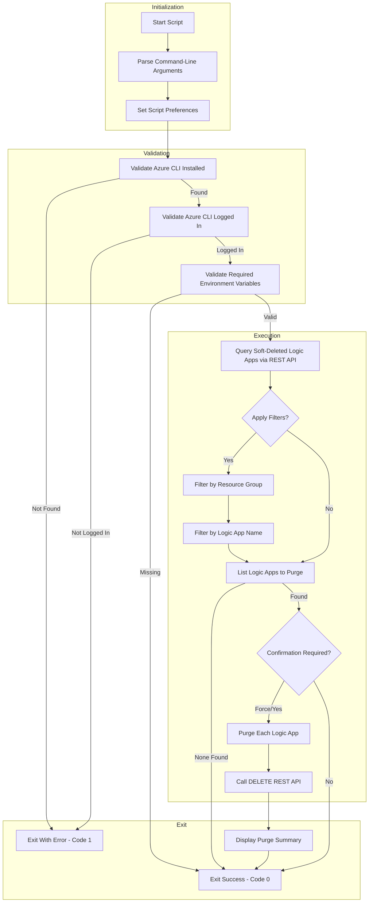

# Purge Soft-Deleted Logic Apps After Infrastructure Deletion

## Overview

This script serves as a post-infrastructure-delete hook for the Azure Developer CLI (azd). It is automatically executed after `azd down` completes to handle cleanup of soft-deleted Azure Logic Apps Standard resources.

When Azure Logic Apps Standard are deleted through normal infrastructure teardown, they enter a soft-delete state and remain recoverable for a retention period. This script permanently purges these soft-deleted resources to ensure complete cleanup of the Azure environment.

The script is implemented in **both PowerShell and Bash** to support cross-platform execution.

## Script Classification

| Attribute | Value |
|-----------|-------|
| **Category** | azd Lifecycle Hook |
| **Trigger Mechanism** | azd hook (postinfradelete) |
| **azd Hook** | Yes - `postdown` |
| **azd Command** | `azd down` |

## Supported Environments

### Shells

| Shell | Minimum Version |
|-------|-----------------|
| PowerShell | 7.0+ |
| Bash | 4.0+ |

### Operating Systems

| OS | Supported |
|----|-----------|
| Windows | ✓ |
| Linux | ✓ |
| macOS | ✓ |

## Prerequisites

| Prerequisite | Required | Description |
|--------------|----------|-------------|
| Azure CLI | Yes | Version 2.50+ for REST API commands |
| jq | Yes (Bash only) | JSON processor for parsing Azure CLI output |
| Azure Authentication | Yes | Must be logged in with appropriate permissions |

### Required Environment Variables

| Variable | Set By | Description |
|----------|--------|-------------|
| `AZURE_SUBSCRIPTION_ID` | azd | Azure subscription ID |
| `AZURE_LOCATION` | azd | Azure region where resources were deployed |

### Optional Environment Variables

| Variable | Description |
|----------|-------------|
| `AZURE_RESOURCE_GROUP` | Filter by specific resource group |
| `LOGIC_APP_NAME` | Filter by Logic App name pattern |

## Files

| File | Description |
|------|-------------|
| `postinfradelete.ps1` | PowerShell implementation |
| `postinfradelete.sh` | Bash implementation |

## High-Level Script Flow



## Usage

### PowerShell

```powershell
# Interactive mode with confirmation prompts
./postinfradelete.ps1

# Force purge without confirmation
./postinfradelete.ps1 -Force

# Preview what would be purged
./postinfradelete.ps1 -WhatIf

# Force purge with verbose output
./postinfradelete.ps1 -Force -Verbose

# Manual execution with environment variables
$env:AZURE_SUBSCRIPTION_ID = "12345678-1234-1234-1234-123456789012"
$env:AZURE_LOCATION = "eastus2"
./postinfradelete.ps1 -Force
```

### Bash

```bash
# Interactive mode with confirmation prompts
./postinfradelete.sh

# Force purge without confirmation
./postinfradelete.sh --force

# Force purge with verbose output
./postinfradelete.sh --force --verbose

# Display help
./postinfradelete.sh --help
```

## Parameters

| Logical Parameter | PowerShell Name | Bash Name | Required | Description |
|-------------------|-----------------|-----------|----------|-------------|
| Force | `-Force` | `-f`, `--force` | No | Bypasses confirmation prompts |
| Verbose | `-Verbose` | `-v`, `--verbose` | No | Displays detailed diagnostic information |
| WhatIf | `-WhatIf` | N/A | No | Shows what would be purged without executing (PowerShell only) |
| Confirm | `-Confirm` | N/A | No | Prompts for confirmation before each purge (PowerShell only) |
| Help | N/A | `-h`, `--help` | No | Display help message (Bash only) |

## Examples

### Standard Post-Delete Cleanup (azd Hook)

The script runs automatically after `azd down`:

```bash
azd down
# postinfradelete hook executes automatically
```

### Manual Force Purge

**PowerShell:**

```powershell
./postinfradelete.ps1 -Force -Verbose
```

**Bash:**

```bash
./postinfradelete.sh --force --verbose
```

### Preview Purge Operations

**PowerShell:**

```powershell
./postinfradelete.ps1 -WhatIf
```

## Error Handling & Exit Codes

| Exit Code | Description |
|-----------|-------------|
| 0 | Purge completed successfully or no Logic Apps to purge |
| 1 | Error (Azure CLI not installed, not logged in, or purge failed) |

### Error Behavior

- **PowerShell**: Uses `SupportsShouldProcess` with `ConfirmImpact = 'High'`. Tracks exit code separately to ensure finally block cleanup.
- **Bash**: Uses `set -euo pipefail` for strict error handling. Missing environment variables result in graceful exit (not failure).

## Logging & Output

| Output Type | Description |
|-------------|-------------|
| stdout | Status messages, Logic App list, purge progress |
| stderr | Error messages, warnings |
| Color-coded output | Visual distinction for success (green), warnings (yellow), errors (red) |

### Log Levels

| Level | Prefix | Description |
|-------|--------|-------------|
| Info | `[i]` | General progress information |
| Success | `[✓]` | Successful operations |
| Warning | `[!]` | Non-fatal issues |
| Error | `[✗]` | Fatal errors |
| Verbose | `[v]` | Detailed diagnostic output (when enabled) |

## Security Considerations

- Uses Azure CLI authentication (no additional credentials stored)
- REST API calls are authenticated via Azure CLI session
- Purged resources cannot be recovered - use `-WhatIf` or confirmation prompts for safety
- Script does not log or persist sensitive information
- API version: `2023-12-01` for Azure Web Sites API

## Troubleshooting

| Issue | Resolution |
|-------|------------|
| `Azure CLI (az) is not installed` | Install Azure CLI from <https://docs.microsoft.com/cli/azure/install-azure-cli> |
| `Not logged in to Azure CLI` | Run `az login` to authenticate |
| `jq is not installed` (Bash) | Install jq: `brew install jq` (macOS), `apt-get install jq` (Ubuntu) |
| `Required environment variable not set` | Ensure running as azd hook or set variables manually |
| `No soft-deleted Logic Apps found` | Resources may have already been purged or retention period expired |
| Purge fails for specific Logic App | Check permissions and resource state in Azure Portal |

### Azure REST API

The script uses the following Azure REST API endpoint:

```
GET https://management.azure.com/subscriptions/{subscriptionId}/providers/Microsoft.Web/locations/{location}/deletedSites?api-version=2023-12-01
```

```
DELETE https://management.azure.com{deletedSiteId}?api-version=2023-12-01
```

## Development Notes

- Script version: `2.0.0` for both implementations
- Filters Logic Apps by `kind` containing `workflowapp`
- Missing environment variables are treated as non-fatal when running outside azd context
- Confirmation prompt uses `ShouldProcess` in PowerShell for `-WhatIf`/`-Confirm` support

## License & Ownership

| Attribute | Value |
|-----------|-------|
| Author | Evilazaro \| Principal Cloud Solution Architect \| Microsoft |
| Version | 2.0.0 |
| Last Modified | 2026-01-09 |
| Repository | [Azure-LogicApps-Monitoring](https://github.com/Evilazaro/Azure-LogicApps-Monitoring) |

## Related Links

- [Azure Logic Apps Documentation](https://learn.microsoft.com/azure/logic-apps/)
- [Azure Developer CLI Documentation](https://learn.microsoft.com/azure/developer/azure-developer-cli/)
