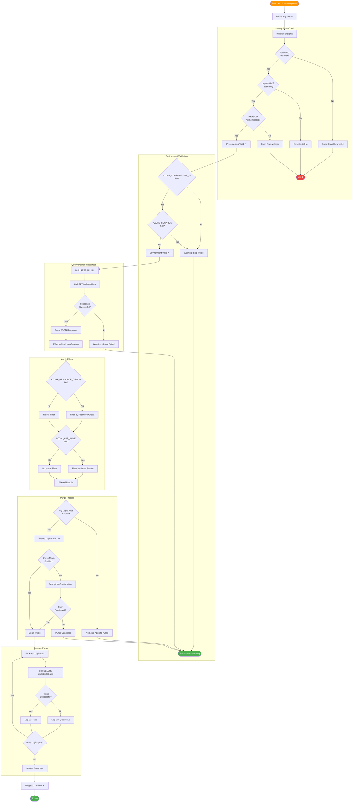

# 🗑️ postinfradelete

Post-infrastructure-delete hook for Azure Developer CLI (azd).

## 📑 Table of Contents

- [📋 Overview](#-overview)
- [⚙️ Prerequisites](#️-prerequisites)
- [🎯 Parameters](#-parameters)
- [🌐 Environment Variables](#-environment-variables)
- [⚙️ Functionality](#️-functionality)
- [📖 Usage Examples](#-usage-examples)
- [💻 Platform Differences](#-platform-differences)
- [🚪 Exit Codes](#-exit-codes)
- [🔗 Related Hooks](#-related-hooks)

## 📋 Overview

Purges soft-deleted Logic Apps Standard resources after infrastructure deletion. This script is automatically executed by `azd` after `azd down` completes.

### 📚 Background

When Azure Logic Apps Standard are deleted, they enter a **soft-delete state** and must be explicitly purged to fully remove them. This retention period (typically 30 days) allows for recovery but means resources aren't fully cleaned up immediately. This script handles the purge operation to ensure complete cleanup.

### 🔑 Key Operations

- Validates required environment variables (subscription, location)
- Authenticates to Azure using the current CLI session
- Retrieves the list of soft-deleted Logic Apps in the specified location
- Purges any Logic Apps that match the resource group naming pattern

### 📅 When Executed

- **Automatically**: After `azd down` completes infrastructure deletion
- **Manually**: When needing to purge lingering soft-deleted resources

## ⚙️ Prerequisites

### 🔧 Required Tools

| Tool | Minimum Version | Purpose |
|:-----|:---------------:|:--------|
| PowerShell Core | 7.0+ | Script execution (PowerShell version) |
| Bash | 4.0+ | Script execution (Bash version) |
| Azure CLI (az) | 2.50+ | Azure REST API calls for purging |
| jq | Latest | JSON parsing (Bash version only) |

### 🔐 Required Permissions

- **Azure CLI**: Must be authenticated (`az login`)
- **Subscription Access**: Contributor or higher to purge deleted resources

## 🎯 Parameters

### PowerShell Parameters

| Parameter | Type | Required | Default | Description |
|:----------|:----:|:--------:|:-------:|:------------|
| `-Force` | Switch | No | `$false` | Skip confirmation prompts and force execution |
| `-Verbose` | Switch | No | `$false` | Enable verbose diagnostic output |
| `-WhatIf` | Switch | No | `$false` | Show what would be purged without making changes |

### Bash Parameters

| Parameter | Type | Required | Default | Description |
|:----------|:----:|:--------:|:-------:|:------------|
| `--force`, `-f` | Flag | No | `false` | Skip confirmation prompts |
| `--verbose`, `-v` | Flag | No | `false` | Enable verbose output |
| `--help`, `-h` | Flag | No | N/A | Display help message |

## 🌐 Environment Variables

### Variables Read (Required)

| Variable | Description | Set By |
|:---------|:------------|:------:|
| `AZURE_SUBSCRIPTION_ID` | Azure subscription GUID | azd |
| `AZURE_LOCATION` | Azure region where resources were deployed | azd |

### Variables Read (Optional)

| Variable | Description | Default |
|:---------|:------------|:-------:|
| `AZURE_RESOURCE_GROUP` | Filter by resource group name pattern | None |
| `LOGIC_APP_NAME` | Filter by Logic App name pattern | None |

### Variables Set

This script does not set any environment variables.

## ⚙️ Functionality

### 🔄 Execution Flow



### 🌐 Azure REST API Calls

#### List Deleted Sites

```http
GET https://management.azure.com/subscriptions/{subscriptionId}/providers/Microsoft.Web/locations/{location}/deletedSites?api-version=2023-12-01
```

#### Purge Deleted Site

```http
DELETE https://management.azure.com/subscriptions/{subscriptionId}/providers/Microsoft.Web/locations/{location}/deletedSites/{deletedSiteId}?api-version=2023-12-01
```

### 🔍 Filtering Logic

The script identifies Logic Apps to purge based on:

1. **Location Match**: Site was deployed in `AZURE_LOCATION`
2. **Resource Group Pattern**: If `AZURE_RESOURCE_GROUP` is set, site's original resource group must match
3. **Name Pattern**: If `LOGIC_APP_NAME` is set, site name must match the pattern

## 📖 Usage Examples

### PowerShell

```powershell
# Standard execution (usually run by azd automatically)
.\postinfradelete.ps1

# Force purge without confirmation
.\postinfradelete.ps1 -Force

# Verbose output for debugging
.\postinfradelete.ps1 -Force -Verbose

# Show what would be purged
.\postinfradelete.ps1 -WhatIf
```

### Bash

```bash
# Standard execution
./postinfradelete.sh

# Force purge without confirmation
./postinfradelete.sh --force

# Verbose output for debugging
./postinfradelete.sh --force --verbose

# Display help
./postinfradelete.sh --help
```

### 📝 Sample Output

```
═══════════════════════════════════════════════════════════════
  Azure Logic Apps Monitoring - Post-Infrastructure Delete
  Version: 2.0.0
═══════════════════════════════════════════════════════════════

───────────────────────────────────────────────────────────────
  Environment Validation
───────────────────────────────────────────────────────────────

✓ AZURE_SUBSCRIPTION_ID: xxxxxxxx-xxxx-xxxx-xxxx-xxxxxxxxxxxx
✓ AZURE_LOCATION: eastus2
✓ Azure CLI authenticated

───────────────────────────────────────────────────────────────
  Discovering Soft-Deleted Logic Apps
───────────────────────────────────────────────────────────────

Found 2 soft-deleted Logic Apps in eastus2:
  1. logic-orders-management-dev (deleted 2026-01-20)
  2. logic-notifications-dev (deleted 2026-01-20)

───────────────────────────────────────────────────────────────
  Purging Soft-Deleted Resources
───────────────────────────────────────────────────────────────

✓ Purged: logic-orders-management-dev
✓ Purged: logic-notifications-dev

═══════════════════════════════════════════════════════════════
  Summary
═══════════════════════════════════════════════════════════════

Total soft-deleted sites found: 2
  ✓ Successfully purged: 2
  ✗ Failed to purge: 0

✓ Post-infrastructure delete completed successfully
```

## 💻 Platform Differences

| Aspect | PowerShell | Bash |
|:-------|:-----------|:-----|
| Azure REST calls | `az rest --method GET` | `az rest --method GET` |
| JSON parsing | `ConvertFrom-Json` | `jq` |
| WhatIf support | Native `-WhatIf` | Manual implementation |
| Confirmation | `ShouldProcess` | Interactive `read` |

## 🚪 Exit Codes

| Code | Meaning |
|:----:|:--------|
| `0` | Success - all soft-deleted resources purged (or none found) |
| `1` | Error - missing required environment variables or purge failed |
| `130` | Script interrupted by user (SIGINT) |

## 🔗 Related Hooks

| Hook | Relationship |
|:-----|:-------------|
| [preprovision](preprovision.md) | Runs before provisioning; this hook cleans up after deletion |
| [postprovision](postprovision.md) | Runs after provisioning; opposite lifecycle stage |

## ❗ Important Notes

### 📅 Soft-Delete Behavior

- Azure Logic Apps Standard have a **soft-delete retention period** (typically 30 days)
- During this period, the resource name is reserved and cannot be reused
- Purging permanently deletes the resource and frees the name

### ⏱️ Timing Considerations

- The script may find 0 deleted sites immediately after `azd down`
- Soft-delete propagation can take a few minutes
- Running with `--force` in CI/CD is recommended to avoid hanging on prompts

### ⚠️ Resource Recovery

> **Warning**: Purging is **irreversible**. If you might need to recover a deleted Logic App, do not run this script until you're certain the resource is no longer needed.

## 🔧 Troubleshooting

### ⚠️ Common Issues

1. **"No soft-deleted sites found"**
   - This is normal if the Logic App was already permanently deleted
   - Wait a few minutes for soft-delete state to propagate

2. **"Failed to purge"**
   - Verify you have Contributor access on the subscription
   - Check if the resource is still being deleted (state = "Deleting")

3. **"Not logged in to Azure CLI"**
   - Run `az login` before executing the script
   - When running via azd, authentication should be handled automatically

---

**Version**: 2.0.0  
**Author**: Evilazaro | Principal Cloud Solution Architect | Microsoft  
**Last Modified**: January 2026
