# 🗑️ postinfradelete

> Post-infrastructure-delete hook for Azure Developer CLI (azd).

## 📋 Overview

Purges soft-deleted Logic Apps Standard resources after infrastructure deletion. This script is automatically executed by azd after `azd down` completes.

When Azure Logic Apps Standard are deleted, they enter a soft-delete state and must be explicitly purged to fully remove them. This script handles the purge operation to ensure complete cleanup.

The script performs the following operations:

- Validates required environment variables (subscription, location)
- Authenticates to Azure using the current CLI session
- Retrieves the list of soft-deleted Logic Apps in the specified location
- Purges any Logic Apps that match the resource group naming pattern

---

## 📑 Table of Contents

- [📌 Script Metadata](#-script-metadata)
- [🔧 Prerequisites](#-prerequisites)
- [📥 Parameters](#-parameters)
- [🌐 Environment Variables](#-environment-variables)
- [🔄 Execution Flow](#-execution-flow)
- [📝 Usage Examples](#-usage-examples)
- [⚠️ Exit Codes](#%EF%B8%8F-exit-codes)
- [🔧 Azure REST API](#-azure-rest-api)
- [📚 Related Scripts](#-related-scripts)
- [📜 Version History](#-version-history)

[⬅️ Back to Index](./index.md)

---

## 📌 Script Metadata

| Property          | PowerShell                                                   | Bash                                                         |
| ----------------- | ------------------------------------------------------------ | ------------------------------------------------------------ |
| **File Name**     | `postinfradelete.ps1`                                        | `postinfradelete.sh`                                         |
| **Version**       | 2.0.0                                                        | 2.0.0                                                        |
| **Last Modified** | 2026-01-09                                                   | 2026-01-09                                                   |
| **Author**        | Evilazaro \| Principal Cloud Solution Architect \| Microsoft | Evilazaro \| Principal Cloud Solution Architect \| Microsoft |

---

## 🔧 Prerequisites

| Requirement     | Minimum Version | Notes                                   |
| --------------- | --------------- | --------------------------------------- |
| PowerShell Core | 7.0             | Required for `.ps1` script              |
| Bash            | 4.0             | Required for `.sh` script               |
| Azure CLI       | 2.50+           | For Azure REST API calls                |
| jq              | Any             | Required for Bash script (JSON parsing) |

---

## 📥 Parameters

### PowerShell (`postinfradelete.ps1`)

| Parameter  | Type   | Required | Default  | Description                                         |
| ---------- | ------ | -------- | -------- | --------------------------------------------------- |
| `-Force`   | Switch | No       | `$false` | Skips confirmation prompts and forces execution     |
| `-WhatIf`  | Switch | No       | `$false` | Shows what would be executed without making changes |
| `-Verbose` | Switch | No       | `$false` | Displays detailed diagnostic information            |

### Bash (`postinfradelete.sh`)

| Parameter         | Type | Required | Default | Description               |
| ----------------- | ---- | -------- | ------- | ------------------------- |
| `--force`, `-f`   | Flag | No       | `false` | Skip confirmation prompts |
| `--verbose`, `-v` | Flag | No       | `false` | Enable verbose output     |
| `--help`, `-h`    | Flag | No       | N/A     | Show help message         |

---

## 🌐 Environment Variables

### Required Variables (Set by azd)

| Variable                | Source      | Description                                |
| ----------------------- | ----------- | ------------------------------------------ |
| `AZURE_SUBSCRIPTION_ID` | azd outputs | Azure subscription GUID                    |
| `AZURE_LOCATION`        | azd outputs | Azure region where resources were deployed |

### Optional Variables

| Variable               | Source      | Description                           |
| ---------------------- | ----------- | ------------------------------------- |
| `AZURE_RESOURCE_GROUP` | azd outputs | Filter by resource group name pattern |
| `LOGIC_APP_NAME`       | azd outputs | Filter by Logic App name pattern      |

---

## 🔄 Execution Flow

```mermaid
flowchart TD
    A[🚀 Start postinfradelete] --> B[Parse Arguments]
    B --> C{Help Requested?}

    C -->|Yes| D[Display Help]
    D --> Z[🏁 End]

    C -->|No| E{Validate Required Env Vars}
    E -->|Missing| F[❌ Exit with Error]
    E -->|Valid| G[Display Configuration]

    G --> H[Get Soft-Deleted Logic Apps via REST API]
    H --> I{Any Deleted Apps Found?}

    I -->|No| J[ℹ️ No Apps to Purge]
    J --> Z

    I -->|Yes| K[Filter by Resource Group Pattern]
    K --> L{Any Matching Apps?}

    L -->|No| J
    L -->|Yes| M{Force Mode?}

    M -->|No| N[Prompt for Confirmation]
    M -->|Yes| O[Skip Confirmation]

    N -->|Decline| P[🚫 Exit Cancelled]
    N -->|Accept| O

    O --> Q[Loop: Purge Each Logic App]
    Q --> R[Call DELETE REST API]

    R --> S{More Apps?}
    S -->|Yes| Q
    S -->|No| T[Display Summary]

    T --> U{Any Failures?}
    U -->|Yes| V[⚠️ Partial Success]
    U -->|No| W[✅ All Purged Successfully]

    V --> Z
    W --> Z
    P --> Z
```



---

## 📝 Usage Examples

### PowerShell

```powershell
# Purge soft-deleted Logic Apps with confirmation prompt
.\postinfradelete.ps1

# Purge soft-deleted Logic Apps without confirmation, with verbose output
.\postinfradelete.ps1 -Force -Verbose

# Show which Logic Apps would be purged without making changes
.\postinfradelete.ps1 -WhatIf
```

### Bash

```bash
# Purge soft-deleted Logic Apps with confirmation prompt
./postinfradelete.sh

# Purge soft-deleted Logic Apps without confirmation, with verbose output
./postinfradelete.sh --force --verbose

# Display help message
./postinfradelete.sh --help
```

---

## ⚠️ Exit Codes

| Code | Meaning                                                    |
| ---- | ---------------------------------------------------------- |
| `0`  | Success - all soft-deleted apps purged or no apps to purge |
| `1`  | Error - validation failed or purge operations failed       |

---

## 🔧 Azure REST API

The script uses the Azure REST API to interact with soft-deleted resources:

### List Deleted Sites

```
GET https://management.azure.com/subscriptions/{subscriptionId}/providers/Microsoft.Web/locations/{location}/deletedSites?api-version=2023-12-01
```

### Purge Deleted Site

```
DELETE https://management.azure.com/subscriptions/{subscriptionId}/providers/Microsoft.Web/locations/{location}/deletedSites/{deletedSiteId}?api-version=2023-12-01
```

---

## 📚 Related Scripts

| Script                              | Purpose                                 |
| ----------------------------------- | --------------------------------------- |
| [preprovision](./preprovision.md)   | Runs before infrastructure provisioning |
| [postprovision](./postprovision.md) | Runs after infrastructure provisioning  |

---

## 📜 Version History

| Version | Date       | Changes                                                                      |
| ------- | ---------- | ---------------------------------------------------------------------------- |
| 2.0.0   | 2026-01-09 | Major refactor with REST API implementation and comprehensive error handling |
| 1.0.0   | 2025-10-01 | Initial release                                                              |

---

## 🔗 Links

- [Repository](https://github.com/Evilazaro/Azure-LogicApps-Monitoring)
- [Azure Logic Apps Standard Documentation](https://learn.microsoft.com/azure/logic-apps/logic-apps-overview)
- [Azure REST API Reference](https://learn.microsoft.com/rest/api/azure/)

---

[⬅️ Back to Index](./index.md)
