# 🗑️ postinfradelete

> [!NOTE]
> **Target Audience:** DevOps Engineers, Cloud Architects, Platform Engineers  
> **Estimated Reading Time:** 9 minutes

<details>
<summary>📍 <strong>Navigation</strong></summary>
<br>

| Previous | Index | Next |
|:---------|:-----:|-----:|
| [postprovision](postprovision.md) | [📑 Index](README.md) | [clean-secrets](clean-secrets.md) |

</details>

---

## 📑 Table of Contents

- [📋 Overview](#-overview)
- [📝 Description](#-description)
- [📊 Workflow Diagram](#-workflow-diagram)
- [✅ Prerequisites](#-prerequisites)
- [⚙️ Parameters/Arguments](#️-parametersarguments)
- [📥 Input/Output Specifications](#-inputoutput-specifications)
- [💻 Usage Examples](#-usage-examples)
- [⚠️ Error Handling and Exit Codes](#️-error-handling-and-exit-codes)
- [🔒 Security Considerations](#-security-considerations)
- [🚧 Known Limitations](#-known-limitations)
- [🔗 Related Scripts](#-related-scripts)
- [📜 Changelog](#-changelog)

---

## 📋 Overview

Post-infrastructure-delete hook for Azure Developer CLI (azd) that purges soft-deleted Logic Apps Standard resources after infrastructure deletion to ensure complete cleanup.

[⬆️ Back to top](#️-postinfradelete)

---

## 📝 Description

This script is automatically executed by Azure Developer CLI (azd) after the `azd down` command completes. It addresses a specific Azure behavior where Logic Apps Standard resources enter a soft-delete state when deleted rather than being permanently removed.

When Azure Logic Apps Standard are deleted through normal Azure Resource Manager operations, they remain in a recoverable soft-delete state for a retention period. This can cause conflicts when re-provisioning resources with the same names and may incur ongoing costs. This script handles the explicit purge operation to fully remove these soft-deleted resources.

The script queries the Azure REST API to retrieve all soft-deleted Logic Apps in the specified Azure location, filters them based on the resource group naming pattern to identify those belonging to the current azd environment, and then purges each matching Logic App. This ensures a clean slate for future deployments.

[⬆️ Back to top](#️-postinfradelete)

---

## 📊 Workflow Diagram

```mermaid
---
title: Post-Infrastructure Delete Execution Flow
---
flowchart TD
    %% ===== INITIALIZATION PHASE =====
    subgraph Initialization["🚀 Initialization"]
        direction TB
        Start(["▶️ Start - azd hook"]) -->|begins| ParseArgs["Parse Arguments"]
        ParseArgs -->|configures| InitLog["Initialize Logging"]
    end
    
    %% ===== VALIDATION PHASE =====
    subgraph Validation["✅ Environment Validation"]
        direction TB
        InitLog -->|validates| CheckSub{"Validate AZURE_SUBSCRIPTION_ID"}
        CheckSub -->|set| CheckLoc{"Validate AZURE_LOCATION"}
        CheckSub -->|missing| ExitError(["❌ Exit with Error"])
        CheckLoc -->|set| EnvValid["Environment Valid"]
        CheckLoc -->|missing| ExitError
    end
    
    %% ===== AZURE AUTH PHASE =====
    subgraph AzureAuth["🔑 Azure Authentication"]
        direction TB
        EnvValid -->|checks| CheckAuth{"Azure CLI Authenticated?"}
        CheckAuth -->|yes| GetToken["Get Access Token"]
        CheckAuth -->|no| ExitError
        GetToken -->|sets| SetContext["Set Subscription Context"]
    end
    
    %% ===== DISCOVERY PHASE =====
    subgraph Discovery["🔍 Soft-Delete Discovery"]
        direction TB
        SetContext -->|queries| QueryAPI["Query Deleted Sites API"]
        QueryAPI -->|evaluates| AppsFound{"Deleted Apps Found?"}
        AppsFound -->|no| NoApps(["✅ No Apps to Purge"])
        AppsFound -->|yes| FilterLoc["Filter by Location"]
        FilterLoc -->|checks| Matching{"Matching Apps?"}
        Matching -->|no| NoApps
        Matching -->|yes| DisplayList["Display App List"]
    end
    
    %% ===== CONFIRMATION PHASE =====
    subgraph Confirmation["⚠️ User Confirmation"]
        direction TB
        DisplayList -->|checks| ForceMode{"Force Mode?"}
        ForceMode -->|yes| SkipConfirm["Skip Confirmation"]
        ForceMode -->|no| UserConfirm{"User Confirms?"}
        UserConfirm -->|yes| SkipConfirm
        UserConfirm -->|no| Cancelled(["⏹️ Cancelled by User"])
    end
    
    %% ===== PURGE PHASE =====
    subgraph Purge["🗑️ Purge Operations"]
        direction TB
        SkipConfirm -->|starts| BeginLoop["Begin Purge Loop"]
        BeginLoop -->|purges| PurgeApp["Purge Logic App"]
        PurgeApp -->|checks| MoreApps{"More Apps?"}
        MoreApps -->|yes| PurgeApp
        MoreApps -->|no| GenSummary["Generate Summary"]
    end
    
    %% ===== COMPLETION =====
    GenSummary -->|finishes| Success(["✅ Success"])
    
    %% ===== NODE STYLING =====
    classDef primary fill:#4F46E5,stroke:#3730A3,color:#FFFFFF
    classDef secondary fill:#10B981,stroke:#059669,color:#FFFFFF
    classDef decision fill:#FFFBEB,stroke:#F59E0B,color:#000000
    classDef failed fill:#F44336,stroke:#C62828,color:#FFFFFF
    classDef trigger fill:#818CF8,stroke:#4F46E5,color:#FFFFFF
    classDef external fill:#6B7280,stroke:#4B5563,color:#FFFFFF,stroke-dasharray:5 5
    
    class Start,Success,NoApps trigger
    class ParseArgs,InitLog,EnvValid,GetToken,SetContext,QueryAPI,FilterLoc,DisplayList,SkipConfirm,BeginLoop,PurgeApp,GenSummary primary
    class CheckSub,CheckLoc,CheckAuth,AppsFound,Matching,ForceMode,UserConfirm,MoreApps decision
    class ExitError failed
    class Cancelled external
    
    %% ===== SUBGRAPH STYLING =====
    style Initialization fill:#EEF2FF,stroke:#4F46E5,stroke-width:2px
    style Validation fill:#ECFDF5,stroke:#10B981,stroke-width:2px
    style AzureAuth fill:#E0E7FF,stroke:#4F46E5,stroke-width:2px
    style Discovery fill:#FEF3C7,stroke:#F59E0B,stroke-width:2px
    style Confirmation fill:#F3F4F6,stroke:#6B7280,stroke-width:2px
    style Purge fill:#FEE2E2,stroke:#F44336,stroke-width:2px
```



[⬆️ Back to top](#️-postinfradelete)

---

## ✅ Prerequisites

| Category | Requirement | Version | Verification Command | Required |
|:---------|:------------|:--------|:---------------------|:--------:|
| Runtime | PowerShell Core | >= 7.0 | `$PSVersionTable.PSVersion` | ✅ |
| Runtime | Bash | >= 4.0 | `bash --version` | ✅ |
| CLI Tool | Azure CLI | >= 2.50 | `az --version` | ✅ |
| CLI Tool | jq (Bash only) | Latest | `jq --version` | ✅ (Bash) |
| Environment Variable | AZURE_SUBSCRIPTION_ID | N/A | `echo $AZURE_SUBSCRIPTION_ID` | ✅ |
| Environment Variable | AZURE_LOCATION | N/A | `echo $AZURE_LOCATION` | ✅ |
| Permission | Azure Subscription Access | N/A | `az account show` | ✅ |

### 📦 Installation Commands (Bash Dependencies)

```bash
# Install jq for JSON parsing
# macOS
brew install jq

# Ubuntu/Debian
sudo apt-get install jq

# RHEL/CentOS
sudo yum install jq
```

[⬆️ Back to top](#️-postinfradelete)

---

## ⚙️ Parameters/Arguments

### PowerShell Parameters

| Parameter | Type | Required | Default | Description |
|:----------|:-----|:--------:|:--------|:------------|
| `-Force` | `[switch]` | ❌ | `$false` | Skips confirmation prompts and forces execution |
| `-WhatIf` | `[switch]` | ❌ | `$false` | Shows what would be executed without making changes |

### Bash Arguments

| Position/Flag | Type | Required | Default | Description |
|:--------------|:-----|:--------:|:--------|:------------|
| `--force`, `-f` | flag | ❌ | `false` | Skip confirmation prompts |
| `--verbose`, `-v` | flag | ❌ | `false` | Enable verbose output |
| `--help`, `-h` | flag | ❌ | N/A | Show help message |

[⬆️ Back to top](#️-postinfradelete)

---

## 📥 Input/Output Specifications

### Inputs

**Environment Variables Read (set by azd):**

| Variable | Required | Description |
|:---------|:--------:|:------------|
| `AZURE_SUBSCRIPTION_ID` | ✅ | Azure subscription GUID |
| `AZURE_LOCATION` | ✅ | Azure region where resources were deployed |
| `AZURE_RESOURCE_GROUP` | ❌ | Filter by resource group name pattern |
| `LOGIC_APP_NAME` | ❌ | Filter by Logic App name pattern |

### Outputs

**Exit Codes:**

| Exit Code | Meaning |
|:---------:|:--------|
| `0` | Success — All soft-deleted Logic Apps purged |
| `1` | General error or purge failure |

**stdout Output:**

- Timestamped progress messages
- List of discovered soft-deleted Logic Apps
- Purge operation results

**Azure Resources Modified:**

- Soft-deleted Logic Apps permanently removed

[⬆️ Back to top](#️-postinfradelete)

---

## 💻 Usage Examples

### Basic Usage

```powershell
# PowerShell: Run post-infrastructure-delete (typically called by azd)
.\postinfradelete.ps1
```

```bash
# Bash: Run post-infrastructure-delete (typically called by azd)
./postinfradelete.sh
```

### Advanced Usage

```powershell
# PowerShell: See what would be purged without making changes
.\postinfradelete.ps1 -WhatIf

# PowerShell: Force purge without confirmation
.\postinfradelete.ps1 -Force -Verbose
```

```bash
# Bash: Force purge with verbose output
./postinfradelete.sh --force --verbose

# Bash: Display help
./postinfradelete.sh --help
```

### CI/CD Pipeline Usage

```yaml
# Azure DevOps Pipeline
- task: AzureCLI@2
  displayName: 'Purge soft-deleted Logic Apps'
  inputs:
    azureSubscription: 'Azure-Connection'
    scriptType: 'bash'
    scriptLocation: 'scriptPath'
    scriptPath: '$(System.DefaultWorkingDirectory)/hooks/postinfradelete.sh'
    arguments: '--force'
  env:
    AZURE_SUBSCRIPTION_ID: $(AZURE_SUBSCRIPTION_ID)
    AZURE_LOCATION: $(AZURE_LOCATION)
  condition: always()

# GitHub Actions
- name: Cleanup soft-deleted Logic Apps
  if: always()
  shell: pwsh
  run: ./hooks/postinfradelete.ps1 -Force
  env:
    AZURE_SUBSCRIPTION_ID: ${{ secrets.AZURE_SUBSCRIPTION_ID }}
    AZURE_LOCATION: ${{ vars.AZURE_LOCATION }}
```

[⬆️ Back to top](#️-postinfradelete)

---

## ⚠️ Error Handling and Exit Codes

| Exit Code | Meaning | Recovery Action |
|:---------:|:--------|:----------------|
| `0` | Success | N/A |
| `1` | General error | Check Azure CLI authentication, verify permissions |

### Error Handling Approach

**PowerShell:**

- `Set-StrictMode -Version Latest` for strict mode
- `$ErrorActionPreference = 'Stop'` for fail-fast
- `SupportsShouldProcess` for WhatIf/Confirm support
- Try/Catch/Finally with preference restoration

**Bash:**

- `set -euo pipefail` for strict error handling
- Cleanup trap for EXIT signal
- Detailed error logging with color coding

[⬆️ Back to top](#️-postinfradelete)

---

## 🔒 Security Considerations

### 🔑 Credential Handling

- [x] No hardcoded secrets
- [x] Uses Azure CLI session for authentication
- [x] Access tokens acquired via `az account get-access-token`

### Required Permissions

| Permission/Role | Scope | Justification |
|:----------------|:------|:--------------|
| Website Contributor | Subscription | Delete soft-deleted Logic Apps |
| Reader | Subscription | List soft-deleted resources |

### 🌐 Network Security

| Property | Value |
|:---------|:------|
| **Endpoints accessed** | Azure Resource Manager (`management.azure.com`) |
| **TLS requirements** | TLS 1.2+ |
| **API Version** | 2023-12-01 |

### 📝 Logging Security

> [!TIP]
> **Security Features:**
>
> - **Sensitive data masking:** Access tokens not logged
> - **Audit trail:** Timestamped operation logs

[⬆️ Back to top](#️-postinfradelete)

---

## 🚧 Known Limitations

> [!CAUTION]
> **Important Notes:**
>
> - Only targets Logic Apps Standard (not Consumption tier)
> - Requires Azure CLI authentication with sufficient permissions
> - Location filtering is case-sensitive
> - **Cannot recover purged Logic Apps after execution**
> - Rate limiting may affect large-scale purge operations

[⬆️ Back to top](#️-postinfradelete)

---

## 🔗 Related Scripts

| Script | Relationship | Description |
|:-------|:-------------|:------------|
| [preprovision.md](preprovision.md) | Related | Pre-provisioning validation |
| [postprovision.md](postprovision.md) | Related | Post-provisioning configuration |

[⬆️ Back to top](#️-postinfradelete)

---

## 📜 Changelog

| Version | Date | Changes |
|:-------:|:----:|:--------|
| 2.0.0 | 2026-01-09 | Complete rewrite with improved error handling |
| 1.0.0 | 2025-06-01 | Initial release |

[⬆️ Back to top](#️-postinfradelete)

---

<div align="center">

**[⬅️ Previous: postprovision](postprovision.md)** · **[📑 Index](README.md)** · **[Next: clean-secrets ➡️](clean-secrets.md)**

</div>
