# postinfradelete (.ps1 / .sh)


## 📋 Overview

The `postinfradelete` script is an Azure Developer CLI (azd) hook that automatically purges soft-deleted Logic Apps Standard resources after infrastructure deletion. When Azure Logic Apps Standard are deleted via `azd down`, they enter a soft-delete state and must be explicitly purged to fully remove them. This script handles that purge operation to ensure complete cleanup of Azure resources.

Available in both PowerShell (`.ps1`) and Bash (`.sh`) versions for cross-platform compatibility, this script automatically runs after `azd down` completes, identifying and permanently deleting any Logic Apps that remain in the soft-delete recovery period.

The script supports:

- **Soft-Delete Recovery Bypass**: Permanently removes Logic Apps from Azure's recovery period
- **Resource Group Filtering**: Optionally filter purge operations to a specific resource group
- **Logic App Name Filtering**: Target specific Logic Apps by name pattern
- **Cross-Platform Execution**: Works on Windows, Linux, and macOS
- **CI/CD Integration**: Non-interactive mode for automated pipelines
- **WhatIf Support**: Preview changes before execution (PowerShell only)

## 📑 Table of Contents

- [📋 Overview](#-overview)
- [🎯 Purpose](#-purpose)
- [🏗️ Required Environment Variables](#️-required-environment-variables)
- [🚀 Usage](#-usage)
  - [🔄 Automatic Execution (Standard)](#-automatic-execution-standard)
  - [💻 Manual Execution](#-manual-execution)
  - [⚡ Force Mode](#-force-mode)
  - [📝 Verbose Mode](#-verbose-mode)
  - [👁️ Preview Mode (WhatIf)](#️-preview-mode-whatif)
- [🔧 Parameters](#-parameters)
- [🛠️ How It Works](#️-how-it-works)
  - [📊 Workflow Diagram](#-workflow-diagram)
  - [🔗 Azure REST API Operations](#-azure-rest-api-operations)
- [📚 Examples](#-examples)
- [📖 Related Documentation](#-related-documentation)
- [🔐 Security Considerations](#-security-considerations)
- [🎓 Best Practices](#-best-practices)
- [📊 Performance](#-performance)
- [📜 Version History](#-version-history)

## 🎯 Purpose

This script is **automatically executed** by `azd down` after infrastructure deletion. It:

- ✅ **Validates Prerequisites**: Ensures Azure CLI is installed and user is logged in
- ✅ **Queries Deleted Sites**: Uses Azure REST API to find soft-deleted Logic Apps
- ✅ **Filters by Scope**: Optionally filters by resource group or Logic App name
- ✅ **Purges Logic Apps**: Permanently removes soft-deleted Logic Apps
- ✅ **Reports Results**: Provides detailed logging of purge operations
- ✅ **Handles Errors Gracefully**: Continues even if some purges fail (configurable)

## 🏗️ Required Environment Variables

The following environment variables are **automatically set by azd** during the hook execution:

| Variable                | Required    | Description                                             | Set By       |
| ----------------------- | ----------- | ------------------------------------------------------- | ------------ |
| `AZURE_SUBSCRIPTION_ID` | ✅ Yes      | The Azure subscription ID where resources were deployed | azd          |
| `AZURE_LOCATION`        | ✅ Yes      | The Azure region where Logic Apps were deployed         | azd          |
| `AZURE_RESOURCE_GROUP`  | ❌ Optional | Filter purge to a specific resource group               | azd          |
| `LOGIC_APP_NAME`        | ❌ Optional | Filter purge to Logic Apps matching this name pattern   | Bicep output |

### ⚙️ How azd Sets These Variables

When running `azd down`, the environment variables are automatically loaded from:

1. **Azure deployment outputs**: Values from Bicep `output` declarations in `main.bicep`
2. **azd environment configuration**: Values stored in `.azure/<env-name>/.env`
3. **Azure context**: Subscription and location from the current azd environment

The script is designed to work seamlessly with azd's hook system, where all required environment variables are pre-populated before hook execution.

## 🚀 Usage

### 🔄 Automatic Execution (Standard)

The script runs automatically as part of `azd down`:

```bash
# Delete all infrastructure (triggers postinfradelete hook)
azd down

# Delete with force (no confirmations)
azd down --force
```

### 💻 Manual Execution

You can run the script manually if needed:

**PowerShell:**

```powershell
# Set required environment variables (normally set by azd)
$env:AZURE_SUBSCRIPTION_ID = "your-subscription-id"
$env:AZURE_LOCATION = "eastus2"

# Run the script
./hooks/postinfradelete.ps1
```

**Bash:**

```bash
# Set required environment variables (normally set by azd)
export AZURE_SUBSCRIPTION_ID="your-subscription-id"
export AZURE_LOCATION="eastus2"

# Run the script
./hooks/postinfradelete.sh
```

### ⚡ Force Mode

Skip confirmation prompts:

**PowerShell:**

```powershell
./hooks/postinfradelete.ps1 -Force
```

**Bash:**

```bash
./hooks/postinfradelete.sh --force
```

### 📝 Verbose Mode

Enable detailed logging:

**PowerShell:**

```powershell
./hooks/postinfradelete.ps1 -Verbose
```

**Bash:**

```bash
./hooks/postinfradelete.sh --verbose
```

### 👁️ Preview Mode (WhatIf)

See what would be purged without making changes (PowerShell only):

```powershell
./hooks/postinfradelete.ps1 -WhatIf
```

## 🔧 Parameters

### PowerShell Parameters

| Parameter  | Type   | Default  | Description                              |
| ---------- | ------ | -------- | ---------------------------------------- |
| `-Force`   | Switch | `$false` | Skip confirmation prompts                |
| `-Verbose` | Switch | `$false` | Enable verbose output                    |
| `-WhatIf`  | Switch | `$false` | Preview mode - show what would be purged |
| `-Confirm` | Switch | `$true`  | Prompt for confirmation before purging   |

### Bash Options

| Option      | Short | Description               |
| ----------- | ----- | ------------------------- |
| `--force`   | `-f`  | Skip confirmation prompts |
| `--verbose` | `-v`  | Enable verbose output     |
| `--help`    | `-h`  | Show help message         |

## 🛠️ How It Works

### 📊 Workflow Diagram

```mermaid
flowchart LR
    %% =====================================================
    %% Style Definitions
    %% =====================================================
    classDef trigger fill:#312E81,stroke:#4F46E5,color:#fff,stroke-width:3px,font-weight:bold
    classDef validation fill:#FEF3C7,stroke:#F59E0B,color:#92400E,stroke-width:2px
    classDef decision fill:#F3E8FF,stroke:#A855F7,color:#581C87,stroke-width:2px
    classDef process fill:#EEF2FF,stroke:#4F46E5,color:#312E81,stroke-width:2px
    classDef success fill:#065F46,stroke:#10B981,color:#fff,stroke-width:3px,font-weight:bold
    classDef warning fill:#FEF3C7,stroke:#F59E0B,color:#92400E,stroke-width:2px
    classDef error fill:#FEE2E2,stroke:#EF4444,color:#991B1B,stroke-width:2px

    %% =====================================================
    %% Trigger Phase
    %% =====================================================
    subgraph TRIGGER["🚀 Trigger"]
        direction TB
        A[/"azd down completes"/]
        B["postinfradelete hook"]
    end

    %% =====================================================
    %% Validation Phase
    %% =====================================================
    subgraph VALIDATION["🔍 Validation"]
        direction TB
        C{"Prerequisites?"}
        E{"Env Variables?"}
    end

    %% =====================================================
    %% Query Phase
    %% =====================================================
    subgraph QUERY["📡 Azure API"]
        direction TB
        G[["Query Deleted Sites"]]
        H{"Logic Apps Found?"}
    end

    %% =====================================================
    %% Filter Phase
    %% =====================================================
    subgraph FILTER["🔎 Filtering"]
        direction TB
        J{"Resource Group?"}
        K["Apply RG Filter"]
        L{"Name Pattern?"}
        M["Apply Name Filter"]
    end

    %% =====================================================
    %% Execution Phase
    %% =====================================================
    subgraph EXECUTE["⚡ Execution"]
        direction TB
        N["List Logic Apps"]
        O{"Confirm Purge?"}
        Q[["Purge Logic Apps"]]
        R["Report Summary"]
    end

    %% =====================================================
    %% Exit States
    %% =====================================================
    subgraph EXIT["🏁 Exit"]
        direction TB
        D[/"⚠️ Exit: Warning"/]
        F[/"⏭️ Exit: Skip"/]
        I[/"✅ Exit: No Apps"/]
        P[/"🚫 Exit: Cancelled"/]
        S[/"✅ Exit: Success"/]
    end

    %% =====================================================
    %% Flow Connections
    %% =====================================================
    A --> B
    B --> C
    C -->|"❌ Fail"| D
    C -->|"✅ Pass"| E
    E -->|"❌ Missing"| F
    E -->|"✅ Valid"| G
    G --> H
    H -->|"❌ None"| I
    H -->|"✅ Found"| J
    J -->|"✅ Yes"| K
    J -->|"❌ No"| L
    K --> L
    L -->|"✅ Yes"| M
    L -->|"❌ No"| N
    M --> N
    N --> O
    O -->|"❌ No"| P
    O -->|"✅ Yes"| Q
    Q --> R
    R --> S

    %% =====================================================
    %% Apply Styles
    %% =====================================================
    class A,B trigger
    class C,E validation
    class H,J,L,O decision
    class G,K,M,N,Q,R process
    class I,S success
    class D,F warning
    class P error

    %% =====================================================
    %% Subgraph Styling
    %% =====================================================
    style TRIGGER fill:#EEF2FF,stroke:#4F46E5,stroke-width:2px
    style VALIDATION fill:#FEF3C7,stroke:#F59E0B,stroke-width:2px
    style QUERY fill:#EEF2FF,stroke:#4F46E5,stroke-width:2px
    style FILTER fill:#F3E8FF,stroke:#A855F7,stroke-width:2px
    style EXECUTE fill:#D1FAE5,stroke:#10B981,stroke-width:2px
    style EXIT fill:#F3F4F6,stroke:#6B7280,stroke-width:2px
```



### 🔗 Azure REST API Operations

The script uses Azure CLI's `az rest` command for authenticated API calls:

#### List Deleted Sites

```http
GET https://management.azure.com/subscriptions/{subscriptionId}/providers/Microsoft.Web/locations/{location}/deletedSites?api-version=2023-12-01
```

Returns all soft-deleted web sites (including Logic Apps Standard) in the specified location.

#### Purge Deleted Site

```http
DELETE https://management.azure.com{deletedSiteId}?api-version=2023-12-01
```

Permanently deletes a soft-deleted site, removing it from the recovery period.

## 📚 Examples

### Example 1: Standard azd Down

```bash
# Run azd down - postinfradelete hook runs automatically
azd down

# Output:
# ...
# [postinfradelete hook]
# 12:34:56 [i] ========================================
# 12:34:56 [i] Post-Infrastructure Delete Hook v2.0.0
# 12:34:56 [i] Logic Apps Purge Script
# 12:34:56 [i] ========================================
# 12:34:56 [i] Validating prerequisites...
# 12:34:57 [✓] Azure CLI prerequisites validated
# 12:34:57 [i] Configuration:
# 12:34:57 [i]   Subscription: 12345678-1234-1234-1234-123456789012
# 12:34:57 [i]   Location: eastus2
# 12:34:57 [i] Starting Logic App purge process...
# 12:34:58 [i] Found 1 soft-deleted Logic App(s)
# 12:34:58 [i]   - my-logic-app-abc123 (Resource Group: rg-myapp, Deleted: 2026-01-09T12:30:00Z)
# 12:34:59 [✓] Successfully purged Logic App: my-logic-app-abc123
# 12:34:59 [i] ========================================
# 12:34:59 [i] Purge Summary
# 12:34:59 [i] ========================================
# 12:34:59 [✓] Logic Apps purged: 1
```

### Example 2: Manual Execution with Filters

```powershell
# Set environment variables (normally set by azd)
$env:AZURE_SUBSCRIPTION_ID = "12345678-1234-1234-1234-123456789012"
$env:AZURE_LOCATION = "eastus2"
$env:AZURE_RESOURCE_GROUP = "rg-myapp-dev"
$env:LOGIC_APP_NAME = "orders"

# Run with verbose output
./hooks/postinfradelete.ps1 -Force -Verbose
```

### Example 3: CI/CD Pipeline Integration

```yaml
# Azure DevOps Pipeline
- task: AzureCLI@2
  displayName: "Purge Deleted Logic Apps"
  inputs:
    azureSubscription: "MyServiceConnection"
    scriptType: "pscore"
    scriptPath: "./hooks/postinfradelete.ps1"
    arguments: "-Force -Verbose"
  env:
    AZURE_SUBSCRIPTION_ID: $(AZURE_SUBSCRIPTION_ID)
    AZURE_LOCATION: $(AZURE_LOCATION)
```

### Example 4: Preview Mode (WhatIf)

```powershell
# See what would be purged without making changes
./hooks/postinfradelete.ps1 -WhatIf -Verbose

# Output:
# 12:34:56 [i] Would purge Logic App: my-logic-app-abc123 (WhatIf)
```

## 📖 Related Documentation

- [Azure Developer CLI (azd) Hooks](https://learn.microsoft.com/azure/developer/azure-developer-cli/azd-extensibility)
- [Azure Logic Apps Standard](https://learn.microsoft.com/azure/logic-apps/single-tenant-overview-compare)
- [Azure Web Sites REST API - Deleted Sites](https://learn.microsoft.com/rest/api/appservice/deleted-web-apps)
- [preprovision Hook](./preprovision.md) - Pre-provisioning validation
- [postprovision Hook](./postprovision.md) - Post-provisioning configuration
- [deploy-workflow Hook](./deploy-workflow.md) - Logic Apps workflow deployment

## 🔐 Security Considerations

### ✅ Safe Operations

- Uses existing Azure CLI session (no credentials stored)
- Requires explicit authentication via azd/Azure CLI
- Supports confirmation prompts for safety
- WhatIf mode for previewing changes (PowerShell)
- Environment variables are set by azd (not hardcoded)

### ⚠️ Caution

- **Purge is permanent**: Once purged, Logic Apps cannot be recovered
- Ensure you have the correct subscription and location configured
- Use filters (`AZURE_RESOURCE_GROUP`, `LOGIC_APP_NAME`) to limit scope
- Test with `-WhatIf` before executing in production

### 🔒 Required Permissions

The executing identity needs the following Azure RBAC permissions:

| Permission                          | Scope        | Purpose                  |
| ----------------------------------- | ------------ | ------------------------ |
| `Microsoft.Web/deletedSites/read`   | Subscription | List deleted Logic Apps  |
| `Microsoft.Web/deletedSites/delete` | Subscription | Purge deleted Logic Apps |

These permissions are typically included in:

- **Contributor** role
- **Website Contributor** role
- Custom role with explicit permissions

## 🎓 Best Practices

### 🔄 Development Workflow

1. Always run `azd down` to trigger automatic cleanup
2. Use filters when working with multiple environments
3. Review purge list before confirming in interactive mode
4. Use `-WhatIf` to preview changes before execution

### 🌍 Multi-Environment Management

```powershell
# Target specific environment
azd env select dev
azd down  # Purges only dev environment Logic Apps
```

### 🔁 CI/CD Integration

- Always use `-Force` flag in automated pipelines
- Set appropriate timeouts for API calls
- Log outputs for audit trails
- Handle partial failures gracefully
- Ensure service principal has required permissions

## 📊 Performance

### ⚡ Performance Characteristics

| Operation              | Typical Duration |
| ---------------------- | ---------------- |
| Prerequisites check    | ~1 second        |
| Query deleted sites    | ~2-5 seconds     |
| Purge single Logic App | ~3-5 seconds     |
| Total (1-5 Logic Apps) | ~10-30 seconds   |

## 📜 Version History

| Version | Date       | Changes                                                                                                                                              |
| ------- | ---------- | ---------------------------------------------------------------------------------------------------------------------------------------------------- |
| 2.0.0   | 2026-01-09 | Applied PowerShell best practices: added begin/process/end blocks, ValidateNotNullOrEmpty, improved error handling, centralized API version constant |
| 1.0.0   | 2026-01-09 | Initial release                                                                                                                                      |

---

**Author**: Evilazaro | Principal Cloud Solution Architect | Microsoft  
**Repository**: [Azure-LogicApps-Monitoring](https://github.com/Evilazaro/Azure-LogicApps-Monitoring)
