# postinfradelete

[Home](../../README.md) > [Docs](..) > [Hooks](README.md) > postinfradelete

> 🗑️ **Summary**: Purges soft-deleted Azure Logic Apps after infrastructure deletion to free up names and resources.

---

## Table of Contents

- [Overview](#overview)
- [Compatibility](#compatibility)
- [Prerequisites](#prerequisites)
- [Parameters](#parameters)
- [Script Flow](#script-flow)
- [Sequence Diagram](#sequence-diagram)
- [Functions](#functions)
- [Usage](#usage)
- [Environment Variables](#environment-variables)
- [Exit Codes](#exit-codes)
- [Error Handling](#error-handling)
- [Notes](#notes)
- [See Also](#see-also)

---

## Overview

This script is an Azure Developer CLI (`azd`) hook that runs after `azd down` to purge soft-deleted Logic Apps Standard instances from Azure. When a Logic App is deleted, it enters a soft-deleted state for a retention period, preventing the same name from being reused.

This script:

1. Queries Azure for soft-deleted Logic Apps in the specified location
2. Identifies Logic Apps associated with the current deployment
3. Permanently purges them using the Azure Resource Manager REST API
4. Frees up the Logic App names for reuse in subsequent deployments

**Operations Performed**:

1. Validates Azure CLI installation and authentication
2. Queries soft-deleted Logic Apps via Azure REST API
3. Filters apps matching the deployment pattern
4. Permanently purges each matching Logic App
5. Reports purge results

---

## Compatibility

| Platform    | Script                   | Status |
|:------------|:-------------------------|:------:|
| Windows     | `postinfradelete.ps1`    |   ✅   |
| Linux/macOS | `postinfradelete.sh`     |   ✅   |

---

## Prerequisites

| Requirement | Details | Installation Guide |
|:------------|:--------|:-------------------|
| **PowerShell** | Version 7.0 or higher | [Install PowerShell](https://docs.microsoft.com/powershell/scripting/install/installing-powershell) |
| **Bash** | Version 4.0 or higher | Pre-installed on Linux/macOS |
| **Azure CLI** | Version 2.60.0 or higher | [Install Azure CLI](https://docs.microsoft.com/cli/azure/install-azure-cli) |
| **Azure Developer CLI** | Latest version | [Install azd](https://learn.microsoft.com/azure/developer/azure-developer-cli/install-azd) |
| **jq** | JSON processor (Bash only) | [Install jq](https://stedolan.github.io/jq/download/) |

---

## Parameters

### PowerShell

| Parameter | Type | Required | Default | Description |
|:----------|:----:|:--------:|:-------:|:------------|
| `-Force` | Switch | No | `$false` | Bypass confirmation prompts |
| `-WhatIf` | Switch | No | `$false` | Preview purge operations without executing |
| `-Confirm` | Switch | No | `$false` | Prompt for confirmation before each purge |
| `-Verbose` | Switch | No | `$false` | Display detailed diagnostic information |

### Bash

| Parameter | Type | Required | Default | Description |
|:----------|:----:|:--------:|:-------:|:------------|
| `-f, --force` | Flag | No | `false` | Bypass confirmation prompts |
| `--dry-run` | Flag | No | `false` | Preview purge operations without executing |
| `-v, --verbose` | Flag | No | `false` | Display detailed diagnostic information |
| `-h, --help` | Flag | No | N/A | Display help message and exit |

---

## Script Flow

### Execution Flow

```mermaid
%%{init: {'flowchart': {'nodeSpacing': 30, 'rankSpacing': 40, 'curve': 'basis'}}}%%
flowchart TD
    subgraph INIT["🔧 Initialization"]
        direction TB
        A([▶️ Start - azd down hook]):::startNode
        A --> B[🔧 Set Strict Mode]:::config
        B --> C[📋 Parse Arguments]:::data
        C --> D[📋 Load Environment Variables]:::data
    end

    subgraph VALIDATE["✅ Validation Phase"]
        direction TB
        E{🔍 Azure CLI available?}:::validation
        E -->|❌ No| F[❗ Error: Azure CLI not found]:::error
        E -->|✅ Yes| G{🔍 Required env vars set?}:::validation
        G -->|❌ No| H[❗ Error: Missing AZURE_SUBSCRIPTION_ID or AZURE_LOCATION]:::error
        G -->|✅ Yes| I[📋 Validate Azure authentication]:::data
    end

    subgraph EXECUTE["⚡ Execution Phase"]
        direction TB
        J[🔎 Query soft-deleted Logic Apps]:::execution
        J --> K{🔍 Any deleted apps found?}:::validation
        K -->|❌ No| L[ℹ️ No soft-deleted Logic Apps]:::logging
        K -->|✅ Yes| M[📋 Filter matching apps]:::data
        M --> N{🔍 Dry run mode?}:::validation
        N -->|✅ Yes| O[📋 Log: Would purge apps]:::logging
        N -->|❌ No| P[🔁 For Each Logic App]:::execution
        P --> Q[⚡ Invoke purge REST API]:::execution
        Q --> R{🔍 Purge successful?}:::validation
        R -->|❌ No| S[⚠️ Warning: Purge failed]:::warning
        R -->|✅ Yes| T[✅ App purged]:::execution
        S --> U{🔍 More apps?}:::validation
        T --> U
        U -->|✅ Yes| P
    end

    subgraph CLEANUP["🧹 Cleanup Phase"]
        direction TB
        V[📋 Display purge summary]:::logging
        W[🧹 Restore preferences]:::cleanup
    end

    subgraph EXIT["🚪 Exit Handling"]
        direction TB
        X([❌ Exit 1]):::errorExit
        Y([✅ Exit 0]):::successExit
    end

    %% Cross-subgraph connections
    D --> E
    F --> X
    H --> X
    I --> J
    L --> V
    O --> V
    U -->|❌ No| V
    V --> W
    W --> Y

    %% Subgraph styles
    style INIT fill:#e8eaf6,stroke:#303f9f,stroke-width:2px,color:#1a237e
    style VALIDATE fill:#fff8e1,stroke:#ffa000,stroke-width:2px,color:#ff6f00
    style EXECUTE fill:#e0f2f1,stroke:#00796b,stroke-width:2px,color:#004d40
    style CLEANUP fill:#ede7f6,stroke:#512da8,stroke-width:2px,color:#311b92
    style EXIT fill:#eceff1,stroke:#455a64,stroke-width:2px,color:#263238

    classDef startNode fill:#b3e5fc,stroke:#0288d1,stroke-width:3px,color:#01579b
    classDef successExit fill:#c8e6c9,stroke:#388e3c,stroke-width:3px,color:#1b5e20
    classDef errorExit fill:#ffcdd2,stroke:#d32f2f,stroke-width:3px,color:#b71c1c
    classDef config fill:#c5cae9,stroke:#3949ab,stroke-width:2px,color:#1a237e
    classDef data fill:#f0f4c3,stroke:#9e9d24,stroke-width:2px,color:#827717
    classDef validation fill:#fff9c4,stroke:#f9a825,stroke-width:2px,color:#f57f17
    classDef execution fill:#b2dfdb,stroke:#00796b,stroke-width:2px,color:#004d40
    classDef error fill:#ffebee,stroke:#e53935,stroke-width:2px,color:#c62828
    classDef cleanup fill:#e1bee7,stroke:#7b1fa2,stroke-width:2px,color:#4a148c
    classDef logging fill:#d7ccc8,stroke:#6d4c41,stroke-width:2px,color:#3e2723
    classDef warning fill:#fff3e0,stroke:#fb8c00,stroke-width:2px,color:#e65100
```



---

## Sequence Diagram


---

## Functions

### PowerShell

| Function | Purpose |
|:---------|:--------|
| `Test-AzureCliAvailable` | Validates Azure CLI installation |
| `Test-RequiredEnvironmentVariables` | Validates required environment variables |
| `Get-DeletedLogicApps` | Queries Azure for soft-deleted Logic Apps |
| `Remove-DeletedLogicApp` | Permanently purges a single Logic App |
| `Invoke-LogicAppPurge` | Orchestrates the purge operation for all matching apps |

### Bash

| Function | Purpose |
|:---------|:--------|
| `cleanup` | Performs cleanup operations on script exit |
| `handle_interrupt` | Handles SIGINT/SIGTERM signals gracefully |
| `log_verbose` | Outputs verbose messages when enabled |
| `log_error` | Outputs error messages to stderr |
| `log_info` | Outputs informational messages |
| `log_success` | Outputs success messages with formatting |
| `log_warning` | Outputs warning messages |
| `show_help` | Displays comprehensive help information |
| `check_azure_cli` | Validates Azure CLI installation |
| `check_required_env_vars` | Validates required environment variables |
| `get_deleted_logic_apps` | Queries soft-deleted Logic Apps via REST API |
| `purge_logic_app` | Permanently purges a single Logic App |
| `main` | Main execution function orchestrating all operations |

---

## Usage

### PowerShell

```powershell
# Standard execution (as azd hook - automatic)
# Runs automatically after `azd down`

# Manual execution with confirmation
.\postinfradelete.ps1

# Execute without confirmation prompts
.\postinfradelete.ps1 -Force

# Preview purge operations without executing
.\postinfradelete.ps1 -WhatIf

# Execute with verbose output
.\postinfradelete.ps1 -Verbose

# Manual execution with explicit environment variables
$env:AZURE_SUBSCRIPTION_ID = "your-subscription-id"
$env:AZURE_LOCATION = "eastus"
.\postinfradelete.ps1 -Force
```

### Bash

```bash
# Standard execution (as azd hook - automatic)
# Runs automatically after `azd down`

# Manual execution
./postinfradelete.sh

# Execute without confirmation prompts
./postinfradelete.sh --force

# Preview purge operations without executing
./postinfradelete.sh --dry-run

# Execute with verbose output
./postinfradelete.sh --verbose

# Display help
./postinfradelete.sh --help

# Manual execution with explicit environment variables
export AZURE_SUBSCRIPTION_ID="your-subscription-id"
export AZURE_LOCATION="eastus"
./postinfradelete.sh --force
```

---

## Environment Variables

| Variable | Description | Required | Default |
|:---------|:------------|:--------:|:-------:|
| `AZURE_SUBSCRIPTION_ID` | Azure subscription ID | **Yes** | N/A |
| `AZURE_LOCATION` | Azure region/location (e.g., `eastus`) | **Yes** | N/A |

> ℹ️ **Note**: These environment variables are automatically set by `azd` when running as a hook. Manual execution requires setting them explicitly.

---

## Exit Codes

| Code | Meaning |
|-----:|:--------|
| 0 | ✅ Purge completed successfully (or no apps to purge) |
| 1 | ❌ Azure CLI not found or not installed |
| 1 | ❌ Required environment variable not set |
| 1 | ❌ Azure authentication failed |
| 1 | ❌ Failed to query deleted Logic Apps |
| 130 | ❌ Script interrupted by user (SIGINT) |

> ℹ️ **Note**: Individual purge failures are logged as warnings but do not cause script failure.

---

## Error Handling

The script implements comprehensive error handling:

- **Strict Mode**: PowerShell uses `Set-StrictMode -Version Latest`; Bash uses `set -euo pipefail`
- **Environment Validation**: Checks required environment variables before proceeding
- **Azure API Error Handling**: Captures and reports Azure REST API errors
- **Graceful Degradation**: Continues purging remaining apps if one fails
- **Dry Run Mode**: Allows previewing operations without modification
- **Signal Handling**: Bash version handles SIGINT and SIGTERM gracefully

---

## Notes

| Item | Details |
|:-----|:--------|
| **Script Version** | 2.0.0 |
| **Author** | Evilazaro \| Principal Cloud Solution Architect \| Microsoft |
| **Last Modified** | 2025-01-07 |
| **Hook Type** | `azd` postinfradelete hook |
| **REST API Version** | 2023-01-01 |

> ℹ️ **Note**: This script runs automatically after `azd down` as part of the Azure Developer CLI lifecycle hooks.

> 💡 **Tip**: Use the `-WhatIf` / `--dry-run` flag to preview which Logic Apps would be purged before executing.

> ⚠️ **Important**: Purged Logic Apps cannot be recovered. Ensure you have backups of any important workflow definitions before running `azd down`.

> 🔒 **Security**: The script uses Azure CLI's built-in authentication and does not store credentials.

---

## See Also

- [Azure Developer CLI Hooks](https://learn.microsoft.com/azure/developer/azure-developer-cli/azd-extensibility)
- [preprovision.md](preprovision.md) — Pre-provisioning validation
- [postprovision.md](postprovision.md) — Post-provisioning configuration
- [README.md](README.md) — Hooks documentation overview

---

[← Back to Hooks Documentation](README.md)
