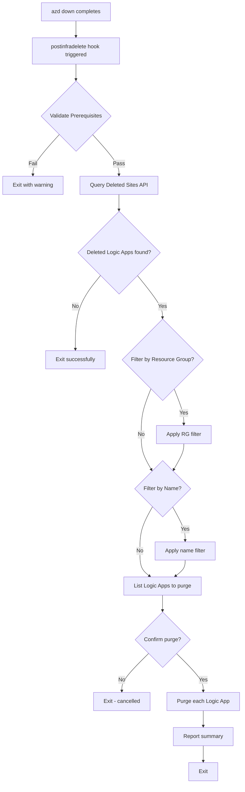

# postinfradelete (.ps1 / .sh)


## 📋 Overview

The `postinfradelete` script is an Azure Developer CLI (azd) hook that automatically purges soft-deleted Logic Apps Standard resources after infrastructure deletion. When Azure Logic Apps Standard are deleted via `azd down`, they enter a soft-delete state and must be explicitly purged to fully remove them. This script handles that purge operation to ensure complete cleanup of Azure resources.

Available in both PowerShell (`.ps1`) and Bash (`.sh`) versions for cross-platform compatibility, this script automatically runs after `azd down` completes, identifying and permanently deleting any Logic Apps that remain in the soft-delete recovery period.

The script supports:

- **Soft-Delete Recovery Bypass**: Permanently removes Logic Apps from Azure's recovery period
- **Resource Group Filtering**: Optionally filter purge operations to a specific resource group
- **Logic App Name Filtering**: Target specific Logic Apps by name pattern
- **Cross-Platform Execution**: Works on Windows, Linux, and macOS
- **CI/CD Integration**: Non-interactive mode for automated pipelines

## 📑 Table of Contents

- [📋 Overview](#-overview)
- [🎯 Purpose](#-purpose)
- [🏗️ Required Environment Variables](#️-required-environment-variables)
- [🚀 Usage](#-usage)
  - [🔄 Automatic Execution (Standard)](#automatic-execution-standard)
  - [💻 Manual Execution](#manual-execution)
  - [⚡ Force Mode](#force-mode)
  - [📝 Verbose Mode](#verbose-mode)
  - [👁️ Preview Mode (WhatIf)](#preview-mode-whatif)
- [🔧 Parameters](#-parameters)
- [🛠️ How It Works](#️-how-it-works)
  - [📊 Workflow Diagram](#workflow-diagram)
  - [🔗 Azure REST API Operations](#azure-rest-api-operations)
- [📚 Examples](#-examples)
- [📖 Related Documentation](#-related-documentation)
- [🔐 Security Considerations](#-security-considerations)
- [🎓 Best Practices](#-best-practices)
- [📜 Version History](#-version-history)

## 🎯 Purpose

This script is **automatically executed** by `azd down` after infrastructure deletion. It:

- ✅ **Validates Prerequisites**: Ensures Azure CLI is installed and user is logged in
- ✅ **Queries Deleted Sites**: Uses Azure REST API to find soft-deleted Logic Apps
- ✅ **Filters by Scope**: Optionally filters by resource group or Logic App name
- ✅ **Purges Logic Apps**: Permanently removes soft-deleted Logic Apps
- ✅ **Reports Results**: Provides detailed logging of purge operations
- ✅ **Handles Errors Gracefully**: Continues even if some purges fail (configurable)

## 🏗️ Required Environment Variables

The following environment variables are automatically set by `azd` during the hook execution:

| Variable | Required | Description |
|----------|----------|-------------|
| `AZURE_SUBSCRIPTION_ID` | ✅ Yes | The Azure subscription ID where resources were deployed |
| `AZURE_LOCATION` | ✅ Yes | The Azure region where Logic Apps were deployed |
| `AZURE_RESOURCE_GROUP` | ❌ Optional | Filter purge to a specific resource group |
| `LOGIC_APP_NAME` | ❌ Optional | Filter purge to Logic Apps matching this name pattern |

### ⚙️ How azd Sets These Variables

When running `azd down`, the environment variables are automatically loaded from:

1. **Azure deployment outputs**: Values from Bicep `output` declarations
2. **azd environment configuration**: Values stored in `.azure/<env-name>/.env`

## 🚀 Usage

### 🔄 Automatic Execution (Standard)

The script runs automatically as part of `azd down`:

```bash
# Delete all infrastructure (triggers postinfradelete hook)
azd down

# Delete with force (no confirmations)
azd down --force
```

### 💻 Manual Execution

You can run the script manually if needed:

**PowerShell:**
```powershell
# Set required environment variables
$env:AZURE_SUBSCRIPTION_ID = "your-subscription-id"
$env:AZURE_LOCATION = "eastus2"

# Run the script
./hooks/postinfradelete.ps1
```

**Bash:**
```bash
# Set required environment variables
export AZURE_SUBSCRIPTION_ID="your-subscription-id"
export AZURE_LOCATION="eastus2"

# Run the script
./hooks/postinfradelete.sh
```

### ⚡ Force Mode

Skip confirmation prompts:

**PowerShell:**
```powershell
./hooks/postinfradelete.ps1 -Force
```

**Bash:**
```bash
./hooks/postinfradelete.sh --force
```

### 📝 Verbose Mode

Enable detailed logging:

**PowerShell:**
```powershell
./hooks/postinfradelete.ps1 -Verbose
```

**Bash:**
```bash
./hooks/postinfradelete.sh --verbose
```

### 👁️ Preview Mode (WhatIf)

See what would be purged without making changes (PowerShell only):

```powershell
./hooks/postinfradelete.ps1 -WhatIf
```

## 🔧 Parameters

### PowerShell Parameters

| Parameter | Type | Default | Description |
|-----------|------|---------|-------------|
| `-Force` | Switch | `$false` | Skip confirmation prompts |
| `-Verbose` | Switch | `$false` | Enable verbose output |
| `-WhatIf` | Switch | `$false` | Preview mode - show what would be purged |
| `-Confirm` | Switch | `$true` | Prompt for confirmation before purging |

### Bash Options

| Option | Short | Description |
|--------|-------|-------------|
| `--force` | `-f` | Skip confirmation prompts |
| `--verbose` | `-v` | Enable verbose output |
| `--help` | `-h` | Show help message |

## 🛠️ How It Works

### 📊 Workflow Diagram



### 🔗 Azure REST API Operations

The script uses the following Azure REST API endpoints:

#### List Deleted Sites
```http
GET https://management.azure.com/subscriptions/{subscriptionId}/providers/Microsoft.Web/locations/{location}/deletedSites?api-version=2023-12-01
```

Returns all soft-deleted web sites (including Logic Apps Standard) in the specified location.

#### Purge Deleted Site
```http
DELETE https://management.azure.com{deletedSiteId}?api-version=2023-12-01
```

Permanently deletes a soft-deleted site, removing it from the recovery period.

## 📚 Examples

### Example 1: Standard azd Down

```bash
# Run azd down - postinfradelete hook runs automatically
azd down

# Output:
# ...
# [postinfradelete hook]
# 12:34:56 [i] ========================================
# 12:34:56 [i] Post-Infrastructure Delete Hook v1.0.0
# 12:34:56 [i] Logic Apps Purge Script
# 12:34:56 [i] ========================================
# 12:34:56 [i] Validating prerequisites...
# 12:34:57 [✓] Azure CLI prerequisites validated
# 12:34:57 [i] Configuration:
# 12:34:57 [i]   Subscription: 12345678-1234-1234-1234-123456789012
# 12:34:57 [i]   Location: eastus2
# 12:34:57 [i] Starting Logic App purge process...
# 12:34:58 [i] Found 1 soft-deleted Logic App(s)
# 12:34:58 [i]   - my-logic-app-abc123 (Resource Group: rg-myapp, Deleted: 2026-01-09T12:30:00Z)
# 12:34:59 [✓] Successfully purged Logic App: my-logic-app-abc123
# 12:34:59 [i] ========================================
# 12:34:59 [i] Purge Summary
# 12:34:59 [i] ========================================
# 12:34:59 [✓] Logic Apps purged: 1
```

### Example 2: Manual Execution with Filters

```powershell
# Set environment variables
$env:AZURE_SUBSCRIPTION_ID = "12345678-1234-1234-1234-123456789012"
$env:AZURE_LOCATION = "eastus2"
$env:AZURE_RESOURCE_GROUP = "rg-myapp-dev"
$env:LOGIC_APP_NAME = "orders"

# Run with verbose output
./hooks/postinfradelete.ps1 -Force -Verbose
```

### Example 3: CI/CD Pipeline Integration

```yaml
# Azure DevOps Pipeline
- task: AzureCLI@2
  displayName: 'Purge Deleted Logic Apps'
  inputs:
    azureSubscription: 'MyServiceConnection'
    scriptType: 'pscore'
    scriptPath: './hooks/postinfradelete.ps1'
    arguments: '-Force -Verbose'
  env:
    AZURE_SUBSCRIPTION_ID: $(AZURE_SUBSCRIPTION_ID)
    AZURE_LOCATION: $(AZURE_LOCATION)
```

## 📖 Related Documentation

- [Azure Developer CLI (azd) Hooks](https://learn.microsoft.com/azure/developer/azure-developer-cli/azd-extensibility)
- [Azure Logic Apps Standard](https://learn.microsoft.com/azure/logic-apps/single-tenant-overview-compare)
- [Azure Web Sites REST API](https://learn.microsoft.com/rest/api/appservice/deleted-web-apps)
- [preprovision Hook](./preprovision.md) - Pre-provisioning validation
- [postprovision Hook](./postprovision.md) - Post-provisioning configuration
- [deploy-workflow Hook](./deploy-workflow.md) - Logic Apps workflow deployment

## 🔐 Security Considerations

### ✅ Safe Operations

- Uses existing Azure CLI session (no credentials stored)
- Requires explicit authentication (`az login`)
- Supports confirmation prompts for safety
- WhatIf mode for previewing changes

### ⚠️ Caution

- **Purge is permanent**: Once purged, Logic Apps cannot be recovered
- Ensure you have the correct subscription and location configured
- Use filters (`AZURE_RESOURCE_GROUP`, `LOGIC_APP_NAME`) to limit scope
- Test with `-WhatIf` before executing in production

### 🔒 Required Permissions

The executing identity needs the following Azure RBAC permissions:

| Permission | Scope | Purpose |
|------------|-------|---------|
| `Microsoft.Web/deletedSites/read` | Subscription | List deleted Logic Apps |
| `Microsoft.Web/deletedSites/delete` | Subscription | Purge deleted Logic Apps |

These permissions are typically included in:
- **Contributor** role
- **Website Contributor** role
- Custom role with explicit permissions

## 🎓 Best Practices

### 🔄 Development Workflow

1. Always run `azd down` to trigger automatic cleanup
2. Use filters when working with multiple environments
3. Review purge list before confirming in interactive mode

### 🌍 Multi-Environment Management

```powershell
# Target specific environment
azd env select dev
azd down  # Purges only dev environment Logic Apps
```

### 🔁 CI/CD Integration

- Always use `-Force` flag in automated pipelines
- Set appropriate timeouts for API calls
- Log outputs for audit trails
- Handle partial failures gracefully

## 📊 Performance

### ⚡ Performance Characteristics

| Operation | Typical Duration |
|-----------|-----------------|
| Prerequisites check | ~1 second |
| Query deleted sites | ~2-5 seconds |
| Purge single Logic App | ~3-5 seconds |
| Total (1-5 Logic Apps) | ~10-30 seconds |

## 📜 Version History

| Version | Date | Changes |
|---------|------|---------|
| 1.0.0 | 2026-01-09 | Initial release |

---

**Author**: Evilazaro | Principal Cloud Solution Architect | Microsoft  
**Repository**: [Azure-LogicApps-Monitoring](https://github.com/Evilazaro/Azure-LogicApps-Monitoring)
