# postinfradelete

[Home](../../README.md) > [Docs](..) > [Hooks](README.md) > postinfradelete

> 🧹 Purges soft-deleted Azure Logic Apps Standard resources after infrastructure deletion

---

## Table of Contents

- [Overview](#overview)
- [Compatibility](#compatibility)
- [Prerequisites](#prerequisites)
- [Parameters](#parameters)
- [Script Flow](#script-flow)
- [External Interactions](#external-interactions)
- [Functions](#functions)
- [Usage](#usage)
- [Environment Variables](#environment-variables)
- [Exit Codes](#exit-codes)
- [Error Handling](#error-handling)
- [Notes](#notes)
- [See Also](#see-also)

---

## Overview

This script serves as a post-infrastructure-delete hook for the Azure Developer CLI (azd). It is automatically executed after `azd down` completes to handle cleanup of soft-deleted Azure Logic Apps Standard resources.

When Azure Logic Apps Standard are deleted through normal infrastructure teardown, they enter a soft-delete state and remain recoverable for a retention period. This script permanently purges these soft-deleted resources to ensure complete cleanup of the Azure environment.

**Operations Performed:**

1. Validates that Azure CLI is installed and the user is authenticated
2. Validates required environment variables (AZURE_SUBSCRIPTION_ID, AZURE_LOCATION)
3. Queries the Azure REST API for soft-deleted Logic Apps in the specified location
4. Filters results by resource group and/or Logic App name if specified
5. Purges matching soft-deleted Logic Apps via the Azure REST API

---

## Compatibility

| Platform    | Script               | Status |
|:------------|:---------------------|:------:|
| Windows     | `postinfradelete.ps1` |   ✅   |
| Linux/macOS | `postinfradelete.sh`  |   ✅   |

---

## Prerequisites

| Requirement | Details | Installation Guide |
|:------------|:--------|:-------------------|
| **PowerShell** | 7.0 or higher | [Install PowerShell](https://docs.microsoft.com/powershell/scripting/install/installing-powershell) |
| **Bash** | 4.0 or higher | Pre-installed on Linux/macOS |
| **Azure CLI** | 2.50 or higher | [Install Azure CLI](https://docs.microsoft.com/cli/azure/install-azure-cli) |
| **jq** | JSON processor (Bash only) | [Install jq](https://stedolan.github.io/jq/download/) |

---

## Parameters

| Parameter | Type | Required | Default | Description |
|:----------|:----:|:--------:|:-------:|:------------|
| `-Force` / `--force` | Switch | No | `false` | Bypasses confirmation prompts and forces immediate purge |
| `-Verbose` / `--verbose` | Switch | No | `false` | Displays detailed diagnostic information |
| `-WhatIf` | Switch | No | `false` | Shows which Logic Apps would be purged (PowerShell only) |
| `-Confirm` | Switch | No | `true` | Prompts for confirmation before each purge (PowerShell only) |
| `--help` | Switch | No | N/A | Displays help message (Bash only) |

---

## Script Flow

### Execution Flow

```mermaid
%%{init: {'flowchart': {'nodeSpacing': 30, 'rankSpacing': 40, 'curve': 'basis'}}}%%
flowchart TD
    subgraph INIT["🔧 Initialization"]
        direction TB
        A([▶️ Start]):::startNode
        A --> B[🔧 Parse Arguments]:::config
        B --> C[📋 Display Banner]:::logging
    end

    subgraph VALIDATE["✅ Validation Phase"]
        direction TB
        D{🔍 Azure CLI Installed?}:::validation
        D -->|❌ No| E1[❗ CLI Not Found]:::error
        D -->|✅ Yes| E{🔍 jq Installed?}:::validation
        E -->|❌ No| E2[❗ jq Not Found]:::error
        E -->|✅ Yes| F{🔐 Azure Logged In?}:::auth
        F -->|❌ No| E3[❗ Not Authenticated]:::error
        F -->|✅ Yes| G{🔍 SUBSCRIPTION_ID Set?}:::validation
        G -->|❌ No| E4[❗ Missing Env Var]:::error
        G -->|✅ Yes| H{🔍 LOCATION Set?}:::validation
        H -->|❌ No| E4
        H -->|✅ Yes| I[✅ Prerequisites Valid]:::logging
    end

    subgraph EXECUTE["⚡ Execution Phase"]
        direction TB
        J[🌐 Query Deleted Sites API]:::external
        J --> K{📋 Logic Apps Found?}:::decision
        K -->|No| L[📋 No Apps to Purge]:::logging
        K -->|Yes| M[📋 Filter by RG/Name]:::data
        M --> N{🔄 For Each App}:::decision
        N --> O{📋 Confirm Purge?}:::decision
        O -->|No| N
        O -->|Yes| P[🧹 Purge Logic App]:::cleanup
        P --> Q[🌐 DELETE API Call]:::external
        Q --> N
    end

    subgraph CLEANUP["🧹 Cleanup Phase"]
        direction TB
        R[📋 Generate Summary]:::logging
        R --> S[📋 Display Results]:::logging
    end

    subgraph EXIT["🚪 Exit Handling"]
        direction TB
        T([❌ Exit 1]):::errorExit
        U([✅ Exit 0]):::successExit
    end

    %% Cross-subgraph connections
    C --> D
    E1 --> T
    E2 --> T
    E3 --> T
    E4 --> T
    I --> J
    L --> R
    N -->|Done| R
    S --> U

    %% Subgraph styles
    style INIT fill:#e8eaf6,stroke:#303f9f,stroke-width:2px,color:#1a237e
    style VALIDATE fill:#fff8e1,stroke:#ffa000,stroke-width:2px,color:#ff6f00
    style EXECUTE fill:#e0f2f1,stroke:#00796b,stroke-width:2px,color:#004d40
    style CLEANUP fill:#ede7f6,stroke:#512da8,stroke-width:2px,color:#311b92
    style EXIT fill:#eceff1,stroke:#455a64,stroke-width:2px,color:#263238

    %% Node class definitions
    classDef startNode fill:#b3e5fc,stroke:#0288d1,stroke-width:3px,color:#01579b
    classDef successExit fill:#c8e6c9,stroke:#388e3c,stroke-width:3px,color:#1b5e20
    classDef errorExit fill:#ffcdd2,stroke:#d32f2f,stroke-width:3px,color:#b71c1c
    classDef decision fill:#ffe0b2,stroke:#f57c00,stroke-width:2px,color:#e65100
    classDef validation fill:#fff9c4,stroke:#f9a825,stroke-width:2px,color:#f57f17
    classDef auth fill:#b2ebf2,stroke:#0097a7,stroke-width:2px,color:#006064
    classDef external fill:#bbdefb,stroke:#1976d2,stroke-width:2px,color:#0d47a1
    classDef error fill:#ffebee,stroke:#e53935,stroke-width:2px,color:#c62828
    classDef cleanup fill:#e1bee7,stroke:#7b1fa2,stroke-width:2px,color:#4a148c
    classDef logging fill:#d7ccc8,stroke:#6d4c41,stroke-width:2px,color:#3e2723
    classDef config fill:#c5cae9,stroke:#3949ab,stroke-width:2px,color:#1a237e
    classDef data fill:#f0f4c3,stroke:#9e9d24,stroke-width:2px,color:#827717
```



### External Interactions


---

## Functions

### PowerShell Functions

| Function | Purpose |
|:---------|:--------|
| `Write-Log` | Writes a formatted log message with level indicators |
| `Test-AzureCliAuthentication` | Verifies Azure CLI login status |
| `Get-DeletedLogicApps` | Queries Azure for soft-deleted Logic Apps |
| `Remove-SoftDeletedLogicApp` | Purges a single soft-deleted Logic App |

### Bash Functions

| Function | Purpose |
|:---------|:--------|
| `log_info` / `log_success` / `log_error` | Formatted logging functions |
| `log_warning` / `log_verbose` | Additional logging helpers |
| `show_help` | Displays usage information |
| `parse_arguments` | Parses command-line arguments |
| `check_azure_cli` | Validates Azure CLI installation |
| `check_jq` | Validates jq installation |
| `check_azure_login` | Verifies Azure authentication |
| `check_required_env_var` | Validates environment variables |
| `get_deleted_logic_apps` | Queries deleted sites API |
| `purge_logic_app` | Purges a soft-deleted Logic App |

---

## Usage

### PowerShell

```powershell
# Standard execution with confirmation prompts
.\postinfradelete.ps1

# Force purge without confirmations
.\postinfradelete.ps1 -Force

# Force purge with detailed output
.\postinfradelete.ps1 -Force -Verbose

# Preview which Logic Apps would be purged
.\postinfradelete.ps1 -WhatIf

# Manual execution with environment variables
$env:AZURE_SUBSCRIPTION_ID = "12345678-1234-1234-1234-123456789012"
$env:AZURE_LOCATION = "eastus2"
.\postinfradelete.ps1 -Force
```

### Bash

```bash
# Standard execution with prompts
./postinfradelete.sh

# Force purge without confirmations
./postinfradelete.sh --force

# Force purge with verbose output
./postinfradelete.sh --force --verbose

# Display help
./postinfradelete.sh --help
```

---

## Environment Variables

| Variable | Description | Required | Default |
|:---------|:------------|:--------:|:-------:|
| `AZURE_SUBSCRIPTION_ID` | Azure subscription GUID | ✅ Yes | N/A |
| `AZURE_LOCATION` | Azure region where resources were deployed | ✅ Yes | N/A |
| `AZURE_RESOURCE_GROUP` | Filter by specific resource group | No | N/A |
| `LOGIC_APP_NAME` | Filter by Logic App name pattern | No | N/A |

> ℹ️ **Note**: Environment variables are automatically set by azd when running as a hook. When running manually, ensure these variables are configured.

---

## Exit Codes

| Code | Meaning |
|-----:|:--------|
| 0 | ✅ Success - All purge operations completed |
| 1 | ❌ Error - Missing prerequisites or purge failure |

---

## Error Handling

The script implements comprehensive error handling:

- **Prerequisite Validation**: Checks for Azure CLI, jq, and authentication before proceeding
- **Environment Validation**: Fails fast if required environment variables are missing
- **API Error Handling**: Gracefully handles REST API failures with detailed error messages
- **Confirmation Prompts**: Requires explicit confirmation before destructive operations (unless `-Force`)
- **Color-coded Output**: Visual distinction for info, success, warning, and error messages

---

## Notes

| Item | Details |
|:-----|:--------|
| **Version** | 2.0.0 |
| **Author** | Evilazaro \| Principal Cloud Solution Architect \| Microsoft |
| **Last Modified** | 2026-01-09 |
| **Repository** | [Azure-LogicApps-Monitoring](https://github.com/Evilazaro/Azure-LogicApps-Monitoring) |
| **Azure API Version** | 2023-12-01 |

> ⚠️ **Warning**: Purged resources **cannot be recovered**. Use `-WhatIf` to preview which resources would be affected before running with `-Force`.

> 💡 **Tip**: The script uses the Azure REST API directly via `az rest` commands rather than Azure PowerShell modules to minimize dependencies and ensure compatibility with the azd execution environment.

---

## See Also

- [preprovision.md](preprovision.md) — Pre-provisioning validation
- [postprovision.md](postprovision.md) — Post-provisioning configuration
- [deploy-workflow.md](deploy-workflow.md) — Logic Apps workflow deployment
- [README.md](README.md) — Hooks documentation overview

---

[← Back to Hooks Documentation](README.md)
