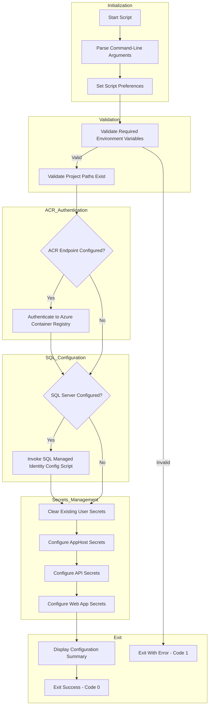

# Configure Azure Resource Secrets and Managed Identity After Provisioning

## Overview

> [!NOTE]
> This script runs automatically after `azd provision` or `azd up` completes. It can also be run manually.

This script is automatically executed by Azure Developer CLI (azd) after infrastructure provisioning completes. It performs comprehensive post-deployment configuration to enable local development and Azure resource connectivity.

The script handles:

1. **Environment Validation** - Validates required environment variables
2. **Azure Container Registry Authentication** - Authenticates to ACR if configured
3. **SQL Database Managed Identity Configuration** - Configures managed identity database user
4. **\.NET User Secrets Management** - Configures secrets for local development

The script is implemented in **both PowerShell and Bash** to support cross-platform execution.

## Script Classification

| Attribute | Value |
|-----------|-------|
| **Category** | azd Lifecycle Hook |
| **Trigger Mechanism** | azd hook (postprovision) |
| **azd Hook** | Yes - `postprovision` |
| **azd Command** | `azd provision`, `azd up` |

## Supported Environments

### Shells

| Shell | Minimum Version |
|-------|-----------------|
| PowerShell | 7.0+ |
| Bash | 4.0+ |

### Operating Systems

| OS | Supported |
|----|-----------|
| Windows | ✓ |
| Linux | ✓ |
| macOS | ✓ |

## Prerequisites

> [!IMPORTANT]
> Ensure you are authenticated to Azure CLI before running this script manually.

| Prerequisite | Required | Description |
|--------------|----------|-------------|
| .NET SDK | Yes | Version 8.0+ for user secrets management |
| Azure CLI | Optional | For ACR authentication |
| Azure Developer CLI | Yes | Sets environment variables |
| go-sqlcmd | Optional | For SQL managed identity configuration |

### Required Environment Variables

| Variable | Set By | Description |
|----------|--------|-------------|
| `AZURE_SUBSCRIPTION_ID` | azd | Azure subscription GUID |
| `AZURE_RESOURCE_GROUP` | azd | Resource group containing deployed resources |
| `AZURE_LOCATION` | azd | Azure region where resources are deployed |

### Optional Environment Variables

| Variable | Description |
|----------|-------------|
| `AZURE_TENANT_ID` | Azure AD tenant ID |
| `MANAGED_IDENTITY_CLIENT_ID` | Client ID of managed identity |
| `MANAGED_IDENTITY_NAME` | Name of managed identity for SQL access |
| `APPLICATIONINSIGHTS_CONNECTION_STRING` | App Insights connection string |
| `MESSAGING_SERVICEBUSHOSTNAME` | Service Bus hostname |
| `AZURE_SQL_SERVER_NAME` | SQL Server name for managed identity config |
| `AZURE_SQL_DATABASE_NAME` | SQL Database name |
| `AZURE_CONTAINER_REGISTRY_ENDPOINT` | ACR endpoint for authentication |

## Files

| File | Description |
|------|-------------|
| `postprovision.ps1` | PowerShell implementation |
| `postprovision.sh` | Bash implementation |
| `sql-managed-identity-config.ps1` / `.sh` | Helper script for SQL configuration (invoked automatically) |

## High-Level Script Flow



## Usage

> [!TIP]
> Use `-WhatIf` (PowerShell) or `--dry-run` (Bash) to preview configuration changes.

### PowerShell

```powershell
# Standard execution (interactive prompts)
./postprovision.ps1

# Execute with verbose output
./postprovision.ps1 -Verbose

# Preview changes without executing
./postprovision.ps1 -WhatIf

# Force execution without prompts (CI/CD)
./postprovision.ps1 -Force

# Automated execution with full logging
./postprovision.ps1 -Force -Verbose
```

### Bash

```bash
# Standard execution
./postprovision.sh

# Execute with verbose output
./postprovision.sh --verbose

# Preview changes (dry-run)
./postprovision.sh --dry-run

# Force execution without prompts
./postprovision.sh --force

# Display help
./postprovision.sh --help
```

## Parameters

| Logical Parameter | PowerShell Name | Bash Name | Required | Description |
|-------------------|-----------------|-----------|----------|-------------|
| Force | `-Force` | `--force` | No | Skips confirmation prompts |
| Verbose | `-Verbose` | `--verbose` | No | Displays detailed diagnostic output |
| Dry Run | `-WhatIf` | `--dry-run` | No | Shows what would be done without making changes |
| Help | N/A | `--help` | No | Displays help message |

## Target Projects

The script configures user secrets for:

| Project | Path | Secrets Configured |
|---------|------|-------------------|
| AppHost | `app.AppHost/app.AppHost.csproj` | Full Azure configuration |
| API | `src/eShop.Orders.API/eShop.Orders.API.csproj` | Service Bus, Database, App Insights |
| Web App | `src/eShop.Web.App/eShop.Web.App.csproj` | Application Insights |

## Examples

### Standard Post-Provision (azd Hook)

The script runs automatically after `azd provision` or `azd up`:

```bash
azd provision
# postprovision hook executes automatically
```

### Manual Execution with Verbose Output

**PowerShell:**

```powershell
./postprovision.ps1 -Verbose
```

**Bash:**

```bash
./postprovision.sh --verbose
```

### CI/CD Pipeline Execution

**PowerShell:**

```powershell
./postprovision.ps1 -Force -Verbose
```

**Bash:**

```bash
./postprovision.sh --force --verbose
```

## Error Handling & Exit Codes

| Exit Code | Description |
|-----------|-------------|
| 0 | Configuration completed successfully |
| 1 | General error (validation failed or operation failed) |
| 2 | Invalid arguments (Bash only) |

### Error Behavior

- **PowerShell**: Uses `SupportsShouldProcess` with `ConfirmImpact = 'Medium'`. Non-critical failures (ACR login) are logged but don't stop execution.
- **Bash**: Uses `set -euo pipefail` for strict error handling. ACR authentication failures are non-blocking.

## Logging & Output

| Output Type | Description |
|-------------|-------------|
| stdout | Status messages, configuration progress |
| stderr | Error messages, warnings, verbose output |
| Color-coded output | Visual distinction using ANSI color codes |

### Output Sections

The script displays formatted section headers:

- Main sections: Double-line borders (`═══`)
- Sub-sections: Single-line borders (`───`)
- Info sections: Simple spacing

## Security Considerations

- User secrets are stored in the local user profile (not in source control)
- Azure AD token authentication is used for SQL Database (no passwords)
- ACR authentication uses existing Azure CLI session
- Access tokens are not logged or persisted
- Connection strings use Azure AD authentication where supported

## Troubleshooting

| Issue | Resolution |
|-------|------------|
| `Required environment variable not set` | Ensure running after `azd provision` or set variables manually |
| `Project file not found` | Verify project structure matches expected layout |
| `ACR authentication failed` | Run `az login` to authenticate Azure CLI |
| `SQL managed identity config failed` | Ensure user is Entra ID admin of SQL Server |
| `dotnet user-secrets failed` | Verify .NET SDK is installed and project has UserSecretsId |

### Secrets Configuration

User secrets are set using `dotnet user-secrets set`:

```powershell
dotnet user-secrets set "ConnectionStrings:SqlDatabase" "Server=xxx;Database=xxx;..." -p "path/to/project.csproj"
```

## Development Notes

- Script version: `2.0.1` for both implementations
- SQL managed identity configuration invokes the helper script `sql-managed-identity-config.ps1`/`.sh`
- ACR authentication is non-blocking - deployment continues if it fails
- Statistics tracking provides success/skipped/failed counts

## License & Ownership

| Attribute | Value |
|-----------|-------|
| Author | Azure DevOps Team |
| Version | 2.0.1 |
| Last Modified | 2026-01-06 |
| Repository | [Azure-LogicApps-Monitoring](https://github.com/Evilazaro/Azure-LogicApps-Monitoring) |

## Related Links

- [Azure Developer CLI Documentation](https://learn.microsoft.com/azure/developer/azure-developer-cli/)
- [.NET User Secrets](https://learn.microsoft.com/dotnet/core/tools/dotnet-user-secrets)
- [Azure Container Registry Authentication](https://learn.microsoft.com/azure/container-registry/container-registry-authentication)

- [Azure Developer CLI Documentation](https://learn.microsoft.com/azure/developer/azure-developer-cli/)
- [.NET User Secrets](https://learn.microsoft.com/aspnet/core/security/app-secrets)
- [Azure AD Authentication for SQL](https://learn.microsoft.com/azure/azure-sql/database/authentication-aad-configure)
