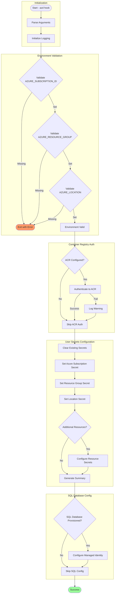

# postprovision

## Synopsis

Post-provisioning script for Azure Developer CLI (azd) that configures .NET user secrets with Azure resource information after infrastructure provisioning completes.

## Description

This script is automatically executed by Azure Developer CLI (azd) after the infrastructure provisioning phase completes successfully. It bridges the gap between Azure resource deployment and local development by configuring .NET user secrets with the connection information for newly provisioned Azure resources.

The script performs several critical operations: validating that required environment variables are set by azd, authenticating to Azure Container Registry if configured, clearing any existing user secrets to prevent conflicts, and configuring new secrets with Azure resource information such as connection strings, endpoints, and credentials.

The configuration enables local development against Azure resources without hardcoding sensitive information in application configuration files. All secrets are stored securely using .NET's built-in user secrets mechanism, which stores data in a protected location outside the project directory.

## Workflow Diagram



## Prerequisites

| Category | Requirement | Version | Verification Command | Required |
|----------|-------------|---------|---------------------|----------|
| Runtime | PowerShell Core | >= 7.0 | `$PSVersionTable.PSVersion` | Yes |
| Runtime | Bash | >= 4.0 | `bash --version` | Yes |
| SDK | .NET SDK | >= 10.0 | `dotnet --version` | Yes |
| CLI Tool | Azure CLI | >= 2.50 | `az --version` | Yes |
| CLI Tool | Azure Developer CLI | Latest | `azd version` | Yes |
| Environment Variable | AZURE_SUBSCRIPTION_ID | N/A | `echo $AZURE_SUBSCRIPTION_ID` | Yes |
| Environment Variable | AZURE_RESOURCE_GROUP | N/A | `echo $AZURE_RESOURCE_GROUP` | Yes |
| Environment Variable | AZURE_LOCATION | N/A | `echo $AZURE_LOCATION` | Yes |

## Parameters/Arguments

### PowerShell Parameters

| Parameter | Type | Required | Default | Description |
|-----------|------|----------|---------|-------------|
| `-Force` | `[switch]` | No | `$false` | Skips confirmation prompts and forces execution |

### Bash Arguments

| Position/Flag | Type | Required | Default | Description |
|---------------|------|----------|---------|-------------|
| `--force` | flag | No | `false` | Skip confirmation prompts and force execution |
| `--verbose` | flag | No | `false` | Enable verbose output for debugging |
| `--dry-run` | flag | No | `false` | Show what would be executed without making changes |
| `--help` | flag | No | N/A | Display help message |

## Input/Output Specifications

### Inputs

**Environment Variables Read (set by azd):**

| Variable | Required | Description |
|----------|----------|-------------|
| `AZURE_SUBSCRIPTION_ID` | Yes | Azure subscription GUID |
| `AZURE_RESOURCE_GROUP` | Yes | Resource group containing deployed resources |
| `AZURE_LOCATION` | Yes | Azure region where resources are deployed |
| `AZURE_CONTAINER_REGISTRY_NAME` | No | ACR name for container authentication |
| `AZURE_CONTAINER_REGISTRY_ENDPOINT` | No | ACR endpoint URL |
| `SERVICE_BUS_CONNECTION_STRING` | No | Service Bus connection string |
| `STORAGE_ACCOUNT_NAME` | No | Storage account name |
| `SQL_SERVER_FQDN` | No | SQL Server fully qualified domain name |
| `SQL_DATABASE_NAME` | No | SQL database name |

### Outputs

**Exit Codes:**

| Exit Code | Meaning |
|-----------|---------|
| 0 | Success - All secrets configured |
| 1 | General error |
| 2 | Missing required environment variables |
| 3 | Azure CLI not authenticated |

**stdout Output:**

- Progress messages with timestamps
- Configuration summary
- Success/failure indicators

**Secrets Configured:**

- Azure subscription and resource group information
- Connection strings for Azure services
- Storage account credentials
- Service Bus connection information

## Usage Examples

### Basic Usage

```powershell
# PowerShell: Run post-provisioning (typically called by azd)
.\postprovision.ps1
```

```bash
# Bash: Run post-provisioning (typically called by azd)
./postprovision.sh
```

### Advanced Usage

```powershell
# PowerShell: Run with verbose output for debugging
.\postprovision.ps1 -Verbose

# PowerShell: Simulate execution without making changes
.\postprovision.ps1 -WhatIf

# PowerShell: Force execution without prompts
.\postprovision.ps1 -Force
```

```bash
# Bash: Run with verbose output for debugging
./postprovision.sh --verbose

# Bash: Simulate execution without making changes
./postprovision.sh --dry-run

# Bash: Force execution without prompts
./postprovision.sh --force
```

### CI/CD Pipeline Usage

```yaml
# Azure DevOps Pipeline - Post-provision hook
- task: AzureCLI@2
  displayName: 'Configure user secrets'
  inputs:
    azureSubscription: 'Azure-Connection'
    scriptType: 'bash'
    scriptLocation: 'scriptPath'
    scriptPath: '$(System.DefaultWorkingDirectory)/hooks/postprovision.sh'
    arguments: '--force'
  env:
    AZURE_SUBSCRIPTION_ID: $(AZURE_SUBSCRIPTION_ID)
    AZURE_RESOURCE_GROUP: $(AZURE_RESOURCE_GROUP)
    AZURE_LOCATION: $(AZURE_LOCATION)

# GitHub Actions
- name: Post-provision configuration
  shell: pwsh
  run: ./hooks/postprovision.ps1 -Force
  env:
    AZURE_SUBSCRIPTION_ID: ${{ secrets.AZURE_SUBSCRIPTION_ID }}
    AZURE_RESOURCE_GROUP: ${{ vars.AZURE_RESOURCE_GROUP }}
    AZURE_LOCATION: ${{ vars.AZURE_LOCATION }}
```

## Error Handling and Exit Codes

| Exit Code | Meaning | Recovery Action |
|-----------|---------|-----------------|
| 0 | Success | N/A |
| 1 | General error | Check stderr output, review execution logs |
| 2 | Missing environment variables | Ensure azd provisioning completed successfully |
| 3 | Azure CLI authentication failure | Run `az login` to authenticate |

### Error Handling Approach

**PowerShell:**

- `Set-StrictMode -Version Latest` enforces strict variable handling
- `$ErrorActionPreference = 'Stop'` ensures errors halt execution
- Try/Catch/Finally for structured exception handling
- Detailed error messages with recovery suggestions

**Bash:**

- `set -euo pipefail` for strict error handling
- Trap handlers for cleanup on EXIT
- Color-coded error messages
- Execution statistics tracking (success/failure counts)

## Security Considerations

### Credential Handling

- [x] No hardcoded secrets
- [x] Credentials sourced from: Azure environment variables (set by azd)
- [x] Secrets stored using .NET user secrets (protected storage)
- [x] ACR authentication uses Azure CLI session

### Required Permissions

| Permission/Role | Scope | Justification |
|-----------------|-------|---------------|
| Reader | Resource Group | Read provisioned resource information |
| AcrPull | Container Registry | Authenticate and pull container images |
| Contributor | SQL Database | Configure managed identity access |

### Network Security

- **Endpoints accessed:** Azure Container Registry, Azure SQL Database
- **TLS requirements:** TLS 1.2+
- **Firewall rules needed:** Outbound HTTPS (443)

### Logging Security

- **Sensitive data masking:** Yes - connection strings and tokens are not logged
- **Audit trail:** Timestamped execution logs

## Known Limitations

- Requires azd to have completed provisioning successfully
- Environment variables must be set before execution
- ACR authentication may fail if firewall rules are restrictive
- SQL managed identity configuration requires admin privileges
- User secrets are stored per-user, not shared across team members

## Related Scripts

| Script | Relationship | Description |
|--------|--------------|-------------|
| [preprovision.md](preprovision.md) | Precedes | Validates prerequisites before provisioning |
| [clean-secrets.md](clean-secrets.md) | Called by | Clears existing user secrets |
| [sql-managed-identity-config.md](sql-managed-identity-config.md) | Called by | Configures SQL managed identity |

## Changelog

| Version | Date | Changes |
|---------|------|---------|
| 2.0.1 | 2026-01-06 | Added SQL managed identity configuration |
| 2.0.0 | 2025-12-01 | Improved secret configuration workflow |
| 1.0.0 | 2025-01-01 | Initial release |
