# ⚙️ postprovision

> [!NOTE]
> **Target Audience:** DevOps Engineers, Cloud Architects, Developers  
> **Estimated Reading Time:** 10 minutes

<details>
<summary>📍 <strong>Navigation</strong></summary>
<br>

| Previous | Index | Next |
|:---------|:-----:|-----:|
| [preprovision](preprovision.md) | [📑 Index](README.md) | [postinfradelete](postinfradelete.md) |

</details>

---

## 📑 Table of Contents

- [📋 Overview](#-overview)
- [📝 Description](#-description)
- [📊 Workflow Diagram](#-workflow-diagram)
- [✅ Prerequisites](#-prerequisites)
- [⚙️ Parameters/Arguments](#️-parametersarguments)
- [📥 Input/Output Specifications](#-inputoutput-specifications)
- [💻 Usage Examples](#-usage-examples)
- [⚠️ Error Handling and Exit Codes](#️-error-handling-and-exit-codes)
- [🔒 Security Considerations](#-security-considerations)
- [🚧 Known Limitations](#-known-limitations)
- [🔗 Related Scripts](#-related-scripts)
- [📜 Changelog](#-changelog)

---

## 📋 Overview

Post-provisioning script for Azure Developer CLI (azd) that configures .NET user secrets with Azure resource information after infrastructure provisioning completes.

[⬆️ Back to top](#️-postprovision)

---

## 📝 Description

This script is automatically executed by Azure Developer CLI (azd) after the infrastructure provisioning phase completes successfully. It bridges the gap between Azure resource deployment and local development by configuring .NET user secrets with the connection information for newly provisioned Azure resources.

The script performs several critical operations: validating that required environment variables are set by azd, authenticating to Azure Container Registry if configured, clearing any existing user secrets to prevent conflicts, and configuring new secrets with Azure resource information such as connection strings, endpoints, and credentials.

The configuration enables local development against Azure resources without hardcoding sensitive information in application configuration files. All secrets are stored securely using .NET's built-in user secrets mechanism, which stores data in a protected location outside the project directory.

[⬆️ Back to top](#️-postprovision)

---

## 📊 Workflow Diagram

```mermaid
---
title: Post-Provision Script Execution Flow
---
flowchart TD
    %% ===== INITIALIZATION PHASE =====
    subgraph Initialization["🚀 Initialization"]
        direction TB
        Start(["▶️ Start - azd hook"]) -->|begins| ParseArgs["Parse Arguments"]
        ParseArgs -->|configures| InitLog["Initialize Logging"]
    end
    
    %% ===== VALIDATION PHASE =====
    subgraph Validation["✅ Environment Validation"]
        direction TB
        InitLog -->|validates| CheckSub{"Validate AZURE_SUBSCRIPTION_ID"}
        CheckSub -->|set| CheckRG{"Validate AZURE_RESOURCE_GROUP"}
        CheckSub -->|missing| ExitError(["❌ Exit with Error"])
        CheckRG -->|set| CheckLoc{"Validate AZURE_LOCATION"}
        CheckRG -->|missing| ExitError
        CheckLoc -->|set| EnvValid["Environment Valid"]
        CheckLoc -->|missing| ExitError
    end
    
    %% ===== CONTAINER REGISTRY PHASE =====
    subgraph ACR["🐳 Container Registry Auth"]
        direction TB
        EnvValid -->|checks| ACRConfig{"ACR Configured?"}
        ACRConfig -->|yes| AuthACR["Authenticate to ACR"]
        ACRConfig -->|no| SkipACR["Skip ACR Auth"]
        AuthACR -->|success| SkipACR
        AuthACR -->|fail| LogWarn["Log Warning"]
        LogWarn -->|continues| SkipACR
    end
    
    %% ===== SECRETS SETUP PHASE =====
    subgraph SecretsSetup["🔐 User Secrets Configuration"]
        direction TB
        SkipACR -->|initializes| ClearSecrets["Clear Existing Secrets"]
        ClearSecrets -->|sets| SetSub["Set Azure Subscription Secret"]
        SetSub -->|sets| SetRG["Set Resource Group Secret"]
        SetRG -->|sets| SetLoc["Set Location Secret"]
        SetLoc -->|checks| AddResources{"Additional Resources?"}
        AddResources -->|yes| ConfigResources["Configure Resource Secrets"]
        AddResources -->|no| GenSummary["Generate Summary"]
        ConfigResources -->|completes| GenSummary
    end
    
    %% ===== SQL CONFIG PHASE =====
    subgraph SQLConfig["🗃️ SQL Database Config"]
        direction TB
        GenSummary -->|checks| SQLProvisioned{"SQL Database Provisioned?"}
        SQLProvisioned -->|yes| ConfigMI["Configure Managed Identity"]
        SQLProvisioned -->|no| SkipSQL["Skip SQL Config"]
        ConfigMI -->|completes| SkipSQL
    end
    
    %% ===== COMPLETION =====
    SkipSQL -->|finishes| Success(["✅ Success"])
    
    %% ===== NODE STYLING =====
    classDef primary fill:#4F46E5,stroke:#3730A3,color:#FFFFFF
    classDef secondary fill:#10B981,stroke:#059669,color:#FFFFFF
    classDef decision fill:#FFFBEB,stroke:#F59E0B,color:#000000
    classDef failed fill:#F44336,stroke:#C62828,color:#FFFFFF
    classDef trigger fill:#818CF8,stroke:#4F46E5,color:#FFFFFF
    classDef datastore fill:#F59E0B,stroke:#D97706,color:#000000
    
    class Start,Success trigger
    class ParseArgs,InitLog,EnvValid,AuthACR,SkipACR,LogWarn,ClearSecrets,SetSub,SetRG,SetLoc,ConfigResources,GenSummary,ConfigMI,SkipSQL primary
    class CheckSub,CheckRG,CheckLoc,ACRConfig,AddResources,SQLProvisioned decision
    class ExitError failed
    
    %% ===== SUBGRAPH STYLING =====
    style Initialization fill:#EEF2FF,stroke:#4F46E5,stroke-width:2px
    style Validation fill:#ECFDF5,stroke:#10B981,stroke-width:2px
    style ACR fill:#E0E7FF,stroke:#4F46E5,stroke-width:2px
    style SecretsSetup fill:#FEF3C7,stroke:#F59E0B,stroke-width:2px
    style SQLConfig fill:#D1FAE5,stroke:#10B981,stroke-width:2px
```



[⬆️ Back to top](#️-postprovision)

---

## ✅ Prerequisites

| Category | Requirement | Version | Verification Command | Required |
|:---------|:------------|:--------|:---------------------|:--------:|
| Runtime | PowerShell Core | >= 7.0 | `$PSVersionTable.PSVersion` | ✅ |
| Runtime | Bash | >= 4.0 | `bash --version` | ✅ |
| SDK | .NET SDK | >= 10.0 | `dotnet --version` | ✅ |
| CLI Tool | Azure CLI | >= 2.50 | `az --version` | ✅ |
| CLI Tool | Azure Developer CLI | Latest | `azd version` | ✅ |
| Environment Variable | AZURE_SUBSCRIPTION_ID | N/A | `echo $AZURE_SUBSCRIPTION_ID` | ✅ |
| Environment Variable | AZURE_RESOURCE_GROUP | N/A | `echo $AZURE_RESOURCE_GROUP` | ✅ |
| Environment Variable | AZURE_LOCATION | N/A | `echo $AZURE_LOCATION` | ✅ |

[⬆️ Back to top](#️-postprovision)

---

## ⚙️ Parameters/Arguments

### PowerShell Parameters

| Parameter | Type | Required | Default | Description |
|:----------|:-----|:--------:|:--------|:------------|
| `-Force` | `[switch]` | ❌ | `$false` | Skips confirmation prompts and forces execution |

### Bash Arguments

| Position/Flag | Type | Required | Default | Description |
|:--------------|:-----|:--------:|:--------|:------------|
| `--force` | flag | ❌ | `false` | Skip confirmation prompts and force execution |
| `--verbose` | flag | ❌ | `false` | Enable verbose output for debugging |
| `--dry-run` | flag | ❌ | `false` | Show what would be executed without making changes |
| `--help` | flag | ❌ | N/A | Display help message |

[⬆️ Back to top](#️-postprovision)

---

## 📥 Input/Output Specifications

### Inputs

**Environment Variables Read (set by azd):**

| Variable | Required | Description |
|:---------|:--------:|:------------|
| `AZURE_SUBSCRIPTION_ID` | ✅ | Azure subscription GUID |
| `AZURE_RESOURCE_GROUP` | ✅ | Resource group containing deployed resources |
| `AZURE_LOCATION` | ✅ | Azure region where resources are deployed |
| `AZURE_CONTAINER_REGISTRY_NAME` | ❌ | ACR name for container authentication |
| `AZURE_CONTAINER_REGISTRY_ENDPOINT` | ❌ | ACR endpoint URL |
| `SERVICE_BUS_CONNECTION_STRING` | ❌ | Service Bus connection string |
| `STORAGE_ACCOUNT_NAME` | ❌ | Storage account name |
| `SQL_SERVER_FQDN` | ❌ | SQL Server fully qualified domain name |
| `SQL_DATABASE_NAME` | ❌ | SQL database name |

### Outputs

**Exit Codes:**

| Exit Code | Meaning |
|:---------:|:--------|
| `0` | Success — All secrets configured |
| `1` | General error |
| `2` | Missing required environment variables |
| `3` | Azure CLI not authenticated |

**stdout Output:**

- Progress messages with timestamps
- Configuration summary
- Success/failure indicators

**Secrets Configured:**

- Azure subscription and resource group information
- Connection strings for Azure services
- Storage account credentials
- Service Bus connection information

[⬆️ Back to top](#️-postprovision)

---

## 💻 Usage Examples

### Basic Usage

```powershell
# PowerShell: Run post-provisioning (typically called by azd)
.\postprovision.ps1
```

```bash
# Bash: Run post-provisioning (typically called by azd)
./postprovision.sh
```

### Advanced Usage

```powershell
# PowerShell: Run with verbose output for debugging
.\postprovision.ps1 -Verbose

# PowerShell: Simulate execution without making changes
.\postprovision.ps1 -WhatIf

# PowerShell: Force execution without prompts
.\postprovision.ps1 -Force
```

```bash
# Bash: Run with verbose output for debugging
./postprovision.sh --verbose

# Bash: Simulate execution without making changes
./postprovision.sh --dry-run

# Bash: Force execution without prompts
./postprovision.sh --force
```

### CI/CD Pipeline Usage

```yaml
# Azure DevOps Pipeline - Post-provision hook
- task: AzureCLI@2
  displayName: 'Configure user secrets'
  inputs:
    azureSubscription: 'Azure-Connection'
    scriptType: 'bash'
    scriptLocation: 'scriptPath'
    scriptPath: '$(System.DefaultWorkingDirectory)/hooks/postprovision.sh'
    arguments: '--force'
  env:
    AZURE_SUBSCRIPTION_ID: $(AZURE_SUBSCRIPTION_ID)
    AZURE_RESOURCE_GROUP: $(AZURE_RESOURCE_GROUP)
    AZURE_LOCATION: $(AZURE_LOCATION)

# GitHub Actions
- name: Post-provision configuration
  shell: pwsh
  run: ./hooks/postprovision.ps1 -Force
  env:
    AZURE_SUBSCRIPTION_ID: ${{ secrets.AZURE_SUBSCRIPTION_ID }}
    AZURE_RESOURCE_GROUP: ${{ vars.AZURE_RESOURCE_GROUP }}
    AZURE_LOCATION: ${{ vars.AZURE_LOCATION }}
```

[⬆️ Back to top](#️-postprovision)

---

## ⚠️ Error Handling and Exit Codes

| Exit Code | Meaning | Recovery Action |
|:---------:|:--------|:----------------|
| `0` | Success | N/A |
| `1` | General error | Check stderr output, review execution logs |
| `2` | Missing environment variables | Ensure azd provisioning completed successfully |
| `3` | Azure CLI authentication failure | Run `az login` to authenticate |

### Error Handling Approach

**PowerShell:**

- `Set-StrictMode -Version Latest` enforces strict variable handling
- `$ErrorActionPreference = 'Stop'` ensures errors halt execution
- Try/Catch/Finally for structured exception handling
- Detailed error messages with recovery suggestions

**Bash:**

- `set -euo pipefail` for strict error handling
- Trap handlers for cleanup on EXIT
- Color-coded error messages
- Execution statistics tracking (success/failure counts)

[⬆️ Back to top](#️-postprovision)

---

## 🔒 Security Considerations

### 🔑 Credential Handling

- [x] No hardcoded secrets
- [x] Credentials sourced from: Azure environment variables (set by azd)
- [x] Secrets stored using .NET user secrets (protected storage)
- [x] ACR authentication uses Azure CLI session

### Required Permissions

| Permission/Role | Scope | Justification |
|:----------------|:------|:--------------|
| Reader | Resource Group | Read provisioned resource information |
| AcrPull | Container Registry | Authenticate and pull container images |
| Contributor | SQL Database | Configure managed identity access |

### 🌐 Network Security

| Property | Value |
|:---------|:------|
| **Endpoints accessed** | Azure Container Registry, Azure SQL Database |
| **TLS requirements** | TLS 1.2+ |
| **Firewall rules needed** | Outbound HTTPS (443) |

### 📝 Logging Security

> [!TIP]
> **Security Features:**
>
> - **Sensitive data masking:** Yes — connection strings and tokens are not logged
> - **Audit trail:** Timestamped execution logs

[⬆️ Back to top](#️-postprovision)

---

## 🚧 Known Limitations

> [!WARNING]
> **Important Notes:**
>
> - Requires azd to have completed provisioning successfully
> - Environment variables must be set before execution
> - ACR authentication may fail if firewall rules are restrictive
> - SQL managed identity configuration requires admin privileges
> - User secrets are stored per-user, not shared across team members

[⬆️ Back to top](#️-postprovision)

---

## 🔗 Related Scripts

| Script | Relationship | Description |
|:-------|:-------------|:------------|
| [preprovision.md](preprovision.md) | Precedes | Validates prerequisites before provisioning |
| [clean-secrets.md](clean-secrets.md) | Called by | Clears existing user secrets |
| [sql-managed-identity-config.md](sql-managed-identity-config.md) | Called by | Configures SQL managed identity |

[⬆️ Back to top](#️-postprovision)

---

## 📜 Changelog

| Version | Date | Changes |
|:-------:|:----:|:--------|
| 2.0.1 | 2026-01-06 | Added SQL managed identity configuration |
| 2.0.0 | 2025-12-01 | Improved secret configuration workflow |
| 1.0.0 | 2025-01-01 | Initial release |

[⬆️ Back to top](#️-postprovision)

---

<div align="center">

**[⬅️ Previous: preprovision](preprovision.md)** · **[📑 Index](README.md)** · **[Next: postinfradelete ➡️](postinfradelete.md)**

</div>
