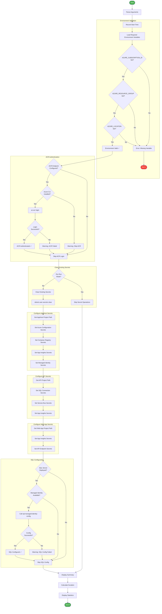

# 🚀 postprovision

> [!NOTE]
> **Target Audience**: DevOps Engineers, Backend Developers  
> **Reading Time**: ~10 minutes

<details>
<summary>📖 Navigation</summary>

| Previous | Index | Next |
|:---------|:-----:|-----:|
| [preprovision](preprovision.md) | [📚 Index](README.md) | [postinfradelete](postinfradelete.md) |

</details>

Post-provisioning script for Azure Developer CLI (azd).

## 📑 Table of Contents

- [📋 Overview](#-overview)
- [⚙️ Prerequisites](#️-prerequisites)
- [🎯 Parameters](#-parameters)
- [🌐 Environment Variables](#-environment-variables)
- [⚙️ Functionality](#️-functionality)
- [📖 Usage Examples](#-usage-examples)
- [💻 Platform Differences](#-platform-differences)
- [🚪 Exit Codes](#-exit-codes)
- [🔗 Related Hooks](#-related-hooks)

## 📋 Overview

Configures .NET user secrets with Azure resource information after infrastructure provisioning completes. This script is automatically executed by `azd` after `azd provision` or `azd up`.

### 🔑 Key Operations

- Validates required environment variables from azd
- Authenticates to Azure Container Registry (if configured)
- Clears existing .NET user secrets
- Configures new user secrets with Azure resource information
- Configures SQL Database managed identity access

### 📅 When Executed

- **Automatically**: After `azd provision` or `azd up` completes successfully
- **Manually**: When needing to reconfigure local development secrets

## ⚙️ Prerequisites

### 🔧 Required Tools

| Tool | Minimum Version | Purpose |
|:-----|:---------------:|:--------|
| PowerShell Core | 7.0+ | Script execution (PowerShell version) |
| Bash | 4.0+ | Script execution (Bash version) |
| .NET SDK | 10.0+ | User secrets management |
| Azure CLI (az) | 2.50+ | Azure authentication |
| Azure Developer CLI (azd) | Latest | Environment variable source |

### 🔐 Required Permissions

- **Azure CLI**: Must be authenticated (`az login`)
- **Container Registry**: `AcrPull` role (if ACR is configured)
- **SQL Database**: Entra ID admin on SQL Server (for managed identity config)

## 🎯 Parameters

### PowerShell Parameters

| Parameter | Type | Required | Default | Description |
|:----------|:----:|:--------:|:-------:|:------------|
| `-Force` | Switch | No | `$false` | Skip confirmation prompts and force execution |
| `-Verbose` | Switch | No | `$false` | Enable verbose diagnostic output |
| `-WhatIf` | Switch | No | `$false` | Show what would be done without making changes |

### Bash Parameters

| Parameter | Type | Required | Default | Description |
|:----------|:----:|:--------:|:-------:|:------------|
| `--force` | Flag | No | `false` | Skip confirmation prompts and force execution |
| `--verbose` | Flag | No | `false` | Enable verbose diagnostic output |
| `--dry-run` | Flag | No | `false` | Show what would be done without making changes |
| `--help` | Flag | No | N/A | Display help message and exit |

## 🌐 Environment Variables

### Variables Read (Required)

| Variable | Description | Set By |
|:---------|:------------|:------:|
| `AZURE_SUBSCRIPTION_ID` | Azure subscription GUID | azd |
| `AZURE_RESOURCE_GROUP` | Resource group name | azd |
| `AZURE_LOCATION` | Azure region | azd |

### Variables Read (Optional)

| Variable | Description | Default |
|:---------|:------------|:-------:|
| `CONTAINER_REGISTRY_NAME` | ACR name for authentication | None |
| `CONTAINER_REGISTRY_ENDPOINT` | ACR login server URL | None |
| `SQL_SERVER_NAME` | Azure SQL Server name | None |
| `SQL_DATABASE_NAME` | SQL Database name | None |
| `MANAGED_IDENTITY_NAME` | User-assigned managed identity name | None |
| `SERVICE_BUS_NAMESPACE` | Service Bus namespace | None |
| `STORAGE_ACCOUNT_NAME` | Storage account name | None |
| `APP_INSIGHTS_CONNECTION_STRING` | Application Insights connection string | None |
| `KEY_VAULT_URI` | Key Vault URI | None |

### Variables Set

This script configures .NET user secrets (not environment variables):

| Secret Key | Source Variable |
|:-----------|:----------------|
| `Azure:SubscriptionId` | `AZURE_SUBSCRIPTION_ID` |
| `Azure:ResourceGroup` | `AZURE_RESOURCE_GROUP` |
| `Azure:Location` | `AZURE_LOCATION` |
| `ConnectionStrings:SqlDatabase` | Constructed from SQL variables |
| `ConnectionStrings:ServiceBus` | Constructed from Service Bus variables |
| `Azure:ContainerRegistry` | `CONTAINER_REGISTRY_ENDPOINT` |
| (and others based on provisioned resources) |

## ⚙️ Functionality

### 🔄 Execution Flow



### 📂 Configured Projects

| Project | Path | Description |
|:--------|:-----|:------------|
| `app.AppHost` | `./app.AppHost/` | .NET Aspire AppHost orchestration |
| `eShop.Orders.API` | `./src/eShop.Orders.API/` | Orders REST API |
| `eShop.Web.App` | `./src/eShop.Web.App/` | Blazor web application |

### 🔐 User Secrets Structure

```json
{
  "Azure": {
    "SubscriptionId": "xxxxxxxx-xxxx-xxxx-xxxx-xxxxxxxxxxxx",
    "ResourceGroup": "rg-logicapps-monitoring-dev",
    "Location": "eastus2"
  },
  "ConnectionStrings": {
    "SqlDatabase": "Server=tcp:sql-xxx.database.windows.net;Database=orders;...",
    "ServiceBus": "Endpoint=sb://sb-xxx.servicebus.windows.net/;..."
  }
}
```

### ⚠️ Error Handling

- **Required Variable Validation**: Fails fast if required environment variables are missing
- **Project Path Validation**: Verifies project directories exist before configuring
- **Secret Set Errors**: Reports failures but continues with remaining secrets
- **Summary Statistics**: Reports total, succeeded, skipped, and failed counts

## 📖 Usage Examples

### PowerShell

```powershell
# Standard post-provisioning (usually run by azd automatically)
.\postprovision.ps1

# Force execution without prompts
.\postprovision.ps1 -Force

# Verbose output for debugging
.\postprovision.ps1 -Verbose

# Show what would be configured without making changes
.\postprovision.ps1 -WhatIf
```

### Bash

```bash
# Standard post-provisioning
./postprovision.sh

# Force execution without prompts
./postprovision.sh --force

# Verbose output for debugging
./postprovision.sh --verbose

# Show what would be configured
./postprovision.sh --dry-run

# Display help
./postprovision.sh --help
```

### 📝 Sample Output

```
═══════════════════════════════════════════════════════════════
  Azure Logic Apps Monitoring - Post-Provisioning
  Version: 2.0.1
═══════════════════════════════════════════════════════════════

───────────────────────────────────────────────────────────────
  Environment Variables
───────────────────────────────────────────────────────────────

✓ AZURE_SUBSCRIPTION_ID: xxxxxxxx-xxxx-xxxx-xxxx-xxxxxxxxxxxx
✓ AZURE_RESOURCE_GROUP: rg-logicapps-monitoring-dev
✓ AZURE_LOCATION: eastus2

───────────────────────────────────────────────────────────────
  Azure Container Registry Authentication
───────────────────────────────────────────────────────────────

✓ Authenticated to ACR: crlogicappsdev.azurecr.io

───────────────────────────────────────────────────────────────
  Configuring User Secrets
───────────────────────────────────────────────────────────────

Configuring: app.AppHost
  ✓ Azure:SubscriptionId
  ✓ Azure:ResourceGroup
  ✓ Azure:Location
  ✓ ConnectionStrings:SqlDatabase
  ✓ ConnectionStrings:ServiceBus

Configuring: eShop.Orders.API
  ✓ Azure:SubscriptionId
  ✓ ConnectionStrings:SqlDatabase
  ✓ ConnectionStrings:ServiceBus

Configuring: eShop.Web.App
  ✓ Azure:SubscriptionId
  ✓ Azure:Location

───────────────────────────────────────────────────────────────
  SQL Managed Identity Configuration
───────────────────────────────────────────────────────────────

✓ Configured managed identity access for sql-logicapps-dev/orders

═══════════════════════════════════════════════════════════════
  Post-Provisioning Summary
═══════════════════════════════════════════════════════════════

Total secrets: 15
  ✓ Succeeded: 15
  ○ Skipped: 0
  ✗ Failed: 0

✓ Post-provisioning completed successfully
```

## 💻 Platform Differences

| Aspect | PowerShell | Bash |
|:-------|:-----------|:-----|
| Secrets command | `dotnet user-secrets set` | `dotnet user-secrets set` |
| Dry-run support | `-WhatIf` (native) | `--dry-run` (custom) |
| Color output | `Write-Host -ForegroundColor` | ANSI escape codes |
| JSON parsing | `ConvertFrom-Json` | `jq` |
| Path resolution | `Join-Path` | String concatenation |

## 🚪 Exit Codes

| Code | Meaning |
|:----:|:--------|
| `0` | Success - all secrets configured successfully |
| `1` | General error - missing required environment variables or unexpected failure |
| `130` | Script interrupted by user (SIGINT) |

## 🔗 Related Hooks

| Hook | Relationship |
|:-----|:-------------|
| [preprovision](preprovision.md) | Runs before provisioning; clears secrets that this script will set |
| [sql-managed-identity-config](sql-managed-identity-config.md) | Called by this script for SQL Database configuration |
| [clean-secrets](clean-secrets.md) | Logic shared for clearing secrets |

## 🔧 Troubleshooting

### ⚠️ Common Issues

1. **"Required environment variable not set"**
   - Ensure you're running through `azd provision` or `azd up`
   - If running manually, export the required variables first

2. **"Project file not found"**
   - Verify the project structure matches expected paths
   - Ensure you're running from the repository root

3. **"ACR authentication failed"**
   - Run `az login` to authenticate
   - Verify you have `AcrPull` role on the registry

4. **"SQL managed identity configuration failed"**
   - Ensure you're an Entra ID admin on the SQL Server
   - Check firewall rules allow your IP address

---

<div align="center">

**[← preprovision](preprovision.md)** · **[⬆️ Back to Top](#-postprovision)** · **[postinfradelete →](postinfradelete.md)**

</div>

**Version**: 2.0.1  
**Author**: Azure DevOps Team  
**Last Modified**: January 2026
