# ⚙️ postprovision

> Post-provisioning script for Azure Developer CLI (azd).

> [!NOTE]
> **Target Audience:** DevOps Engineers and Developers  
> **Reading Time:** ~7 minutes

<details>
<summary>📍 Navigation</summary>

| Previous                          |          Index          |                                    Next |
| :-------------------------------- | :---------------------: | --------------------------------------: |
| [preprovision](./preprovision.md) | [🪝 Hooks](./README.md) | [postinfradelete](./postinfradelete.md) |

</details>

---

## 📋 Overview

Configures .NET user secrets with Azure resource information after provisioning. This script is automatically executed by azd after infrastructure provisioning completes.

The script performs the following operations:

- Validates required environment variables
- Authenticates to Azure Container Registry (if configured)
- Clears existing .NET user secrets
- Configures new user secrets with Azure resource information
- Configures SQL Database managed identity access

---

## 📑 Table of Contents

- [📌 Script Metadata](#-script-metadata)
- [🔧 Prerequisites](#-prerequisites)
- [📥 Parameters](#-parameters)
- [🌐 Environment Variables](#-environment-variables)
- [🔄 Execution Flow](#-execution-flow)
- [📝 Usage Examples](#-usage-examples)
- [⚠️ Exit Codes](#%EF%B8%8F-exit-codes)
- [📊 Output Statistics](#-output-statistics)
- [📚 Related Scripts](#-related-scripts)
- [📜 Version History](#-version-history)

[⬅️ Back to Index](./README.md)

> [!TIP]
> Run with `--verbose` flag to see detailed configuration output.

---

## 📌 Script Metadata

| Property          | PowerShell          | Bash               |
| ----------------- | ------------------- | ------------------ |
| **File Name**     | `postprovision.ps1` | `postprovision.sh` |
| **Version**       | 2.0.1               | 2.0.1              |
| **Last Modified** | 2026-01-06          | 2026-01-06         |
| **Author**        | Azure DevOps Team   | Azure DevOps Team  |

---

## 🔧 Prerequisites

| Requirement         | Minimum Version | Notes                       |
| ------------------- | --------------- | --------------------------- |
| PowerShell Core     | 7.0             | Required for `.ps1` script  |
| Bash                | 4.0             | Required for `.sh` script   |
| .NET SDK            | 10.0            | For user secrets management |
| Azure CLI           | 2.50+           | For Azure authentication    |
| Azure Developer CLI | Any             | Sets environment variables  |

---

## 📥 Parameters

### PowerShell (`postprovision.ps1`)

| Parameter | Type   | Required | Default  | Description                                     |
| --------- | ------ | -------- | -------- | ----------------------------------------------- |
| `-Force`  | Switch | No       | `$false` | Skips confirmation prompts and forces execution |

### Bash (`postprovision.sh`)

| Parameter   | Type | Required | Default | Description                                          |
| ----------- | ---- | -------- | ------- | ---------------------------------------------------- |
| `--force`   | Flag | No       | `false` | Skip confirmation prompts and force execution        |
| `--verbose` | Flag | No       | `false` | Enable verbose output for debugging                  |
| `--dry-run` | Flag | No       | `false` | Show what the script would do without making changes |
| `--help`    | Flag | No       | N/A     | Display help message                                 |

---

## 🌐 Environment Variables

### Required Variables (Set by azd)

| Variable                | Source      | Description                                  |
| ----------------------- | ----------- | -------------------------------------------- |
| `AZURE_SUBSCRIPTION_ID` | azd outputs | Azure subscription GUID                      |
| `AZURE_RESOURCE_GROUP`  | azd outputs | Resource group containing deployed resources |
| `AZURE_LOCATION`        | azd outputs | Azure region where resources are deployed    |

### Optional Variables (Set by azd outputs)

| Variable                            | Source      | Description                            |
| ----------------------------------- | ----------- | -------------------------------------- |
| `AZURE_CONTAINER_REGISTRY_NAME`     | azd outputs | ACR name for container authentication  |
| `AZURE_CONTAINER_REGISTRY_ENDPOINT` | azd outputs | ACR endpoint URL                       |
| `SERVICE_BUS_NAMESPACE`             | azd outputs | Service Bus namespace name             |
| `SERVICE_BUS_CONNECTION_STRING`     | azd outputs | Service Bus connection string          |
| `SQL_SERVER_NAME`                   | azd outputs | Azure SQL Server name                  |
| `SQL_DATABASE_NAME`                 | azd outputs | Azure SQL Database name                |
| `MANAGED_IDENTITY_NAME`             | azd outputs | Managed identity name for SQL access   |
| `APP_INSIGHTS_CONNECTION_STRING`    | azd outputs | Application Insights connection string |

---

## 🔄 Execution Flow

```mermaid
---
title: postprovision Execution Flow
---
flowchart TD
    %% ===== STYLE DEFINITIONS =====
    classDef primary fill:#4F46E5,stroke:#3730A3,color:#FFFFFF
    classDef secondary fill:#10B981,stroke:#059669,color:#FFFFFF
    classDef datastore fill:#F59E0B,stroke:#D97706,color:#000000
    classDef trigger fill:#818CF8,stroke:#4F46E5,color:#FFFFFF
    classDef decision fill:#FFFBEB,stroke:#F59E0B,color:#000000
    classDef failed fill:#F44336,stroke:#C62828,color:#FFFFFF
    classDef external fill:#6B7280,stroke:#4B5563,color:#FFFFFF,stroke-dasharray:5 5

    %% ===== TRIGGER =====
    subgraph triggers["🚀 Entry Point"]
        direction TB
        A(["🚀 Start postprovision"])
        B["Initialize Execution Timer"]
    end

    %% ===== VALIDATION =====
    subgraph validation["🔍 Validation"]
        direction TB
        C{"Validate Required Env Vars"}
        D["Display Configuration Summary"]
    end

    %% ===== ACR AUTHENTICATION =====
    subgraph acr["🐳 Container Registry"]
        direction TB
        E{"ACR Configured?"}
        F["Authenticate to ACR"]
        G["Skip ACR Auth"]
    end

    %% ===== SECRETS CONFIGURATION =====
    subgraph secrets["🔐 Secrets Configuration"]
        direction TB
        H["Clear Existing User Secrets"]
        I["Configure User Secrets"]
        J["Set AZURE_SUBSCRIPTION_ID"]
        K["Set AZURE_RESOURCE_GROUP"]
        L["Set AZURE_LOCATION"]
        M["Set Service Connection Strings"]
    end

    %% ===== SQL CONFIGURATION =====
    subgraph sql["🗄️ SQL Configuration"]
        direction TB
        N{"SQL Server Configured?"}
        O["Configure SQL Managed Identity"]
        P["Skip SQL Config"]
    end

    %% ===== RESULTS =====
    subgraph results["📊 Results"]
        direction TB
        Q["Display Success Summary"]
        R["Report Execution Statistics"]
        S["✅ Post-provisioning Complete"]
        T(["🏁 End"])
    end

    %% ===== FAILURE =====
    subgraph failure["❌ Error Handling"]
        direction TB
        Z["❌ Exit with Error"]
    end

    %% ===== CONNECTIONS =====
    A -->|"initializes"| B
    B -->|"validates"| C

    C -->|"Missing"| Z
    C -->|"Valid"| D

    D -->|"checks"| E
    E -->|"Yes"| F
    E -->|"No"| G

    F -->|"clears"| H
    G -->|"clears"| H

    H -->|"configures"| I
    I -->|"sets"| J
    J -->|"sets"| K
    K -->|"sets"| L
    L -->|"sets"| M

    M -->|"checks"| N
    N -->|"Yes"| O
    N -->|"No"| P

    O -->|"displays"| Q
    P -->|"displays"| Q

    Q -->|"reports"| R
    R -->|"completes"| S
    S -->|"ends"| T

    %% ===== NODE STYLING =====
    class A trigger
    class B,D,F,G,H,I,J,K,L,M,O,P primary
    class C,E,N decision
    class Q,R,S secondary
    class T secondary
    class Z failed

    %% ===== SUBGRAPH STYLING =====
    style triggers fill:#EEF2FF,stroke:#4F46E5,stroke-width:2px
    style validation fill:#ECFDF5,stroke:#10B981,stroke-width:2px
    style acr fill:#E0E7FF,stroke:#4F46E5,stroke-width:2px
    style secrets fill:#D1FAE5,stroke:#059669,stroke-width:2px
    style sql fill:#E0E7FF,stroke:#4F46E5,stroke-width:2px
    style results fill:#FEF3C7,stroke:#F59E0B,stroke-width:2px
    style failure fill:#FEE2E2,stroke:#F44336,stroke-width:2px
```



---

## 📝 Usage Examples

### PowerShell

```powershell
# Standard post-provisioning with default settings
.\postprovision.ps1

# Post-provisioning with verbose output for debugging
.\postprovision.ps1 -Verbose

# Show what the script would do without making changes
.\postprovision.ps1 -WhatIf
```

### Bash

```bash
# Standard post-provisioning with default settings
./postprovision.sh

# Post-provisioning with verbose output for debugging
./postprovision.sh --verbose

# Show what the script would do without making changes
./postprovision.sh --dry-run
```

---

## ⚠️ Exit Codes

| Code | Meaning                                                                  |
| ---- | ------------------------------------------------------------------------ |
| `0`  | Success - all secrets configured successfully                            |
| `1`  | Failure - missing required environment variables or configuration errors |

---

## 📊 Output Statistics

The script tracks and reports:

- Total number of secrets to configure
- Successfully configured secrets count
- Skipped secrets count (empty values)
- Failed secret configuration attempts
- Total execution time

---

## 📚 Related Scripts

| Script                                                          | Purpose                                      |
| --------------------------------------------------------------- | -------------------------------------------- |
| [preprovision](./preprovision.md)                               | Runs before infrastructure provisioning      |
| [clean-secrets](./clean-secrets.md)                             | Called to clear existing secrets             |
| [sql-managed-identity-config](./sql-managed-identity-config.md) | Called for SQL database access configuration |

---

## 📜 Version History

| Version | Date       | Changes                                          |
| ------- | ---------- | ------------------------------------------------ |
| 2.0.1   | 2026-01-06 | Enhanced error handling and execution statistics |
| 2.0.0   | 2025-11-01 | Added SQL managed identity configuration         |
| 1.5.0   | 2025-09-15 | Added ACR authentication support                 |
| 1.0.0   | 2025-08-15 | Initial release                                  |

> [!IMPORTANT]
> Ensure all required environment variables are set by `azd provision` before running this script.

## 🔗 Links

- [Repository](https://github.com/Evilazaro/Azure-LogicApps-Monitoring)
- [Azure Developer CLI Documentation](https://learn.microsoft.com/azure/developer/azure-developer-cli/)
- [.NET User Secrets Documentation](https://learn.microsoft.com/aspnet/core/security/app-secrets)

---

<div align="center">

**[⬆️ Back to Top](#%EF%B8%8F-postprovision)** · **[← preprovision](./preprovision.md)** · **[postinfradelete →](./postinfradelete.md)**

## </div>

[⬅️ Back to Index](./README.md)
