# ⚙️ postprovision (.ps1 / .sh)


> [!NOTE]
> 🎯 **For Developers**: Configures secrets after `azd provision` completes.  
> ⏱️ **Execution time:** 10-20 seconds

<details>
<summary>📍 <strong>Quick Navigation</strong></summary>

| Previous | Index | Next |
|:---------|:------:|--------:|
| [← preprovision](preprovision.md) | [📑 Hooks Index](README.md) | [sql-managed-identity-config →](sql-managed-identity-config.md) |

</details>

## 📋 Overview

The `postprovision` script is an Azure Developer CLI (azd) hook that automatically configures .NET user secrets with Azure resource information immediately after infrastructure provisioning completes. As the third and final step in the deployment workflow, it bridges the gap between infrastructure deployment and application configuration by extracting Bicep outputs and Azure resource properties to populate connection strings, endpoints, and identifiers.

Available in both PowerShell (`.ps1`) and Bash (`.sh`) versions for cross-platform compatibility, this script automatically runs after `azd provision` or `azd up`, configuring **secrets across 3 projects** (app.AppHost, eShop.Orders.API, and eShop.Web.App) with comprehensive Azure infrastructure details including SQL Database with managed identity access, Service Bus topics, Container Registry, Container Apps, and monitoring configuration.

The script supports the current infrastructure which includes:

- **SQL Database** with Entra ID authentication
- **Service Bus** with topics and subscriptions
- **Container Registry** and Container Apps Environment
- **Application Insights** and Log Analytics
- **Managed Identity** for authentication
- **Storage accounts** for Logic Apps workflows

With comprehensive validation, error handling, SQL managed identity configuration, and detailed logging, the script typically completes in 10-20 seconds, providing immediate feedback on configuration success and database access setup.

## 📑 Table of Contents

- [📋 Overview](#-overview)
- [🎯 Purpose](#-purpose)
- [🏗️ Required Environment Variables](#️-required-environment-variables)
  - [⚙️ How azd Sets These Variables](#how-azd-sets-these-variables)
- [🚀 Usage](#-usage)
  - [🔄 Automatic Execution (Standard)](#automatic-execution-standard)
  - [💻 Manual Execution](#manual-execution)
  - [⚡ Force Mode](#force-mode)
  - [📝 Verbose Mode](#verbose-mode)
  - [👁️ Preview Mode (WhatIf)](#preview-mode-whatif)
- [🔧 Parameters](#-parameters)
- [📚 Configured User Secrets](#-configured-user-secrets)
  - [🏠 app.AppHost Project (23 secrets)](#appapphost-project-23-secrets)
  - [📦 eShop.Orders.API Project (3-4 secrets)](#eshopordersapi-project-3-4-secrets)
  - [🌐 eShop.Web.App Project (1 secret)](#eshopwebapp-project-1-secret)
- [🔒 SQL Database Managed Identity Configuration](#-sql-database-managed-identity-configuration)
  - [🛡️ Roles Assigned](#roles-assigned)
  - [⚙️ Configuration Process](#configuration-process)
  - [📌 Important Notes](#important-notes)
- [🛠️ How It Works](#️-how-it-works)
  - [📊 Workflow Diagram](#workflow-diagram)
  - [🔗 Integration Points](#integration-points)
- [📚 Examples](#-examples)
  - [✅ Example 1: Standard azd Provisioning](#example-1-standard-azd-provisioning)
  - [🔁 Example 2: CI/CD Integration](#example-2-cicd-integration)
- [📖 Related Documentation](#-related-documentation)
- [🔐 Security Considerations](#-security-considerations)
  - [✅ Safe Operations](#safe-operations)
  - [⚙️ What Gets Configured](#what-gets-configured)
  - [📁 Storage Location](#storage-location)
  - [💡 Best Practices](#best-practices)
- [🎓 Best Practices](#-best-practices)
  - [🔄 Development Workflow](#development-workflow)
  - [🌍 Multi-Environment Management](#multi-environment-management)
  - [🔁 CI/CD Integration](#cicd-integration)
- [📊 Performance](#-performance)
  - [⚡ Performance Characteristics](#performance-characteristics)
- [📜 Version History](#-version-history)

## 🎯 Purpose

This script is **automatically executed** by `azd provision` and `azd up` after infrastructure deployment. It:

- ✅ **Validates Environment**: Ensures all required environment variables are set by azd
- ✅ **Authenticates to Azure**: Handles Azure Container Registry authentication if configured
- ✅ **Configures SQL Access**: Sets up managed identity database access with appropriate roles
- ✅ **Clears Old Secrets**: Removes stale configuration to ensure clean state
- ✅ **Sets New Secrets**: Configures user secrets with fresh Azure resource information
- ✅ **Validates Configuration**: Verifies that all secrets were set correctly with detailed reporting
- ✅ **Completes Workflow**: Final step in the deployment automation chain

## 🏗️ Required Environment Variables

The script requires the following environment variables to be set by Azure Developer CLI:

| Variable                               | Description             | Example                   | Set By |
| -------------------------------------- | ----------------------- | ------------------------- | ------ |
| `AZURE_SUBSCRIPTION_ID`                | Azure subscription GUID | `12345678-1234-...`       | azd    |
| `AZURE_RESOURCE_GROUP`                 | Resource group name     | `rg-logicapps-dev`        | azd    |
| `AZURE_LOCATION`                       | Azure region            | `eastus`                  | azd    |
| `AZURE_CONTAINER_REGISTRY_ENDPOINT`    | ACR endpoint (optional) | `myacr.azurecr.io`        | azd    |
| `AZURE_SERVICEBUS_NAMESPACE`           | Service Bus namespace   | `sb-orders-dev`           | azd    |
| `AZURE_STORAGE_ACCOUNT_NAME`           | Storage account name    | `storders001`             | azd    |
| `AZURE_APP_INSIGHTS_CONNECTION_STRING` | App Insights connection | `InstrumentationKey=...`  | azd    |
| `ORDERS_API_ENDPOINT`                  | Orders API URL          | `https://api.contoso.com` | azd    |

### How azd Sets These Variables

Azure Developer CLI automatically sets environment variables based on:

1. **Bicep outputs** defined in `main.bicep`
2. **Azure resource properties** discovered during provisioning
3. **User-defined variables** in `.azure/<environment>/.env`

Example Bicep output:

```bicep
output AZURE_STORAGE_ACCOUNT_NAME string = storageAccount.name
output AZURE_SERVICEBUS_NAMESPACE string = serviceBusNamespace.name
```

## 🚀 Usage

### Automatic Execution (Standard)

The script is **automatically called** by azd:

**PowerShell (Windows):**

```powershell
# Script runs automatically after provisioning
azd provision

# Or during full deployment
azd up
```

**Bash (Linux/macOS):**

```bash
# Script runs automatically after provisioning
azd provision

# Or during full deployment
azd up
```

**azd Execution Flow:**

```
azd provision
    │
    ├─> Deploy Bicep templates
    ├─> Set environment variables from outputs
    └─> Execute postprovision.ps1 ← (automatic)
```

### Manual Execution

You can also run the script manually:

**PowerShell (Windows):**

```powershell
# Basic manual execution
.\postprovision.ps1
```

**Bash (Linux/macOS):**

```bash
# Basic manual execution
./postprovision.sh
```

**Use Cases for Manual Execution:**

- Re-configure secrets after environment variable changes
- Fix configuration issues without re-provisioning
- Test secret configuration separately
- Update secrets after resource changes

### Force Mode

**PowerShell (Windows):**

```powershell
# Skip confirmation prompts
.\postprovision.ps1 -Force
```

**Bash (Linux/macOS):**

```bash
# Skip confirmation prompts
./postprovision.sh --force
```

**Output:**

```
[10:15:30] Post-Provisioning Script Started
[10:15:30] ═══════════════════════════════════════════════════════════
[10:15:30] Script Version: 2.0.1
[10:15:30]
[10:15:31] ✓ All 3 required environment variables are set
[10:15:32] ✓ Azure Container Registry authenticated
[10:15:33] ✓ SQL Database managed identity configured successfully
[10:15:34] ✓ User secrets cleared successfully
[10:15:35]
[10:15:35] Configuring user secrets...
[10:15:36] Configuring AppHost project secrets...
[10:15:37]   ✓ app.AppHost: 23 secrets configured
[10:15:38] Configuring API project secrets...
[10:15:39]   ✓ eShop.Orders.API: 4 secrets configured
[10:15:40]
[10:15:40] Configuration Summary:
[10:15:40]   • Total secrets defined   : 27
[10:15:40]   • Successfully configured : 27
[10:15:40]   • Skipped (empty)         : 0
[10:15:40]   • Failed                  : 0
[10:15:40]   Success Rate: 100%
[10:15:40]
[10:15:40] ✓ Post-Provisioning Completed Successfully!
[10:15:40] Duration: 10 seconds
```

### Verbose Mode

**PowerShell (Windows):**

```powershell
# Get detailed diagnostic output
.\postprovision.ps1 -Verbose
```

**Bash (Linux/macOS):**

```bash
# Get detailed diagnostic output
./postprovision.sh --verbose
```

**Output:**

```
VERBOSE: Starting postprovision script v2.0.1
VERBOSE: Validating environment variable: AZURE_SUBSCRIPTION_ID
VERBOSE: Found value length: 36
VERBOSE: Validating environment variable: AZURE_RESOURCE_GROUP
VERBOSE: Found value length: 22
VERBOSE: Validating environment variable: AZURE_LOCATION
VERBOSE: Found value length: 6
VERBOSE: All required environment variables validated
VERBOSE: Checking for Azure Container Registry configuration...
VERBOSE: Found ACR endpoint: myacr.azurecr.io
VERBOSE: Authenticating to ACR...
VERBOSE: ACR authentication successful
VERBOSE: Clearing existing user secrets...
VERBOSE: Calling clean-secrets.ps1...
VERBOSE: Secrets cleared successfully
VERBOSE: Configuring secrets for app.AppHost...
VERBOSE: Setting secret: ConnectionStrings:ServiceBus
VERBOSE: Secret set successfully
...
```

### Preview Mode (WhatIf)

**PowerShell (Windows):**

```powershell
# Preview what would be configured
.\postprovision.ps1 -WhatIf
```

**Bash (Linux/macOS):**

```bash
# Preview what would be configured
./postprovision.sh --dry-run
```

**Output:**

```
What if: Performing operation "Configure User Secrets" with configuration:

  Environment Variables:
    AZURE_SUBSCRIPTION_ID: 12345678-****
    AZURE_RESOURCE_GROUP: rg-logicapps-dev
    AZURE_LOCATION: eastus

  Projects to Configure:
    • app.AppHost (23 secrets)
    • eShop.Orders.API (4 secrets)

  Operations:
    1. Validate environment variables
    2. Authenticate to Azure Container Registry
    3. Clear existing secrets
    4. Configure SQL Database Managed Identity
    5. Configure 28 new secrets across 3 projects

No changes were made. This was a simulation.
```

## 🔧 Parameters

### `-Force` (PowerShell) / `--force` (Bash)

Skips all confirmation prompts and forces immediate execution.

**Type:** `SwitchParameter` (PowerShell) / `Flag` (Bash)  
**Required:** No  
**Default:** `$false` / `false`  
**Confirm Impact:** Medium

**PowerShell Example:**

```powershell
.\postprovision.ps1 -Force
```

**Bash Example:**

```bash
./postprovision.sh --force
```

**Use Cases:**

- CI/CD pipelines
- azd automatic execution
- Scripted deployments
- Non-interactive environments

---

### `-WhatIf` (PowerShell) / `--dry-run` (Bash)

Shows what operations would be performed without making actual changes.

**Type:** `SwitchParameter` (PowerShell built-in) / `Flag` (Bash)  
**Required:** No  
**Default:** `$false` / `false`

**PowerShell Example:**

```powershell
.\postprovision.ps1 -WhatIf
```

**Bash Example:**

```bash
./postprovision.sh --dry-run
```

**Use Cases:**

- Verifying configuration before applying
- Understanding script behavior
- Auditing planned changes
- Documentation and training

---

### `-Confirm`

Prompts for confirmation before operations.

**Type:** `SwitchParameter` (built-in)  
**Required:** No  
**Default:** `$true` (due to `ConfirmImpact = 'Medium'`)

**Example:**

```powershell
# Explicitly request confirmation
.\postprovision.ps1 -Confirm

# Suppress confirmation (same as -Force)
.\postprovision.ps1 -Confirm:$false
```

---

### `-Verbose` (PowerShell) / `--verbose` (Bash)

Enables detailed diagnostic output.

**Type:** `SwitchParameter` (PowerShell built-in) / `Flag` (Bash)  
**Required:** No  
**Default:** `$false` / `false`

**PowerShell Example:**

```powershell
.\postprovision.ps1 -Verbose
```

**Bash Example:**

```bash
./postprovision.sh --verbose
```

**Use Cases:**

- Troubleshooting failures
- Understanding execution flow
- Debugging configuration issues
- Generating detailed logs

## 📚 Configured User Secrets

### app.AppHost Project (23 secrets)

| Secret Key                             | Source                  | Purpose                                |
| -------------------------------------- | ----------------------- | -------------------------------------- |
| `Azure:TenantId`                       | `AZURE_TENANT_ID`       | Azure AD tenant ID                     |
| `Azure:SubscriptionId`                 | `AZURE_SUBSCRIPTION_ID` | Azure subscription                     |
| `Azure:Location`                       | `AZURE_LOCATION`        | Azure region                           |
| `Azure:ResourceGroup`                  | `AZURE_RESOURCE_GROUP`  | Resource group name                    |
| `ApplicationInsights:Enabled`          | Environment             | Application Insights feature flag      |
| `Azure:ApplicationInsights:Name`       | Bicep output            | Application Insights resource name     |
| `ApplicationInsights:ConnectionString` | Bicep output            | Telemetry connection string            |
| `Azure:ClientId`                       | `AZURE_CLIENT_ID`       | Managed Identity client ID             |
| `Azure:ManagedIdentity:Name`           | Bicep output            | Managed Identity display name          |
| `Azure:ServiceBus:HostName`            | Bicep output            | Service Bus namespace hostname         |
| `Azure:ServiceBus:TopicName`           | Bicep output            | Service Bus topic name                 |
| `Azure:ServiceBus:SubscriptionName`    | Bicep output            | Service Bus subscription name          |
| `Azure:ServiceBus:Endpoint`            | Bicep output            | Service Bus endpoint URL               |
| `Azure:SqlServer:Fqdn`                 | Bicep output            | SQL Server FQDN                        |
| `Azure:SqlServer:Name`                 | Bicep output            | SQL Server name                        |
| `Azure:SqlDatabase:Name`               | Bicep output            | SQL Database name                      |
| `Azure:Storage:AccountName`            | Bicep output            | Storage account name                   |
| `Azure:ContainerRegistry:Endpoint`     | Bicep output            | ACR login server                       |
| `Azure:ContainerRegistry:Name`         | Bicep output            | ACR name                               |
| `Azure:ContainerApps:EnvironmentName`  | Bicep output            | Container Apps environment name        |
| `Azure:ContainerApps:EnvironmentId`    | Bicep output            | Container Apps environment resource ID |
| `Azure:ContainerApps:DefaultDomain`    | Bicep output            | Container Apps default domain          |
| `Azure:LogAnalytics:WorkspaceName`     | Bicep output            | Log Analytics workspace name           |

### eShop.Orders.API Project (3-4 secrets)

The API project receives minimal configuration as it relies on managed identity for Azure resource access and inherits configuration from the AppHost during development. When SQL Database is configured, an additional connection string secret is automatically added.

| Secret Key                             | Source            | Purpose                            | Conditional               |
| -------------------------------------- | ----------------- | ---------------------------------- | ------------------------- |
| `Azure:TenantId`                       | `AZURE_TENANT_ID` | Azure AD tenant for authentication | Always                    |
| `Azure:ClientId`                       | `AZURE_CLIENT_ID` | Managed Identity client ID         | Always                    |
| `ApplicationInsights:ConnectionString` | Bicep output      | Monitoring and telemetry           | Always                    |
| `ConnectionStrings:OrderDb`            | Computed          | SQL Database connection string     | When SQL DB is configured |

**Note:** The `ConnectionStrings:OrderDb` secret is automatically added when both `ORDERSDATABASE_SQLSERVERFQDN` and `AZURE_SQL_DATABASE_NAME` environment variables are set. It uses Azure Active Directory authentication with managed identity.

### eShop.Web.App Project (1 secret)

The Web App project receives minimal configuration for frontend monitoring and telemetry.

| Secret Key                             | Source       | Purpose                  |
| -------------------------------------- | ------------ | ------------------------ |
| `ApplicationInsights:ConnectionString` | Bicep output | Monitoring and telemetry |

## 🔒 SQL Database Managed Identity Configuration

A critical feature of this script is the automatic configuration of Azure SQL Database access using managed identities. This section executes after secret configuration and performs the following:

### Roles Assigned

**Default Configuration:**

- `db_owner` - Full database permissions including schema control, data read/write access
  - Required for Entity Framework migrations and `EnsureCreatedAsync()` operations
  - Enables CREATE TABLE, ALTER TABLE, foreign key constraints
  - Supports full CRUD operations on all tables

**Why db_owner?**

The application uses Entity Framework with `EnsureCreatedAsync()` which requires permissions to create database schema objects (tables, indexes, constraints). Without `db_owner`, the application would fail with REFERENCES permission errors during startup.

### Configuration Process

1. **Validation**: Checks for required parameters (server name, database name, managed identity name)
2. **Script Execution**: Runs `sql-managed-identity-config.sh/.ps1` to create database user
3. **Role Assignment**: Grants appropriate database roles
4. **Error Handling**: Provides detailed guidance for manual configuration if needed

### Important Notes

- **db_owner Role**: Both PowerShell and Bash scripts now use `db_owner` role consistently for full schema management
- **EF Migrations**: The `db_owner` role is required for Entity Framework migrations and `EnsureCreatedAsync()` operations
- **Manual Configuration**: If the script fails, detailed SQL commands are provided for manual setup
- **Security**: While `db_owner` provides full control, this is necessary for applications that manage their own schema

## 🛠️ How It Works

### Workflow Diagram

The script executes a comprehensive post-provisioning configuration workflow:

```mermaid
---
title: postprovision Configuration Workflow
---
flowchart LR
    %% ===== STYLE DEFINITIONS =====
    classDef primary fill:#4F46E5,stroke:#3730A3,color:#FFFFFF
    classDef secondary fill:#10B981,stroke:#059669,color:#FFFFFF
    classDef datastore fill:#F59E0B,stroke:#D97706,color:#000000
    classDef external fill:#6B7280,stroke:#4B5563,color:#FFFFFF,stroke-dasharray: 5 5
    classDef failed fill:#F44336,stroke:#C62828,color:#FFFFFF
    classDef trigger fill:#818CF8,stroke:#4F46E5,color:#FFFFFF
    classDef decision fill:#FFFBEB,stroke:#F59E0B,color:#000000
    classDef input fill:#F3F4F6,stroke:#6B7280,color:#000000

    %% ===== ENTRY AND EXIT =====
    Start(["🚀 azd provision completes"]):::trigger
    Complete(["🏁 Complete"]):::secondary

    Start -->|"triggers"| EnvironmentSetup

    %% ===== PHASE 1: ENVIRONMENT SETUP =====
    subgraph EnvironmentSetup["1️⃣ Environment Setup"]
        direction TB
        SetEnv["Set Environment Variables"]:::primary
        Execute["Execute postprovision"]:::primary
        Validate["Validate Environment"]:::primary
        SetEnv -->|"configures"| Execute
        Execute -->|"validates"| Validate
    end

    %% ===== PHASE 2: AUTHENTICATION =====
    subgraph Authentication["2️⃣ Authentication"]
        direction TB
        ACRAuth["ACR Authentication"]:::external
        SQLConfig["SQL Managed Identity"]:::external
        ACRAuth -->|"configures"| SQLConfig
    end

    %% ===== PHASE 3: SECRETS CONFIGURATION =====
    subgraph SecretsConfig["3️⃣ Secrets Configuration"]
        direction TB
        Clear["Clear Old Secrets"]:::primary
        ConfigLoop["Configure Secrets Loop"]:::datastore
        ConfigProject["Set Project Secrets"]:::primary
        Clear -->|"clears"| ConfigLoop
        ConfigLoop -->|"iterates"| ConfigProject
        ConfigProject -->|"continues"| ConfigLoop
    end

    %% ===== PHASE 4: VALIDATION =====
    subgraph ValidationPhase["4️⃣ Validation & Summary"]
        direction TB
        Validate2["Validate Configuration"]:::primary
        Summary["Display Summary"]:::secondary
        Validate2 -->|"summarizes"| Summary
    end

    %% ===== FLOW CONNECTIONS =====
    EnvironmentSetup -->|"proceeds to"| Authentication
    Authentication -->|"proceeds to"| SecretsConfig
    SecretsConfig -->|"proceeds to"| ValidationPhase
    ValidationPhase -->|"completes"| Complete

    %% ===== SUBGRAPH STYLES =====
    style EnvironmentSetup fill:#EEF2FF,stroke:#4F46E5,stroke-width:2px
    style Authentication fill:#F3E8FF,stroke:#A855F7,stroke-width:2px
    style SecretsConfig fill:#FEF3C7,stroke:#F59E0B,stroke-width:2px
    style ValidationPhase fill:#D1FAE5,stroke:#10B981,stroke-width:2px
```



### Integration Points

| Aspect                  | Details                                                                                                                                                                                                                                                                                                                                                                                                                                                                                                                                                           |
| ----------------------- | ----------------------------------------------------------------------------------------------------------------------------------------------------------------------------------------------------------------------------------------------------------------------------------------------------------------------------------------------------------------------------------------------------------------------------------------------------------------------------------------------------------------------------------------------------------------- |
| **Version**             | 2.0.1 (PowerShell: 2026-01-06, Bash: 2026-01-06)                                                                                                                                                                                                                                                                                                                                                                                                                                                                                                                  |
| **Projects Configured** | • app.AppHost (23 secrets)<br/>• eShop.Orders.API (3+ secrets)<br/>• eShop.Web.App (1 secret)                                                                                                                                                                                                                                                                                                                                                                                                                                                                     |
| **Total Secrets**       | 27+ secrets across 3 projects                                                                                                                                                                                                                                                                                                                                                                                                                                                                                                                                     |
| **Called By**           | • **Azure Developer CLI (azd)** automatically after `azd provision` or `azd up`<br/>• Developers manually for reconfiguration without reprovisioning<br/>• CI/CD pipelines during automated deployment workflows<br/>• Post-deployment automation scripts for environment setup                                                                                                                                                                                                                                                                                   |
| **Key Features**        | • SQL Database managed identity configuration<br/>• Azure Container Registry authentication<br/>• Comprehensive error handling and reporting<br/>• Success/failure/skip tracking<br/>• Detailed verbose logging                                                                                                                                                                                                                                                                                                                                                   |
| **Calls**               | • `clean-secrets.ps1` or `clean-secrets.sh` to clear existing secrets<br/>• `sql-managed-identity-config.ps1` or `sql-managed-identity-config.sh` for SQL Database managed identity configuration<br/>• `dotnet user-secrets set` for each secret configuration<br/>• `az acr login` for Azure Container Registry authentication<br/>• Environment variable reads from azd-set values                                                                                                                                                                             |
| **Dependencies**        | • **Runtime:** PowerShell 7.0+ or Bash 4.0+<br/>• **.NET SDK:** Version 10.0+ with user-secrets tool<br/>• **Azure CLI:** Version 2.60.0+ for ACR authentication<br/>• **Azure Developer CLI (azd):** For automatic hook execution and environment variables<br/>• **Azure Resources:** Provisioned infrastructure with Bicep outputs<br/>• **clean-secrets script:** Must exist in same hooks directory                                                                                                                                                          |
| **Outputs**             | • **User Secrets:** 27+ secrets across 3 projects (23 AppHost + 3+ API + 1 Web.App) in local user secrets storage<br/>• **SQL Database:** Managed identity user configured with db_owner role for full schema control<br/>• **Console Output:** Progress messages, validation results, summary statistics<br/>• **Exit Code:** 0 (success) or 1 (failure with detailed error messages)<br/>• **Verbose Logs:** Detailed diagnostic information for each operation (optional)<br/>• **WhatIf Preview:** Simulated execution plan without making changes (optional) |
| **Integration Role**    | Serves as the **critical configuration bridge** between Azure infrastructure provisioning and local application development. Automatically translates Azure resource information into application configuration, enabling immediate local development and testing with real Azure resources. Essential for azd-based development workflows, ensuring seamless transition from deployment to development.                                                                                                                                                          |

## 📚 Examples

### Example 1: Standard azd Provisioning

```powershell
# Navigate to project root
cd Z:\Azure-LogicApps-Monitoring

# Provision infrastructure (postprovision runs automatically)
azd provision

# Verify secrets were set
dotnet user-secrets list --project app.AppHost\app.AppHost.csproj
```

---

### Example 2: CI/CD Integration

```powershell
# In CI/CD pipeline after azd provision
$ErrorActionPreference = 'Stop'

try {
    # Postprovision runs automatically with azd provision
    azd provision

    # Verify secrets were configured
    $secrets = dotnet user-secrets list --project app.AppHost/app.AppHost.csproj

    if ($secrets -notmatch "ConnectionStrings:ServiceBus") {
        throw "Required secrets not configured"
    }

    Write-Host "✓ Configuration verified"
}
catch {
    Write-Error "Provisioning failed: $_"
    exit 1
}
```

---

### Performance Metrics

**Execution Time:**

- Environment validation: 1-2s
- SQL Managed Identity configuration: 3-5s (if configured)
- Clear secrets: 2-3s
- Retrieve Azure resources: Minimal (environment variables already set by azd)
- Set secrets (3 projects, 27 total): 3-6s
- **Total typical runtime:** 11-17s

**Azure CLI Calls:**

- `az acr login`: 1 call (if ACR configured)
- SQL database operations: 2-3 calls (if SQL configured)
- **Total Azure API calls:** ~3-4

### Troubleshooting

**Using Verbose Mode:**

The script includes comprehensive error detection with clear, actionable error messages. All common issues are automatically detected and reported with guidance on resolution.

For additional diagnostic information:

**PowerShell:**

```powershell
.\postprovision.ps1 -Verbose
```

**Bash:**

```bash
./postprovision.sh --verbose
```

---

## 📖 Related Documentation

- **[preprovision.ps1](./preprovision.ps1)** - Pre-provisioning validation (runs before)
- **[clean-secrets.ps1](./clean-secrets.md)** - Secret clearing (called by this script)
- **[check-dev-workstation.md](./check-dev-workstation.md)** - Environment validation
- **[Azure Developer CLI](https://learn.microsoft.com/azure/developer/azure-developer-cli/)** - azd documentation
- **[.NET User Secrets](https://learn.microsoft.com/aspnet/core/security/app-secrets)** - User secrets guide
- **[Main README](./README.md)** - Hooks directory overview

## 🔐 Security Considerations

### Safe Operations

✅ **Secure Practices:**

- Secrets stored locally in encrypted user profile
- Never committed to source control
- Separate secrets per user/machine
- No secrets in environment variables (after initial set)
- Cleared before provisioning (clean slate)

### What Gets Configured

**Sensitive Data:**

- Connection strings with credentials
- API keys and tokens
- Azure resource identifiers
- Application Insights instrumentation keys

**Non-Sensitive Data:**

- Azure subscription IDs
- Resource group names
- Azure regions
- Public endpoints

### Storage Location

User secrets are stored in:

- **Windows**: `%APPDATA%\Microsoft\UserSecrets\<id>\secrets.json`
- **Linux/macOS**: `~/.microsoft/usersecrets/<id>/secrets.json`

### Best Practices

1. **Never Commit Secrets**: Ensured by .NET user secrets design
2. **Rotate Regularly**: Use Azure Key Vault for production
3. **Limit Scope**: Each project has separate secrets
4. **Audit Access**: Review who has access to Azure resources
5. **Use Key Vault**: Migrate to Azure Key Vault for production workloads

## 🎓 Best Practices

### Development Workflow

```powershell
# Typical development workflow

# Step 1: Validate environment
.\check-dev-workstation.ps1

# Step 2: Clear old secrets (if needed)
.\clean-secrets.ps1 -Force

# Step 3: Provision infrastructure (postprovision runs automatically)
azd provision

# Step 4: Verify configuration
dotnet user-secrets list --project ..\app.AppHost\app.AppHost.csproj

# Step 5: Run application
azd up
```

### Multi-Environment Management

```powershell
# Manage multiple environments

# Create new environment
azd env new staging

# Provision staging
azd provision --environment staging

# Secrets configured automatically via postprovision

# Switch back to dev
azd env select dev

# Each environment has separate secrets
```

### CI/CD Integration

**GitHub Actions Example:**

```yaml
jobs:
  deploy:
    runs-on: ubuntu-latest
    steps:
      - uses: actions/checkout@v3

      - name: Azure Login
        uses: azure/login@v1
        with:
          creds: ${{ secrets.AZURE_CREDENTIALS }}

      - name: Provision Infrastructure
        run: |
          azd provision --no-prompt
          # postprovision.ps1 runs automatically

      - name: Verify Configuration
        run: |
          dotnet user-secrets list --project app.AppHost/app.AppHost.csproj
```

## 📊 Performance

**Execution Time:**

- Environment validation: 0.5 seconds
- ACR authentication: 2-3 seconds
- Clear secrets: 2-4 seconds (via clean-secrets.ps1)
- Configure secrets: 3-6 seconds (3 projects, 27 secrets)

## 📋 Performance

### Performance Characteristics

| Characteristic | Details |
|----------------|---------||
| **Execution Time** | • **Environment validation:** 1-2 seconds<br/>• **ACR authentication:** 2-3 seconds (if configured)<br/>• **SQL Managed Identity config:** 3-5 seconds (if configured)<br/>• **Clear secrets:** 2-4 seconds (calls clean-secrets.ps1)<br/>• **Configure secrets:** 3-6 seconds (27 secrets across 3 projects)<br/>• **Total standard:** 12-22 seconds<br/>• **With -Verbose:** 15-26 seconds |
| **Resource Usage** | • **Memory:** ~50 MB peak during execution<br/>• **CPU:** Low utilization - dotnet CLI and az CLI operations<br/>• **Disk I/O:** Moderate - writes to secrets.json files<br/>• **Process spawning:** 30+ child processes (dotnet user-secrets commands)<br/>• **Baseline:** Lightweight orchestration script |
| **Network Impact** | • **ACR authentication:** Single API call to Azure Container Registry<br/>• **SQL configuration:** 2-3 API calls for managed identity setup<br/>• **Azure CLI:** Minimal network usage for authentication token refresh<br/>• **Environment variables:** Read from local azd context (no network)<br/>• **Secret storage:** Local file system only (no network)<br/>• **Bandwidth:** < 20 KB total (primarily ACR + SQL operations) |
| **Scalability** | • **Linear with projects:** O(n) scaling with number of projects<br/>• **Linear with secrets:** O(m) scaling with secrets per project<br/>• **Sequential processing:** Projects configured one at a time<br/>• **No degradation:** Consistent per-secret configuration time<br/>• **Tested configuration:** 3 projects, 27 secrets completes in <22s |
| **Optimization** | • **Batch validation:** All environment variables checked upfront<br/>• **Conditional ACR:** Skips authentication if not configured<br/>• **Conditional SQL:** Skips managed identity setup if not configured<br/>• **Efficient clearing:** Delegates to optimized clean-secrets script<br/>• **Error handling:** Early exit on critical failures<br/>• **Minimal overhead:** Direct dotnet CLI invocations |

## 📜 Version History

| Version    | Date       | Changes                                                                                                                                                |
| ---------- | ---------- | ------------------------------------------------------------------------------------------------------------------------------------------------------ |
| **v1.0.0** | 2025-11-20 | Initial release with basic user secrets configuration                                                                                                  |
| **v2.0.0** | 2025-12-15 | Added SQL managed identity configuration, ACR authentication, comprehensive validation                                                                 |
| **v2.0.1** | 2026-01-06 | Applied PowerShell best practices (OutputType on script block, preference backup/restore pattern), added IFS protection in Bash, documentation updates |

## Quick Links

- **Repository**: [Azure-LogicApps-Monitoring](https://github.com/Evilazaro/Azure-LogicApps-Monitoring)
- **Issues**: [Report Bug](https://github.com/Evilazaro/Azure-LogicApps-Monitoring/issues)
- **Azure Developer CLI**: [Learn More](https://learn.microsoft.com/azure/developer/azure-developer-cli/)
- **User Secrets**: [Microsoft Learn](https://learn.microsoft.com/aspnet/core/security/app-secrets)

---

---

## 📝 Notes

- **Last Updated**: January 6, 2026
- **PowerShell Version**: 2.0.1 (Last Modified: January 6, 2026)
- **Bash Version**: 2.0.1 (Last Modified: January 6, 2026)
- Both scripts are functionally equivalent with complete feature parity
- Configures secrets across 3 projects (AppHost, Orders.API, Web.App)
- Both scripts implement comprehensive error handling and detailed logging

**Made with ❤️ by Evilazaro | Principal Cloud Solution Architect | Microsoft**
