# 📋 postprovision Hook

Post-provisioning script for Azure Developer CLI (azd) that configures .NET user secrets with Azure resource information after infrastructure provisioning completes.

---

## 📖 Overview

| Property | Value |
|----------|-------|
| **Hook Name** | postprovision |
| **Version** | 2.0.1 |
| **Execution Phase** | After `azd provision` |
| **Author** | Azure DevOps Team |

The `postprovision` hook automatically configures .NET user secrets with Azure resource connection strings and identifiers after the infrastructure has been provisioned, enabling local development against cloud resources.

---

## ⚙️ Prerequisites

### Required Tools

| Tool | Minimum Version | Purpose |
|------|-----------------|---------|
| PowerShell | 7.0+ | Script execution (Windows/cross-platform) |
| Bash | 4.0+ | Script execution (Linux/macOS) |
| .NET SDK | 10.0+ | User secrets management |
| Azure CLI | 2.50+ | Container registry authentication |
| Azure Developer CLI (azd) | Latest | Environment variable injection |

### Required Environment Variables

| Variable | Description |
|----------|-------------|
| `AZURE_SUBSCRIPTION_ID` | Azure subscription GUID |
| `AZURE_RESOURCE_GROUP` | Resource group containing deployed resources |
| `AZURE_LOCATION` | Azure region where resources are deployed |

---

## 🔧 Parameters/Arguments

### PowerShell Parameters

| Parameter | Type | Required | Default | Description |
|-----------|------|----------|---------|-------------|
| `-Force` | Switch | No | `$false` | Skip confirmation prompts |
| `-WhatIf` | Switch | No | `$false` | Preview changes without executing |
| `-Verbose` | Switch | No | `$false` | Enable detailed output |

### Bash Arguments

| Argument | Required | Default | Description |
|----------|----------|---------|-------------|
| `--force` | No | `false` | Skip confirmation prompts |
| `--verbose` | No | `false` | Enable verbose output |
| `--dry-run` | No | `false` | Preview changes without executing |
| `--help` | No | - | Display help message |

---

## 🌍 Environment Variables

### Variables Read

| Variable | Description | Required |
|----------|-------------|----------|
| `AZURE_SUBSCRIPTION_ID` | Azure subscription GUID | Yes |
| `AZURE_RESOURCE_GROUP` | Resource group name | Yes |
| `AZURE_LOCATION` | Azure region | Yes |
| `AZURE_TENANT_ID` | Azure AD tenant ID | No |
| `APPLICATION_INSIGHTS_NAME` | App Insights resource name | No |
| `APPLICATIONINSIGHTS_CONNECTION_STRING` | App Insights connection string | No |
| `MANAGED_IDENTITY_CLIENT_ID` | Managed identity client ID | No |
| `MANAGED_IDENTITY_NAME` | Managed identity display name | No |
| `MESSAGING_SERVICEBUSHOSTNAME` | Service Bus hostname | No |
| `AZURE_SERVICE_BUS_TOPIC_NAME` | Service Bus topic name | No |
| `AZURE_SERVICE_BUS_SUBSCRIPTION_NAME` | Service Bus subscription name | No |
| `ORDERSDATABASE_SQLSERVERFQDN` | SQL Server FQDN | No |
| `AZURE_SQL_SERVER_NAME` | SQL Server name | No |
| `AZURE_SQL_DATABASE_NAME` | SQL Database name | No |
| `AZURE_CONTAINER_REGISTRY_ENDPOINT` | Container registry endpoint | No |
| `AZURE_CONTAINER_REGISTRY_NAME` | Container registry name | No |

### Variables Set

This hook does not export environment variables but configures .NET user secrets for the following projects:

- `app.AppHost`
- `eShop.Orders.API`
- `eShop.Web.App`

---

## 📝 Functionality

The postprovision script performs these operations in sequence:

1. **Environment Validation**
   - Validates required environment variables are set
   - Verifies Azure CLI is available
   - Checks .NET SDK availability

2. **Azure Container Registry Authentication** (Optional)
   - Authenticates to ACR if `AZURE_CONTAINER_REGISTRY_ENDPOINT` is set
   - Uses Azure CLI for authentication
   - Non-blocking if ACR is not configured

3. **User Secrets Cleanup**
   - Calls `clean-secrets` script to clear existing secrets
   - Ensures fresh configuration state

4. **AppHost Project Configuration**
   - Configures `app.AppHost.csproj` with:
     - Azure subscription and tenant information
     - Container registry settings
     - Application Insights configuration
     - Service Bus connection details

5. **API Project Configuration**
   - Configures `eShop.Orders.API.csproj` with:
     - SQL Database connection information
     - Service Bus messaging settings
     - Managed identity configuration
     - Application Insights telemetry

6. **Web App Project Configuration**
   - Configures `eShop.Web.App.csproj` with:
     - API endpoint information
     - Application Insights configuration

7. **SQL Managed Identity Configuration**
   - Calls `sql-managed-identity-config` script
   - Configures database user for managed identity authentication

---

## 🔄 Execution Flow

```mermaid
---
title: postprovision Execution Flow
---
flowchart TD
    %% ===== CLASS DEFINITIONS =====
    classDef primary fill:#4F46E5,stroke:#3730A3,color:#FFFFFF
    classDef secondary fill:#10B981,stroke:#059669,color:#FFFFFF
    classDef datastore fill:#F59E0B,stroke:#D97706,color:#000000
    classDef external fill:#6B7280,stroke:#4B5563,color:#FFFFFF,stroke-dasharray:5 5
    classDef failed fill:#F44336,stroke:#C62828,color:#FFFFFF
    classDef trigger fill:#818CF8,stroke:#4F46E5,color:#FFFFFF
    classDef decision fill:#FFFBEB,stroke:#F59E0B,color:#000000
    classDef input fill:#F3F4F6,stroke:#6B7280,color:#000000

    A([Start postprovision]) -->|begin| B[Parse Arguments]
    B -->|setup| C[Initialize Counters]

    %% ===== ENVIRONMENT VALIDATION =====
    subgraph EnvValidation["Environment Validation"]
        direction TB
        C -->|check| D{Required Env Vars<br/>Set?}
        D -->|No| E[Display Missing Variables]
        E -->|exit| F([Exit 1])
        D -->|Yes| G[Environment Valid ✓]
    end

    %% ===== TOOL VALIDATION =====
    subgraph ToolCheck["Tool Validation"]
        direction TB
        G -->|check| H{.NET SDK<br/>Available?}
        H -->|No| I[Display SDK Error]
        I -->|exit| F
        H -->|Yes| J[.NET SDK OK ✓]
    end

    %% ===== ACR AUTHENTICATION =====
    subgraph AcrAuth["Container Registry Authentication"]
        direction TB
        J -->|check| K{ACR Endpoint<br/>Configured?}
        K -->|No| L[Skip ACR Login]
        K -->|Yes| M[[az acr login]]
        M -->|result| N{ACR Login<br/>Successful?}
        N -->|No| O[Warning: ACR Login Failed]
        O -->|continue| L
        N -->|Yes| P[ACR Authenticated ✓]
        P -->|continue| L
    end

    %% ===== SECRETS CLEANUP =====
    subgraph SecretsCleanup["Secrets Cleanup"]
        direction TB
        L -->|execute| Q[[clean-secrets script]]
        Q -->|result| R{Cleanup<br/>Successful?}
        R -->|No| S[Warning: Cleanup Failed]
        S -->|continue| T[Continue with Configuration]
        R -->|Yes| T
    end

    %% ===== APPHOST CONFIGURATION =====
    subgraph AppHostConfig["AppHost Project Configuration"]
        direction TB
        T -->|configure| U[Get AppHost Project Path]
        U -->|set| V[Set Azure:SubscriptionId]
        V -->|set| W[Set Azure:TenantId]
        W -->|set| X[Set Azure:ContainerRegistry]
        X -->|set| Y[Set ApplicationInsights Settings]
        Y -->|complete| Z[AppHost Configured ✓]
    end

    %% ===== API CONFIGURATION =====
    subgraph ApiConfig["API Project Configuration"]
        direction TB
        Z -->|configure| AA[Get API Project Path]
        AA -->|set| AB[Set SQL Connection Settings]
        AB -->|set| AC[Set ServiceBus Settings]
        AC -->|set| AD[Set ManagedIdentity Settings]
        AD -->|set| AE[Set ApplicationInsights Settings]
        AE -->|complete| AF[API Configured ✓]
    end

    %% ===== WEBAPP CONFIGURATION =====
    subgraph WebAppConfig["Web App Project Configuration"]
        direction TB
        AF -->|configure| AG[Get WebApp Project Path]
        AG -->|set| AH[Set API Endpoint]
        AH -->|set| AI[Set ApplicationInsights Settings]
        AI -->|complete| AJ[WebApp Configured ✓]
    end

    %% ===== SQL IDENTITY CONFIGURATION =====
    subgraph SqlConfig["SQL Managed Identity Configuration"]
        direction TB
        AJ -->|check| AK{SQL Server<br/>Configured?}
        AK -->|No| AL[Skip SQL Config]
        AK -->|Yes| AM[[sql-managed-identity-config]]
        AM -->|result| AN{SQL Config<br/>Successful?}
        AN -->|No| AO[Warning: SQL Config Failed]
        AO -->|continue| AL
        AN -->|Yes| AP[SQL Identity Configured ✓]
        AP -->|continue| AL
    end

    %% ===== SUMMARY =====
    subgraph Summary["Completion Summary"]
        direction TB
        AL -->|summarize| AQ[Display Configuration Summary]
        AQ -->|stats| AR[Show Success/Skipped/Failed Counts]
        AR -->|complete| AS([Exit 0])
    end

    %% ===== SUBGRAPH STYLES =====
    style EnvValidation fill:#EEF2FF,stroke:#4F46E5,stroke-width:2px
    style ToolCheck fill:#ECFDF5,stroke:#10B981,stroke-width:2px
    style AcrAuth fill:#E0E7FF,stroke:#4F46E5,stroke-width:2px
    style SecretsCleanup fill:#FEE2E2,stroke:#EF4444,stroke-width:2px
    style AppHostConfig fill:#FEF3C7,stroke:#F59E0B,stroke-width:2px
    style ApiConfig fill:#FEF3C7,stroke:#F59E0B,stroke-width:2px
    style WebAppConfig fill:#FEF3C7,stroke:#F59E0B,stroke-width:2px
    style SqlConfig fill:#ECFDF5,stroke:#10B981,stroke-width:2px
    style Summary fill:#F3F4F6,stroke:#6B7280,stroke-width:2px

    %% ===== NODE CLASS ASSIGNMENTS =====
    class A,AS trigger
    class B,C,U,V,W,X,Y,AA,AB,AC,AD,AE,AG,AH,AI,AQ,AR primary
    class G,J,P,T,Z,AF,AJ,AP secondary
    class D,H,K,N,R,AK,AN decision
    class E,I,O,S,AO input
    class F failed
    class M,Q,AM external
```



---

## 💻 Usage Examples

### PowerShell

```powershell
# Standard execution (called automatically by azd)
.\hooks\postprovision.ps1

# Force execution without prompts
.\hooks\postprovision.ps1 -Force

# Verbose output for debugging
.\hooks\postprovision.ps1 -Verbose

# Preview changes without executing
.\hooks\postprovision.ps1 -WhatIf
```

### Bash

```bash
# Standard execution (called automatically by azd)
./hooks/postprovision.sh

# Force execution without prompts
./hooks/postprovision.sh --force

# Verbose output for debugging
./hooks/postprovision.sh --verbose

# Preview changes without executing
./hooks/postprovision.sh --dry-run
```

---

## 🔀 Platform Differences

| Feature | PowerShell | Bash |
|---------|------------|------|
| User secrets command | `dotnet user-secrets set` | `dotnet user-secrets set` |
| Path resolution | `Join-Path` with `GetFullPath` | `cd` and `pwd` combination |
| Output streams | `Write-Host`, `Write-Information` | `echo` with color codes |
| Counter variables | Script-scoped `$script:` | Global shell variables |
| Error handling | Try/Catch/Finally | `set -euo pipefail` with trap |

---

## 🚪 Exit Codes

| Code | Description |
|------|-------------|
| `0` | Success - All configurations applied |
| `1` | General error - Configuration failed |
| `2` | Invalid arguments |

---

## 🔗 Related Hooks

- [preprovision](preprovision.md) - Runs before infrastructure provisioning
- [clean-secrets](clean-secrets.md) - Called to clear existing secrets
- [sql-managed-identity-config](sql-managed-identity-config.md) - Called for SQL identity setup
- [deploy-workflow](deploy-workflow.md) - Runs after postprovision for workflow deployment

---

**Last Modified:** 2026-01-26
