# postprovision

[Home](../../README.md) > [Docs](..) > [Hooks](README.md) > postprovision

> ⚙️ Configures .NET user secrets and Azure SQL Database managed identity access after infrastructure provisioning

---

## Table of Contents

- [Overview](#overview)
- [Compatibility](#compatibility)
- [Prerequisites](#prerequisites)
- [Parameters](#parameters)
- [Script Flow](#script-flow)
- [External Interactions](#external-interactions)
- [Functions](#functions)
- [Usage](#usage)
- [Environment Variables](#environment-variables)
- [Exit Codes](#exit-codes)
- [Error Handling](#error-handling)
- [Notes](#notes)
- [See Also](#see-also)

---

## Overview

This script is automatically executed by azd after infrastructure provisioning completes. It performs comprehensive post-deployment configuration to enable local development and Azure resource connectivity.

**Operations Performed:**

1. Validates all required environment variables (AZURE_SUBSCRIPTION_ID, AZURE_RESOURCE_GROUP, AZURE_LOCATION)
2. Authenticates to Azure Container Registry (ACR) if endpoint is configured
3. Configures SQL Database managed identity user with db_owner role
4. Clears existing .NET user secrets for all target projects
5. Configures new user secrets with Azure resource connection information
6. Provides detailed logging and error handling

**Target Projects:**

- **AppHost Project**: `app.AppHost/app.AppHost.csproj` (full Azure configuration)
- **API Project**: `src/eShop.Orders.API/eShop.Orders.API.csproj` (Service Bus, Database, App Insights)
- **Web App Project**: `src/eShop.Web.App/eShop.Web.App.csproj` (Application Insights)

---

## Compatibility

| Platform | Script | Status |
|:---------|:-------|:------:|
| Windows | `postprovision.ps1` | ✅ |
| Linux/macOS | `postprovision.sh` | ✅ |

---

## Prerequisites

| Requirement | Details | Installation Guide |
|:------------|:--------|:-------------------|
| **PowerShell** | 7.0 or higher | [Install PowerShell](https://docs.microsoft.com/powershell/scripting/install/installing-powershell) |
| **Bash** | 4.0 or higher | Pre-installed on Linux/macOS |
| **.NET SDK** | 8.0 or higher | [Install .NET](https://dotnet.microsoft.com/download) |
| **Azure CLI** | Latest version | [Install Azure CLI](https://docs.microsoft.com/cli/azure/install-azure-cli) |
| **go-sqlcmd** | For SQL managed identity (optional) | [Install sqlcmd](https://learn.microsoft.com/sql/tools/sqlcmd/sqlcmd-utility) |

---

## Parameters

| Parameter | Type | Required | Default | Description |
|:----------|:----:|:--------:|:-------:|:------------|
| `-Force` / `--force` | Switch | No | `false` | Skips confirmation prompts |
| `-Verbose` / `--verbose` | Switch | No | `false` | Enables detailed diagnostic output |
| `--dry-run` | Switch | No | `false` | Shows what would be done without changes (Bash only) |
| `-WhatIf` | Switch | No | `false` | Previews changes without executing (PowerShell only) |

---

## Script Flow

### Execution Flow

```mermaid
%%{init: {'flowchart': {'nodeSpacing': 30, 'rankSpacing': 40, 'curve': 'basis'}}}%%
flowchart TD
    subgraph INIT["🔧 Initialization"]
        direction TB
        A([▶️ Start]):::startNode
        A --> B[🔧 Parse Arguments]:::config
        B --> C[📋 Load Environment]:::data
    end

    subgraph VALIDATE["✅ Validation Phase"]
        direction TB
        D{🔍 AZURE_SUBSCRIPTION_ID?}:::validation
        D -->|❌ Missing| E1[❗ Missing Env Var]:::error
        D -->|✅ Set| E{🔍 AZURE_RESOURCE_GROUP?}:::validation
        E -->|❌ Missing| E1
        E -->|✅ Set| F{🔍 AZURE_LOCATION?}:::validation
        F -->|❌ Missing| E1
        F -->|✅ Set| G[✅ Validation Complete]:::logging
    end

    subgraph ACR["📦 Container Registry"]
        direction TB
        H{🔍 ACR Endpoint Set?}:::decision
        H -->|No| I[📋 Skip ACR Login]:::logging
        H -->|Yes| J[🔐 ACR Login]:::auth
        J -->|❌ Fail| K[⚠️ ACR Warning]:::warning
        J -->|✅ Pass| L[✅ ACR Authenticated]:::logging
    end

    subgraph SQL["🗄️ SQL Configuration"]
        direction TB
        M{🔍 SQL Server Configured?}:::decision
        M -->|No| N[📋 Skip SQL Config]:::logging
        M -->|Yes| O[🗄️ Configure MI User]:::data
        O --> P[⚡ Run sql-managed-identity-config]:::execution
    end

    subgraph SECRETS["🔐 User Secrets"]
        direction TB
        Q[🧹 Clear Existing Secrets]:::cleanup
        Q --> R[🔧 Configure AppHost]:::config
        R --> S[🔧 Configure API]:::config
        S --> T[🔧 Configure WebApp]:::config
    end

    subgraph CLEANUP["🧹 Cleanup Phase"]
        direction TB
        U[📋 Generate Summary]:::logging
        U --> V[📋 Display Statistics]:::logging
    end

    subgraph EXIT["🚪 Exit Handling"]
        direction TB
        W([❌ Exit 1]):::errorExit
        X([✅ Exit 0]):::successExit
    end

    %% Cross-subgraph connections
    C --> D
    E1 --> W
    G --> H
    I --> M
    K --> M
    L --> M
    N --> Q
    P --> Q
    T --> U
    V --> X

    %% Subgraph styles
    style INIT fill:#e8eaf6,stroke:#303f9f,stroke-width:2px,color:#1a237e
    style VALIDATE fill:#fff8e1,stroke:#ffa000,stroke-width:2px,color:#ff6f00
    style ACR fill:#e3f2fd,stroke:#1976d2,stroke-width:2px,color:#0d47a1
    style SQL fill:#f3e5f5,stroke:#7b1fa2,stroke-width:2px,color:#4a148c
    style SECRETS fill:#e0f2f1,stroke:#00796b,stroke-width:2px,color:#004d40
    style CLEANUP fill:#ede7f6,stroke:#512da8,stroke-width:2px,color:#311b92
    style EXIT fill:#eceff1,stroke:#455a64,stroke-width:2px,color:#263238

    %% Node class definitions
    classDef startNode fill:#b3e5fc,stroke:#0288d1,stroke-width:3px,color:#01579b
    classDef successExit fill:#c8e6c9,stroke:#388e3c,stroke-width:3px,color:#1b5e20
    classDef errorExit fill:#ffcdd2,stroke:#d32f2f,stroke-width:3px,color:#b71c1c
    classDef decision fill:#ffe0b2,stroke:#f57c00,stroke-width:2px,color:#e65100
    classDef validation fill:#fff9c4,stroke:#f9a825,stroke-width:2px,color:#f57f17
    classDef auth fill:#b2ebf2,stroke:#0097a7,stroke-width:2px,color:#006064
    classDef execution fill:#b2dfdb,stroke:#00796b,stroke-width:2px,color:#004d40
    classDef error fill:#ffebee,stroke:#e53935,stroke-width:2px,color:#c62828
    classDef warning fill:#ffecb3,stroke:#ffa000,stroke-width:2px,color:#ff6f00
    classDef cleanup fill:#e1bee7,stroke:#7b1fa2,stroke-width:2px,color:#4a148c
    classDef logging fill:#d7ccc8,stroke:#6d4c41,stroke-width:2px,color:#3e2723
    classDef config fill:#c5cae9,stroke:#3949ab,stroke-width:2px,color:#1a237e
    classDef data fill:#f0f4c3,stroke:#9e9d24,stroke-width:2px,color:#827717
```



### External Interactions

```mermaid
%%{init: {'sequence': {'mirrorActors': false, 'boxMargin': 10, 'boxTextMargin': 5}}}%%
sequenceDiagram
    box rgb(227, 242, 253) Local Environment
        participant Script as 🖥️ postprovision
        participant DotNet as 📦 dotnet CLI
    end
    
    box rgb(232, 245, 233) Azure Services
        participant AzCLI as 🔐 Azure CLI
        participant ACR as 📦 Container Registry
        participant SQL as 🗄️ SQL Database
    end

    Script->>Script: 🔍 Validate Environment Variables
    
    alt ACR Endpoint Configured
        Script->>AzCLI: 🔐 az acr login
        AzCLI->>ACR: Authenticate
        ACR-->>AzCLI: ✅ Token
        AzCLI-->>Script: ✅ Login Success
    end
    
    alt SQL Server Configured
        Script->>Script: ⚡ Invoke sql-managed-identity-config
        Script->>AzCLI: 🔑 Get Access Token
        AzCLI-->>Script: 🔑 OAuth Token
        Script->>SQL: 🗄️ Create DB User
        SQL-->>Script: ✅ User Created
    end
    
    Script->>DotNet: 🧹 dotnet user-secrets clear
    DotNet-->>Script: ✅ Secrets Cleared
    
    loop For Each Secret
        Script->>DotNet: 🔧 dotnet user-secrets set
        DotNet-->>Script: ✅ Secret Set
    end
    
    Script->>Script: 📋 Generate Summary
```



---

## Functions

### PowerShell Functions

| Function | Purpose |
|:---------|:--------|
| `Test-RequiredEnvironmentVariable` | Validates that a required environment variable is set |
| `Set-DotNetUserSecret` | Sets a .NET user secret with error handling |
| `Get-ProjectPath` | Resolves project paths relative to script location |
| `Invoke-AcrLogin` | Authenticates to Azure Container Registry |
| `Invoke-SqlManagedIdentityConfig` | Runs SQL managed identity configuration |

### Bash Functions

| Function | Purpose |
|:---------|:--------|
| `check_required_env_var` | Validates required environment variables |
| `set_user_secret` | Sets a .NET user secret |
| `get_project_path` | Resolves project paths |
| `acr_login` | Authenticates to ACR |
| `configure_sql_managed_identity` | Configures SQL database access |

---

## Usage

### PowerShell

```powershell
# Standard post-provisioning (runs automatically via azd)
.\postprovision.ps1

# With verbose output for troubleshooting
.\postprovision.ps1 -Verbose

# Preview changes without executing
.\postprovision.ps1 -WhatIf

# Force execution without prompts (CI/CD)
.\postprovision.ps1 -Force

# Combined flags for automated pipelines
.\postprovision.ps1 -Force -Verbose
```

### Bash

```bash
# Standard post-provisioning
./postprovision.sh

# With verbose output
./postprovision.sh --verbose

# Dry run to preview changes
./postprovision.sh --dry-run

# Force execution without prompts
./postprovision.sh --force

# Display help
./postprovision.sh --help
```

---

## Environment Variables

| Variable | Description | Required | Default |
|:---------|:------------|:--------:|:-------:|
| `AZURE_SUBSCRIPTION_ID` | Azure subscription GUID | ✅ Yes | N/A |
| `AZURE_RESOURCE_GROUP` | Resource group containing deployed resources | ✅ Yes | N/A |
| `AZURE_LOCATION` | Azure region where resources are deployed | ✅ Yes | N/A |
| `AZURE_TENANT_ID` | Azure AD tenant ID | No | N/A |
| `MANAGED_IDENTITY_CLIENT_ID` | Client ID of managed identity | No | N/A |
| `MANAGED_IDENTITY_NAME` | Name of managed identity for SQL access | No | N/A |
| `APPLICATIONINSIGHTS_CONNECTION_STRING` | App Insights connection string | No | N/A |
| `AZURE_SQL_SERVER_NAME` | SQL Server name for managed identity config | No | N/A |
| `AZURE_SQL_DATABASE_NAME` | SQL Database name | No | N/A |
| `AZURE_CONTAINER_REGISTRY_ENDPOINT` | ACR endpoint for authentication | No | N/A |
| `MESSAGING_SERVICEBUSHOSTNAME` | Service Bus hostname | No | N/A |

---

## Exit Codes

| Code | Meaning |
|-----:|:--------|
| 0 | ✅ Success - All configurations completed |
| 1 | ❌ General error - Operation failed |
| 2 | ❌ Invalid arguments - Unknown options provided |

---

## Error Handling

The script implements robust error handling:

- **Environment Validation**: Fails fast if required variables are missing
- **Graceful Degradation**: ACR login failures are warnings, not fatal errors
- **Secret Tracking**: Counts successful, skipped, and failed secret operations
- **Comprehensive Logging**: Color-coded output with timestamps
- **Preference Restoration**: Original PowerShell preferences restored on exit

---

## Notes

| Item | Details |
|:-----|:--------|
| **Version** | 2.0.1 |
| **Author** | Azure DevOps Team |
| **Last Modified** | 2026-01-06 |
| **Repository** | [Azure-LogicApps-Monitoring](https://github.com/Evilazaro/Azure-LogicApps-Monitoring) |

**User Secrets Configured:**

| Project | Secrets |
|:--------|:--------|
| AppHost | Full Azure configuration (subscription, location, ACR, SQL, Service Bus, App Insights) |
| API | Service Bus hostname, SQL connection string, App Insights |
| Web App | Application Insights connection string |

> ℹ️ **Note**: This script is designed to run as an azd hook. Environment variables are automatically populated by azd from the provisioned infrastructure outputs.

---

## See Also

- [preprovision.md](preprovision.md) — Pre-provisioning validation
- [sql-managed-identity-config.md](sql-managed-identity-config.md) — SQL Database managed identity setup
- [clean-secrets.md](clean-secrets.md) — .NET user secrets management
- [README.md](README.md) — Hooks documentation overview

---

[← Back to Hooks Documentation](README.md)
