# postprovision

[Home](../../README.md) > [Docs](..) > [Hooks](README.md) > postprovision

> ⚙️ Configures application secrets and post-deployment settings after Azure infrastructure provisioning

---

## Table of Contents

- [Overview](#overview)
- [Compatibility](#compatibility)
- [Prerequisites](#prerequisites)
- [Parameters](#parameters)
- [Script Flow](#script-flow)
- [Sequence Diagram](#sequence-diagram)
- [Functions](#functions)
- [Usage](#usage)
- [Environment Variables](#environment-variables)
- [Exit Codes](#exit-codes)
- [Error Handling](#error-handling)
- [Notes](#notes)
- [See Also](#see-also)

---

## Overview

This script is an Azure Developer CLI (`azd`) hook that runs after `azd provision` to configure local development environment settings. It sets up .NET user secrets with connection strings and configuration values from the newly provisioned Azure resources.

**Target Projects:**

1. `app.AppHost` — Aspire host orchestration project
2. `eShop.Orders.API` — Orders API microservice
3. `eShop.Web.App` — Blazor web application frontend

**Operations Performed:**

1. Validates .NET SDK availability and version
2. Retrieves Azure resource configuration from `azd` environment
3. Configures .NET user secrets for each project
4. Sets up Azure Container Registry authentication
5. Configures SQL Database managed identity access
6. Validates configuration success

---

## Compatibility

| Platform    | Script               | Status |
|:------------|:---------------------|:------:|
| Windows     | `postprovision.ps1`  |   ✅   |
| Linux/macOS | `postprovision.sh`   |   ✅   |

---

## Prerequisites

| Requirement | Details | Installation Guide |
|:------------|:--------|:-------------------|
| **PowerShell** | Version 7.0 or higher | [Install PowerShell](https://docs.microsoft.com/powershell/scripting/install/installing-powershell) |
| **Bash** | Version 4.0 or higher | Pre-installed on Linux/macOS |
| **.NET SDK** | Version 10.0 or higher | [Install .NET](https://dotnet.microsoft.com/download) |
| **Azure CLI** | Version 2.60.0 or higher | [Install Azure CLI](https://docs.microsoft.com/cli/azure/install-azure-cli) |
| **Azure Developer CLI** | Latest version | [Install azd](https://learn.microsoft.com/azure/developer/azure-developer-cli/install-azd) |

---

## Parameters

### PowerShell

| Parameter | Type | Required | Default | Description |
|:----------|:----:|:--------:|:-------:|:------------|
| `-Force` | Switch | No | `$false` | Bypass confirmation prompts |
| `-SkipSqlConfig` | Switch | No | `$false` | Skip SQL managed identity configuration |
| `-Verbose` | Switch | No | `$false` | Display detailed diagnostic information |

### Bash

| Parameter | Type | Required | Default | Description |
|:----------|:----:|:--------:|:-------:|:------------|
| `-f, --force` | Flag | No | `false` | Bypass confirmation prompts |
| `--skip-sql-config` | Flag | No | `false` | Skip SQL managed identity configuration |
| `--dry-run` | Flag | No | `false` | Preview changes without applying |
| `-v, --verbose` | Flag | No | `false` | Display detailed diagnostic information |
| `-h, --help` | Flag | No | N/A | Display help message and exit |

---

## Script Flow

### Execution Flow

```mermaid
%%{init: {'flowchart': {'nodeSpacing': 30, 'rankSpacing': 40, 'curve': 'basis'}}}%%
flowchart TD
    subgraph INIT["🔧 Initialization"]
        direction TB
        A([▶️ Start - azd provision hook]):::startNode
        A --> B[🔧 Set Strict Mode]:::config
        B --> C[📋 Parse Arguments]:::data
        C --> D[📋 Load Environment Variables]:::data
        D --> E[📋 Resolve Script Root Path]:::data
    end

    subgraph VALIDATE["✅ Validation Phase"]
        direction TB
        F{🔍 .NET SDK available?}:::validation
        F -->|❌ No| G[❗ Error: .NET not found]:::error
        F -->|✅ Yes| H{🔍 .NET Version >= 10.0?}:::validation
        H -->|❌ No| I[❗ Error: Version mismatch]:::error
        H -->|✅ Yes| J{🔍 Required env vars set?}:::validation
        J -->|❌ No| K[❗ Error: Missing env vars]:::error
        J -->|✅ Yes| L[📋 Validate project paths]:::data
    end

    subgraph EXECUTE["⚡ Execution Phase"]
        direction TB
        M[📋 Retrieve azd environment values]:::data
        M --> N[🔁 For Each Target Project]:::execution
        N --> O{🔍 Project path exists?}:::validation
        O -->|❌ No| P[⚠️ Warning: Skip project]:::warning
        O -->|✅ Yes| Q[⚡ Set user secrets]:::execution
        Q --> R{🔍 Secrets set successfully?}:::validation
        R -->|❌ No| S[❗ Error: Secret config failed]:::error
        R -->|✅ Yes| T[✅ Project configured]:::execution
        P --> U{🔍 More projects?}:::validation
        T --> U
        U -->|✅ Yes| N
        U -->|❌ No| V{🔍 Skip SQL config?}:::validation
        V -->|✅ Yes| W[ℹ️ Skipping SQL configuration]:::logging
        V -->|❌ No| X[⚡ Configure SQL managed identity]:::execution
    end

    subgraph CLEANUP["🧹 Cleanup Phase"]
        direction TB
        Y[📋 Display configuration summary]:::logging
        Z[🧹 Restore preferences]:::cleanup
    end

    subgraph EXIT["🚪 Exit Handling"]
        direction TB
        AA([❌ Exit 1]):::errorExit
        BB([✅ Exit 0]):::successExit
    end

    %% Cross-subgraph connections
    E --> F
    G --> AA
    I --> AA
    K --> AA
    L --> M
    S --> AA
    W --> Y
    X --> Y
    Y --> Z
    Z --> BB

    %% Subgraph styles
    style INIT fill:#e8eaf6,stroke:#303f9f,stroke-width:2px,color:#1a237e
    style VALIDATE fill:#fff8e1,stroke:#ffa000,stroke-width:2px,color:#ff6f00
    style EXECUTE fill:#e0f2f1,stroke:#00796b,stroke-width:2px,color:#004d40
    style CLEANUP fill:#ede7f6,stroke:#512da8,stroke-width:2px,color:#311b92
    style EXIT fill:#eceff1,stroke:#455a64,stroke-width:2px,color:#263238

    classDef startNode fill:#b3e5fc,stroke:#0288d1,stroke-width:3px,color:#01579b
    classDef successExit fill:#c8e6c9,stroke:#388e3c,stroke-width:3px,color:#1b5e20
    classDef errorExit fill:#ffcdd2,stroke:#d32f2f,stroke-width:3px,color:#b71c1c
    classDef config fill:#c5cae9,stroke:#3949ab,stroke-width:2px,color:#1a237e
    classDef data fill:#f0f4c3,stroke:#9e9d24,stroke-width:2px,color:#827717
    classDef validation fill:#fff9c4,stroke:#f9a825,stroke-width:2px,color:#f57f17
    classDef execution fill:#b2dfdb,stroke:#00796b,stroke-width:2px,color:#004d40
    classDef error fill:#ffebee,stroke:#e53935,stroke-width:2px,color:#c62828
    classDef cleanup fill:#e1bee7,stroke:#7b1fa2,stroke-width:2px,color:#4a148c
    classDef logging fill:#d7ccc8,stroke:#6d4c41,stroke-width:2px,color:#3e2723
    classDef warning fill:#fff3e0,stroke:#fb8c00,stroke-width:2px,color:#e65100
```



---

## Sequence Diagram


---

## Functions

### PowerShell

| Function | Purpose |
|:---------|:--------|
| `Test-DotNetAvailability` | Validates .NET SDK installation and version |
| `Test-RequiredEnvironmentVariables` | Validates required environment variables |
| `Get-AzdEnvironmentValues` | Retrieves configuration from azd environment |
| `Set-ProjectUserSecrets` | Configures user secrets for a specific project |
| `Invoke-SqlManagedIdentityConfig` | Runs SQL managed identity configuration script |

### Bash

| Function | Purpose |
|:---------|:--------|
| `cleanup` | Performs cleanup operations on script exit |
| `handle_interrupt` | Handles SIGINT/SIGTERM signals gracefully |
| `log_verbose` | Outputs verbose messages when enabled |
| `log_error` | Outputs error messages to stderr |
| `log_info` | Outputs informational messages |
| `log_success` | Outputs success messages with formatting |
| `log_warning` | Outputs warning messages |
| `show_help` | Displays comprehensive help information |
| `check_dotnet` | Validates .NET SDK availability and version |
| `check_required_env_vars` | Validates required environment variables |
| `get_azd_env_value` | Retrieves a single azd environment value |
| `set_user_secrets` | Configures user secrets for a project |
| `configure_sql_identity` | Invokes SQL managed identity configuration |
| `main` | Main execution function orchestrating all operations |

---

## Usage

### PowerShell

```powershell
# Standard execution (as azd hook - automatic)
# Runs automatically after `azd provision`

# Manual execution
.\postprovision.ps1

# Execute without confirmation prompts
.\postprovision.ps1 -Force

# Skip SQL configuration
.\postprovision.ps1 -SkipSqlConfig

# Execute with verbose output
.\postprovision.ps1 -Verbose
```

### Bash

```bash
# Standard execution (as azd hook - automatic)
# Runs automatically after `azd provision`

# Manual execution
./postprovision.sh

# Execute without confirmation prompts
./postprovision.sh --force

# Skip SQL configuration
./postprovision.sh --skip-sql-config

# Preview changes without applying
./postprovision.sh --dry-run

# Execute with verbose output
./postprovision.sh --verbose

# Display help
./postprovision.sh --help
```

---

## Environment Variables

| Variable | Description | Required | Default |
|:---------|:------------|:--------:|:-------:|
| `AZURE_SUBSCRIPTION_ID` | Azure subscription ID | **Yes** | N/A |
| `AZURE_RESOURCE_GROUP` | Resource group name | **Yes** | N/A |
| `AZURE_LOCATION` | Azure region/location | **Yes** | N/A |
| `SERVICE_BUS_ENDPOINT` | Service Bus endpoint URL | No | From azd |
| `SQL_SERVER_FQDN` | SQL Server fully qualified domain name | No | From azd |
| `SQL_DATABASE_NAME` | SQL Database name | No | From azd |
| `ACR_LOGIN_SERVER` | Azure Container Registry login server | No | From azd |
| `LOGIC_APP_NAME` | Logic App Standard instance name | No | From azd |

> ℹ️ **Note**: Most configuration values are automatically retrieved from the `azd` environment. Only `AZURE_SUBSCRIPTION_ID`, `AZURE_RESOURCE_GROUP`, and `AZURE_LOCATION` are required to be pre-set.

---

## Exit Codes

| Code | Meaning |
|-----:|:--------|
| 0 | ✅ Configuration completed successfully |
| 1 | ❌ .NET SDK not found or version mismatch |
| 1 | ❌ Required environment variable not set |
| 1 | ❌ Failed to set user secrets for a project |
| 1 | ❌ SQL managed identity configuration failed |
| 130 | ❌ Script interrupted by user (SIGINT) |

---

## Error Handling

The script implements comprehensive error handling:

- **Strict Mode**: PowerShell uses `Set-StrictMode -Version Latest`; Bash uses `set -euo pipefail`
- **.NET Validation**: Checks for SDK presence and minimum version
- **Environment Validation**: Verifies all required environment variables
- **Project Validation**: Confirms each project path exists before configuration
- **Graceful Degradation**: Continues with remaining projects if one fails
- **Detailed Logging**: Provides clear error messages with troubleshooting guidance
- **Signal Handling**: Bash version handles SIGINT and SIGTERM gracefully

---

## Notes

| Item | Details |
|:-----|:--------|
| **Script Version** | 2.0.1 |
| **Author** | Evilazaro \| Principal Cloud Solution Architect \| Microsoft |
| **Last Modified** | 2025-01-07 |
| **Hook Type** | `azd` postprovision hook |
| **Minimum .NET Version** | 10.0 |

> ℹ️ **Note**: This script runs automatically after `azd provision` as part of the Azure Developer CLI lifecycle hooks.

> 💡 **Tip**: Use `dotnet user-secrets list --project <path>` to view configured secrets for a project.

> ⚠️ **Important**: User secrets are stored in the user profile directory and should not be committed to source control.

> 🔒 **Security**: Connection strings and sensitive configuration are stored in .NET user secrets, not in source files.

---

## See Also

- [clean-secrets.md](clean-secrets.md) — Clears user secrets from projects
- [preprovision.md](preprovision.md) — Pre-provisioning validation
- [sql-managed-identity-config.md](sql-managed-identity-config.md) — SQL managed identity configuration
- [Azure Developer CLI Hooks](https://learn.microsoft.com/azure/developer/azure-developer-cli/azd-extensibility)
- [README.md](README.md) — Hooks documentation overview

---

[← Back to Hooks Documentation](README.md)
