# 📋 preprovision Hook

Pre-provisioning script for Azure Developer CLI (azd) deployment that validates the development environment and ensures a clean state before Azure resources are provisioned.

---

## 📖 Overview

| Property | Value |
|----------|-------|
| **Hook Name** | preprovision |
| **Version** | 2.3.0 |
| **Execution Phase** | Before `azd provision` |
| **Author** | Evilazaro \| Principal Cloud Solution Architect \| Microsoft |

The `preprovision` hook performs comprehensive validation of the development environment to ensure all required tools, software dependencies, and Azure configurations are properly set up before provisioning Azure resources.

---

## ⚙️ Prerequisites

### Required Tools

| Tool | Minimum Version | Purpose |
|------|-----------------|---------|
| PowerShell | 7.0+ | Script execution (Windows/cross-platform) |
| Bash | 4.0+ | Script execution (Linux/macOS) |
| .NET SDK | 10.0+ | Build and manage .NET projects |
| Azure CLI | 2.60.0+ | Azure resource management |
| Azure Developer CLI (azd) | Latest | Azure deployment automation |
| Bicep CLI | 0.30.0+ | Infrastructure as Code |

### Required Permissions

- Azure subscription with Contributor role or higher
- Ability to register Azure Resource Providers
- Network access to Azure management endpoints

---

## 🔧 Parameters/Arguments

### PowerShell Parameters

| Parameter | Type | Required | Default | Description |
|-----------|------|----------|---------|-------------|
| `-Force` | Switch | No | `$false` | Skip confirmation prompts |
| `-SkipSecretsClear` | Switch | No | `$false` | Skip user secrets clearing step |
| `-ValidateOnly` | Switch | No | `$false` | Only validate prerequisites without changes |
| `-UseDeviceCodeLogin` | Switch | No | `$false` | Use device code flow for Azure auth |
| `-AutoInstall` | Switch | No | `$false` | Auto-install missing prerequisites |

### Bash Arguments

| Argument | Required | Default | Description |
|----------|----------|---------|-------------|
| `--force` | No | `false` | Skip confirmation prompts |
| `--skip-secrets-clear` | No | `false` | Skip user secrets clearing step |
| `--validate-only` | No | `false` | Only validate prerequisites without changes |
| `--use-device-code-login` | No | `false` | Use device code flow for Azure auth |
| `--auto-install` | No | `false` | Auto-install missing prerequisites |
| `--verbose` | No | `false` | Enable verbose output |
| `--help` | No | - | Display help message |

---

## 🌍 Environment Variables

### Variables Read

| Variable | Description | Required |
|----------|-------------|----------|
| `AZURE_SUBSCRIPTION_ID` | Azure subscription GUID | Yes (for quota checks) |
| `AZURE_LOCATION` | Target Azure region | Yes (for quota checks) |

### Variables Set

This hook does not set environment variables but validates their presence when needed.

---

## 📝 Functionality

The preprovision script performs these operations in sequence:

1. **PowerShell/Bash Version Validation**
   - Verifies the shell version meets minimum requirements
   - Exits with error if version is incompatible

2. **Tool Validation**
   - Validates .NET SDK installation and version
   - Validates Azure Developer CLI (azd) availability
   - Validates Azure CLI installation and version
   - Validates Bicep CLI installation and version

3. **Azure Authentication Check**
   - Verifies Azure CLI login status
   - Optionally initiates login with browser or device code flow
   - Displays current subscription information

4. **Resource Provider Registration**
   - Checks registration status for required Azure Resource Providers:
     - `Microsoft.App`
     - `Microsoft.ServiceBus`
     - `Microsoft.Storage`
     - `Microsoft.Web`
     - `Microsoft.ContainerRegistry`
     - `Microsoft.Insights`
     - `Microsoft.OperationalInsights`
     - `Microsoft.ManagedIdentity`

5. **Quota Validation** (Informational)
   - Checks Azure subscription quotas for the target region
   - Warns about potential quota limitations

6. **User Secrets Cleanup**
   - Clears .NET user secrets for all projects
   - Ensures clean state for fresh configuration

---

## 🔄 Execution Flow

```mermaid
---
title: preprovision Execution Flow
---
flowchart TD
    %% ===== CLASS DEFINITIONS =====
    classDef primary fill:#4F46E5,stroke:#3730A3,color:#FFFFFF
    classDef secondary fill:#10B981,stroke:#059669,color:#FFFFFF
    classDef datastore fill:#F59E0B,stroke:#D97706,color:#000000
    classDef external fill:#6B7280,stroke:#4B5563,color:#FFFFFF,stroke-dasharray:5 5
    classDef failed fill:#F44336,stroke:#C62828,color:#FFFFFF
    classDef trigger fill:#818CF8,stroke:#4F46E5,color:#FFFFFF
    classDef decision fill:#FFFBEB,stroke:#F59E0B,color:#000000
    classDef input fill:#F3F4F6,stroke:#6B7280,color:#000000

    A([Start preprovision]) -->|begin| B[Parse Arguments]
    B -->|setup| C[Backup Preferences]
    C -->|configure| D[Set Strict Mode]

    %% ===== SHELL VALIDATION =====
    subgraph ShellValidation["Shell Version Validation"]
        direction TB
        D -->|check| E{PowerShell/Bash<br/>Version Valid?}
        E -->|No| F[Display Version Error]
        F -->|exit| G([Exit 1])
        E -->|Yes| H[Shell Version OK ✓]
    end

    %% ===== TOOL VALIDATION =====
    subgraph ToolValidation["Tool Validation"]
        direction TB
        H -->|check| I{.NET SDK<br/>10.0+ Installed?}
        I -->|No| J{AutoInstall<br/>Enabled?}
        J -->|Yes| K[Install .NET SDK]
        K -->|retry| I
        J -->|No| L[Display Install Instructions]
        L -->|exit| G
        I -->|Yes| M[.NET SDK OK ✓]
        
        M -->|check| N{Azure CLI<br/>2.60.0+ Installed?}
        N -->|No| O[Display CLI Install Info]
        O -->|exit| G
        N -->|Yes| P[Azure CLI OK ✓]
        
        P -->|check| Q{azd<br/>Installed?}
        Q -->|No| R[Display azd Install Info]
        R -->|exit| G
        Q -->|Yes| S[azd OK ✓]
        
        S -->|check| T{Bicep CLI<br/>0.30.0+ Installed?}
        T -->|No| U[Display Bicep Install Info]
        U -->|exit| G
        T -->|Yes| V[Bicep CLI OK ✓]
    end

    %% ===== AZURE AUTHENTICATION =====
    subgraph AzureAuth["Azure Authentication"]
        direction TB
        V -->|check| W{Azure CLI<br/>Authenticated?}
        W -->|No| X{Device Code<br/>Login?}
        X -->|Yes| Y[az login --use-device-code]
        X -->|No| Z[az login]
        Y -->|result| AA{Login<br/>Successful?}
        Z -->|result| AA
        AA -->|No| AB[Display Login Error]
        AB -->|exit| G
        AA -->|Yes| AC[Authenticated ✓]
        W -->|Yes| AC
    end

    %% ===== RESOURCE PROVIDER CHECK =====
    subgraph ResourceProviders["Resource Provider Registration"]
        direction TB
        AC -->|check| AD[Get Registered Providers]
        AD -->|iterate| AE{All Required<br/>Providers Registered?}
        AE -->|No| AF[Display Unregistered Providers]
        AF -->|warn| AG[Continue with Warning]
        AE -->|Yes| AG[Providers OK ✓]
    end

    %% ===== QUOTA CHECK =====
    subgraph QuotaCheck["Quota Validation"]
        direction TB
        AG -->|check| AH[Query Subscription Quotas]
        AH -->|analyze| AI{Sufficient<br/>Quotas?}
        AI -->|No| AJ[Display Quota Warnings]
        AJ -->|continue| AK[Quota Check Complete]
        AI -->|Yes| AK
    end

    %% ===== SECRETS CLEANUP =====
    subgraph SecretsCleanup["User Secrets Cleanup"]
        direction TB
        AK -->|check| AL{ValidateOnly<br/>Mode?}
        AL -->|Yes| AM[Skip Secrets Cleanup]
        AL -->|No| AN{SkipSecretsClear<br/>Flag?}
        AN -->|Yes| AM
        AN -->|No| AO[Execute clean-secrets.ps1/sh]
        AO -->|result| AP{Secrets<br/>Cleared?}
        AP -->|No| AQ[Display Cleanup Error]
        AQ -->|warn| AM
        AP -->|Yes| AR[Secrets Cleared ✓]
        AR -->|continue| AM
    end

    %% ===== COMPLETION =====
    subgraph Summary["Completion Summary"]
        direction TB
        AM -->|summarize| AS[Display Validation Summary]
        AS -->|restore| AT[Restore Preferences]
        AT -->|complete| AU([Exit 0])
    end

    %% ===== SUBGRAPH STYLES =====
    style ShellValidation fill:#EEF2FF,stroke:#4F46E5,stroke-width:2px
    style ToolValidation fill:#ECFDF5,stroke:#10B981,stroke-width:2px
    style AzureAuth fill:#E0E7FF,stroke:#4F46E5,stroke-width:2px
    style ResourceProviders fill:#FEF3C7,stroke:#F59E0B,stroke-width:2px
    style QuotaCheck fill:#F3F4F6,stroke:#6B7280,stroke-width:2px
    style SecretsCleanup fill:#FEE2E2,stroke:#EF4444,stroke-width:2px
    style Summary fill:#ECFDF5,stroke:#10B981,stroke-width:2px

    %% ===== NODE CLASS ASSIGNMENTS =====
    class A,AU trigger
    class B,C,D,K,Y,Z,AD,AH,AO,AS,AT primary
    class H,M,P,S,V,AC,AG,AK,AR secondary
    class E,I,J,N,Q,T,W,X,AA,AE,AI,AL,AN,AP decision
    class F,L,O,R,U,AB,AF,AJ,AQ input
    class G failed
```



---

## 💻 Usage Examples

### PowerShell

```powershell
# Standard execution
.\hooks\preprovision.ps1

# Force execution without prompts
.\hooks\preprovision.ps1 -Force

# Validate only (no changes)
.\hooks\preprovision.ps1 -ValidateOnly

# Skip secrets clearing with verbose output
.\hooks\preprovision.ps1 -SkipSecretsClear -Verbose

# Device code login for remote sessions
.\hooks\preprovision.ps1 -UseDeviceCodeLogin

# Auto-install missing prerequisites
.\hooks\preprovision.ps1 -AutoInstall -Force
```

### Bash

```bash
# Standard execution
./hooks/preprovision.sh

# Force execution without prompts
./hooks/preprovision.sh --force

# Validate only (no changes)
./hooks/preprovision.sh --validate-only

# Skip secrets clearing with verbose output
./hooks/preprovision.sh --skip-secrets-clear --verbose

# Device code login for remote sessions
./hooks/preprovision.sh --use-device-code-login

# Auto-install missing prerequisites
./hooks/preprovision.sh --auto-install --force
```

---

## 🔀 Platform Differences

| Feature | PowerShell | Bash |
|---------|------------|------|
| Version validation | Uses `$PSVersionTable.PSVersion` | Uses `$BASH_VERSION` |
| Preference backup | Script-scoped variables | Not applicable |
| Color output | `Write-Host -ForegroundColor` | ANSI escape codes |
| Path handling | `Join-Path` cmdlet | Standard path expansion |
| Exit handling | `exit` with finally block | `trap` for cleanup |

---

## 🚪 Exit Codes

| Code | Description |
|------|-------------|
| `0` | Success - All validations passed |
| `1` | General error - Validation failed |
| `2` | Invalid arguments |
| `130` | Script interrupted by user (Ctrl+C) |

---

## 🔗 Related Hooks

- [postprovision](postprovision.md) - Runs after infrastructure provisioning
- [clean-secrets](clean-secrets.md) - Called internally to clear user secrets
- [check-dev-workstation](check-dev-workstation.md) - Wrapper for validation-only mode

---

**Last Modified:** 2026-01-26
