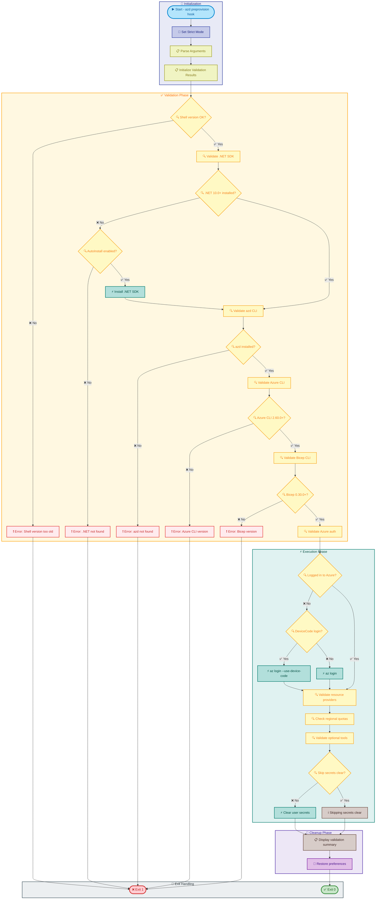
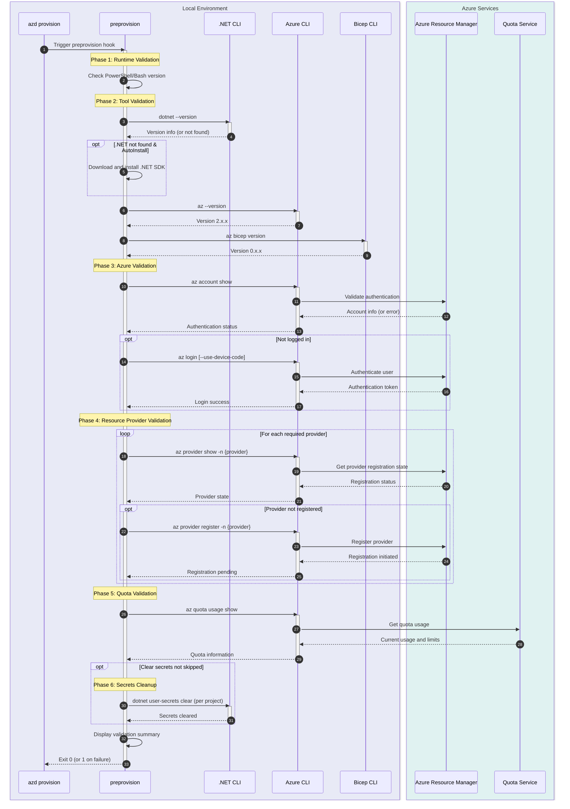

# preprovision

[Home](../../README.md) > [Docs](..) > [Hooks](README.md) > preprovision

> 🔍 **Summary**: Validates development environment prerequisites and prepares for Azure infrastructure provisioning.

---

## Table of Contents

- [Overview](#overview)
- [Compatibility](#compatibility)
- [Prerequisites](#prerequisites)
- [Parameters](#parameters)
- [Script Flow](#script-flow)
- [Sequence Diagram](#sequence-diagram)
- [Functions](#functions)
- [Usage](#usage)
- [Environment Variables](#environment-variables)
- [Exit Codes](#exit-codes)
- [Error Handling](#error-handling)
- [Validation Checks](#validation-checks)
- [Notes](#notes)
- [See Also](#see-also)

---

## Overview

This script is an Azure Developer CLI (`azd`) hook that runs before `azd provision` to validate the development environment and ensure all required tools, configurations, and permissions are in place for successful infrastructure deployment.

The script performs comprehensive validation of:

- Runtime environment (PowerShell/Bash version)
- Required CLI tools (.NET SDK, Azure CLI, Bicep CLI, azd)
- Azure authentication and subscription access
- Azure resource provider registrations
- Regional quotas for required Azure services
- Optional tool installations (sqlcmd, zip)

**Operations Performed**:

1. Validates shell runtime version (PowerShell 7.0+ or Bash 4.0+)
2. Checks and optionally installs .NET SDK 10.0+
3. Validates Azure Developer CLI installation
4. Validates Azure CLI installation and version
5. Validates Bicep CLI installation and version
6. Checks Azure authentication status
7. Validates Azure resource provider registrations
8. Checks regional quotas for Azure services
9. Validates optional tools (sqlcmd, zip)
10. Clears existing user secrets (unless skipped)

---

## Compatibility

| Platform    | Script              | Status |
|:------------|:--------------------|:------:|
| Windows     | `preprovision.ps1`  |   ✅   |
| Linux/macOS | `preprovision.sh`   |   ✅   |

---

## Prerequisites

| Requirement | Details | Installation Guide |
|:------------|:--------|:-------------------|
| **PowerShell** | Version 7.0 or higher | [Install PowerShell](https://docs.microsoft.com/powershell/scripting/install/installing-powershell) |
| **Bash** | Version 4.0 or higher | Pre-installed on Linux/macOS |

> ℹ️ **Note**: Other dependencies are validated and optionally installed by this script.

---

## Parameters

### PowerShell

| Parameter | Type | Required | Default | Description |
|:----------|:----:|:--------:|:-------:|:------------|
| `-Force` | Switch | No | `$false` | Bypass confirmation prompts |
| `-SkipSecretsClear` | Switch | No | `$false` | Skip clearing existing user secrets |
| `-ValidateOnly` | Switch | No | `$false` | Only validate, do not install missing tools |
| `-UseDeviceCodeLogin` | Switch | No | `$false` | Use device code flow for Azure authentication |
| `-AutoInstall` | Switch | No | `$false` | Automatically install missing dependencies |
| `-Verbose` | Switch | No | `$false` | Display detailed diagnostic information |

### Bash

| Parameter | Type | Required | Default | Description |
|:----------|:----:|:--------:|:-------:|:------------|
| `-f, --force` | Flag | No | `false` | Bypass confirmation prompts |
| `--skip-secrets-clear` | Flag | No | `false` | Skip clearing existing user secrets |
| `--validate-only` | Flag | No | `false` | Only validate, do not install missing tools |
| `--use-device-code-login` | Flag | No | `false` | Use device code flow for Azure authentication |
| `--auto-install` | Flag | No | `false` | Automatically install missing dependencies |
| `-v, --verbose` | Flag | No | `false` | Display detailed diagnostic information |
| `-h, --help` | Flag | No | N/A | Display help message and exit |

---

## Script Flow

### Execution Flow



---

## Sequence Diagram



---

## Functions

### PowerShell

| Function | Purpose |
|:---------|:--------|
| `Test-ShellVersion` | Validates PowerShell version >= 7.0 |
| `Test-DotNetSdk` | Validates .NET SDK installation and version |
| `Install-DotNetSdk` | Downloads and installs .NET SDK |
| `Test-AzdCli` | Validates Azure Developer CLI installation |
| `Test-AzureCli` | Validates Azure CLI installation and version |
| `Test-BicepCli` | Validates Bicep CLI installation and version |
| `Test-AzureAuthentication` | Validates Azure login status |
| `Invoke-AzureLogin` | Performs Azure CLI login |
| `Test-ResourceProviders` | Validates Azure resource provider registrations |
| `Register-ResourceProvider` | Registers an Azure resource provider |
| `Test-RegionalQuotas` | Validates Azure regional quotas |
| `Test-OptionalTools` | Validates optional tools (sqlcmd, zip) |
| `Clear-UserSecrets` | Clears .NET user secrets for projects |

### Bash

| Function | Purpose |
|:---------|:--------|
| `cleanup` | Performs cleanup operations on script exit |
| `handle_interrupt` | Handles SIGINT/SIGTERM signals gracefully |
| `log_verbose` | Outputs verbose messages when enabled |
| `log_error` | Outputs error messages to stderr |
| `log_info` | Outputs informational messages |
| `log_success` | Outputs success messages with formatting |
| `log_warning` | Outputs warning messages |
| `show_help` | Displays comprehensive help information |
| `check_shell_version` | Validates Bash version >= 4.0 |
| `check_dotnet_sdk` | Validates .NET SDK installation and version |
| `install_dotnet_sdk` | Downloads and installs .NET SDK |
| `check_azd_cli` | Validates Azure Developer CLI |
| `check_azure_cli` | Validates Azure CLI installation and version |
| `check_bicep_cli` | Validates Bicep CLI installation and version |
| `check_azure_auth` | Validates Azure login status |
| `azure_login` | Performs Azure CLI login |
| `check_resource_providers` | Validates Azure resource provider registrations |
| `check_regional_quotas` | Validates Azure regional quotas |
| `check_optional_tools` | Validates optional tools |
| `clear_user_secrets` | Clears .NET user secrets |
| `main` | Main execution function orchestrating all operations |

---

## Usage

### PowerShell

```powershell
# Standard execution (as azd hook - automatic)
# Runs automatically before `azd provision`

# Manual validation only (no installations)
.\preprovision.ps1 -ValidateOnly

# Manual execution with auto-install
.\preprovision.ps1 -AutoInstall

# Execute without clearing secrets
.\preprovision.ps1 -SkipSecretsClear

# Use device code login for Azure
.\preprovision.ps1 -UseDeviceCodeLogin

# Execute with all options
.\preprovision.ps1 -Force -AutoInstall -Verbose
```

### Bash

```bash
# Standard execution (as azd hook - automatic)
# Runs automatically before `azd provision`

# Manual validation only (no installations)
./preprovision.sh --validate-only

# Manual execution with auto-install
./preprovision.sh --auto-install

# Execute without clearing secrets
./preprovision.sh --skip-secrets-clear

# Use device code login for Azure
./preprovision.sh --use-device-code-login

# Execute with all options
./preprovision.sh --force --auto-install --verbose

# Display help
./preprovision.sh --help
```

---

## Environment Variables

| Variable | Description | Required | Default |
|:---------|:------------|:--------:|:-------:|
| `AZURE_SUBSCRIPTION_ID` | Target Azure subscription ID | No | From `az account show` |
| `AZURE_LOCATION` | Target Azure region | No | `eastus` |

> ℹ️ **Note**: Environment variables are optional; the script will use defaults or prompt for required values.

---

## Exit Codes

| Code | Meaning |
|-----:|:--------|
| 0 | ✅ All validations passed successfully |
| 1 | ❌ Shell version too old (PowerShell < 7.0 or Bash < 4.0) |
| 1 | ❌ .NET SDK not found and AutoInstall not enabled |
| 1 | ❌ Azure Developer CLI not installed |
| 1 | ❌ Azure CLI not installed or version < 2.60.0 |
| 1 | ❌ Bicep CLI not installed or version < 0.30.0 |
| 1 | ❌ Azure authentication failed |
| 1 | ❌ Required resource provider registration failed |
| 1 | ❌ Insufficient Azure quota for deployment |
| 130 | ❌ Script interrupted by user (SIGINT) |

---

## Error Handling

The script implements comprehensive error handling:

- **Strict Mode**: PowerShell uses `Set-StrictMode -Version Latest`; Bash uses `set -euo pipefail`
- **Version Validation**: Semantic version comparison for all CLI tools
- **Retry Logic**: Retries transient Azure API failures
- **Graceful Degradation**: Warns on non-critical failures (optional tools)
- **Validation Summary**: Collects all issues and reports at end
- **Signal Handling**: Bash version handles SIGINT and SIGTERM gracefully

---

## Validation Checks

| Check | Minimum Version | Critical |
|:------|:----------------|:--------:|
| PowerShell | 7.0 | ✅ |
| Bash | 4.0 | ✅ |
| .NET SDK | 10.0 | ✅ |
| Azure Developer CLI | Latest | ✅ |
| Azure CLI | 2.60.0 | ✅ |
| Bicep CLI | 0.30.0 | ✅ |
| sqlcmd | Any | ❌ |
| zip | Any | ❌ |

### Required Resource Providers

| Provider | Service |
|:---------|:--------|
| `Microsoft.App` | Azure Container Apps |
| `Microsoft.ServiceBus` | Azure Service Bus |
| `Microsoft.Storage` | Azure Storage |
| `Microsoft.Web` | Azure App Service / Logic Apps |
| `Microsoft.ContainerRegistry` | Azure Container Registry |
| `Microsoft.Insights` | Application Insights |
| `Microsoft.OperationalInsights` | Log Analytics |
| `Microsoft.ManagedIdentity` | Managed Identities |

---

## Notes

| Item | Details |
|:-----|:--------|
| **Script Version** | 2.3.0 |
| **Author** | Evilazaro \| Principal Cloud Solution Architect \| Microsoft |
| **Last Modified** | 2025-01-07 |
| **Hook Type** | `azd` preprovision hook |

> ℹ️ **Note**: This script runs automatically before `azd provision` as part of the Azure Developer CLI lifecycle hooks.

> 💡 **Tip**: Use `-ValidateOnly` to check environment readiness without making any changes.

> ⚠️ **Important**: Resource provider registration may take several minutes. The script will wait for registration to complete.

> 🔒 **Security**: The script requires Azure authentication to validate subscriptions and quotas.

---

## See Also

- [check-dev-workstation.md](check-dev-workstation.md) — Developer workstation validation wrapper
- [postprovision.md](postprovision.md) — Post-provisioning configuration
- [clean-secrets.md](clean-secrets.md) — User secrets management
- [Azure Developer CLI Hooks](https://learn.microsoft.com/azure/developer/azure-developer-cli/azd-extensibility)
- [README.md](README.md) — Hooks documentation overview

---

[← Back to Hooks Documentation](README.md) | [↑ Back to Top](#preprovision)
