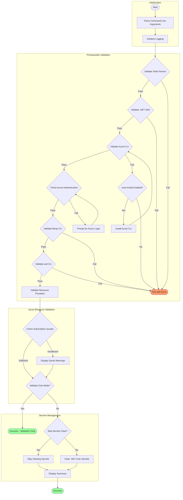

# preprovision

## Synopsis

Pre-provisioning script for Azure Developer CLI (azd) deployment that validates the development environment and clears .NET user secrets to ensure a clean state before Azure resources are provisioned.

## Description

This script performs comprehensive pre-provisioning tasks before Azure infrastructure is deployed using Azure Developer CLI (azd). It serves as the first step in the deployment pipeline, ensuring that all prerequisites are met and the environment is properly configured.

The script validates multiple layers of dependencies including PowerShell/Bash version compatibility, .NET SDK availability, Azure Developer CLI (azd), Azure CLI with authentication, and Bicep CLI. It also validates Azure Resource Provider registrations and checks Azure subscription quotas to identify potential deployment blockers early.

When executed without the `--validate-only` flag, the script clears existing .NET user secrets to ensure a clean configuration state. This prevents stale secrets from interfering with the provisioning process. The script provides detailed logging, color-coded output for different message types, and comprehensive error handling with actionable recovery suggestions.

## Workflow Diagram



## Prerequisites

| Category | Requirement | Version | Verification Command | Required |
|----------|-------------|---------|---------------------|----------|
| Runtime | PowerShell Core | >= 7.0 | `$PSVersionTable.PSVersion` | Yes |
| Runtime | Bash | >= 4.0 | `bash --version` | Yes |
| SDK | .NET SDK | >= 10.0 | `dotnet --version` | Yes |
| CLI Tool | Azure CLI | >= 2.60.0 | `az --version` | Yes |
| CLI Tool | Azure Developer CLI (azd) | Latest | `azd version` | Yes |
| CLI Tool | Bicep CLI | >= 0.30.0 | `az bicep version` | Yes |
| Permission | Azure Subscription Access | N/A | `az account show` | Yes |
| Azure Provider | Microsoft.App | N/A | `az provider show -n Microsoft.App` | Yes |
| Azure Provider | Microsoft.ServiceBus | N/A | `az provider show -n Microsoft.ServiceBus` | Yes |
| Azure Provider | Microsoft.Storage | N/A | `az provider show -n Microsoft.Storage` | Yes |
| Azure Provider | Microsoft.Web | N/A | `az provider show -n Microsoft.Web` | Yes |
| Azure Provider | Microsoft.ContainerRegistry | N/A | `az provider show -n Microsoft.ContainerRegistry` | Yes |
| Azure Provider | Microsoft.Insights | N/A | `az provider show -n Microsoft.Insights` | Yes |
| Azure Provider | Microsoft.OperationalInsights | N/A | `az provider show -n Microsoft.OperationalInsights` | Yes |
| Azure Provider | Microsoft.ManagedIdentity | N/A | `az provider show -n Microsoft.ManagedIdentity` | Yes |

### Installation Commands

```powershell
# Install .NET SDK 10.0+ (Windows/macOS/Linux)
# Visit: https://dotnet.microsoft.com/download/dotnet/10.0

# Install Azure CLI
# Windows: winget install Microsoft.AzureCLI
# macOS: brew install azure-cli
# Linux: curl -sL https://aka.ms/InstallAzureCLIDeb | sudo bash

# Install Azure Developer CLI (azd)
# Windows: winget install Microsoft.Azd
# macOS: brew install azure/tap/azd
# Linux: curl -fsSL https://aka.ms/install-azd.sh | bash

# Install Bicep CLI (included with Azure CLI)
az bicep install
```

## Parameters/Arguments

### PowerShell Parameters

| Parameter | Type | Required | Default | Description |
|-----------|------|----------|---------|-------------|
| `-Force` | `[switch]` | No | `$false` | Skips confirmation prompts and forces execution of all operations |
| `-SkipSecretsClear` | `[switch]` | No | `$false` | Skips the user secrets clearing step |
| `-ValidateOnly` | `[switch]` | No | `$false` | Only validates prerequisites without making any changes |
| `-UseDeviceCodeLogin` | `[switch]` | No | `$false` | Uses device code flow for Azure authentication (useful for remote/headless sessions) |
| `-AutoInstall` | `[switch]` | No | `$false` | Automatically installs missing prerequisites without prompting |

### Bash Arguments

| Position/Flag | Type | Required | Default | Description |
|---------------|------|----------|---------|-------------|
| `--force` | flag | No | `false` | Skip confirmation prompts and force execution |
| `--skip-secrets-clear` | flag | No | `false` | Skip the user secrets clearing step |
| `--validate-only` | flag | No | `false` | Only validate prerequisites without making changes |
| `--use-device-code-login` | flag | No | `false` | Use device code flow for Azure authentication |
| `--auto-install` | flag | No | `false` | Automatically install missing prerequisites |
| `--verbose` | flag | No | `false` | Enable verbose output |
| `--help` | flag | No | N/A | Display help message |

## Input/Output Specifications

### Inputs

**Environment Variables Read:**

- None required (script is self-contained for validation)

**Files/Paths Expected:**

- `clean-secrets.ps1` / `clean-secrets.sh` - Must exist in same directory for secrets clearing

### Outputs

**Exit Codes:**

| Exit Code | Meaning |
|-----------|---------|
| 0 | Success - All validations passed and operations completed |
| 1 | General error - Unexpected failure during execution |
| 2 | Missing prerequisites - Required tools not installed |
| 3 | Validation failure - Prerequisites check failed |
| 4 | Azure authentication failure - Not logged in or session expired |

**stdout Output:**

- Color-coded progress messages
- Validation results summary
- Prerequisite status indicators (✓/✗)

**Files Modified:**

- .NET user secrets cleared for configured projects (unless `--skip-secrets-clear` or `--validate-only`)

## Usage Examples

### Basic Usage

```powershell
# PowerShell: Run standard pre-provisioning with confirmation prompts
.\preprovision.ps1
```

```bash
# Bash: Run standard pre-provisioning with confirmation prompts
./preprovision.sh
```

### Advanced Usage

```powershell
# PowerShell: Run validation only without making changes
.\preprovision.ps1 -ValidateOnly -Verbose

# PowerShell: Force execution with auto-install of missing prerequisites
.\preprovision.ps1 -Force -AutoInstall

# PowerShell: Remote session with device code authentication
.\preprovision.ps1 -UseDeviceCodeLogin -SkipSecretsClear
```

```bash
# Bash: Run validation only without making changes
./preprovision.sh --validate-only --verbose

# Bash: Force execution with auto-install of missing prerequisites
./preprovision.sh --force --auto-install

# Bash: Remote session with device code authentication
./preprovision.sh --use-device-code-login --skip-secrets-clear
```

### CI/CD Pipeline Usage

```yaml
# Azure DevOps Pipeline
- task: AzureCLI@2
  displayName: 'Pre-provision validation'
  inputs:
    azureSubscription: 'Azure-Connection'
    scriptType: 'pscore'
    scriptLocation: 'scriptPath'
    scriptPath: '$(System.DefaultWorkingDirectory)/hooks/preprovision.ps1'
    arguments: '-ValidateOnly -Force'

# GitHub Actions
- name: Validate prerequisites
  shell: bash
  run: |
    chmod +x ./hooks/preprovision.sh
    ./hooks/preprovision.sh --validate-only --force
```

## Error Handling and Exit Codes

| Exit Code | Meaning | Recovery Action |
|-----------|---------|-----------------|
| 0 | Success | N/A |
| 1 | General error | Check stderr output for details, review logs |
| 2 | Missing prerequisites | Install missing tools using provided commands |
| 3 | Validation failure | Address specific validation failures shown in output |
| 4 | Azure authentication failure | Run `az login` to authenticate |

### Error Handling Approach

**PowerShell:**

- Uses `Set-StrictMode -Version Latest` for strict variable handling
- `$ErrorActionPreference = 'Stop'` for fail-fast behavior
- Try/Catch/Finally blocks for structured error handling
- Original preferences restored in finally block

**Bash:**

- Uses `set -euo pipefail` for strict error handling
- Trap handlers for EXIT, INT, and TERM signals
- Cleanup function ensures resources are released
- Color-coded error messages to stderr

## Security Considerations

### Credential Handling

- [x] No hardcoded secrets
- [x] Credentials sourced from: Azure CLI session (interactive or service principal)
- [x] Device code flow option for remote/headless authentication
- [x] No sensitive data logged to output

### Required Permissions

| Permission/Role | Scope | Justification |
|-----------------|-------|---------------|
| Reader | Subscription | Validate resource provider registrations |
| User Access Administrator | Subscription | Check quota availability |
| Contributor | Resource Group | Deploy Azure resources (after validation) |

### Network Security

- **Endpoints accessed:** Azure Resource Manager (`management.azure.com`), Azure AD (`login.microsoftonline.com`)
- **TLS requirements:** TLS 1.2+
- **Firewall rules needed:** Outbound HTTPS (443) to Azure endpoints

### Logging Security

- **Sensitive data masking:** Yes - access tokens and secrets are not logged
- **Audit trail:** Script execution logs with timestamps

## Known Limitations

- Quota checking is informational only and does not block execution
- Auto-install feature requires elevated permissions on some systems
- Device code login requires manual browser interaction
- Resource provider registration may require subscription owner permissions
- Windows execution policy may require bypass (`-ExecutionPolicy Bypass`)

## Related Scripts

| Script | Relationship | Description |
|--------|--------------|-------------|
| [clean-secrets.md](clean-secrets.md) | Called by | Clears .NET user secrets for all projects |
| [postprovision.md](postprovision.md) | Follows | Configures secrets after Azure provisioning |
| [check-dev-workstation.md](check-dev-workstation.md) | Wrapper | Developer-friendly validation wrapper |

## Changelog

| Version | Date | Changes |
|---------|------|---------|
| 2.3.0 | 2026-01-06 | Added auto-install feature, improved quota checking |
| 2.0.0 | 2025-12-01 | Added Azure Resource Provider validation |
| 1.0.0 | 2025-01-01 | Initial release |
