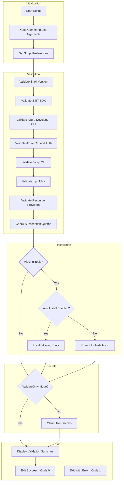

# Validate Prerequisites and Prepare Environment Before Provisioning

## Overview

This script performs comprehensive pre-provisioning tasks before Azure resources are provisioned using the Azure Developer CLI (azd). It ensures a clean state by clearing user secrets, validates the development environment, and optionally installs missing prerequisites.

The script validates:

- PowerShell/Bash version compatibility
- .NET SDK 10.0+
- Azure Developer CLI (azd)
- Azure CLI 2.60.0+ with authentication
- Bicep CLI 0.30.0+
- zip utility for Logic Apps deployment
- Azure Resource Provider registration
- Azure subscription quotas

The script is implemented in **both PowerShell and Bash** to support cross-platform execution.

## Table of Contents

- [Script Classification](#script-classification)
- [Supported Environments](#supported-environments)
- [Prerequisites](#prerequisites)
- [Files](#files)
- [High-Level Script Flow](#high-level-script-flow)
- [Usage](#usage)
- [Parameters](#parameters)
- [Examples](#examples)
- [Error Handling and Exit Codes](#error-handling-and-exit-codes)
- [Logging and Output](#logging-and-output)
- [Security Considerations](#security-considerations)
- [Troubleshooting](#troubleshooting)
- [Development Notes](#development-notes)
- [License and Ownership](#license-and-ownership)
- [Related Links](#related-links)

## Script Classification

| Attribute | Value |
|-----------|-------|
| **Category** | azd Lifecycle Hook |
| **Trigger Mechanism** | azd hook (preprovision) or manual execution |
| **azd Hook** | Yes - `preprovision` |
| **azd Command** | `azd provision`, `azd up` |

## Supported Environments

### Shells

| Shell | Minimum Version |
|-------|-----------------|
| PowerShell | 7.0+ |
| Bash | 4.0+ |

### Operating Systems

| OS | Supported |
|----|-----------|
| Windows | ✓ |
| Linux | ✓ |
| macOS | ✓ |

## Prerequisites

The script validates the following prerequisites:

| Tool | Minimum Version | Description |
|------|-----------------|-------------|
| PowerShell / Bash | 7.0+ / 4.0+ | Shell for script execution |
| .NET SDK | 10.0+ | For building .NET applications |
| Azure Developer CLI (azd) | Any | For deployment automation |
| Azure CLI | 2.60.0+ | For Azure resource management |
| Bicep CLI | 0.30.0+ | For infrastructure-as-code |
| zip | Any | For Logic Apps workflow deployment |
| sqlcmd (go-sqlcmd) | Any | For SQL Database configuration |
| iconv | Any | For Azure AD token encoding (Bash) |

### Required Azure Resource Providers

> [!IMPORTANT]
> These resource providers must be registered in your Azure subscription. The script validates and can register them automatically.

| Provider | Description |
|----------|-------------|
| `Microsoft.App` | Azure Container Apps |
| `Microsoft.ServiceBus` | Azure Service Bus |
| `Microsoft.Storage` | Azure Storage |
| `Microsoft.Web` | Azure App Service and Logic Apps |
| `Microsoft.ContainerRegistry` | Azure Container Registry |
| `Microsoft.Insights` | Application Insights |
| `Microsoft.OperationalInsights` | Log Analytics |
| `Microsoft.ManagedIdentity` | Managed Identities |

## Files

| File | Description |
|------|-------------|
| `preprovision.ps1` | PowerShell implementation |
| `preprovision.sh` | Bash implementation |
| `clean-secrets.ps1` / `.sh` | Helper script for clearing user secrets (invoked automatically) |

## High-Level Script Flow



## Usage

> [!TIP]
> This script runs automatically before `azd provision` or `azd up`. Use `-ValidateOnly` to check prerequisites without making changes, or `-UseDeviceCodeLogin` for remote/headless environments.

### PowerShell

```powershell
# Standard pre-provisioning with prompts
./preprovision.ps1

# Force execution without prompts
./preprovision.ps1 -Force

# Validate only (no changes)
./preprovision.ps1 -ValidateOnly

# Skip user secrets clearing
./preprovision.ps1 -SkipSecretsClear

# Use device code for Azure login (remote/headless)
./preprovision.ps1 -UseDeviceCodeLogin

# Auto-install missing prerequisites
./preprovision.ps1 -AutoInstall -Force

# Verbose output
./preprovision.ps1 -Verbose
```

### Bash

```bash
# Standard pre-provisioning
./preprovision.sh

# Force execution without prompts
./preprovision.sh --force

# Validate only (no changes)
./preprovision.sh --validate-only

# Skip user secrets clearing
./preprovision.sh --skip-secrets-clear

# Use device code for Azure login
./preprovision.sh --use-device-code-login

# Auto-install missing prerequisites
./preprovision.sh --auto-install --force

# Verbose output
./preprovision.sh --verbose

# Display help
./preprovision.sh --help
```

## Parameters

| Logical Parameter | PowerShell Name | Bash Name | Required | Description |
|-------------------|-----------------|-----------|----------|-------------|
| Force | `-Force` | `--force` | No | Skips confirmation prompts |
| Skip Secrets Clear | `-SkipSecretsClear` | `--skip-secrets-clear` | No | Skips user secrets clearing |
| Validate Only | `-ValidateOnly` | `--validate-only` | No | Only validates without changes |
| Use Device Code | `-UseDeviceCodeLogin` | `--use-device-code-login` | No | Uses device code flow for Azure auth |
| Auto Install | `-AutoInstall` | `--auto-install` | No | Automatically installs missing tools |
| Verbose | `-Verbose` | `--verbose` | No | Displays detailed output |
| Help | N/A | `--help` | No | Displays help message |

## Examples

### Standard Pre-Provision (azd Hook)

The script runs automatically before `azd provision` or `azd up`:

```bash
azd provision
# preprovision hook executes automatically
```

### Validate Workstation Prerequisites Only

**PowerShell:**

```powershell
./preprovision.ps1 -ValidateOnly
```

**Bash:**

```bash
./preprovision.sh --validate-only
```

### CI/CD Pipeline with Auto-Install

**PowerShell:**

```powershell
./preprovision.ps1 -AutoInstall -Force
```

**Bash:**

```bash
./preprovision.sh --auto-install --force
```

### Remote/Headless Session

**PowerShell:**

```powershell
./preprovision.ps1 -UseDeviceCodeLogin
```

**Bash:**

```bash
./preprovision.sh --use-device-code-login
```

## Error Handling and Exit Codes

| Exit Code | Description |
|-----------|-------------|
| 0 | All validations passed and operations completed |
| 1 | Validation failed or operation error |
| 2 | Invalid arguments (Bash only) |
| 130 | Script interrupted by user (SIGINT) - Bash only |

### Error Behavior

- **PowerShell**: Uses `SupportsShouldProcess` with `ConfirmImpact = 'Medium'`. Tracks failures and reports summary.
- **Bash**: Uses `set -euo pipefail` for strict error handling. Signal handlers for graceful interruption.

## Logging and Output

| Output Type | Description |
|-------------|-------------|
| stdout | Status messages, validation results, summary |
| stderr | Error messages, warnings, verbose output |
| Color-coded output | Visual distinction with emojis and colors |

### Validation Status Indicators

| Indicator | Meaning |
|-----------|---------|
| ✓ | Validation passed |
| ✗ | Validation failed |
| ⚠ | Warning (non-fatal) |
| ℹ | Information |

## Security Considerations

- Azure CLI authentication is validated before proceeding
- Device code flow is available for environments without browser access
- No credentials are stored or logged
- Resource provider registration requires appropriate Azure permissions

## Troubleshooting

| Issue | Resolution |
|-------|------------|
| `.NET SDK version too low` | Install .NET SDK 10.0+ from <https://dotnet.microsoft.com/download> |
| `Azure CLI not found` | Install from <https://docs.microsoft.com/cli/azure/install-azure-cli> |
| `Not authenticated to Azure` | Run `az login` or use `-UseDeviceCodeLogin` |
| `Bicep CLI not found` | Run `az bicep install` or install standalone |
| `Resource provider not registered` | Run `az provider register --namespace Microsoft.X` |
| `zip command not found` (Linux/macOS) | Install via package manager: `apt-get install zip` or `brew install zip` |
| `Permission denied` | Ensure execute permissions on scripts |

### Auto-Installation Support

> [!TIP]
> Use `-AutoInstall` with `-Force` for unattended CI/CD pipelines to automatically install missing prerequisites.

The `-AutoInstall` flag supports automatic installation of:

| Tool | Windows | Linux | macOS |
|------|---------|-------|-------|
| .NET SDK | winget | apt/dnf | brew |
| Azure CLI | winget | apt/dnf | brew |
| Bicep CLI | via Azure CLI | via Azure CLI | via Azure CLI |
| azd | winget | script | brew |

## Development Notes

- Script version: `2.3.0` for both implementations
- PowerShell uses `#Requires -Version 7.0` directive
- Bash validates version at runtime using `$BASH_VERSION`
- Both implementations provide functional parity
- Execution time is tracked and reported at completion

## License and Ownership

| Attribute | Value |
|-----------|-------|
| Author | Evilazaro \| Principal Cloud Solution Architect \| Microsoft |
| Version | 2.3.0 |
| Last Modified | 2026-01-06 |
| Repository | [Azure-LogicApps-Monitoring](https://github.com/Evilazaro/Azure-LogicApps-Monitoring) |

## Related Links

- See [Azure Developer CLI Documentation](https://learn.microsoft.com/azure/developer/azure-developer-cli/)
- See [.NET User Secrets](https://learn.microsoft.com/dotnet/core/tools/dotnet-user-secrets)
- See [Azure Resource Providers](https://learn.microsoft.com/azure/azure-resource-manager/management/resource-providers-and-types)
