# 🚀 preprovision

> Pre-provisioning script for Azure Developer CLI (azd) deployment.

## 📋 Overview

This script performs pre-provisioning tasks before Azure resources are provisioned. It ensures a clean state by clearing user secrets and validates the development environment.

The script performs the following operations:

- Validates PowerShell/Bash version compatibility
- Clears .NET user secrets for all projects
- Validates required tools (.NET SDK, Azure CLI, Bicep CLI)
- Validates Azure Resource Provider registration
- Checks Azure subscription quotas (informational)
- Prepares environment for Azure deployment
- Provides detailed logging and error handling

---

## � Table of Contents

- [📌 Script Metadata](#-script-metadata)
- [🔧 Prerequisites](#-prerequisites)
- [📥 Parameters](#-parameters)
- [🌐 Environment Variables](#-environment-variables)
- [🔄 Execution Flow](#-execution-flow)
- [📝 Usage Examples](#-usage-examples)
- [⚠️ Exit Codes](#%EF%B8%8F-exit-codes)
- [📚 Related Scripts](#-related-scripts)
- [📜 Version History](#-version-history)

[⬅️ Back to Index](./index.md)

---

## �📌 Script Metadata

| Property          | PowerShell                                                   | Bash                                                         |
| ----------------- | ------------------------------------------------------------ | ------------------------------------------------------------ |
| **File Name**     | `preprovision.ps1`                                           | `preprovision.sh`                                            |
| **Version**       | 2.3.0                                                        | 2.3.0                                                        |
| **Last Modified** | 2026-01-06                                                   | 2026-01-06                                                   |
| **Author**        | Evilazaro \| Principal Cloud Solution Architect \| Microsoft | Evilazaro \| Principal Cloud Solution Architect \| Microsoft |

---

## 🔧 Prerequisites

| Requirement         | Minimum Version | Notes                                          |
| ------------------- | --------------- | ---------------------------------------------- |
| PowerShell Core     | 7.0             | Required for `.ps1` script                     |
| Bash                | 4.0             | Required for `.sh` script (associative arrays) |
| .NET SDK            | 10.0            | Latest LTS features                            |
| Azure CLI           | 2.60.0          | Latest Bicep and ACA support                   |
| Bicep CLI           | 0.30.0          | Latest language features                       |
| Azure Developer CLI | Any             | Required for `azd` workflow                    |

---

## 📥 Parameters

### PowerShell (`preprovision.ps1`)

| Parameter             | Type   | Required | Default  | Description                                                                   |
| --------------------- | ------ | -------- | -------- | ----------------------------------------------------------------------------- |
| `-Force`              | Switch | No       | `$false` | Skips confirmation prompts and forces execution                               |
| `-SkipSecretsClear`   | Switch | No       | `$false` | Skips the user secrets clearing step                                          |
| `-ValidateOnly`       | Switch | No       | `$false` | Only validates prerequisites without making changes                           |
| `-UseDeviceCodeLogin` | Switch | No       | `$false` | Uses device code flow for Azure authentication (for remote/headless sessions) |
| `-AutoInstall`        | Switch | No       | `$false` | Automatically installs missing prerequisites without prompting                |

### Bash (`preprovision.sh`)

| Parameter                 | Type | Required | Default | Description                                        |
| ------------------------- | ---- | -------- | ------- | -------------------------------------------------- |
| `--force`                 | Flag | No       | `false` | Skip confirmation prompts and force execution      |
| `--skip-secrets-clear`    | Flag | No       | `false` | Skip the user secrets clearing step                |
| `--validate-only`         | Flag | No       | `false` | Only validate prerequisites without making changes |
| `--use-device-code-login` | Flag | No       | `false` | Use device code flow for Azure authentication      |
| `--auto-install`          | Flag | No       | `false` | Automatically install missing prerequisites        |
| `--verbose`               | Flag | No       | `false` | Enable verbose output                              |
| `--help`                  | Flag | No       | N/A     | Display help message                               |

---

## 🌐 Environment Variables

This script primarily validates the environment rather than consuming environment variables. However, it requires the following Azure Resource Providers to be registered:

### Required Azure Resource Providers

| Provider                        | Purpose                                               |
| ------------------------------- | ----------------------------------------------------- |
| `Microsoft.App`                 | Azure Container Apps for serverless containers        |
| `Microsoft.ServiceBus`          | Azure Service Bus for reliable messaging              |
| `Microsoft.Storage`             | Azure Storage for blobs, queues, and tables           |
| `Microsoft.Web`                 | Azure App Service and Logic Apps                      |
| `Microsoft.ContainerRegistry`   | Azure Container Registry for Docker images            |
| `Microsoft.Insights`            | Application Insights for telemetry and monitoring     |
| `Microsoft.OperationalInsights` | Log Analytics for centralized logging                 |
| `Microsoft.ManagedIdentity`     | Managed identities for Azure resources authentication |

---

## 🔄 Execution Flow

```mermaid
flowchart TD
    A[🚀 Start preprovision] --> B{Validate PowerShell/Bash Version}
    B -->|Pass| C{Validate .NET SDK}
    B -->|Fail| Z[❌ Exit with Error]

    C -->|Pass| D{Validate Azure CLI}
    C -->|Fail| C1{AutoInstall?}
    C1 -->|Yes| C2[Install .NET SDK]
    C1 -->|No| Z
    C2 --> D

    D -->|Pass| E{Validate Bicep CLI}
    D -->|Fail| D1{AutoInstall?}
    D1 -->|Yes| D2[Install Azure CLI]
    D1 -->|No| Z
    D2 --> E

    E -->|Pass| F{Validate Azure Authentication}
    E -->|Fail| E1{AutoInstall?}
    E1 -->|Yes| E2[Install Bicep CLI]
    E1 -->|No| Z
    E2 --> F

    F -->|Pass| G[Check Resource Provider Registration]
    F -->|Fail| F1{UseDeviceCodeLogin?}
    F1 -->|Yes| F2[Azure Login with Device Code]
    F1 -->|No| F3[Azure Login with Browser]
    F2 --> G
    F3 --> G

    G --> H{ValidateOnly Mode?}
    H -->|Yes| I[✅ Validation Complete]
    H -->|No| J{SkipSecretsClear?}

    J -->|Yes| K[Skip Secrets Clearing]
    J -->|No| L[Clear .NET User Secrets]

    K --> M[✅ Pre-provisioning Complete]
    L --> M

    I --> N[Display Validation Summary]
    M --> N
    N --> O[🏁 End]
```



---

## 📝 Usage Examples

### PowerShell

```powershell
# Standard pre-provisioning with confirmation prompts
.\preprovision.ps1

# Pre-provisioning without confirmation prompts
.\preprovision.ps1 -Force

# Only validate prerequisites without clearing secrets
.\preprovision.ps1 -ValidateOnly

# Skip secret clearing and show verbose output
.\preprovision.ps1 -SkipSecretsClear -Verbose

# Use device code flow for Azure login (useful for remote/headless sessions)
.\preprovision.ps1 -UseDeviceCodeLogin

# Automatically install all missing prerequisites without prompts
.\preprovision.ps1 -AutoInstall -Force
```

### Bash

```bash
# Standard pre-provisioning with confirmation prompts
./preprovision.sh

# Pre-provisioning without confirmation prompts
./preprovision.sh --force

# Only validate prerequisites without clearing secrets
./preprovision.sh --validate-only

# Skip secret clearing and show verbose output
./preprovision.sh --skip-secrets-clear --verbose

# Use device code flow for Azure login
./preprovision.sh --use-device-code-login

# Automatically install all missing prerequisites without prompts
./preprovision.sh --auto-install --force
```

---

## ⚠️ Exit Codes

| Code | Meaning                                                     |
| ---- | ----------------------------------------------------------- |
| `0`  | Success - all validations passed and operations completed   |
| `1`  | Failure - one or more validations failed or errors occurred |

---

## 📚 Related Scripts

| Script                                              | Purpose                                              |
| --------------------------------------------------- | ---------------------------------------------------- |
| [clean-secrets](./clean-secrets.md)                 | Called to clear .NET user secrets                    |
| [check-dev-workstation](./check-dev-workstation.md) | Wrapper that calls preprovision in ValidateOnly mode |
| [postprovision](./postprovision.md)                 | Runs after infrastructure provisioning               |

---

## 📜 Version History

| Version | Date       | Changes                                                                  |
| ------- | ---------- | ------------------------------------------------------------------------ |
| 2.3.0   | 2026-01-06 | Added AutoInstall parameter, enhanced Azure Resource Provider validation |
| 2.2.0   | 2025-12-15 | Added UseDeviceCodeLogin parameter for remote sessions                   |
| 2.1.0   | 2025-11-20 | Added Bicep CLI validation                                               |
| 2.0.0   | 2025-10-01 | Major refactor with comprehensive validation                             |
| 1.0.0   | 2025-08-15 | Initial release                                                          |

---

## 🔗 Links

- [Repository](https://github.com/Evilazaro/Azure-LogicApps-Monitoring)
- [Azure Developer CLI Documentation](https://learn.microsoft.com/azure/developer/azure-developer-cli/)
- [.NET SDK Installation](https://dotnet.microsoft.com/download)
- [Azure CLI Installation](https://learn.microsoft.com/cli/azure/install-azure-cli)

---

[⬅️ Back to Index](./index.md)
