# 🚀 Pre-Provisioning Script Documentation

> **Version:** 2.3.0  
> **Last Updated:** 2025-12-30  
> **Scripts:** `preprovision.ps1` (PowerShell) | `preprovision.sh` (Bash)

## 📋 Table of Contents

- [Overview](#overview)
- [Prerequisites](#prerequisites)
- [Parameters](#parameters)
- [Usage Examples](#usage-examples)
- [What the Script Does](#what-the-script-does)
- [Prerequisite Validation](#prerequisite-validation)
- [Installation Functions](#installation-functions)
- [Azure Authentication](#azure-authentication)
- [Resource Provider Registration](#resource-provider-registration)
- [How It Works](#how-it-works)
- [Error Handling](#error-handling)
- [Exit Codes](#exit-codes)
- [Troubleshooting](#troubleshooting)
- [Integration Points](#integration-points)
- [Performance Characteristics](#performance-characteristics)
- [Version History](#version-history)

---

## Overview

The **pre-provisioning script** is an Azure Developer CLI (azd) hook that runs **before** Azure resources are provisioned. It validates the development environment, ensures all prerequisites are installed and configured, and prepares the workspace for deployment.

### Key Features

- ✅ **Prerequisite Validation**: Validates all required tools and versions
- 🔧 **Auto-Installation**: Can automatically install missing prerequisites
- 🔐 **Azure Authentication**: Handles Azure CLI login with device code support
- 📝 **Resource Provider Registration**: Ensures Azure providers are registered
- 🧹 **Clean State**: Clears .NET user secrets for fresh deployment
- 📊 **Detailed Logging**: Provides verbose output for troubleshooting

---

## Prerequisites

### Required Tools

| Tool | Minimum Version | Purpose |
|------|-----------------|---------|
| **PowerShell** | 7.0+ | Script runtime (Windows/macOS/Linux) |
| **Bash** | 4.0+ | Script runtime (macOS/Linux) |
| **.NET SDK** | 10.0+ | Building and managing .NET projects |
| **Azure CLI** | 2.60.0+ | Azure resource management |
| **Azure Developer CLI (azd)** | Latest | Azure deployment automation |
| **Bicep CLI** | 0.30.0+ | Infrastructure as Code |

### Azure Requirements

- Active Azure subscription
- Sufficient permissions to register resource providers
- Quota for required resources (Container Apps, Storage, Service Bus, etc.)

---

## Parameters

### PowerShell (`preprovision.ps1`)

| Parameter | Type | Description |
|-----------|------|-------------|
| `-Force` | Switch | Skip confirmation prompts and force execution |
| `-SkipSecretsClear` | Switch | Skip the user secrets clearing step |
| `-ValidateOnly` | Switch | Only validate prerequisites without making changes |
| `-UseDeviceCodeLogin` | Switch | Use device code flow for Azure authentication |
| `-AutoInstall` | Switch | Automatically install missing prerequisites |
| `-Verbose` | Switch | Enable verbose output |
| `-WhatIf` | Switch | Show what would happen without making changes |

### Bash (`preprovision.sh`)

| Parameter | Description |
|-----------|-------------|
| `--force` | Skip confirmation prompts and force execution |
| `--skip-secrets-clear` | Skip the user secrets clearing step |
| `--validate-only` | Only validate prerequisites without making changes |
| `--use-device-code-login` | Use device code flow for Azure authentication |
| `--auto-install` | Automatically install missing prerequisites |
| `--verbose` | Enable verbose output |
| `--help` | Display help message |

---

## Usage Examples

### Basic Usage

```powershell
# PowerShell - Standard execution with prompts
.\preprovision.ps1

# Bash - Standard execution with prompts
./preprovision.sh
```

### Force Execution (No Prompts)

```powershell
# PowerShell
.\preprovision.ps1 -Force

# Bash
./preprovision.sh --force
```

### Validate Only (No Changes)

```powershell
# PowerShell
.\preprovision.ps1 -ValidateOnly

# Bash
./preprovision.sh --validate-only
```

### Auto-Install Missing Prerequisites

```powershell
# PowerShell - Install missing tools automatically
.\preprovision.ps1 -AutoInstall -Force

# Bash - Install missing tools automatically
./preprovision.sh --auto-install --force
```

### Remote/Headless Sessions

```powershell
# PowerShell - Use device code for Azure login
.\preprovision.ps1 -UseDeviceCodeLogin

# Bash - Use device code for Azure login
./preprovision.sh --use-device-code-login
```

### Verbose Output

```powershell
# PowerShell
.\preprovision.ps1 -Verbose

# Bash
./preprovision.sh --verbose
```

### Skip Secrets Clearing

```powershell
# PowerShell
.\preprovision.ps1 -SkipSecretsClear

# Bash
./preprovision.sh --skip-secrets-clear
```

---

## What the Script Does

### Execution Flow

1. **Validate Runtime Version**
   - PowerShell: Validates PowerShell 7.0+
   - Bash: Validates Bash 4.0+

2. **Validate Prerequisites**
   - Check .NET SDK version (10.0+)
   - Check Azure Developer CLI (azd)
   - Check Azure CLI version (2.60.0+)
   - Check Azure CLI authentication
   - Check Bicep CLI version (0.30.0+)

3. **Azure Resource Providers** (if authenticated)
   - Validate required providers are registered
   - Optionally register missing providers

4. **Azure Quota Check** (informational)
   - Display quota requirements
   - Guide users to check current quotas

5. **Clear User Secrets** (unless skipped)
   - Execute `clean-secrets.ps1` or `clean-secrets.sh`
   - Remove stale configuration from previous runs

---

## Prerequisite Validation

### .NET SDK Validation

The script validates that .NET SDK 10.0 or higher is installed:

```powershell
# PowerShell validation logic
$versionOutput = & dotnet --version 2>&1
$majorVersion = [int]$versionString.Split('.')[0]
if ($majorVersion -lt 10) {
    # Offer to install
}
```

```bash
# Bash validation logic
version_output=$(dotnet --version 2>&1)
major_version=$(echo "${version_output}" | cut -d. -f1)
if [[ ${major_version} -lt 10 ]]; then
    # Offer to install
fi
```

### Azure CLI Validation

The script performs a comprehensive Azure CLI check:

1. **Installation Check**: Verifies `az` command exists
2. **Version Check**: Validates version ≥ 2.60.0
3. **Authentication Check**: Verifies user is logged in

### Bicep CLI Validation

Checks for Bicep CLI in two locations:
1. Standalone installation (`bicep` command)
2. Azure CLI integration (`az bicep version`)

---

## Installation Functions

### Automatic Installation

When `--auto-install` or `-AutoInstall` is specified, the script can install missing prerequisites:

| Tool | Windows | Linux/macOS |
|------|---------|-------------|
| .NET SDK | winget / dotnet-install.ps1 | dotnet-install.sh |
| Azure CLI | winget / MSI installer | apt-get / brew / yum |
| Azure Developer CLI | winget / PowerShell script | curl installer |
| Bicep CLI | winget / az bicep install | az bicep install |

### Manual Installation

If auto-install is not used, the script provides download links:

- **.NET SDK**: https://dotnet.microsoft.com/download/dotnet/10.0
- **Azure CLI**: https://docs.microsoft.com/cli/azure/install-azure-cli
- **Azure Developer CLI**: https://aka.ms/azd/install
- **Bicep CLI**: `az bicep install` or https://github.com/Azure/bicep/releases

---

## Azure Authentication

### Browser-Based Login (Default)

```powershell
# PowerShell
.\preprovision.ps1
# Opens browser for authentication
```

### Device Code Login

For remote sessions, SSH connections, or environments without a browser:

```powershell
# PowerShell
.\preprovision.ps1 -UseDeviceCodeLogin

# Bash
./preprovision.sh --use-device-code-login
```

Device code flow displays a code and URL for authentication on another device.

---

## Resource Provider Registration

### Required Providers

The script validates registration of these Azure resource providers:

| Provider | Service |
|----------|---------|
| `Microsoft.App` | Azure Container Apps |
| `Microsoft.ServiceBus` | Azure Service Bus |
| `Microsoft.Storage` | Azure Storage |
| `Microsoft.Web` | Azure App Service & Logic Apps |
| `Microsoft.ContainerRegistry` | Azure Container Registry |
| `Microsoft.Insights` | Application Insights |
| `Microsoft.OperationalInsights` | Log Analytics |
| `Microsoft.ManagedIdentity` | Managed Identities |

### Manual Registration

If automatic registration fails, register manually:

```bash
az provider register --namespace Microsoft.App --wait
az provider register --namespace Microsoft.ServiceBus --wait
az provider register --namespace Microsoft.Storage --wait
# ... etc
```

---

## 🛠️ How It Works

### Workflow Diagram

```mermaid
flowchart LR
    Start(["🚀 azd up / azd provision"])
    Complete(["✓ Pre-provisioning Complete"])
    Failed(["✗ Pre-provisioning Failed"])

    Start --> RuntimeValidation

    subgraph RuntimeValidation["1️⃣ Runtime Validation"]
        direction TB
        ValidateRuntime["Validate Runtime Version"]
    end

    subgraph Prerequisites["2️⃣ Prerequisites Check"]
        direction TB
        CheckDotNet["Check .NET SDK"]
        InstallDotNet{"Install .NET?"}
        CheckAzd["Check Azure Developer CLI"]
        InstallAzd{"Install azd?"}
        CheckAzCLI["Check Azure CLI"]
        InstallAzCLI{"Install Azure CLI?"}
        CheckBicep["Check Bicep CLI"]
        InstallBicep{"Install Bicep?"}

        CheckDotNet -->|Missing| InstallDotNet
        InstallDotNet -->|Yes| CheckDotNet
        CheckDotNet -->|OK| CheckAzd
        CheckAzd -->|Missing| InstallAzd
        InstallAzd -->|Yes| CheckAzd
        CheckAzd -->|OK| CheckAzCLI
        CheckAzCLI -->|Missing| InstallAzCLI
        InstallAzCLI -->|Yes| CheckAzCLI
        CheckAzCLI -->|OK| CheckBicep
        CheckBicep -->|Missing| InstallBicep
        InstallBicep -->|Yes| CheckBicep
    end

    subgraph Authentication["3️⃣ Azure Authentication"]
        direction TB
        CheckAuth["Check Azure Authentication"]
        Login{"Login to Azure?"}

        CheckAuth -->|Not Authenticated| Login
        Login -->|Yes| CheckAuth
    end

    subgraph AzureConfig["4️⃣ Azure Configuration"]
        direction TB
        CheckProviders["Check Resource Providers"]
        RegisterProviders{"Register Providers?"}
        CheckQuota["Check Quotas (Info)"]

        CheckProviders -->|Missing| RegisterProviders
        RegisterProviders -->|Yes| CheckProviders
        CheckProviders -->|OK| CheckQuota
    end

    subgraph Cleanup["5️⃣ Cleanup"]
        direction TB
        ClearSecrets["Clear User Secrets"]
    end

    RuntimeValidation --> Prerequisites
    InstallDotNet -->|No| Failed
    InstallAzd -->|No| Failed
    InstallAzCLI -->|No| Failed
    InstallBicep -->|No| Failed
    CheckBicep -->|OK| Authentication
    Login -->|No| Failed
    CheckAuth -->|OK| AzureConfig
    RegisterProviders -->|No| Failed
    CheckQuota --> Cleanup
    Cleanup --> Complete

    classDef startEnd fill:#e8f5e9,stroke:#2e7d32,stroke-width:3px,color:#1b5e20
    classDef process fill:#e3f2fd,stroke:#1976d2,stroke-width:2px,color:#0d47a1
    classDef decision fill:#fff3e0,stroke:#f57c00,stroke-width:2px,color:#e65100
    classDef failure fill:#ffcdd2,stroke:#d32f2f,stroke-width:2px,color:#b71c1c

    class Start,Complete startEnd
    class ValidateRuntime,CheckDotNet,CheckAzd,CheckAzCLI,CheckAuth,CheckBicep,CheckProviders,CheckQuota,ClearSecrets process
    class InstallDotNet,InstallAzd,InstallAzCLI,Login,InstallBicep,RegisterProviders decision
    class Failed failure
```



### Integration Points

| Aspect | Details |
|--------|---------|
| **Version** | 2.3.0 (PowerShell: 2025-12-30, Bash: 2025-12-30) |
| **Called By** | • **Azure Developer CLI (azd)** automatically before `azd provision` or `azd up`<br/>• Developers manually for environment validation<br/>• CI/CD pipelines during automated deployment workflows |
| **Calls** | • `clean-secrets.ps1` or `clean-secrets.sh` for secret clearing<br/>• `az login` for Azure authentication<br/>• `az provider register` for resource provider registration<br/>• Installation scripts for missing prerequisites |
| **Dependencies** | • **Runtime:** PowerShell 7.0+ or Bash 4.0+<br/>• **.NET SDK:** Version 10.0+<br/>• **Azure CLI:** Version 2.60.0+<br/>• **Azure Developer CLI (azd)**<br/>• **Bicep CLI:** Version 0.30.0+ |

---

## Error Handling

### Error Categories

| Category | Behavior | Recovery |
|----------|----------|----------|
| **Missing Prerequisites** | Offer to install or display instructions | Install manually or use `--auto-install` |
| **Version Mismatch** | Display current vs required version | Upgrade tool |
| **Authentication Failure** | Prompt for Azure login | Run `az login` manually |
| **Provider Registration** | Display registration commands | Run commands manually |
| **Clean Secrets Failure** | Warning (non-fatal) | Continue with deployment |

### Error Messages

The scripts provide detailed error messages with:
- Current state vs expected state
- Specific remediation steps
- Download/installation URLs
- Manual command alternatives

---

## Exit Codes

| Code | Meaning |
|------|---------|
| `0` | Success - All validations passed |
| `1` | Failure - Prerequisites missing or validation failed |
| `2` | Invalid arguments (Bash only) |
| `130` | User interruption (Ctrl+C) |

---

## Troubleshooting

### Common Issues

#### .NET SDK Not Found

```bash
# Verify installation
dotnet --version

# If not found, install from:
# https://dotnet.microsoft.com/download/dotnet/10.0
```

#### Azure CLI Not Authenticated

```bash
# Login interactively
az login

# Or use device code for remote sessions
az login --use-device-code
```

#### Bicep Version Too Old

```bash
# Upgrade Bicep via Azure CLI
az bicep upgrade

# Or install standalone
az bicep install
```

#### Resource Provider Not Registered

```bash
# Check provider status
az provider show --namespace Microsoft.App --query registrationState

# Register provider
az provider register --namespace Microsoft.App --wait
```

### Verbose Mode

For detailed diagnostic information:

```powershell
# PowerShell
.\preprovision.ps1 -Verbose

# Bash
./preprovision.sh --verbose
```

---

## Performance Characteristics

| Characteristic | Details |
|----------------|---------|
| **Execution Time** | • **With all prerequisites:** 5-10 seconds<br/>• **With installations:** 2-10 minutes (depending on downloads)<br/>• **Provider registration:** Up to 2 minutes per provider |
| **Resource Usage** | • **Memory:** ~30 MB peak<br/>• **CPU:** Low utilization<br/>• **Network:** Download bandwidth for installations |
| **Scalability** | • Linear with number of prerequisites to install<br/>• Provider registration is parallelizable |

---

## 🔄 Version History

| Version | Date | Changes |
|---------|------|---------|
| **2.3.0** | 2025-12-30 | • Added `--auto-install` parameter<br/>• Added `--use-device-code-login` parameter<br/>• Added installation functions for all prerequisites<br/>• Added Azure resource provider registration<br/>• Synchronized PowerShell and Bash implementations |
| **2.0.0** | 2025-12-29 | • Complete rewrite with comprehensive validation<br/>• Added Bicep CLI validation<br/>• Added Azure authentication check<br/>• Added quota information |
| **1.0.0** | 2025-12-01 | • Initial release with basic validation |

---

## Related Documentation

- [clean-secrets.md](clean-secrets.md) - User secrets clearing script
- [postprovision.md](postprovision.md) - Post-provisioning configuration script
- [check-dev-workstation.md](check-dev-workstation.md) - Development workstation validation
- [README.md](README.md) - Hooks overview

---

> **📝 Note:** This documentation is auto-generated based on script analysis. For the most accurate information, refer to the script source code and inline comments.
