# ⚙️ preprovision

> [!NOTE]
> **Target Audience**: DevOps Engineers, Platform Engineers, Developers  
> **Reading Time**: ~12 minutes

<details>
<summary>📖 Navigation</summary>

| Previous | Index | Next |
|:---------|:-----:|-----:|
| [check-dev-workstation](check-dev-workstation.md) | [📚 Index](README.md) | [postprovision](postprovision.md) |

</details>

Pre-provisioning script for Azure Developer CLI (azd) deployment.

## 📑 Table of Contents

- [📋 Overview](#-overview)
- [⚙️ Prerequisites](#️-prerequisites)
- [🎯 Parameters](#-parameters)
- [🌐 Environment Variables](#-environment-variables)
- [⚙️ Functionality](#️-functionality)
- [📖 Usage Examples](#-usage-examples)
- [💻 Platform Differences](#-platform-differences)
- [🚪 Exit Codes](#-exit-codes)
- [🔗 Related Hooks](#-related-hooks)

## 📋 Overview

This script performs pre-provisioning tasks before Azure resources are provisioned. It ensures a clean state by clearing user secrets and validates the development environment comprehensively.

### 🔑 Key Operations

- Validates PowerShell/Bash version compatibility
- Clears .NET user secrets for all projects
- Validates required tools (.NET SDK, Azure CLI, Bicep CLI, azd)
- Validates Azure CLI authentication
- Checks Azure Resource Provider registrations
- Validates Azure subscription quotas (informational)
- Prepares environment for Azure deployment

### 📅 When Executed

- **Automatically**: Before `azd provision` or `azd up`
- **Manually**: When validating environment setup

## ⚙️ Prerequisites

### 🔧 Required Tools

| Tool | Minimum Version | Purpose |
|:-----|:---------------:|:--------|
| PowerShell Core | 7.0+ | Script execution (PowerShell version) |
| Bash | 4.0+ | Script execution (Bash version) |
| .NET SDK | 10.0+ | Application build and user secrets |
| Azure Developer CLI (azd) | Latest | Deployment orchestration |
| Azure CLI (az) | 2.60.0+ | Azure resource management |
| Bicep CLI | 0.30.0+ | Infrastructure as Code compilation |

### 🔐 Required Azure Permissions

- **Azure CLI Authentication**: Must be logged in via `az login`
- **Subscription Access**: Reader access to check quotas
- **Resource Provider Registration**: Contributor or higher to register providers

### ☁️ Required Azure Resource Providers

The following providers must be registered in the target subscription:

| Provider | Purpose |
|:---------|:--------|
| `Microsoft.App` | Azure Container Apps |
| `Microsoft.ServiceBus` | Azure Service Bus |
| `Microsoft.Storage` | Azure Storage accounts |
| `Microsoft.Web` | Azure App Service & Logic Apps |
| `Microsoft.ContainerRegistry` | Azure Container Registry |
| `Microsoft.Insights` | Application Insights |
| `Microsoft.OperationalInsights` | Log Analytics |
| `Microsoft.ManagedIdentity` | Managed Identities |

## 🎯 Parameters

### PowerShell Parameters

| Parameter | Type | Required | Default | Description |
|:----------|:----:|:--------:|:-------:|:------------|
| `-Force` | Switch | No | `$false` | Skip confirmation prompts and force execution |
| `-SkipSecretsClear` | Switch | No | `$false` | Skip the user secrets clearing step |
| `-ValidateOnly` | Switch | No | `$false` | Only validate prerequisites without making changes |
| `-UseDeviceCodeLogin` | Switch | No | `$false` | Use device code flow for Azure authentication |
| `-AutoInstall` | Switch | No | `$false` | Automatically install missing prerequisites |
| `-Verbose` | Switch | No | `$false` | Enable verbose diagnostic output |
| `-WhatIf` | Switch | No | `$false` | Show what would be done without making changes |

### Bash Parameters

| Parameter | Type | Required | Default | Description |
|:----------|:----:|:--------:|:-------:|:------------|
| `--force` | Flag | No | `false` | Skip confirmation prompts and force execution |
| `--skip-secrets-clear` | Flag | No | `false` | Skip the user secrets clearing step |
| `--validate-only` | Flag | No | `false` | Only validate prerequisites without making changes |
| `--use-device-code-login` | Flag | No | `false` | Use device code flow for Azure authentication |
| `--auto-install` | Flag | No | `false` | Automatically install missing prerequisites |
| `--verbose` | Flag | No | `false` | Enable verbose diagnostic output |
| `--help` | Flag | No | N/A | Display help message and exit |

## 🌐 Environment Variables

### Variables Read

| Variable | Required | Description |
|:---------|:--------:|:------------|
| `AZURE_SUBSCRIPTION_ID` | No | Used for quota validation if available |

### Variables Set

This script does not set environment variables. It prepares the local environment for provisioning.

## ⚙️ Functionality

### 🔄 Execution Flow

```mermaid
---
title: preprovision Execution Flow
---
flowchart TD
    %% ===== CLASS DEFINITIONS =====
    classDef primary fill:#4F46E5,stroke:#3730A3,color:#FFFFFF
    classDef secondary fill:#10B981,stroke:#059669,color:#FFFFFF
    classDef datastore fill:#F59E0B,stroke:#D97706,color:#000000
    classDef external fill:#6B7280,stroke:#4B5563,color:#FFFFFF,stroke-dasharray:5 5
    classDef failed fill:#F44336,stroke:#C62828,color:#FFFFFF
    classDef trigger fill:#818CF8,stroke:#4F46E5,color:#FFFFFF
    classDef decision fill:#FFFBEB,stroke:#F59E0B,color:#000000
    classDef input fill:#F3F4F6,stroke:#6B7280,color:#000000

    %% ===== INITIALIZATION =====
    A([Start]) -->|begin| B[Parse Command-Line Arguments]
    B -->|setup| C[Initialize Logging]
    
    %% ===== SHELL VALIDATION =====
    subgraph ShellValidation["Shell Validation"]
        C -->|check| D{Shell Version<br/>Valid?}
        D -->|No| E[Error: Upgrade Shell]
        E -->|terminate| F([Exit 1])
        D -->|Yes| G[Continue]
    end
    
    %% ===== TOOL VALIDATION =====
    subgraph ToolValidation["Tool Validation"]
        G -->|check| H{.NET SDK<br/>Installed?}
        H -->|No| I{Auto-Install<br/>Enabled?}
        I -->|Yes| J[Install .NET SDK]
        J -->|retry| H
        I -->|No| K[Error: Install .NET]
        K -->|terminate| F
        
        H -->|Yes| L{azd<br/>Installed?}
        L -->|No| M{Auto-Install<br/>Enabled?}
        M -->|Yes| N[Install azd]
        N -->|retry| L
        M -->|No| O[Error: Install azd]
        O -->|terminate| F
        
        L -->|Yes| P{Azure CLI<br/>Installed?}
        P -->|No| Q{Auto-Install?}
        Q -->|Yes| R[Install Azure CLI]
        R -->|retry| P
        Q -->|No| S[Error: Install az]
        S -->|terminate| F
        
        P -->|Yes| T{Bicep CLI<br/>Installed?}
        T -->|No| U[Install via Azure CLI]
        U -->|retry| T
        T -->|Yes| V[Tools Validated ✓]
    end
    
    %% ===== AZURE AUTHENTICATION =====
    subgraph AzureAuth["Azure Authentication"]
        V -->|check| W{Azure CLI<br/>Authenticated?}
        W -->|No| X{Device Code<br/>Flow?}
        X -->|Yes| Y[az login --use-device-code]
        X -->|No| Z[az login]
        Y -->|verify| AA{Login<br/>Successful?}
        Z -->|verify| AA
        AA -->|No| F
        AA -->|Yes| AB[Authenticated ✓]
        W -->|Yes| AB
    end
    
    %% ===== AZURE VALIDATION =====
    subgraph AzureValidation["Azure Validation"]
        AB -->|check| AC[Check Resource Providers]
        AC -->|evaluate| AD{All Providers<br/>Registered?}
        AD -->|No| AE[Warning: Register Providers]
        AD -->|Yes| AF[Providers Valid ✓]
        AE -->|continue| AF
        
        AF -->|check| AG[Check Subscription Quotas]
        AG -->|evaluate| AH{Quotas<br/>Sufficient?}
        AH -->|No| AI[Warning: Quota Issues]
        AH -->|Yes| AJ[Quotas Valid ✓]
        AI -->|continue| AJ
    end
    
    %% ===== SECRETS MANAGEMENT =====
    subgraph SecretsManagement["Secrets Management"]
        AJ -->|evaluate| AK{Validate Only<br/>Mode?}
        AK -->|Yes| AL[Skip Secrets Clear]
        AK -->|No| AM{Skip Secrets<br/>Clear?}
        AM -->|Yes| AL
        AM -->|No| AN[Execute clean-secrets]
        AN -->|verify| AO{Secrets<br/>Cleared?}
        AO -->|No| AP[Warning: Clear Failed]
        AO -->|Yes| AQ[Secrets Cleared ✓]
        AP -->|continue| AQ
        AL -->|continue| AQ
    end
    
    AQ -->|summarize| AR[Display Summary]
    AR -->|complete| AS([Exit 0])

    %% ===== SUBGRAPH STYLES =====
    style ShellValidation fill:#EEF2FF,stroke:#4F46E5,stroke-width:2px
    style ToolValidation fill:#ECFDF5,stroke:#10B981,stroke-width:2px
    style AzureAuth fill:#E0E7FF,stroke:#4F46E5,stroke-width:2px
    style AzureValidation fill:#FEF3C7,stroke:#F59E0B,stroke-width:2px
    style SecretsManagement fill:#F3F4F6,stroke:#6B7280,stroke-width:2px

    %% ===== NODE CLASS ASSIGNMENTS =====
    class A,AS trigger
    class B,C,AC,AG,AN,AR primary
    class G,V,AB,AF,AJ,AQ secondary
    class D,H,I,L,M,P,Q,T,W,X,AA,AD,AH,AK,AM,AO decision
    class E,K,O,S,AE,AI,AP input
    class J,N,R,U,Y,Z,AL external
    class F failed
```



### ✅ Validation Details

#### PowerShell/Bash Version

```powershell
# PowerShell - checks $PSVersionTable.PSVersion >= 7.0
# Bash - checks ${BASH_VERSION} >= 4.0
```

#### .NET SDK Version

```bash
# Runs: dotnet --version
# Validates: Major version >= 10
```

#### Azure CLI Validation

```bash
# Runs: az version
# Validates: Version >= 2.60.0

# Authentication check:
# Runs: az account show
# Validates: Returns account information (not error)
```

#### Bicep CLI Validation

```bash
# Runs: az bicep version
# Validates: Version >= 0.30.0
```

### ⚠️ Error Handling

- **Strict Mode**: PowerShell uses `Set-StrictMode -Version Latest`; Bash uses `set -euo pipefail`
- **Preference Backup**: Original preferences are stored and restored in `finally`/`trap EXIT`
- **Graceful Interruption**: SIGINT/SIGTERM are caught and handled cleanly
- **Detailed Logging**: Colored, timestamped output with verbose mode for diagnostics

## 📖 Usage Examples

### PowerShell

```powershell
# Standard pre-provisioning with prompts
.\preprovision.ps1

# Force execution without prompts
.\preprovision.ps1 -Force

# Validate only (no changes made)
.\preprovision.ps1 -ValidateOnly

# Skip secret clearing
.\preprovision.ps1 -SkipSecretsClear

# Verbose output for troubleshooting
.\preprovision.ps1 -Verbose

# Use device code for headless/remote sessions
.\preprovision.ps1 -UseDeviceCodeLogin

# Auto-install missing prerequisites
.\preprovision.ps1 -AutoInstall -Force

# Show what would happen without making changes
.\preprovision.ps1 -WhatIf
```

### Bash

```bash
# Standard pre-provisioning with prompts
./preprovision.sh

# Force execution without prompts
./preprovision.sh --force

# Validate only (no changes made)
./preprovision.sh --validate-only

# Skip secret clearing
./preprovision.sh --skip-secrets-clear

# Verbose output for troubleshooting
./preprovision.sh --verbose

# Use device code for headless/remote sessions
./preprovision.sh --use-device-code-login

# Auto-install missing prerequisites
./preprovision.sh --auto-install --force

# Combine options
./preprovision.sh --force --skip-secrets-clear --verbose
```

### 📝 Sample Output

```
═══════════════════════════════════════════════════════════════
  Azure Logic Apps Monitoring - Pre-Provisioning
  Version: 2.3.0
═══════════════════════════════════════════════════════════════

───────────────────────────────────────────────────────────────
  Prerequisites Validation
───────────────────────────────────────────────────────────────

✓ PowerShell version 7.4.0 meets minimum requirement (7.0)
✓ .NET SDK version 10.0.100 meets minimum requirement (10.0)
✓ Azure Developer CLI is available
✓ Azure CLI version 2.65.0 meets minimum requirement (2.60.0)
✓ Logged in to Azure as user@example.com
✓ Subscription: My Azure Subscription (xxxxxxxx-xxxx-xxxx-xxxx-xxxxxxxxxxxx)
✓ Bicep CLI version 0.30.3 meets minimum requirement (0.30.0)

───────────────────────────────────────────────────────────────
  Azure Resource Provider Validation
───────────────────────────────────────────────────────────────

✓ Microsoft.App is registered
✓ Microsoft.ServiceBus is registered
✓ Microsoft.Storage is registered
✓ Microsoft.Web is registered
✓ Microsoft.ContainerRegistry is registered
✓ Microsoft.Insights is registered
✓ Microsoft.OperationalInsights is registered
✓ Microsoft.ManagedIdentity is registered

───────────────────────────────────────────────────────────────
  Clearing User Secrets
───────────────────────────────────────────────────────────────

✓ Cleared user secrets for app.AppHost
✓ Cleared user secrets for eShop.Orders.API
✓ Cleared user secrets for eShop.Web.App

═══════════════════════════════════════════════════════════════
  Pre-Provisioning Summary
═══════════════════════════════════════════════════════════════

✓ All prerequisites validated successfully
✓ User secrets cleared for 3 projects
✓ Environment is ready for provisioning
```

## 💻 Platform Differences

| Aspect | PowerShell | Bash |
|:-------|:-----------|:-----|
| Parameter style | `-ParameterName` | `--parameter-name` |
| Boolean parameters | Switch (`-Force`) | Flag (`--force`) |
| WhatIf support | Native (`-WhatIf`) | N/A (use `--dry-run` equivalent) |
| Confirmation | `ShouldProcess` | Interactive prompt |
| Help | `Get-Help .\preprovision.ps1` | `./preprovision.sh --help` |
| Strict mode | `Set-StrictMode -Version Latest` | `set -euo pipefail` |

## 🚪 Exit Codes

| Code | Meaning |
|:----:|:--------|
| `0` | Success - all validations passed, operations completed |
| `1` | General error - invalid arguments or unexpected failure |
| `2` | PowerShell/Bash version too old |
| `3` | .NET SDK not found or version too old |
| `4` | Azure Developer CLI not found |
| `5` | Azure CLI not found or version too old |
| `6` | Azure CLI not authenticated |
| `7` | Bicep CLI not found or version too old |
| `8` | Azure Resource Provider not registered |
| `130` | Script interrupted by user (SIGINT) |

## 🔗 Related Hooks

| Hook | Relationship |
|:-----|:-------------|
| [check-dev-workstation](check-dev-workstation.md) | Wraps this script in `--validate-only` mode |
| [clean-secrets](clean-secrets.md) | Called by this script to clear user secrets |
| [postprovision](postprovision.md) | Runs after provisioning; relies on prerequisites validated here |

## 🔧 Troubleshooting

### ⚠️ Common Issues

1. **".NET SDK not found"**
   - Install .NET SDK 10.0+ from <https://dot.net>
   - Ensure `dotnet` is in your PATH

2. **"Not logged in to Azure CLI"**
   - Run `az login` before executing the script
   - For CI/CD, use service principal authentication

3. **"Resource Provider not registered"**
   - Run `az provider register --namespace <provider-name>`
   - Or use `--auto-install` flag to auto-register

4. **"Quota exceeded" warnings**
   - Review Azure subscription quotas in the portal
   - Request quota increases if needed
   - This is informational only; provisioning may still succeed

---

<div align="center">

**[← check-dev-workstation](check-dev-workstation.md)** · **[⬆️ Back to Top](#-preprovision)** · **[postprovision →](postprovision.md)**

</div>

**Version**: 2.3.0  
**Author**: Evilazaro | Principal Cloud Solution Architect | Microsoft  
**Last Modified**: January 2026
