# preprovision

[Home](../../README.md) > [Docs](..) > [Hooks](README.md) > preprovision

> 🔧 Performs comprehensive pre-provisioning validation and environment setup before Azure resource deployment

---

## Table of Contents

- [Overview](#overview)
- [Compatibility](#compatibility)
- [Prerequisites](#prerequisites)
- [Parameters](#parameters)
- [Script Flow](#script-flow)
- [Functions](#functions)
- [Usage](#usage)
- [Environment Variables](#environment-variables)
- [Exit Codes](#exit-codes)
- [Error Handling](#error-handling)
- [Notes](#notes)
- [See Also](#see-also)

---

## Overview

This script performs comprehensive pre-provisioning tasks before Azure resources are provisioned using the Azure Developer CLI (azd). It ensures a clean state by clearing user secrets, validates the development environment, and optionally installs missing prerequisites.

**Operations Performed:**

1. Validates PowerShell/Bash version compatibility
2. Validates and optionally installs required development tools (.NET SDK, Azure CLI, azd, Bicep, zip)
3. Checks Azure CLI authentication status
4. Verifies Azure Resource Provider registrations
5. Clears .NET user secrets for all projects (unless skipped)
6. Provides detailed logging, error handling, and execution summaries

---

## Compatibility

| Platform | Script | Status |
|:---------|:-------|:------:|
| Windows | `preprovision.ps1` | ✅ |
| Linux/macOS | `preprovision.sh` | ✅ |

---

## Prerequisites

| Requirement | Details | Installation Guide |
|:------------|:--------|:-------------------|
| **PowerShell** | 7.0 or higher | [Install PowerShell](https://docs.microsoft.com/powershell/scripting/install/installing-powershell) |
| **Bash** | 4.0 or higher (for associative arrays) | Pre-installed on Linux/macOS |
| **.NET SDK** | 10.0 or higher | [Install .NET](https://dotnet.microsoft.com/download) |
| **Azure Developer CLI** | Latest version | [Install azd](https://learn.microsoft.com/azure/developer/azure-developer-cli/install-azd) |
| **Azure CLI** | 2.60.0 or higher | [Install Azure CLI](https://docs.microsoft.com/cli/azure/install-azure-cli) |
| **Bicep CLI** | 0.30.0 or higher | [Install Bicep](https://docs.microsoft.com/azure/azure-resource-manager/bicep/install) |
| **zip utility** | For Logic Apps workflow deployment | Built-in (Windows), `apt install zip` (Linux) |

---

## Parameters

| Parameter | Type | Required | Default | Description |
|:----------|:----:|:--------:|:-------:|:------------|
| `-Force` / `--force` | Switch | No | `false` | Skips confirmation prompts and forces execution |
| `-SkipSecretsClear` / `--skip-secrets-clear` | Switch | No | `false` | Skips the user secrets clearing step |
| `-ValidateOnly` / `--validate-only` | Switch | No | `false` | Only validates prerequisites without making changes |
| `-UseDeviceCodeLogin` / `--use-device-code-login` | Switch | No | `false` | Uses device code flow for Azure authentication |
| `-AutoInstall` / `--auto-install` | Switch | No | `false` | Automatically installs missing prerequisites |
| `-Verbose` / `--verbose` | Switch | No | `false` | Displays detailed diagnostic information |
| `-WhatIf` | Switch | No | `false` | Shows what would be executed (PowerShell only) |

---

## Script Flow

### Execution Flow

```mermaid
%%{init: {'flowchart': {'nodeSpacing': 30, 'rankSpacing': 40, 'curve': 'basis'}}}%%
flowchart TD
    subgraph INIT["🔧 Initialization"]
        direction TB
        A([▶️ Start]):::startNode
        A --> B[🔧 Parse Arguments]:::config
        B --> C[📋 Set Preferences]:::logging
    end

    subgraph VALIDATE["✅ Validation Phase"]
        direction TB
        D{🔍 PowerShell/Bash Version?}:::validation
        D -->|❌ Fail| E1[❗ Version Error]:::error
        D -->|✅ Pass| E[🔍 Check .NET SDK]:::validation
        E -->|❌ Missing| F{🔄 AutoInstall?}:::decision
        F -->|Yes| F1[📦 Install .NET]:::external
        F -->|No| E2[❗ .NET Error]:::error
        F1 --> G
        E -->|✅ Pass| G[🔍 Check Azure CLI]:::validation
        G -->|❌ Missing| H{🔄 AutoInstall?}:::decision
        H -->|Yes| H1[📦 Install Azure CLI]:::external
        H -->|No| E3[❗ CLI Error]:::error
        H1 --> I
        G -->|✅ Pass| I[🔍 Check azd]:::validation
        I --> J[🔍 Check Bicep]:::validation
        J --> K[🔍 Check zip]:::validation
    end

    subgraph AUTH["🔐 Authentication"]
        direction TB
        L{🔐 Azure Logged In?}:::auth
        L -->|❌ No| M{🔑 Device Code?}:::decision
        M -->|Yes| M1[🔑 Device Code Login]:::auth
        M -->|No| M2[🌐 Browser Login]:::auth
        M1 --> N
        M2 --> N
        L -->|✅ Yes| N[🔍 Check Providers]:::validation
    end

    subgraph EXECUTE["⚡ Execution Phase"]
        direction TB
        O{📋 ValidateOnly?}:::decision
        O -->|Yes| P[📋 Skip Secrets]:::logging
        O -->|No| Q{🧹 SkipSecretsClear?}:::decision
        Q -->|Yes| P
        Q -->|No| R[🧹 Clear Secrets]:::cleanup
        R --> S[⚡ Run clean-secrets]:::execution
    end

    subgraph CLEANUP["🧹 Cleanup Phase"]
        direction TB
        T[📋 Generate Summary]:::logging
        T --> U[📋 Display Results]:::logging
    end

    subgraph EXIT["🚪 Exit Handling"]
        direction TB
        V([❌ Exit 1]):::errorExit
        W([✅ Exit 0]):::successExit
    end

    %% Cross-subgraph connections
    C --> D
    E1 --> V
    E2 --> V
    E3 --> V
    K --> L
    N --> O
    P --> T
    S --> T
    U --> W

    %% Subgraph styles
    style INIT fill:#e8eaf6,stroke:#303f9f,stroke-width:2px,color:#1a237e
    style VALIDATE fill:#fff8e1,stroke:#ffa000,stroke-width:2px,color:#ff6f00
    style AUTH fill:#e0f7fa,stroke:#0097a7,stroke-width:2px,color:#006064
    style EXECUTE fill:#e0f2f1,stroke:#00796b,stroke-width:2px,color:#004d40
    style CLEANUP fill:#ede7f6,stroke:#512da8,stroke-width:2px,color:#311b92
    style EXIT fill:#eceff1,stroke:#455a64,stroke-width:2px,color:#263238

    %% Node class definitions
    classDef startNode fill:#b3e5fc,stroke:#0288d1,stroke-width:3px,color:#01579b
    classDef successExit fill:#c8e6c9,stroke:#388e3c,stroke-width:3px,color:#1b5e20
    classDef errorExit fill:#ffcdd2,stroke:#d32f2f,stroke-width:3px,color:#b71c1c
    classDef decision fill:#ffe0b2,stroke:#f57c00,stroke-width:2px,color:#e65100
    classDef validation fill:#fff9c4,stroke:#f9a825,stroke-width:2px,color:#f57f17
    classDef auth fill:#b2ebf2,stroke:#0097a7,stroke-width:2px,color:#006064
    classDef execution fill:#b2dfdb,stroke:#00796b,stroke-width:2px,color:#004d40
    classDef external fill:#bbdefb,stroke:#1976d2,stroke-width:2px,color:#0d47a1
    classDef error fill:#ffebee,stroke:#e53935,stroke-width:2px,color:#c62828
    classDef cleanup fill:#e1bee7,stroke:#7b1fa2,stroke-width:2px,color:#4a148c
    classDef logging fill:#d7ccc8,stroke:#6d4c41,stroke-width:2px,color:#3e2723
    classDef config fill:#c5cae9,stroke:#3949ab,stroke-width:2px,color:#1a237e
```



---

## Functions

### PowerShell Functions

| Function | Purpose |
|:---------|:--------|
| `Test-PowerShellVersion` | Validates PowerShell version meets minimum requirements (7.0+) |
| `Test-DotNetSDK` | Validates .NET SDK availability and version (10.0+) |
| `Test-AzureDeveloperCLI` | Validates Azure Developer CLI (azd) availability |
| `Test-AzureCLI` | Validates Azure CLI version and authentication status |
| `Test-BicepCLI` | Validates Bicep CLI availability and version |
| `Test-ZipUtility` | Validates zip utility availability |
| `Invoke-AzureLogin` | Performs Azure CLI login (browser or device code) |
| `Test-ResourceProviderRegistration` | Checks Azure Resource Provider registration status |
| `Install-MissingPrerequisite` | Installs missing tools via winget/package manager |

### Bash Functions

| Function | Purpose |
|:---------|:--------|
| `check_bash_version` | Validates Bash version meets minimum requirements (4.0+) |
| `check_dotnet_sdk` | Validates .NET SDK availability and version |
| `check_azure_developer_cli` | Validates azd availability |
| `check_azure_cli` | Validates Azure CLI version and authentication |
| `check_bicep_cli` | Validates Bicep CLI availability |
| `check_zip_utility` | Validates zip utility availability |
| `perform_azure_login` | Performs Azure CLI login |
| `check_resource_providers` | Checks Resource Provider registration |
| `version_compare` | Compares semantic version strings |

---

## Usage

### PowerShell

```powershell
# Standard pre-provisioning with prompts
.\preprovision.ps1

# Force execution without prompts
.\preprovision.ps1 -Force

# Validate only (no changes)
.\preprovision.ps1 -ValidateOnly

# Skip secrets clearing with verbose output
.\preprovision.ps1 -SkipSecretsClear -Verbose

# Use device code flow for remote sessions
.\preprovision.ps1 -UseDeviceCodeLogin

# Auto-install missing prerequisites (CI/CD)
.\preprovision.ps1 -AutoInstall -Force

# Preview what would be executed
.\preprovision.ps1 -WhatIf
```

### Bash

```bash
# Standard pre-provisioning with prompts
./preprovision.sh

# Force execution without prompts
./preprovision.sh --force

# Validate only (no changes)
./preprovision.sh --validate-only

# Skip secrets clearing with verbose output
./preprovision.sh --skip-secrets-clear --verbose

# Use device code flow for remote sessions
./preprovision.sh --use-device-code-login

# Auto-install missing prerequisites (CI/CD)
./preprovision.sh --auto-install --force

# Display help
./preprovision.sh --help
```

---

## Environment Variables

| Variable | Description | Required | Default |
|:---------|:------------|:--------:|:-------:|
| `AZURE_SUBSCRIPTION_ID` | Azure subscription ID (validated if Azure CLI is authenticated) | No | N/A |

> ℹ️ **Note**: Environment variables are primarily set by azd during hook execution. This script validates the development environment rather than relying on specific environment variables.

---

## Exit Codes

| Code | Meaning |
|-----:|:--------|
| 0 | ✅ Success - All validations passed |
| 1 | ❌ Failure - One or more validations failed |
| 2 | ❌ Invalid arguments - Unknown command-line options |
| 130 | ⚠️ Interrupted - Script terminated by user (Ctrl+C) |

---

## Error Handling

The script implements comprehensive error handling:

- **Strict Mode**: PowerShell uses `Set-StrictMode -Version Latest`; Bash uses `set -euo pipefail`
- **Trap Handlers**: Cleanup functions run on exit (normal or error)
- **Interrupt Handling**: Graceful shutdown on SIGINT/SIGTERM (exit code 130)
- **Preference Restoration**: Original preference variables restored in finally blocks
- **Detailed Logging**: Color-coded output for errors, warnings, success, and info messages

---

## Notes

| Item | Details |
|:-----|:--------|
| **Version** | 2.3.0 |
| **Author** | Evilazaro \| Principal Cloud Solution Architect \| Microsoft |
| **Last Modified** | 2026-01-06 |
| **Repository** | [Azure-LogicApps-Monitoring](https://github.com/Evilazaro/Azure-LogicApps-Monitoring) |

**Required Azure Resource Providers:**

The script validates registration of the following providers:

- `Microsoft.App` - Azure Container Apps
- `Microsoft.ServiceBus` - Azure Service Bus
- `Microsoft.Storage` - Azure Storage
- `Microsoft.Web` - Azure App Service and Logic Apps
- `Microsoft.ContainerRegistry` - Azure Container Registry
- `Microsoft.Insights` - Application Insights
- `Microsoft.OperationalInsights` - Log Analytics
- `Microsoft.ManagedIdentity` - Managed Identities

> 💡 **Tip**: Use `-ValidateOnly` to check your environment without making changes. Use `-AutoInstall -Force` for CI/CD pipelines where interactive prompts are not possible.

---

## See Also

- [postprovision.md](postprovision.md) — Post-provisioning configuration
- [check-dev-workstation.md](check-dev-workstation.md) — Developer workstation validation wrapper
- [clean-secrets.md](clean-secrets.md) — .NET user secrets management
- [README.md](README.md) — Hooks documentation overview

---

[← Back to Hooks Documentation](README.md)
