# 🚀 preprovision

> Pre-provisioning script for Azure Developer CLI (azd) deployment.

> [!NOTE]
> **Target Audience:** DevOps Engineers and Cloud Administrators  
> **Reading Time:** ~8 minutes

<details>
<summary>📍 Navigation</summary>

| Previous |          Index          |                                Next |
| :------- | :---------------------: | ----------------------------------: |
| —        | [🪝 Hooks](./README.md) | [postprovision](./postprovision.md) |

</details>

---

## 📋 Overview

This script performs pre-provisioning tasks before Azure resources are provisioned. It ensures a clean state by clearing user secrets and validates the development environment.

The script performs the following operations:

- Validates PowerShell/Bash version compatibility
- Clears .NET user secrets for all projects
- Validates required tools (.NET SDK, Azure CLI, Bicep CLI)
- Validates Azure Resource Provider registration
- Checks Azure subscription quotas (informational)
- Prepares environment for Azure deployment
- Provides detailed logging and error handling

---

## 📑 Table of Contents

- [📌 Script Metadata](#-script-metadata)
- [🔧 Prerequisites](#-prerequisites)
- [📥 Parameters](#-parameters)
- [🌐 Environment Variables](#-environment-variables)
- [🔄 Execution Flow](#-execution-flow)
- [📝 Usage Examples](#-usage-examples)
- [⚠️ Exit Codes](#%EF%B8%8F-exit-codes)
- [📚 Related Scripts](#-related-scripts)
- [📜 Version History](#-version-history)

[⬅️ Back to Index](./README.md)

> [!TIP]
> Use the `-ValidateOnly` flag to check prerequisites without clearing secrets.

---

## 📌 Script Metadata

| Property          | PowerShell                                                   | Bash                                                         |
| ----------------- | ------------------------------------------------------------ | ------------------------------------------------------------ |
| **File Name**     | `preprovision.ps1`                                           | `preprovision.sh`                                            |
| **Version**       | 2.3.0                                                        | 2.3.0                                                        |
| **Last Modified** | 2026-01-06                                                   | 2026-01-06                                                   |
| **Author**        | Evilazaro \| Principal Cloud Solution Architect \| Microsoft | Evilazaro \| Principal Cloud Solution Architect \| Microsoft |

---

## 🔧 Prerequisites

| Requirement         | Minimum Version | Notes                                          |
| ------------------- | --------------- | ---------------------------------------------- |
| PowerShell Core     | 7.0             | Required for `.ps1` script                     |
| Bash                | 4.0             | Required for `.sh` script (associative arrays) |
| .NET SDK            | 10.0            | Latest LTS features                            |
| Azure CLI           | 2.60.0          | Latest Bicep and ACA support                   |
| Bicep CLI           | 0.30.0          | Latest language features                       |
| Azure Developer CLI | Any             | Required for `azd` workflow                    |

---

## 📥 Parameters

### PowerShell (`preprovision.ps1`)

| Parameter             | Type   | Required | Default  | Description                                                                   |
| --------------------- | ------ | -------- | -------- | ----------------------------------------------------------------------------- |
| `-Force`              | Switch | No       | `$false` | Skips confirmation prompts and forces execution                               |
| `-SkipSecretsClear`   | Switch | No       | `$false` | Skips the user secrets clearing step                                          |
| `-ValidateOnly`       | Switch | No       | `$false` | Only validates prerequisites without making changes                           |
| `-UseDeviceCodeLogin` | Switch | No       | `$false` | Uses device code flow for Azure authentication (for remote/headless sessions) |
| `-AutoInstall`        | Switch | No       | `$false` | Automatically installs missing prerequisites without prompting                |

### Bash (`preprovision.sh`)

| Parameter                 | Type | Required | Default | Description                                        |
| ------------------------- | ---- | -------- | ------- | -------------------------------------------------- |
| `--force`                 | Flag | No       | `false` | Skip confirmation prompts and force execution      |
| `--skip-secrets-clear`    | Flag | No       | `false` | Skip the user secrets clearing step                |
| `--validate-only`         | Flag | No       | `false` | Only validate prerequisites without making changes |
| `--use-device-code-login` | Flag | No       | `false` | Use device code flow for Azure authentication      |
| `--auto-install`          | Flag | No       | `false` | Automatically install missing prerequisites        |
| `--verbose`               | Flag | No       | `false` | Enable verbose output                              |
| `--help`                  | Flag | No       | N/A     | Display help message                               |

---

## 🌐 Environment Variables

This script primarily validates the environment rather than consuming environment variables. However, it requires the following Azure Resource Providers to be registered:

### Required Azure Resource Providers

| Provider                        | Purpose                                               |
| ------------------------------- | ----------------------------------------------------- |
| `Microsoft.App`                 | Azure Container Apps for serverless containers        |
| `Microsoft.ServiceBus`          | Azure Service Bus for reliable messaging              |
| `Microsoft.Storage`             | Azure Storage for blobs, queues, and tables           |
| `Microsoft.Web`                 | Azure App Service and Logic Apps                      |
| `Microsoft.ContainerRegistry`   | Azure Container Registry for Docker images            |
| `Microsoft.Insights`            | Application Insights for telemetry and monitoring     |
| `Microsoft.OperationalInsights` | Log Analytics for centralized logging                 |
| `Microsoft.ManagedIdentity`     | Managed identities for Azure resources authentication |

---

## 🔄 Execution Flow

```mermaid
---
title: preprovision Execution Flow
---
flowchart TD
    %% ===== STYLE DEFINITIONS =====
    classDef primary fill:#4F46E5,stroke:#3730A3,color:#FFFFFF
    classDef secondary fill:#10B981,stroke:#059669,color:#FFFFFF
    classDef datastore fill:#F59E0B,stroke:#D97706,color:#000000
    classDef trigger fill:#818CF8,stroke:#4F46E5,color:#FFFFFF
    classDef decision fill:#FFFBEB,stroke:#F59E0B,color:#000000
    classDef failed fill:#F44336,stroke:#C62828,color:#FFFFFF
    classDef external fill:#6B7280,stroke:#4B5563,color:#FFFFFF,stroke-dasharray:5 5

    %% ===== TRIGGER =====
    subgraph triggers["🚀 Entry Point"]
        direction TB
        A(["🚀 Start preprovision"])
    end

    %% ===== VALIDATION STAGE =====
    subgraph validation["🔍 Prerequisites Validation"]
        direction TB
        B{"Validate PowerShell/Bash Version"}
        C{"Validate .NET SDK"}
        C1{"AutoInstall?"}
        C2["Install .NET SDK"]
        D{"Validate Azure CLI"}
        D1{"AutoInstall?"}
        D2["Install Azure CLI"]
        E{"Validate Bicep CLI"}
        E1{"AutoInstall?"}
        E2["Install Bicep CLI"]
    end

    %% ===== AUTHENTICATION STAGE =====
    subgraph auth["🔐 Azure Authentication"]
        direction TB
        F{"Validate Azure Authentication"}
        F1{"UseDeviceCodeLogin?"}
        F2["Azure Login with Device Code"]
        F3["Azure Login with Browser"]
        G["Check Resource Provider Registration"]
    end

    %% ===== EXECUTION STAGE =====
    subgraph execution["⚙️ Execution"]
        direction TB
        H{"ValidateOnly Mode?"}
        I["✅ Validation Complete"]
        J{"SkipSecretsClear?"}
        K["Skip Secrets Clearing"]
        L["Clear .NET User Secrets"]
        M["✅ Pre-provisioning Complete"]
    end

    %% ===== RESULTS =====
    subgraph results["📊 Results"]
        direction TB
        N["Display Validation Summary"]
        O(["🏁 End"])
    end

    %% ===== FAILURE =====
    subgraph failure["❌ Error Handling"]
        direction TB
        Z["❌ Exit with Error"]
    end

    %% ===== CONNECTIONS =====
    A -->|"validates"| B
    B -->|"Pass"| C
    B -->|"Fail"| Z

    C -->|"Pass"| D
    C -->|"Fail"| C1
    C1 -->|"Yes"| C2
    C1 -->|"No"| Z
    C2 -->|"installed"| D

    D -->|"Pass"| E
    D -->|"Fail"| D1
    D1 -->|"Yes"| D2
    D1 -->|"No"| Z
    D2 -->|"installed"| E

    E -->|"Pass"| F
    E -->|"Fail"| E1
    E1 -->|"Yes"| E2
    E1 -->|"No"| Z
    E2 -->|"installed"| F

    F -->|"Pass"| G
    F -->|"Fail"| F1
    F1 -->|"Yes"| F2
    F1 -->|"No"| F3
    F2 -->|"authenticated"| G
    F3 -->|"authenticated"| G

    G -->|"checked"| H
    H -->|"Yes"| I
    H -->|"No"| J

    J -->|"Yes"| K
    J -->|"No"| L

    K -->|"skipped"| M
    L -->|"cleared"| M

    I -->|"summary"| N
    M -->|"summary"| N
    N -->|"completes"| O

    %% ===== NODE STYLING =====
    class A trigger
    class B,C,D,E,F,H,J,C1,D1,E1,F1 decision
    class C2,D2,E2,F2,F3,G,K,L primary
    class I,M,N secondary
    class O secondary
    class Z failed

    %% ===== SUBGRAPH STYLING =====
    style triggers fill:#EEF2FF,stroke:#4F46E5,stroke-width:2px
    style validation fill:#ECFDF5,stroke:#10B981,stroke-width:2px
    style auth fill:#E0E7FF,stroke:#4F46E5,stroke-width:2px
    style execution fill:#D1FAE5,stroke:#059669,stroke-width:2px
    style results fill:#FEF3C7,stroke:#F59E0B,stroke-width:2px
    style failure fill:#FEE2E2,stroke:#F44336,stroke-width:2px
```



---

## 📝 Usage Examples

### PowerShell

```powershell
# Standard pre-provisioning with confirmation prompts
.\preprovision.ps1

# Pre-provisioning without confirmation prompts
.\preprovision.ps1 -Force

# Only validate prerequisites without clearing secrets
.\preprovision.ps1 -ValidateOnly

# Skip secret clearing and show verbose output
.\preprovision.ps1 -SkipSecretsClear -Verbose

# Use device code flow for Azure login (useful for remote/headless sessions)
.\preprovision.ps1 -UseDeviceCodeLogin

# Automatically install all missing prerequisites without prompts
.\preprovision.ps1 -AutoInstall -Force
```

### Bash

```bash
# Standard pre-provisioning with confirmation prompts
./preprovision.sh

# Pre-provisioning without confirmation prompts
./preprovision.sh --force

# Only validate prerequisites without clearing secrets
./preprovision.sh --validate-only

# Skip secret clearing and show verbose output
./preprovision.sh --skip-secrets-clear --verbose

# Use device code flow for Azure login
./preprovision.sh --use-device-code-login

# Automatically install all missing prerequisites without prompts
./preprovision.sh --auto-install --force
```

---

## ⚠️ Exit Codes

| Code | Meaning                                                     |
| ---- | ----------------------------------------------------------- |
| `0`  | Success - all validations passed and operations completed   |
| `1`  | Failure - one or more validations failed or errors occurred |

---

## 📚 Related Scripts

| Script                                              | Purpose                                              |
| --------------------------------------------------- | ---------------------------------------------------- |
| [clean-secrets](./clean-secrets.md)                 | Called to clear .NET user secrets                    |
| [check-dev-workstation](./check-dev-workstation.md) | Wrapper that calls preprovision in ValidateOnly mode |
| [postprovision](./postprovision.md)                 | Runs after infrastructure provisioning               |

---

## 📜 Version History

| Version | Date       | Changes                                                                  |
| ------- | ---------- | ------------------------------------------------------------------------ |
| 2.3.0   | 2026-01-06 | Added AutoInstall parameter, enhanced Azure Resource Provider validation |
| 2.2.0   | 2025-12-15 | Added UseDeviceCodeLogin parameter for remote sessions                   |
| 2.1.0   | 2025-11-20 | Added Bicep CLI validation                                               |
| 2.0.0   | 2025-10-01 | Major refactor with comprehensive validation                             |
| 1.0.0   | 2025-08-15 | Initial release                                                          |

> [!IMPORTANT]
> This script must run successfully before `azd provision`. It validates all required tools and configurations.

---

## 🔗 Links

- [Repository](https://github.com/Evilazaro/Azure-LogicApps-Monitoring)
- [Azure Developer CLI Documentation](https://learn.microsoft.com/azure/developer/azure-developer-cli/)
- [.NET SDK Installation](https://dotnet.microsoft.com/download)
- [Azure CLI Installation](https://learn.microsoft.com/cli/azure/install-azure-cli)

---

<div align="center">

**[⬆️ Back to Top](#-preprovision)** · **[🪝 Hooks](./README.md)** · **[postprovision →](./postprovision.md)**

</div>
