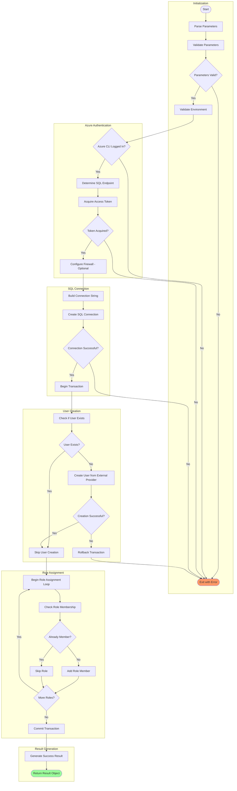

# 🔐 sql-managed-identity-config

> [!NOTE]
> **Target Audience:** Database Administrators, DevOps Engineers, Security Engineers  
> **Estimated Reading Time:** 12 minutes

<details>
<summary>📍 <strong>Navigation</strong></summary>
<br>

| Previous | Index | Next |
|:---------|:-----:|-----:|
| [Generate-Orders](Generate-Orders.md) | [📑 Index](README.md) | [check-dev-workstation](check-dev-workstation.md) |

</details>

---

## 📑 Table of Contents

- [📋 Overview](#-overview)
- [📝 Description](#-description)
- [📊 Workflow Diagram](#-workflow-diagram)
- [✅ Prerequisites](#-prerequisites)
- [⚙️ Parameters/Arguments](#️-parametersarguments)
- [📥 Input/Output Specifications](#-inputoutput-specifications)
- [💻 Usage Examples](#-usage-examples)
- [⚠️ Error Handling and Exit Codes](#️-error-handling-and-exit-codes)
- [🔒 Security Considerations](#-security-considerations)
- [🚧 Known Limitations](#-known-limitations)
- [🔗 Related Scripts](#-related-scripts)
- [💾 T-SQL Commands Executed](#-t-sql-commands-executed)
- [📜 Changelog](#-changelog)

---

## 📋 Overview

Configures Azure SQL Database user authentication with Managed Identity by creating a contained database user from an external provider (Microsoft Entra ID) and assigning specified database roles.

[⬆️ Back to top](#-sql-managed-identity-config)

---

## 📝 Description

This script enables passwordless authentication from Azure resources to Azure SQL Database using Managed Identities. It creates a contained database user in the target database that maps to a Microsoft Entra ID (formerly Azure AD) managed identity or service principal, then assigns the specified database roles to grant appropriate permissions.

The script uses Azure AD token-based authentication to connect to the SQL Database, eliminating the need for SQL authentication credentials. It acquires an access token using the Azure CLI session, then executes T-SQL commands to create the user and assign roles. The operation is idempotent - it safely handles cases where the user or role membership already exists.

Key security benefits include: no SQL passwords stored or transmitted, authentication tied to Azure AD identity lifecycle, role-based access control within the database, and full audit trail through Azure AD and SQL audit logs. This is the recommended authentication pattern for Azure applications connecting to Azure SQL Database.

[⬆️ Back to top](#-sql-managed-identity-config)

---

## 📊 Workflow Diagram



[⬆️ Back to top](#-sql-managed-identity-config)

---

## ✅ Prerequisites

| Category | Requirement | Version | Verification Command | Required |
|:---------|:------------|:--------|:---------------------|:--------:|
| Runtime | PowerShell Core | >= 7.0 | `$PSVersionTable.PSVersion` | ✅ |
| Runtime | Bash | >= 4.0 | `bash --version` | ✅ |
| CLI Tool | Azure CLI | >= 2.60.0 | `az --version` | ✅ |
| CLI Tool | sqlcmd (Bash only) | Latest | `sqlcmd -?` | ✅ (Bash) |
| Azure Config | Entra ID Authentication | N/A | SQL Server must have Entra admin configured | ✅ |
| Environment Variable | AZURE_RESOURCE_GROUP | N/A | For firewall configuration | Conditional |

### ⚠️ Critical Prerequisites

> [!IMPORTANT]
> The authenticated Azure CLI user must be the Entra ID administrator of the target SQL Server, or have equivalent permissions. Set the admin using:
>
> ```bash
> az sql server ad-admin create --resource-group <rg> --server-name <server> \
>   --display-name <name> --object-id <id>
> ```

### 📦 Installation Commands (Bash Dependencies)

```bash
# Install sqlcmd (mssql-tools)
# Ubuntu/Debian
curl https://packages.microsoft.com/keys/microsoft.asc | sudo apt-key add -
curl https://packages.microsoft.com/config/ubuntu/20.04/prod.list | sudo tee /etc/apt/sources.list.d/msprod.list
sudo apt-get update
sudo apt-get install mssql-tools unixodbc-dev

# macOS
brew tap microsoft/mssql-release https://github.com/Microsoft/homebrew-mssql-release
brew install mssql-tools
```

[⬆️ Back to top](#-sql-managed-identity-config)

---

## ⚙️ Parameters/Arguments

### PowerShell Parameters

| Parameter | Type | Required | Default | Description |
|:----------|:-----|:--------:|:--------|:------------|
| `-SqlServerName` | `[string]` | ✅ | N/A | Azure SQL Server name (without .database.windows.net suffix) |
| `-DatabaseName` | `[string]` | ✅ | N/A | Target database name (cannot be 'master') |
| `-PrincipalDisplayName` | `[string]` | ✅ | N/A | Managed identity or service principal display name from Entra ID |
| `-DatabaseRoles` | `[string[]]` | ❌ | `@("db_datareader", "db_datawriter")` | Array of database roles to assign |
| `-AzureEnvironment` | `[string]` | ❌ | `AzureCloud` | Azure cloud environment |
| `-CommandTimeout` | `[int]` | ❌ | `120` | SQL command timeout in seconds (30-600) |

### Bash Arguments

| Position/Flag | Type | Required | Default | Description |
|:--------------|:-----|:--------:|:--------|:------------|
| `--sql-server-name`, `-s` | string | ✅ | N/A | Azure SQL Server name (without suffix) |
| `--database-name`, `-d` | string | ✅ | N/A | Target database name |
| `--principal-name`, `-p` | string | ✅ | N/A | Managed identity display name |
| `--database-roles`, `-r` | string | ❌ | `db_datareader,db_datawriter` | Comma-separated database roles |
| `--environment`, `-e` | string | ❌ | `AzureCloud` | Azure environment |
| `--timeout`, `-t` | number | ❌ | `120` | SQL command timeout (30-600) |
| `--verbose`, `-v` | flag | ❌ | `false` | Enable verbose output |
| `--help`, `-h` | flag | ❌ | N/A | Display help message |

### Valid Database Roles

| Role | Permissions |
|:-----|:------------|
| `db_owner` | Full permissions in the database |
| `db_datareader` | Read all data from all user tables |
| `db_datawriter` | Add, delete, or modify data in all user tables |
| `db_ddladmin` | Run DDL commands (CREATE, ALTER, DROP) |
| `db_backupoperator` | Backup database permissions |
| `db_securityadmin` | Manage role membership and permissions |
| `db_accessadmin` | Add or remove database access |
| `db_denydatareader` | Deny read access to data |
| `db_denydatawriter` | Deny write access to data |

### Azure Environments

| Environment | SQL Endpoint Suffix |
|:------------|:-------------------:|
| `AzureCloud` | `.database.windows.net` |
| `AzureUSGovernment` | `.database.usgovcloudapi.net` |
| `AzureChinaCloud` | `.database.chinacloudapi.cn` |
| `AzureGermanCloud` | `.database.cloudapi.de` |

[⬆️ Back to top](#-sql-managed-identity-config)

---

## 📥 Input/Output Specifications

### Inputs

**Environment Variables Read:**

| Variable | Required | Description |
|:---------|:--------:|:------------|
| `AZURE_RESOURCE_GROUP` | Conditional | Used for firewall rule configuration |

### Outputs

**Exit Codes:**

| Exit Code | Meaning |
|:---------:|:--------|
| `0` | Success — User configured with roles |
| `1` | Error — Configuration failed |

**PowerShell Output Object:**

```powershell
[PSCustomObject]@{
    PSTypeName           = 'SqlManagedIdentityConfiguration.Result'
    Success              = $true  # or $false
    Principal            = 'identity-name'
    Server               = 'server.database.windows.net'
    Database             = 'database-name'
    Roles                = @('db_datareader', 'db_datawriter')
    RowsAffected         = 2      # On success
    ExecutionTimeSeconds = 5.23   # On success
    Timestamp            = '2026-01-06T12:30:00Z'
    Message              = 'Configuration completed successfully'  # On success
    ScriptVersion        = '1.0.0'
    Error                = $null  # Error message on failure
    ErrorType            = $null  # Exception type on failure
    InnerError           = $null  # Inner exception on failure
}
```

[⬆️ Back to top](#-sql-managed-identity-config)

---

## 💻 Usage Examples

### Basic Usage

```powershell
# PowerShell: Configure with default roles
.\sql-managed-identity-config.ps1 -SqlServerName "myserver" -DatabaseName "mydb" -PrincipalDisplayName "my-app-identity"
```

```bash
# Bash: Configure with default roles
./sql-managed-identity-config.sh --sql-server-name myserver --database-name mydb --principal-name my-app-identity
```

### Advanced Usage

```powershell
# PowerShell: Configure with additional DDL admin role
.\sql-managed-identity-config.ps1 `
    -SqlServerName "myserver" `
    -DatabaseName "mydb" `
    -PrincipalDisplayName "my-app-identity" `
    -DatabaseRoles @("db_datareader", "db_datawriter", "db_ddladmin") `
    -Verbose

# PowerShell: Capture result for conditional logic
$result = .\sql-managed-identity-config.ps1 -SqlServerName "myserver" -DatabaseName "mydb" -PrincipalDisplayName "my-app-identity"
if ($result.Success) {
    Write-Host "Configured $($result.Principal) with roles: $($result.Roles -join ', ')"
} else {
    Write-Error "Failed: $($result.Error)"
}
```

```bash
# Bash: Configure with additional roles and verbose output
./sql-managed-identity-config.sh \
    -s myserver \
    -d mydb \
    -p my-app-identity \
    -r "db_datareader,db_datawriter,db_ddladmin" \
    -v

# Bash: Azure Government cloud
./sql-managed-identity-config.sh \
    --sql-server-name myserver \
    --database-name mydb \
    --principal-name my-app-identity \
    --environment AzureUSGovernment
```

### CI/CD Pipeline Usage

```yaml
# Azure DevOps Pipeline
- task: AzureCLI@2
  displayName: 'Configure SQL managed identity'
  inputs:
    azureSubscription: 'Azure-Connection'
    scriptType: 'pscore'
    scriptLocation: 'scriptPath'
    scriptPath: '$(System.DefaultWorkingDirectory)/hooks/sql-managed-identity-config.ps1'
    arguments: '-SqlServerName "$(SQL_SERVER_NAME)" -DatabaseName "$(SQL_DATABASE_NAME)" -PrincipalDisplayName "$(MANAGED_IDENTITY_NAME)"'
  env:
    AZURE_RESOURCE_GROUP: $(AZURE_RESOURCE_GROUP)

# GitHub Actions
- name: Configure SQL Database access
  shell: bash
  run: |
    chmod +x ./hooks/sql-managed-identity-config.sh
    ./sql-managed-identity-config.sh \
      --sql-server-name "${{ vars.SQL_SERVER_NAME }}" \
      --database-name "${{ vars.SQL_DATABASE_NAME }}" \
      --principal-name "${{ vars.MANAGED_IDENTITY_NAME }}"
```

[⬆️ Back to top](#-sql-managed-identity-config)

---

## ⚠️ Error Handling and Exit Codes

| Exit Code | Meaning | Recovery Action |
|:---------:|:--------|:----------------|
| `0` | Success | N/A |
| `1` | Error | Check Azure CLI auth, verify Entra admin permissions |

### Error Handling Approach

**PowerShell:**

- `Set-StrictMode -Version Latest`
- `$ErrorActionPreference = 'Stop'`
- Comprehensive parameter validation with attributes
- Structured result object with error details
- Transaction rollback on failure

**Bash:**

- `set -euo pipefail`
- Parameter validation before SQL operations
- Token acquisition error handling
- Cleanup of temporary files

[⬆️ Back to top](#-sql-managed-identity-config)

---

## 🔒 Security Considerations

### 🔑 Credential Handling

- [x] No hardcoded secrets
- [x] No SQL passwords - uses Azure AD token authentication
- [x] Access tokens acquired via Azure CLI, not logged
- [x] Connections encrypted with TLS 1.2+

### Required Permissions

| Permission/Role | Scope | Justification |
|:----------------|:------|:--------------|
| SQL Server Contributor | Resource Group | Manage SQL Server firewall rules |
| Entra ID Administrator | SQL Server | Create users from external provider |
| db_owner | Target Database | Create users and assign roles |

### 🌐 Network Security

| Property | Value |
|:---------|:------|
| **Endpoints accessed** | Azure SQL Database (FQDN based on environment) |
| **TLS requirements** | TLS 1.2+ enforced |
| **Firewall rules needed** | Client IP must be allowed (auto-configured if AZURE_RESOURCE_GROUP set) |

### 📝 Logging Security

> [!TIP]
> **Security Features:**
>
> - **Sensitive data masking:** Access tokens never logged
> - **Audit trail:** Azure SQL audit logs, Entra ID sign-in logs

[⬆️ Back to top](#-sql-managed-identity-config)

---

## 🚧 Known Limitations

> [!CAUTION]
> **Important Notes:**
>
> - Cannot create users in 'master' database (by design for security)
> - Principal names with special characters may require bracketing in Entra ID
> - Requires Entra ID authentication to be enabled on SQL Server
> - Bash version requires sqlcmd utility installation
> - Firewall rule creation requires AZURE_RESOURCE_GROUP environment variable
> - Token expiration (typically 1 hour) may affect long operations

[⬆️ Back to top](#-sql-managed-identity-config)

---

## 🔗 Related Scripts

| Script | Relationship | Description |
|:-------|:-------------|:------------|
| [postprovision.md](postprovision.md) | Called by | May invoke this script after SQL provisioning |
| [preprovision.md](preprovision.md) | Related | Validates Azure CLI authentication |

[⬆️ Back to top](#-sql-managed-identity-config)

---

## 💾 T-SQL Commands Executed

```sql
-- Check if user exists
SELECT 1 FROM sys.database_principals WHERE name = N'{PrincipalDisplayName}'

-- Create user from external provider
CREATE USER [{PrincipalDisplayName}] FROM EXTERNAL PROVIDER

-- Check role membership
SELECT 1 FROM sys.database_role_members rm
    JOIN sys.database_principals rp ON rm.role_principal_id = rp.principal_id
    JOIN sys.database_principals mp ON rm.member_principal_id = mp.principal_id
WHERE rp.name = N'{RoleName}' AND mp.name = N'{PrincipalDisplayName}'

-- Add role member
ALTER ROLE [{RoleName}] ADD MEMBER [{PrincipalDisplayName}]
```

[⬆️ Back to top](#-sql-managed-identity-config)

---

## 📜 Changelog

| Version | Date | Changes |
|:-------:|:----:|:--------|
| 1.0.0 | 2026-01-06 | Initial release |

[⬆️ Back to top](#-sql-managed-identity-config)

---

<div align="center">

**[⬅️ Previous: Generate-Orders](Generate-Orders.md)** · **[📑 Index](README.md)** · **[Next: check-dev-workstation ➡️](check-dev-workstation.md)**

</div>
