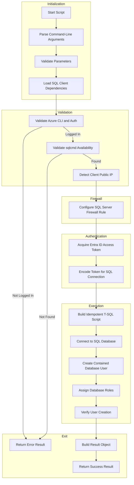

# Configure Azure SQL Database User with Managed Identity Authentication

## Overview

This script automates the configuration of Microsoft Entra ID (formerly Azure AD) managed identities for Azure SQL Database access. It creates contained database users from external providers and assigns specified database roles using token-based authentication.

Key features include:

- **Idempotent execution** - Safe to re-run without side effects (skips existing users/roles)
- **Cross-platform** - Supports Windows, Linux, and macOS
- **Multi-cloud** - Works with Azure Public, Government, China, and Germany clouds
- **Secure** - Uses token-based authentication with TLS 1.2+ encryption (no SQL passwords)
- **Robust** - Includes retry logic, detailed error handling, and comprehensive logging

The script is implemented in **both PowerShell and Bash** to support cross-platform execution.

## Script Classification

| Attribute | Value |
|-----------|-------|
| **Category** | Azure Security & Identity Configuration |
| **Trigger Mechanism** | Manual execution or invoked by postprovision scripts |
| **azd Hook** | No (helper utility) |

## Supported Environments

### Shells

| Shell | Minimum Version |
|-------|-----------------|
| PowerShell | 7.0+ |
| Bash | 4.0+ |

### Operating Systems

| OS | Supported |
|----|-----------|
| Windows | ✓ |
| Linux | ✓ |
| macOS | ✓ |

### Azure Cloud Environments

| Environment | SQL Endpoint Suffix |
|-------------|-------------------|
| AzureCloud (default) | `.database.windows.net` |
| AzureUSGovernment | `.database.usgovcloudapi.net` |
| AzureChinaCloud | `.database.chinacloudapi.cn` |
| AzureGermanCloud | `.database.cloudapi.de` |

## Prerequisites

> [!IMPORTANT]
> The authenticated user **must be an Entra ID administrator** of the SQL Server to run this script.

| Prerequisite | Required | Description |
|--------------|----------|-------------|
| Azure CLI | Yes | Version 2.60.0+ with active authentication |
| sqlcmd (go-sqlcmd) | Yes | Microsoft's cross-platform SQL command tool |
| Microsoft.Data.SqlClient | Yes (PowerShell) | .NET SQL client assembly |
| iconv | Yes (Bash) | For Azure AD token encoding (UTF-16LE) |
| Entra ID Admin | Yes | Authenticated user must be SQL Server Entra ID administrator |

### Environment Variables

| Variable | Required | Description |
|----------|----------|-------------|
| `AZURE_RESOURCE_GROUP` | Yes | Resource group containing the SQL Server (for firewall configuration) |

## Files

| File | Description |
|------|-------------|
| `sql-managed-identity-config.ps1` | PowerShell implementation |
| `sql-managed-identity-config.sh` | Bash implementation |

## High-Level Script Flow



## Usage

### PowerShell

```powershell
# Basic usage with default roles
./sql-managed-identity-config.ps1 -SqlServerName "myserver" -DatabaseName "mydb" -PrincipalDisplayName "my-app-identity"

# With custom roles and verbose output
./sql-managed-identity-config.ps1 -SqlServerName "myserver" -DatabaseName "mydb" -PrincipalDisplayName "my-app-identity" -DatabaseRoles @("db_datareader", "db_datawriter", "db_ddladmin") -Verbose

# Capture result and check status
$result = ./sql-managed-identity-config.ps1 -SqlServerName "myserver" -DatabaseName "mydb" -PrincipalDisplayName "my-app-identity"
if ($result.Success) {
    Write-Host "Configuration succeeded for $($result.Principal)"
} else {
    Write-Error "Configuration failed: $($result.Error)"
}
```

### Bash

```bash
# Basic usage with default roles
./sql-managed-identity-config.sh --sql-server-name myserver --database-name mydb --principal-name my-app-identity

# With custom roles and verbose output
./sql-managed-identity-config.sh -s myserver -d mydb -p my-app-identity -r "db_datareader,db_datawriter,db_ddladmin" -v

# Azure Government cloud
./sql-managed-identity-config.sh -s myserver -d mydb -p my-app-identity -e AzureUSGovernment

# Display help
./sql-managed-identity-config.sh --help
```

## Parameters

> [!WARNING]
> The `DatabaseName` parameter cannot be `master`. Specify a user database for managed identity configuration.

| Logical Parameter | PowerShell Name | Bash Name | Required | Default | Description |
|-------------------|-----------------|-----------|----------|---------|-------------|
| SQL Server Name | `-SqlServerName` | `-s`, `--sql-server-name` | Yes | N/A | Azure SQL Server name (without suffix) |
| Database Name | `-DatabaseName` | `-d`, `--database-name` | Yes | N/A | Target database name (not 'master') |
| Principal Name | `-PrincipalDisplayName` | `-p`, `--principal-name` | Yes | N/A | Managed identity display name from Entra ID |
| Database Roles | `-DatabaseRoles` | `-r`, `--database-roles` | No | `db_datareader,db_datawriter` | Comma-separated database roles |
| Azure Environment | `-AzureEnvironment` | `-e`, `--environment` | No | `AzureCloud` | Azure cloud environment |
| Command Timeout | `-CommandTimeout` | `-t`, `--timeout` | No | 120 | SQL command timeout (30-600 seconds) |
| Verbose | `-Verbose` | `-v`, `--verbose` | No | `false` | Enable verbose output |
| Help | N/A | `-h`, `--help` | No | N/A | Display help message |

### Valid Database Roles

| Role | Permission |
|------|------------|
| `db_owner` | Full permissions in the database |
| `db_datareader` | Read all data from all user tables |
| `db_datawriter` | Add, delete, or modify data in all user tables |
| `db_ddladmin` | Run DDL commands (CREATE, ALTER, DROP) |
| `db_backupoperator` | Can backup the database |
| `db_securityadmin` | Manage roles and permissions |
| `db_accessadmin` | Add or remove access to the database |
| `db_denydatareader` | Cannot read any data |
| `db_denydatawriter` | Cannot modify any data |

## Examples

### Configure Default Read/Write Access

**PowerShell:**

```powershell
./sql-managed-identity-config.ps1 -SqlServerName "myserver" -DatabaseName "mydb" -PrincipalDisplayName "my-app-identity"
```

**Bash:**

```bash
./sql-managed-identity-config.sh --sql-server-name myserver --database-name mydb --principal-name my-app-identity
```

### Configure with DDL Admin Permissions

**PowerShell:**

```powershell
./sql-managed-identity-config.ps1 -SqlServerName "myserver" -DatabaseName "mydb" -PrincipalDisplayName "my-app-identity" -DatabaseRoles @("db_datareader", "db_datawriter", "db_ddladmin")
```

**Bash:**

```bash
./sql-managed-identity-config.sh -s myserver -d mydb -p my-app-identity -r "db_datareader,db_datawriter,db_ddladmin"
```

## Error Handling & Exit Codes

| Exit Code | Description |
|-----------|-------------|
| 0 | Configuration completed successfully |
| 1 | Error (validation failed, authentication failed, or SQL operation failed) |

### Return Object (PowerShell)

The PowerShell script returns a `PSCustomObject` with:

| Property | Type | Description |
|----------|------|-------------|
| `Success` | Boolean | True if configuration succeeded |
| `Principal` | String | The principal display name |
| `Server` | String | The server FQDN |
| `Database` | String | The database name |
| `Roles` | Array | The assigned roles |
| `RowsAffected` | Int | Number of rows affected (on success) |
| `ExecutionTimeSeconds` | Double | Execution duration (on success) |
| `Timestamp` | String | ISO 8601 timestamp |
| `Message` | String | Success message (on success) |
| `Error` | String | Error message (on failure) |

## Logging & Output

| Output Type | Description |
|-------------|-------------|
| stdout | Status messages, success indicators |
| stderr | Error messages, warnings, verbose output |
| Color-coded output | Visual distinction with timestamps |

### Log Format

```
[2026-01-06 14:23:45] [Info] Configuring managed identity access...
[2026-01-06 14:23:46] [Success] Database user created successfully
```

## Security Considerations

> [!NOTE]
> This script is **idempotent** and safe to re-run. Existing users and roles are skipped, not duplicated.

- **Token-based authentication** - No SQL passwords are used or stored
- **TLS 1.2+** - All connections are encrypted
- **Access tokens not logged** - Sensitive data is excluded from logs
- **SQL injection protection** - Uses parameterized principals in T-SQL
- **Idempotent operations** - Safe to re-run without side effects
- **Firewall auto-configuration** - Client IP is added to firewall rules

### Entra ID Administrator Requirement

The authenticated user **must be an Entra ID administrator** of the SQL Server. Set this via:

```bash
az sql server ad-admin create \
  --resource-group <rg> \
  --server-name <server> \
  --display-name <name> \
  --object-id <id>
```

## Troubleshooting

| Issue | Resolution |
|-------|------------|
| `Azure CLI not installed` | Install from <https://docs.microsoft.com/cli/azure/install-azure-cli> |
| `Not authenticated to Azure` | Run `az login` to authenticate |
| `sqlcmd not found` | Install go-sqlcmd (see installation instructions below) |
| `Microsoft.Data.SqlClient not found` (PowerShell) | Install via `dotnet add package Microsoft.Data.SqlClient` |
| `Cannot configure users in 'master'` | Specify a user database, not the system database |
| `Principal not found in Entra ID` | Verify the managed identity name exactly matches Entra ID |
| `Permission denied` | Ensure you are the Entra ID administrator of the SQL Server |
| `Firewall blocking connection` | The script auto-configures firewall; check AZURE_RESOURCE_GROUP is set |

### Installing go-sqlcmd

> [!TIP]
> Use the platform-specific commands below to install the cross-platform `sqlcmd` tool.

| Platform | Command |
|----------|---------|
| Ubuntu/Debian | `curl https://packages.microsoft.com/keys/microsoft.asc \| sudo tee /etc/apt/trusted.gpg.d/microsoft.asc && sudo apt-get update && sudo apt-get install sqlcmd` |
| macOS | `brew install sqlcmd` |
| Windows | `winget install sqlcmd` |

## Development Notes

- Script version: `1.0.0` for both implementations
- T-SQL script is idempotent using `IF NOT EXISTS` checks
- Firewall rule cleanup is handled automatically
- Both implementations return structured results for programmatic use

## License & Ownership

| Attribute | Value |
|-----------|-------|
| Author | Evilazaro \| Principal Cloud Solution Architect \| Microsoft |
| Version | 1.0.0 |
| Creation Date | 2025-12-26 |
| Last Modified | 2026-01-06 |
| Repository | [Azure-LogicApps-Monitoring](https://github.com/Evilazaro/Azure-LogicApps-Monitoring) |

## Related Links

- [Azure AD Authentication for SQL](https://learn.microsoft.com/azure/azure-sql/database/authentication-aad-configure)
- [Managed Identities Overview](https://learn.microsoft.com/azure/active-directory/managed-identities-azure-resources/overview)
- [go-sqlcmd Documentation](https://github.com/microsoft/go-sqlcmd)
