# SQL Managed Identity Configuration Scripts

## Overview

The `sql-managed-identity-config` scripts configure Azure SQL Database users with Microsoft Entra ID (formerly Azure AD) Managed Identity authentication. These scripts create contained database users from external providers and assign specified database roles, enabling secure, passwordless authentication for Azure services.

## Script Versions

| Script | Version | Platform | Purpose |
|--------|---------|----------|---------|
| `sql-managed-identity-config.ps1` | 1.0.0 | PowerShell 7.0+ | Windows, Linux, macOS |
| `sql-managed-identity-config.sh` | 1.1.0 | Bash 4.0+ | Linux, macOS, WSL |

## Workflow

The scripts follow a structured workflow to ensure secure and reliable database user configuration:

```mermaid
flowchart LR
    subgraph Init["Initialization"]
        A[Start] --> B{Parse Arguments}
        B -->|Invalid| C[Display Error & Exit]
        B -->|Valid| D[Log Configuration Parameters]
    end

    subgraph Auth["Authentication Validation"]
        D --> E[Step 1: Validate Azure CLI Auth]
        E -->|Failed| F[Error: Run az login]
        E -->|Success| G[Azure Context Validated]
    end

    subgraph SqlCmd["SQL Tools - Bash Only"]
        G --> H{Bash Script?}
        H -->|Yes| I[Step 2: Validate sqlcmd]
        I -->|Not Found| J[Error: Install mssql-tools]
        I -->|Found| K[sqlcmd Validated]
        H -->|No| K
    end

    subgraph Conn["Connection Setup"]
        K --> L[Step: Construct Connection Details]
        L --> M[Detect Public IP]
        M --> N{AZURE_RESOURCE_GROUP Set?}
        N -->|Yes| O[Create Firewall Rule]
        N -->|No| P[Skip Firewall - Manual Config Needed]
        O --> Q[Build Server FQDN]
        P --> Q
    end

    subgraph Token["Token Acquisition"]
        Q --> R[Step: Acquire Entra ID Token]
        R -->|Failed| S[Error: Token Acquisition Failed]
        R -->|Success| T[Token Validated]
    end

    subgraph ScriptGen["Script Generation"]
        T --> U[Step: Generate SQL Script]
        U --> V[Create User from External Provider]
        V --> W[Generate Role Assignments]
    end

    subgraph Exec["Execution"]
        W --> X[Step: Execute SQL Script]
        X -->|Connection Failed| Y[Error: Check Firewall/Permissions]
        X -->|Auth Failed| Z[Error: Login Failed - Check Entra Admin]
        X -->|Success| AA[Configuration Complete]
    end

    subgraph Result["Result"]
        AA --> AB[Return Success JSON]
        C --> AC[Return Error JSON]
        F --> AC
        J --> AC
        S --> AC
        Y --> AC
        Z --> AC
    end

    classDef initClass fill:#e1f5fe,stroke:#0288d1,stroke-width:2px,color:#01579b
    classDef authClass fill:#fff3e0,stroke:#f57c00,stroke-width:2px,color:#e65100
    classDef sqlClass fill:#f3e5f5,stroke:#7b1fa2,stroke-width:2px,color:#4a148c
    classDef connClass fill:#e8f5e9,stroke:#388e3c,stroke-width:2px,color:#1b5e20
    classDef tokenClass fill:#fff8e1,stroke:#fbc02d,stroke-width:2px,color:#f57f17
    classDef scriptClass fill:#fce4ec,stroke:#c2185b,stroke-width:2px,color:#880e4f
    classDef execClass fill:#e0f2f1,stroke:#00796b,stroke-width:2px,color:#004d40
    classDef resultClass fill:#f5f5f5,stroke:#757575,stroke-width:2px,color:#424242
    classDef errorClass fill:#ffcdd2,stroke:#d32f2f,stroke-width:2px,color:#b71c1c
    classDef successClass fill:#c8e6c9,stroke:#388e3c,stroke-width:2px,color:#1b5e20
    classDef decisionClass fill:#fff3e0,stroke:#f57c00,stroke-width:2px,color:#e65100

    class A,D initClass
    class E,G authClass
    class I,K sqlClass
    class L,M,O,P,Q connClass
    class R,T tokenClass
    class U,V,W scriptClass
    class X,AA execClass
    class AB successClass
    class C,F,J,S,Y,Z,AC errorClass
    class B,H,N decisionClass
```



## Parameters

### Required Parameters

| Parameter | PowerShell | Bash | Description |
|-----------|------------|------|-------------|
| SQL Server Name | `-SqlServerName` | `--sql-server-name` | Azure SQL Server logical name (without `.database.windows.net` suffix). Must be 1-63 characters, lowercase letters, numbers, and hyphens only. |
| Database Name | `-DatabaseName` | `--database-name` | Target database where the user will be created. Cannot be `master`. |
| Principal Name | `-PrincipalDisplayName` | `--principal-name` | Display name of the managed identity or service principal as shown in Microsoft Entra ID. Case-sensitive. |

### Optional Parameters

| Parameter | PowerShell | Bash | Default | Description |
|-----------|------------|------|---------|-------------|
| Database Roles | `-DatabaseRoles` | `--database-roles` | `db_datareader,db_datawriter` | Array/comma-separated list of database roles to assign (1-20 roles). |
| Azure Environment | `-AzureEnvironment` | `--azure-environment` | `AzureCloud` | Azure cloud environment: `AzureCloud`, `AzureUSGovernment`, `AzureChinaCloud`, `AzureGermanCloud`. |
| Command Timeout | `-CommandTimeout` | `--command-timeout` | `120` | SQL command timeout in seconds (30-600). |
| Verbose | `-Verbose` | `--verbose` | Disabled | Enable detailed diagnostic output. |
| Help | - | `--help` | - | Display help message (Bash only). |

## Azure Environment Endpoints

| Environment | SQL Endpoint Suffix |
|-------------|---------------------|
| `AzureCloud` | `database.windows.net` |
| `AzureUSGovernment` | `database.usgovcloudapi.net` |
| `AzureChinaCloud` | `database.chinacloudapi.cn` |
| `AzureGermanCloud` | `database.cloudapi.de` |

## Common Database Roles

| Role | Permission |
|------|------------|
| `db_datareader` | Read all data from all user tables |
| `db_datawriter` | Add, delete, or modify data in all user tables |
| `db_ddladmin` | Run DDL commands (CREATE, ALTER, DROP) |
| `db_owner` | Full permissions in the database |
| `db_securityadmin` | Modify role membership and manage permissions |

## Prerequisites

### Common Requirements

- **Azure CLI** version 2.60.0 or higher
- **Azure CLI Authentication**: Run `az login` before script execution
- **Entra ID Admin**: You must be authenticated as an Entra ID administrator of the SQL Server
- **Network Access**: Firewall rules configured to allow connection to Azure SQL Database
- **Environment Variable**: `AZURE_RESOURCE_GROUP` for automatic firewall rule creation

### PowerShell-Specific

- **PowerShell** version 7.0 or higher
- **System.Data.SqlClient**: Built-in .NET SQL Client (no additional installation)

### Bash-Specific

- **Bash** version 4.0 or higher
- **sqlcmd**: From `mssql-tools` or `mssql-tools18` package
- **curl**: For public IP detection
- **jq**: Recommended for JSON output parsing

## Usage Examples

### Basic Usage

**PowerShell:**
```powershell
# Configure managed identity with default roles
.\sql-managed-identity-config.ps1 `
    -SqlServerName "contoso-sql-server" `
    -DatabaseName "orders-db" `
    -PrincipalDisplayName "app-orders-api-identity"
```

**Bash:**
```bash
# Configure managed identity with default roles
./sql-managed-identity-config.sh \
    --sql-server-name "contoso-sql-server" \
    --database-name "orders-db" \
    --principal-name "app-orders-api-identity"
```

### Custom Roles with Verbose Output

**PowerShell:**
```powershell
.\sql-managed-identity-config.ps1 `
    -SqlServerName "contoso-sql-server" `
    -DatabaseName "orders-db" `
    -PrincipalDisplayName "app-orders-api-identity" `
    -DatabaseRoles @('db_datareader', 'db_datawriter', 'db_ddladmin') `
    -Verbose
```

**Bash:**
```bash
./sql-managed-identity-config.sh \
    --sql-server-name "contoso-sql-server" \
    --database-name "orders-db" \
    --principal-name "app-orders-api-identity" \
    --database-roles "db_datareader,db_datawriter,db_ddladmin" \
    --verbose
```

### Azure Government Cloud

**PowerShell:**
```powershell
.\sql-managed-identity-config.ps1 `
    -SqlServerName "gov-sql-server" `
    -DatabaseName "secure-db" `
    -PrincipalDisplayName "gov-app-identity" `
    -AzureEnvironment "AzureUSGovernment"
```

**Bash:**
```bash
./sql-managed-identity-config.sh \
    --sql-server-name "gov-sql-server" \
    --database-name "secure-db" \
    --principal-name "gov-app-identity" \
    --azure-environment "AzureUSGovernment"
```

### Programmatic Result Handling

**PowerShell:**
```powershell
$result = .\sql-managed-identity-config.ps1 `
    -SqlServerName "myserver" `
    -DatabaseName "mydb" `
    -PrincipalDisplayName "my-app-identity"

if ($result.Success) {
    Write-Host "Configuration succeeded for $($result.Principal)"
    Write-Host "Assigned roles: $($result.Roles -join ', ')"
} else {
    Write-Error "Configuration failed: $($result.Error)"
}
```

**Bash:**
```bash
result=$(./sql-managed-identity-config.sh \
    --sql-server-name "myserver" \
    --database-name "mydb" \
    --principal-name "my-app-identity")

if echo "$result" | jq -e '.Success == true' > /dev/null 2>&1; then
    echo "Configuration succeeded"
    echo "Principal: $(echo "$result" | jq -r '.Principal')"
else
    echo "Configuration failed"
    echo "Error: $(echo "$result" | jq -r '.Error')"
fi
```

## Output Format

Both scripts return a structured JSON object:

### Success Response
```json
{
  "Success": true,
  "Principal": "app-orders-api-identity",
  "Server": "contoso-sql-server.database.windows.net",
  "Database": "orders-db",
  "Roles": "db_datareader,db_datawriter",
  "Message": "Managed identity configuration completed successfully"
}
```

### Error Response
```json
{
  "Success": false,
  "Principal": "app-orders-api-identity",
  "Server": "contoso-sql-server.database.windows.net",
  "Database": "orders-db",
  "Roles": "db_datareader,db_datawriter",
  "Error": "SQL execution failed. Verify permissions and authentication."
}
```

## Troubleshooting

### Error: Login Failed (SQL Error 18456)

**Symptom:** Authentication succeeded but SQL Server rejects the login.

**Root Cause:** The authenticated Azure CLI user is not an Entra ID administrator of the SQL Server.

**Solution:**
1. Set an Entra ID Admin on the SQL Server:
   ```bash
   # Get your current user details
   me=$(az ad signed-in-user show --query '{name:userPrincipalName,id:id}' -o json)
   
   # Set yourself as Entra ID admin
   az sql server ad-admin create \
       --resource-group <your-rg> \
       --server-name <server-name> \
       --display-name $(echo $me | jq -r '.name') \
       --object-id $(echo $me | jq -r '.id')
   ```

2. Verify the admin is set:
   ```bash
   az sql server ad-admin list --resource-group <rg> --server-name <server>
   ```

3. Re-authenticate and retry:
   ```bash
   az login
   azd provision  # or run the script directly
   ```

### Error: Firewall Blocking Connection (SQL Error 40615)

**Symptom:** Connection times out or is refused.

**Solution:**
1. Ensure `AZURE_RESOURCE_GROUP` environment variable is set for automatic firewall rule creation.
2. Manually add your IP if automatic creation fails:
   ```bash
   # Get your public IP
   curl ifconfig.me
   
   # Add firewall rule
   az sql server firewall-rule create \
       --resource-group <rg> \
       --server <server> \
       --name "AllowMyIP" \
       --start-ip-address <your-ip> \
       --end-ip-address <your-ip>
   ```

### Error: sqlcmd Not Found (Bash Only)

**Symptom:** Script fails at Step 2 with "sqlcmd is not installed" error.

**Solution:**
- **Ubuntu/Debian:**
  ```bash
  # Follow Microsoft's installation guide
  curl https://packages.microsoft.com/keys/microsoft.asc | sudo apt-key add -
  # Add repository and install mssql-tools18
  ```
- **macOS:**
  ```bash
  brew install mssql-tools18
  ```
- **Windows:** Download from [https://aka.ms/msodbcsql](https://aka.ms/msodbcsql)

### Error: Access Token Acquisition Failed

**Symptom:** Script fails to acquire Entra ID access token.

**Possible Causes:**
1. Azure CLI session expired
2. Insufficient permissions
3. Network connectivity issues

**Solution:**
1. Re-authenticate: `az login`
2. Verify account: `az account show`
3. Check network connectivity to Azure

### Error: User Already Exists (SQL Error 15023)

**Symptom:** Script reports user already exists.

**Note:** This is typically safe to ignore. The script is idempotent and skips existing users.

## Security Considerations

1. **Token-Based Authentication:** Uses Azure AD tokens instead of SQL passwords
2. **Token Lifetime:** Tokens are valid for approximately 1 hour
3. **No Token Persistence:** Access tokens are never logged or persisted
4. **TLS Encryption:** All connections use TLS 1.2+ encryption
5. **SQL Injection Protection:** Principal and role names are sanitized
6. **Certificate Validation:** Server certificates are validated by default

## Related Documentation

- [Configure Azure AD authentication for Azure SQL](https://learn.microsoft.com/azure/azure-sql/database/authentication-aad-configure)
- [Managed identities for Azure resources](https://learn.microsoft.com/azure/active-directory/managed-identities-azure-resources/overview)
- [Azure SQL Database firewall rules](https://learn.microsoft.com/azure/azure-sql/database/firewall-configure)
- [Azure CLI for SQL Server](https://learn.microsoft.com/cli/azure/sql/server)

## Changelog

### PowerShell Script (sql-managed-identity-config.ps1)

| Version | Date | Changes |
|---------|------|---------|
| 1.0.0 | 2025-12-29 | Initial release |

### Bash Script (sql-managed-identity-config.sh)

| Version | Date | Changes |
|---------|------|---------|
| 1.1.0 | 2025-01-08 | Updated step numbering to 6 steps for clarity |
| 1.0.0 | 2025-12-29 | Initial release |

---

**Made with ❤️ by Evilazaro | Principal Cloud Solution Architect | Microsoft**
