# sql-managed-identity-config (.ps1 / .sh)


---

## 📑 Table of Contents

- [📋 Overview](#-overview)
- [🎯 Purpose](#-purpose)
- [🏗️ Required Environment Variables](#️-required-environment-variables)
  - [How Environment Variables Are Set](#how-environment-variables-are-set)
- [🔧 Parameters](#-parameters)
  - [PowerShell Parameters](#powershell-parameters)
  - [Bash Parameters](#bash-parameters)
- [🚀 Usage](#-usage)
  - [PowerShell Examples](#powershell-examples)
  - [Bash Examples](#bash-examples)
- [🔒 Database Roles](#-database-roles)
- [🛠️ How It Works](#️-how-it-works)
  - [📊 Workflow Diagram](#-workflow-diagram)
  - [🔗 Technical Details](#-technical-details)
- [☁️ Azure Environments](#️-azure-environments)
- [🔐 Security Considerations](#-security-considerations)
  - [Safe Operations](#safe-operations)
  - [Required Permissions](#required-permissions)
  - [What the Script Creates](#what-the-script-creates)
- [🔧 Troubleshooting](#-troubleshooting)
  - [Common Errors](#common-errors)
  - [Setting Entra ID Admin](#setting-entra-id-admin)
- [📖 Related Documentation](#-related-documentation)
- [📜 Version History](#-version-history)

---

## 📋 Overview

The `sql-managed-identity-config` script configures Azure SQL Database users with Managed Identity authentication. It creates contained database users from Microsoft Entra ID (formerly Azure AD) and assigns specified database roles using token-based authentication.

Available in both PowerShell (`.ps1`) and Bash (`.sh`) versions for cross-platform compatibility, this script is designed to be **idempotent** and can be safely re-run. It will skip existing users and role memberships without errors.

The script is typically called by the `postprovision` hook after Azure infrastructure provisioning completes, setting up managed identity access for applications to connect to Azure SQL Database without storing credentials.

---

## 🎯 Purpose

This script performs the following operations:

| Operation                                 | Description                                              |
| ----------------------------------------- | -------------------------------------------------------- |
| ✅ **Validates Azure CLI authentication** | Ensures user is logged in                                |
| ✅ **Configures firewall rules**          | Automatically adds client IP to SQL Server firewall      |
| ✅ **Acquires access token**              | Gets Azure AD token for SQL Database authentication      |
| ✅ **Creates database user**              | Creates contained user from external provider (Entra ID) |
| ✅ **Assigns database roles**             | Grants specified permissions to the managed identity     |
| ✅ **Returns structured results**         | Provides JSON output for programmatic handling           |

## 🏗️ Required Environment Variables

| Variable                | Description                              | Required           | Set By |
| ----------------------- | ---------------------------------------- | ------------------ | ------ |
| `AZURE_RESOURCE_GROUP`  | Resource group containing the SQL Server | Yes (for firewall) | azd    |
| `AZURE_SUBSCRIPTION_ID` | Azure subscription GUID                  | Optional           | azd    |

### How Environment Variables Are Set

When running via Azure Developer CLI (`azd`), these variables are automatically set based on:

1. **Bicep outputs** defined in `main.bicep`
2. **Azure resource properties** discovered during provisioning
3. **User's azd environment configuration**

## 🔧 Parameters

### PowerShell Parameters

| Parameter               | Type     | Required | Default                               | Description                                                    |
| ----------------------- | -------- | -------- | ------------------------------------- | -------------------------------------------------------------- |
| `-SqlServerName`        | String   | Yes      | -                                     | Azure SQL Server name (without `.database.windows.net` suffix) |
| `-DatabaseName`         | String   | Yes      | -                                     | Target database name (cannot be 'master')                      |
| `-PrincipalDisplayName` | String   | Yes      | -                                     | Managed identity display name from Entra ID                    |
| `-DatabaseRoles`        | String[] | No       | `@('db_datareader', 'db_datawriter')` | Database roles to assign                                       |
| `-AzureEnvironment`     | String   | No       | `AzureCloud`                          | Azure cloud environment                                        |
| `-CommandTimeout`       | Int      | No       | `120`                                 | SQL command timeout in seconds (30-600)                        |

### Bash Parameters

| Parameter       | Short | Required | Default                       | Description                               |
| --------------- | ----- | -------- | ----------------------------- | ----------------------------------------- |
| `--server`      | `-s`  | Yes      | -                             | Azure SQL Server name (without suffix)    |
| `--database`    | `-d`  | Yes      | -                             | Target database name (cannot be 'master') |
| `--principal`   | `-p`  | Yes      | -                             | Managed identity display name             |
| `--roles`       | `-r`  | No       | `db_datareader,db_datawriter` | Comma-separated database roles            |
| `--environment` | `-e`  | No       | `AzureCloud`                  | Azure cloud environment                   |
| `--timeout`     | `-t`  | No       | `120`                         | SQL command timeout in seconds            |
| `--verbose`     | `-v`  | No       | -                             | Enable verbose output                     |
| `--help`        | `-h`  | No       | -                             | Display help message                      |

## 🚀 Usage

### PowerShell Examples

```powershell
# Basic usage with default roles
.\sql-managed-identity-config.ps1 `
    -SqlServerName "myserver" `
    -DatabaseName "mydb" `
    -PrincipalDisplayName "my-app-identity"

# With custom roles
.\sql-managed-identity-config.ps1 `
    -SqlServerName "myserver" `
    -DatabaseName "mydb" `
    -PrincipalDisplayName "my-app-identity" `
    -DatabaseRoles @("db_datareader", "db_datawriter", "db_ddladmin")

# With verbose output
.\sql-managed-identity-config.ps1 `
    -SqlServerName "myserver" `
    -DatabaseName "mydb" `
    -PrincipalDisplayName "my-app-identity" `
    -Verbose

# Capture result for programmatic handling
$result = .\sql-managed-identity-config.ps1 `
    -SqlServerName "myserver" `
    -DatabaseName "mydb" `
    -PrincipalDisplayName "my-app-identity"

if ($result.Success) {
    Write-Host "Configuration succeeded for $($result.Principal)"
} else {
    Write-Error "Configuration failed: $($result.Error)"
}
```

### Bash Examples

```bash
# Basic usage with default roles
./sql-managed-identity-config.sh \
    --server myserver \
    --database mydb \
    --principal my-app-identity

# With custom roles
./sql-managed-identity-config.sh \
    -s myserver \
    -d mydb \
    -p my-app-identity \
    -r "db_datareader,db_datawriter,db_ddladmin"

# With verbose output
./sql-managed-identity-config.sh \
    --server myserver \
    --database mydb \
    --principal my-app-identity \
    --verbose

# Azure Government cloud
./sql-managed-identity-config.sh \
    -s myserver \
    -d mydb \
    -p my-app-identity \
    -e AzureUSGovernment
```

## 🔒 Database Roles

The following built-in database roles can be assigned:

| Role                | Description                                    |
| ------------------- | ---------------------------------------------- | --------- |
| `db_owner`          | Full permissions in the database               | 🔴 High   |
| `db_datareader`     | Read all data from all user tables             | 🟢 Low    |
| `db_datawriter`     | Add, delete, or modify data in all user tables | 🟡 Medium |
| `db_ddladmin`       | Run DDL commands (CREATE, ALTER, DROP)         | 🟡 Medium |
| `db_backupoperator` | Can back up the database                       | 🟡 Medium |
| `db_securityadmin`  | Modify role membership and manage permissions  | 🔴 High   |
| `db_accessadmin`    | Add or remove database access                  | 🔴 High   |
| `db_denydatareader` | Cannot read any data in the database           | 🔵 Deny   |
| `db_denydatawriter` | Cannot modify any data in the database         | 🔵 Deny   |

**Default Roles:** `db_datareader`, `db_datawriter`

---

## 🛠️ How It Works

### 📊 Workflow Diagram

```mermaid
---
title: sql-managed-identity-config Workflow
---
flowchart LR
    %% ===== STYLE DEFINITIONS =====
    classDef primary fill:#4F46E5,stroke:#3730A3,color:#FFFFFF
    classDef secondary fill:#10B981,stroke:#059669,color:#FFFFFF
    classDef datastore fill:#F59E0B,stroke:#D97706,color:#000000
    classDef external fill:#6B7280,stroke:#4B5563,color:#FFFFFF,stroke-dasharray: 5 5
    classDef failed fill:#F44336,stroke:#C62828,color:#FFFFFF
    classDef trigger fill:#818CF8,stroke:#4F46E5,color:#FFFFFF
    classDef decision fill:#FFFBEB,stroke:#F59E0B,color:#000000
    classDef input fill:#F3F4F6,stroke:#6B7280,color:#000000

    %% ===== TRIGGER NODES =====
    A["🚀 Start"]:::trigger

    %% ===== PHASE 1: VALIDATION =====
    subgraph validation["🔍 Phase 1: Validation"]
        direction TB
        B["Validate Parameters"]:::primary
        C["Check Azure CLI Auth"]:::primary
        D{"Authenticated?"}:::decision
    end

    %% ===== PHASE 2: CONFIGURATION =====
    subgraph config["⚙️ Phase 2: Configuration"]
        direction TB
        F["Configure Firewall"]:::primary
        G["Acquire Access Token"]:::primary
        H["Generate SQL Script"]:::datastore
    end

    %% ===== PHASE 3: EXECUTION =====
    subgraph execution["▶️ Phase 3: Execution"]
        direction TB
        I["Connect to Database"]:::external
        J["Execute SQL Script"]:::primary
        K{"Success?"}:::decision
    end

    %% ===== RESULT NODES =====
    E["❌ Exit with Error"]:::failed
    L["📋 Show Troubleshooting"]:::datastore
    M["❌ Return Error Result"]:::failed
    N["✅ Return Success Result"]:::secondary
    O["🏁 End"]:::input

    %% ===== MAIN FLOW CONNECTIONS =====
    A -->|"Start Process"| validation
    B -->|"Params OK"| C
    C -->|"Check Auth"| D
    D -->|"No"| E
    D -->|"Yes"| config
    F -->|"Firewall OK"| G
    G -->|"Token Acquired"| H
    H -->|"Script Ready"| execution
    I -->|"Connected"| J
    J -->|"Execute"| K
    K -->|"No"| L
    L -->|"Show Help"| M
    K -->|"Yes"| N
    M -->|"Exit"| O
    N -->|"Exit"| O
    E -->|"Exit"| O

    %% ===== SUBGRAPH STYLES =====
    style validation fill:#EEF2FF,stroke:#4F46E5,stroke-width:2px
    style config fill:#FEF3C7,stroke:#F59E0B,stroke-width:2px
    style execution fill:#D1FAE5,stroke:#10B981,stroke-width:2px
```



### 🔗 Technical Details

#### Authentication Flow

| Step | Action                                                                   |
| ---- | ------------------------------------------------------------------------ |
| 1    | Uses Azure CLI (`az account get-access-token`) to acquire Azure AD token |
| 2    | Token is scoped to Azure SQL Database resource                           |
| 3    | No SQL passwords are used or stored                                      |

#### SQL Script Generation

| Aspect            | Implementation                                              |
| ----------------- | ----------------------------------------------------------- |
| **Idempotency**   | Uses `IF EXISTS` checks to safely handle re-runs            |
| **User Creation** | `CREATE USER ... FROM EXTERNAL PROVIDER` for Entra ID users |
| **SQL Injection** | Input sanitization via T-SQL escaping                       |

#### Connection Details

| Property           | PowerShell                                | Bash              |
| ------------------ | ----------------------------------------- | ----------------- |
| **SQL Client**     | `Microsoft.Data.SqlClient`                | `sqlcmd` utility  |
| **Authentication** | Azure AD token via `AccessToken` property | `-G` flag + token |
| **Encryption**     | TLS 1.2+ enforced                         | TLS 1.2+ enforced |

#### Firewall Configuration

| Aspect        | Details                                         |
| ------------- | ----------------------------------------------- |
| IP Detection  | Automatically detects client public IP          |
| Rule Creation | Creates temporary firewall rule for execution   |
| Rule Naming   | Includes timestamp for uniqueness               |
| Auto-Cleanup  | Rule removed after script completion (optional) |

## ☁️ Azure Environments

The script supports multiple Azure cloud environments:

| Environment         | SQL Endpoint Suffix           | Description            |
| ------------------- | ----------------------------- | ---------------------- |
| `AzureCloud`        | `.database.windows.net`       | Public Azure (default) |
| `AzureUSGovernment` | `.database.usgovcloudapi.net` | Azure Government       |
| `AzureChinaCloud`   | `.database.chinacloudapi.cn`  | Azure China (21Vianet) |
| `AzureGermanCloud`  | `.database.cloudapi.de`       | Azure Germany          |

## 🔐 Security Considerations

### Safe Operations

- ✅ Uses Azure AD token authentication (no SQL passwords)
- ✅ Access tokens are not logged or persisted
- ✅ SQL injection protection via input sanitization
- ✅ Connections use TLS 1.2+ encryption
- ✅ Server certificates are validated

### Required Permissions

- **Azure Resource Manager:** SQL Server Contributor or higher
- **Database:** db_owner or higher in target database
- **Entra ID:** Must authenticate as SQL Server Entra ID administrator

### What the Script Creates

| Resource         | Details                                      |
| ---------------- | -------------------------------------------- |
| Database User    | Contained user from external provider        |
| Role Memberships | Specified database roles assigned to user    |
| Firewall Rule    | Temporary rule for client IP (if configured) |

## 🔧 Troubleshooting

### Common Errors

| Error                            | Cause                               | Solution                             |
| -------------------------------- | ----------------------------------- | ------------------------------------ |
| `18456 - Login failed`           | Not authenticated as Entra ID admin | Set Entra ID admin on SQL Server     |
| `40615 - Firewall rule blocking` | Client IP not allowed               | Add IP to SQL Server firewall        |
| `40613 - Database not available` | Database offline or doesn't exist   | Verify database exists and is online |
| `33134 - User already exists`    | User was previously created         | Safe to ignore (idempotent)          |

### Setting Entra ID Admin

To create database users via Entra ID, you **must** authenticate as an Entra ID administrator of the SQL Server:

```bash
# 1. Get your current user details
az ad signed-in-user show --query '{name:userPrincipalName,id:id}' -o json

# 2. Set yourself as Entra ID admin
az sql server ad-admin create \
    --resource-group <your-resource-group> \
    --server-name <your-sql-server> \
    --display-name <your-user-principal-name> \
    --object-id <your-object-id>

# 3. Verify the admin is set
az sql server ad-admin list \
    --resource-group <your-resource-group> \
    --server-name <your-sql-server>

# 4. Re-run the script
./sql-managed-identity-config.sh -s <server> -d <database> -p <principal>
```

## 📖 Related Documentation

- [Azure SQL Database Microsoft Entra ID Authentication](https://learn.microsoft.com/azure/azure-sql/database/authentication-aad-configure)
- [Managed Identities for Azure Resources](https://learn.microsoft.com/azure/active-directory/managed-identities-azure-resources/overview)
- [CREATE USER (Transact-SQL)](https://learn.microsoft.com/sql/t-sql/statements/create-user-transact-sql)
- [Database-Level Roles](https://learn.microsoft.com/sql/relational-databases/security/authentication-access/database-level-roles)
- [Azure CLI SQL Commands](https://learn.microsoft.com/cli/azure/sql)
- [postprovision Hook Documentation](./postprovision.md)

## 📜 Version History

| Version | Date       | Changes                                                                                       |
| ------- | ---------- | --------------------------------------------------------------------------------------------- |
| 1.0.0   | 2026-01-06 | Initial release with PowerShell Core and Bash support, preference backup/restore pattern, `-CommandType Application` to `Get-Command` calls, IFS protection in Bash |

---

<div align="center">

**Made with ❤️ by Evilazaro | Principal Cloud Solution Architect | Microsoft**

[⬆ Back to Top](#-pre-provisioning-script-documentation)

</div>
