# 🔐 sql-managed-identity-config

> Configures Azure SQL Database user with Managed Identity authentication.

## 📋 Overview

Creates a database user from an external provider (Microsoft Entra ID/Managed Identity) and assigns specified database roles using Azure AD token-based authentication.

The script performs the following operations:

- Validates Azure CLI authentication
- Acquires an access token for Azure SQL Database
- Creates a contained database user from external provider
- Assigns specified database roles to the user
- Returns a structured result object

The script is **idempotent** and can be safely re-run. It will skip existing users and role memberships.

---

## 📑 Table of Contents

- [📌 Script Metadata](#-script-metadata)
- [🔧 Prerequisites](#-prerequisites)
- [📥 Parameters](#-parameters)
- [🌐 Environment Variables](#-environment-variables)
- [🔑 Azure Environments](#-azure-environments)
- [🛡️ Database Roles](#%EF%B8%8F-database-roles)
- [🔄 Execution Flow](#-execution-flow)
- [📝 Usage Examples](#-usage-examples)
- [📄 Output Format](#-output-format)
- [⚠️ Exit Codes](#%EF%B8%8F-exit-codes)
- [🔒 Security Considerations](#-security-considerations)
- [⚠️ Known Limitations](#%EF%B8%8F-known-limitations)
- [📚 Related Scripts](#-related-scripts)
- [📜 Version History](#-version-history)

[⬅️ Back to Index](./index.md)

---

## 📌 Script Metadata

| Property          | PowerShell                                                   | Bash                                                         |
| ----------------- | ------------------------------------------------------------ | ------------------------------------------------------------ |
| **File Name**     | `sql-managed-identity-config.ps1`                            | `sql-managed-identity-config.sh`                             |
| **Version**       | 1.0.0                                                        | 1.0.0                                                        |
| **Last Modified** | 2026-01-06                                                   | 2026-01-06                                                   |
| **Author**        | Evilazaro \| Principal Cloud Solution Architect \| Microsoft | Evilazaro \| Principal Cloud Solution Architect \| Microsoft |
| **Creation Date** | 2025-12-26                                                   | 2025-12-26                                                   |

---

## 🔧 Prerequisites

| Requirement     | Minimum Version | Notes                                    |
| --------------- | --------------- | ---------------------------------------- |
| PowerShell Core | 7.0             | Required for `.ps1` script               |
| Bash            | 4.0             | Required for `.sh` script                |
| Azure CLI       | 2.60.0          | For token acquisition and authentication |
| sqlcmd          | Any             | Required for Bash script (mssql-tools)   |

### Critical Requirements

- **Entra ID Administrator**: You must authenticate as an Entra ID administrator of the SQL Server
  ```bash
  az sql server ad-admin create --resource-group <rg> --server-name <server> --display-name <name> --object-id <id>
  ```
- **Network Access**: Firewall rules must allow access to Azure SQL Database
- **Environment Variable**: `AZURE_RESOURCE_GROUP` must be set for firewall configuration

---

## 📥 Parameters

### PowerShell (`sql-managed-identity-config.ps1`)

| Parameter               | Type     | Required | Default                               | Description                                                    |
| ----------------------- | -------- | -------- | ------------------------------------- | -------------------------------------------------------------- |
| `-SqlServerName`        | String   | **Yes**  | N/A                                   | Azure SQL Server name (without `.database.windows.net` suffix) |
| `-DatabaseName`         | String   | **Yes**  | N/A                                   | Target database name (cannot be `master`)                      |
| `-PrincipalDisplayName` | String   | **Yes**  | N/A                                   | Managed identity or service principal display name             |
| `-DatabaseRoles`        | String[] | No       | `@("db_datareader", "db_datawriter")` | Array of database roles to assign                              |
| `-AzureEnvironment`     | String   | No       | `AzureCloud`                          | Azure cloud environment                                        |
| `-CommandTimeout`       | Int      | No       | `120`                                 | SQL command timeout (30-600 seconds)                           |

### Bash (`sql-managed-identity-config.sh`)

| Parameter                 | Type   | Required | Default                       | Description                            |
| ------------------------- | ------ | -------- | ----------------------------- | -------------------------------------- |
| `-s`, `--sql-server-name` | String | **Yes**  | N/A                           | Azure SQL Server name (without suffix) |
| `-d`, `--database-name`   | String | **Yes**  | N/A                           | Database name (cannot be `master`)     |
| `-p`, `--principal-name`  | String | **Yes**  | N/A                           | Managed identity display name          |
| `-r`, `--database-roles`  | String | No       | `db_datareader,db_datawriter` | Comma-separated database roles         |
| `-e`, `--environment`     | String | No       | `AzureCloud`                  | Azure environment                      |
| `-t`, `--timeout`         | Int    | No       | `120`                         | SQL command timeout (30-600)           |
| `-v`, `--verbose`         | Flag   | No       | `false`                       | Enable verbose output                  |
| `-h`, `--help`            | Flag   | No       | N/A                           | Display help message                   |

---

## 🌐 Environment Variables

### Required Variables

| Variable               | Source   | Description                                                   |
| ---------------------- | -------- | ------------------------------------------------------------- |
| `AZURE_RESOURCE_GROUP` | User/azd | Resource group containing the SQL Server (for firewall rules) |

---

## 🔑 Azure Environments

The script supports multiple Azure cloud environments:

| Environment         | SQL Endpoint                  |
| ------------------- | ----------------------------- |
| `AzureCloud`        | `.database.windows.net`       |
| `AzureUSGovernment` | `.database.usgovcloudapi.net` |
| `AzureChinaCloud`   | `.database.chinacloudapi.cn`  |
| `AzureGermanCloud`  | `.database.cloudapi.de`       |

---

## 🛡️ Database Roles

Common built-in roles that can be assigned:

| Role                | Description                                    |
| ------------------- | ---------------------------------------------- |
| `db_datareader`     | Read all data from all user tables             |
| `db_datawriter`     | Add, delete, or modify data in all user tables |
| `db_ddladmin`       | Run DDL commands (CREATE, ALTER, DROP)         |
| `db_owner`          | Full permissions in the database               |
| `db_backupoperator` | Can backup the database                        |
| `db_securityadmin`  | Manage role memberships and permissions        |
| `db_accessadmin`    | Add or remove access for users                 |
| `db_denydatareader` | Cannot read any data                           |
| `db_denydatawriter` | Cannot modify any data                         |

---

## 🔄 Execution Flow

```mermaid
flowchart TD
    A[🚀 Start sql-managed-identity-config] --> B[Parse Arguments]
    B --> C{Help Requested?}

    C -->|Yes| D[Display Help]
    D --> Z[🏁 End]

    C -->|No| E{Validate Parameters}
    E -->|Invalid| F[❌ Return Error Result]
    F --> Z

    E -->|Valid| G{Azure CLI Logged In?}
    G -->|No| H[❌ Return Auth Error]
    H --> Z

    G -->|Yes| I[Acquire Azure AD Token]
    I --> J{Token Acquired?}

    J -->|No| K[❌ Return Token Error]
    K --> Z

    J -->|Yes| L[Build SQL Connection]
    L --> M[Connect to Database]

    M --> N{Connection Success?}
    N -->|No| O[❌ Return Connection Error]
    O --> Z

    N -->|Yes| P[Check if User Exists]
    P --> Q{User Exists?}

    Q -->|Yes| R[Skip User Creation]
    Q -->|No| S[CREATE USER FROM EXTERNAL PROVIDER]

    R --> T[Process Role Assignments]
    S --> T

    T --> U[Loop: Assign Each Role]
    U --> V[Check Role Membership]
    V --> W{Already Member?}

    W -->|Yes| X[Skip Role Assignment]
    W -->|No| Y[ALTER ROLE ADD MEMBER]

    X --> AA{More Roles?}
    Y --> AA

    AA -->|Yes| U
    AA -->|No| AB[Build Success Result]

    AB --> AC[✅ Return Result Object]
    AC --> Z
```



---

## 📝 Usage Examples

### PowerShell

```powershell
# Basic usage with default roles
.\sql-managed-identity-config.ps1 -SqlServerName "myserver" -DatabaseName "mydb" -PrincipalDisplayName "my-app-identity"

# With custom roles and verbose output
.\sql-managed-identity-config.ps1 -SqlServerName "myserver" -DatabaseName "mydb" -PrincipalDisplayName "my-app-identity" -DatabaseRoles @("db_datareader", "db_datawriter", "db_ddladmin") -Verbose

# Capture and check result
$result = .\sql-managed-identity-config.ps1 -SqlServerName "myserver" -DatabaseName "mydb" -PrincipalDisplayName "my-app-identity"
if ($result.Success) {
    Write-Host "Configuration succeeded for $($result.Principal)"
} else {
    Write-Error "Configuration failed: $($result.Error)"
}
```

### Bash

```bash
# Basic usage with default roles
./sql-managed-identity-config.sh --sql-server-name myserver --database-name mydb --principal-name my-app-identity

# With custom roles and verbose output
./sql-managed-identity-config.sh -s myserver -d mydb -p my-app-identity -r "db_datareader,db_datawriter,db_ddladmin" -v

# Azure Government cloud
./sql-managed-identity-config.sh -s myserver -d mydb -p my-app-identity -e AzureUSGovernment
```

---

## 📄 Output Format

### PowerShell Result Object

The script returns a `PSCustomObject` with type `SqlManagedIdentityConfiguration.Result`:

**Success Result:**

```powershell
@{
    Success = $true
    Principal = "my-app-identity"
    Server = "myserver.database.windows.net"
    Database = "mydb"
    Roles = @("db_datareader", "db_datawriter")
    RowsAffected = 2
    ExecutionTimeSeconds = 3.45
    Timestamp = "2026-01-21T10:30:00Z"
    Message = "Successfully configured managed identity access"
    ScriptVersion = "1.0.0"
}
```

**Error Result:**

```powershell
@{
    Success = $false
    Principal = "my-app-identity"
    Server = "myserver.database.windows.net"
    Database = "mydb"
    Roles = @("db_datareader", "db_datawriter")
    Timestamp = "2026-01-21T10:30:00Z"
    ScriptVersion = "1.0.0"
    Error = "Login failed for user '<token-identified principal>'"
    ErrorType = "SqlException"
    InnerError = $null
}
```

---

## ⚠️ Exit Codes

| Code | Meaning                                                     |
| ---- | ----------------------------------------------------------- |
| `0`  | Success - user configured with all roles                    |
| `1`  | Error - validation, authentication, or SQL execution failed |

---

## 🔒 Security Considerations

- Uses Azure AD token authentication (no SQL passwords)
- Access tokens are not logged or persisted
- SQL injection protection via parameterized principals
- Connections use encryption (TLS 1.2+)

---

## ⚠️ Known Limitations

- Requires Microsoft Entra ID authentication to be enabled on the SQL Server
- Cannot create users in the `master` database (by design)
- Principal names with special characters should be enclosed in brackets in Entra ID

---

## 📚 Related Scripts

| Script                              | Purpose                                          |
| ----------------------------------- | ------------------------------------------------ |
| [postprovision](./postprovision.md) | Calls this script for SQL managed identity setup |

---

## 📜 Version History

| Version | Date       | Changes                                                       |
| ------- | ---------- | ------------------------------------------------------------- |
| 1.0.0   | 2026-01-06 | Initial release - Entra ID managed identity SQL configuration |

---

## 🔗 Links

- [Repository](https://github.com/Evilazaro/Azure-LogicApps-Monitoring)
- [Azure SQL Authentication with Azure AD](https://learn.microsoft.com/azure/azure-sql/database/authentication-aad-configure)
- [Managed Identities Overview](https://learn.microsoft.com/azure/active-directory/managed-identities-azure-resources/overview)

---

[⬅️ Back to Index](./index.md)
