# 🗄️ sql-managed-identity-config

> [!NOTE]
> **Target Audience**: Database Administrators, DevOps Engineers, Security Engineers  
> **Reading Time**: ~12 minutes

<details>
<summary>📖 Navigation</summary>

| Previous | Index | Next |
|:---------|:-----:|-----:|
| [configure-federated-credential](configure-federated-credential.md) | [📚 Index](README.md) | [Generate-Orders](Generate-Orders.md) |

</details>

Configures Azure SQL Database user with Managed Identity authentication.

## 📑 Table of Contents

- [📋 Overview](#-overview)
- [⚙️ Prerequisites](#️-prerequisites)
- [🎯 Parameters](#-parameters)
- [🌐 Environment Variables](#-environment-variables)
- [⚙️ Functionality](#️-functionality)
- [📖 Usage Examples](#-usage-examples)
- [💻 Platform Differences](#-platform-differences)
- [🚪 Exit Codes](#-exit-codes)
- [🔗 Related Hooks](#-related-hooks)

## 📋 Overview

Creates a database user from an external provider (Microsoft Entra ID/Managed Identity) and assigns specified database roles using Azure AD token-based authentication.

### ✨ Key Features

- **Idempotent**: Can be safely re-run; skips existing users and role memberships
- **Passwordless**: Uses Azure AD token authentication (no SQL passwords)
- **Secure**: Access tokens are not logged or persisted
- **Multi-cloud**: Supports Azure Public, Government, China, and Germany clouds

### 🔑 Key Operations

- Validates Azure CLI authentication
- Acquires an access token for Azure SQL Database
- Creates a contained database user from external provider
- Assigns specified database roles to the user

### 📅 When Executed

- **Automatically**: Called by `postprovision` script after infrastructure provisioning
- **Manually**: When needing to configure additional managed identities

## ⚙️ Prerequisites

### 🔧 Required Tools

| Tool | Minimum Version | Purpose |
|:-----|:---------------:|:--------|
| PowerShell Core | 7.0+ | Script execution (PowerShell version) |
| Bash | 4.0+ | Script execution (Bash version) |
| Azure CLI (az) | 2.60.0+ | Token acquisition |
| sqlcmd | Latest | SQL Server connectivity (Bash version) |

### ☁️ Required Azure Configuration

- **SQL Server Entra Admin**: You must authenticate as an Entra ID administrator of the SQL Server
- **Network Access**: Firewall rules must allow your client IP
- **Managed Identity**: The identity must exist in Microsoft Entra ID

### 🔐 SQL Server Entra ID Admin Setup

```bash
# Set Entra ID admin on SQL Server
az sql server ad-admin create \
  --resource-group <rg> \
  --server-name <server> \
  --display-name <admin-name> \
  --object-id <admin-object-id>
```

## 🎯 Parameters

### PowerShell Parameters

| Parameter | Type | Required | Default | Description |
|:----------|:----:|:--------:|:-------:|:------------|
| `-SqlServerName` | String | **Yes** | N/A | SQL Server name (without `.database.windows.net`) |
| `-DatabaseName` | String | **Yes** | N/A | Target database name (not `master`) |
| `-PrincipalDisplayName` | String | **Yes** | N/A | Managed identity display name in Entra ID |
| `-DatabaseRoles` | String[] | No | `@("db_datareader", "db_datawriter")` | Database roles to assign |
| `-AzureEnvironment` | String | No | `AzureCloud` | Azure cloud environment |
| `-CommandTimeout` | Int | No | `120` | SQL command timeout (30-600 seconds) |

### Bash Parameters

| Parameter | Type | Required | Default | Description |
|:----------|:----:|:--------:|:-------:|:------------|
| `--sql-server-name`, `-s` | String | **Yes** | N/A | SQL Server name (without suffix) |
| `--database-name`, `-d` | String | **Yes** | N/A | Target database name |
| `--principal-name`, `-p` | String | **Yes** | N/A | Managed identity display name |
| `--database-roles`, `-r` | String | No | `db_datareader,db_datawriter` | Comma-separated roles |
| `--environment`, `-e` | String | No | `AzureCloud` | Azure cloud environment |
| `--timeout`, `-t` | Int | No | `120` | SQL command timeout |
| `--verbose`, `-v` | Flag | No | `false` | Enable verbose output |
| `--help`, `-h` | Flag | No | N/A | Display help message |

### 📋 Valid Database Roles

| Role | Description |
|:-----|:------------|
| `db_owner` | Full permissions in the database |
| `db_datareader` | Read all data from all user tables |
| `db_datawriter` | Add, delete, or modify data in all user tables |
| `db_ddladmin` | Run DDL commands (CREATE, ALTER, DROP) |
| `db_backupoperator` | Back up the database |
| `db_securityadmin` | Modify role membership and manage permissions |
| `db_accessadmin` | Add or remove access to the database |
| `db_denydatareader` | Cannot read any data in user tables |
| `db_denydatawriter` | Cannot modify any data in user tables |

## 🌐 Environment Variables

### Variables Read

| Variable | Required | Description |
|:---------|:--------:|:------------|
| `AZURE_RESOURCE_GROUP` | No | Used for firewall configuration context |

### Variables Set

This script does not set environment variables.

## ⚙️ Functionality

### 🔄 Execution Flow

```mermaid
flowchart TD
    A([Start]) --> B[Parse Arguments]
    B --> C[Validate Parameters]
    
    subgraph "Parameter Validation"
        C --> D{SQL Server Name<br/>Valid Format?}
        D -->|No| E[Error: Invalid Name]
        E --> F([Exit 1])
        D -->|Yes| G{Database Name<br/>!= 'master'?}
        G -->|No| H[Error: Cannot Use Master]
        H --> F
        G -->|Yes| I{Roles<br/>Valid?}
        I -->|No| J[Error: Invalid Role]
        J --> F
        I -->|Yes| K[Parameters Valid ✓]
    end
    
    subgraph "Prerequisites Check"
        K --> L{Azure CLI<br/>Installed?}
        L -->|No| M[Error: Install Azure CLI]
        M --> F
        L -->|Yes| N{Azure CLI<br/>Authenticated?}
        N -->|No| O[Error: Run az login]
        O --> F
        N -->|Yes| P{sqlcmd/SqlClient<br/>Available?}
        P -->|No| Q{Can<br/>Auto-Install?}
        Q -->|Yes| R[Install go-sqlcmd]
        R --> S{Install<br/>Successful?}
        S -->|No| T[Error: Install Failed]
        T --> F
        S -->|Yes| U[Prerequisites Valid ✓]
        Q -->|No| T
        P -->|Yes| U
    end
    
    subgraph "Token Acquisition"
        U --> V[Build Server FQDN]
        V --> W["server.database.windows.net"]
        W --> X[Request Azure AD Token]
        X --> Y["az account get-access-token<br/>--resource https://database.windows.net"]
        Y --> Z{Token<br/>Acquired?}
        Z -->|No| AA[Error: Token Failed]
        AA --> F
        Z -->|Yes| AB[Token Acquired ✓]
    end
    
    subgraph "Database Operations"
        AB --> AC[Build Connection String]
        AC --> AD[Connect to Database]
        AD --> AE{Connection<br/>Successful?}
        AE -->|No| AF[Error: Connection Failed]
        AF --> AG[Check Firewall Rules]
        AG --> F
        AE -->|Yes| AH[Connected ✓]
        
        AH --> AI{User<br/>Exists?}
        AI -->|Yes| AJ[Skip User Creation]
        AI -->|No| AK[CREATE USER FROM EXTERNAL PROVIDER]
        AK --> AL{Creation<br/>Successful?}
        AL -->|No| AM[Error: User Creation Failed]
        AM --> F
        AL -->|Yes| AN[User Created ✓]
        AJ --> AN
    end
    
    subgraph "Role Assignment"
        AN --> AO[For Each Role]
        AO --> AP{Role Member<br/>Exists?}
        AP -->|Yes| AQ[Skip Role Assignment]
        AP -->|No| AR[ALTER ROLE ADD MEMBER]
        AR --> AS{Assignment<br/>Successful?}
        AS -->|No| AT[Error: Role Failed]
        AT --> F
        AS -->|Yes| AU[Role Assigned ✓]
        AQ --> AV{More<br/>Roles?}
        AU --> AV
        AV -->|Yes| AO
        AV -->|No| AW[All Roles Assigned ✓]
    end
    
    subgraph "Result"
        AW --> AX[Build Result Object]
        AX --> AY[Return Success]
    end
    
    AY --> AZ([Exit 0])
    
    style A fill:#4CAF50,color:#fff
    style AZ fill:#4CAF50,color:#fff
    style F fill:#f44336,color:#fff
```



### 💻 SQL Commands Executed

```sql
-- Check if user exists
SELECT principal_id FROM sys.database_principals WHERE name = @PrincipalName

-- Create user from external provider (Entra ID)
CREATE USER [managed-identity-name] FROM EXTERNAL PROVIDER

-- Check if user is role member
SELECT IS_ROLEMEMBER(@RoleName, @PrincipalName)

-- Add user to role
ALTER ROLE [db_datareader] ADD MEMBER [managed-identity-name]
```

### ☁️ Azure Cloud Endpoints

| Environment | SQL Endpoint |
|:------------|:-------------|
| `AzureCloud` | `database.windows.net` |
| `AzureUSGovernment` | `database.usgovcloudapi.net` |
| `AzureChinaCloud` | `database.chinacloudapi.cn` |
| `AzureGermanCloud` | `database.cloudapi.de` |

## 📖 Usage Examples

### PowerShell

```powershell
# Basic usage with default roles
.\sql-managed-identity-config.ps1 `
  -SqlServerName "myserver" `
  -DatabaseName "mydb" `
  -PrincipalDisplayName "my-app-identity"

# With custom roles and verbose output
.\sql-managed-identity-config.ps1 `
  -SqlServerName "myserver" `
  -DatabaseName "mydb" `
  -PrincipalDisplayName "my-app-identity" `
  -DatabaseRoles @("db_datareader", "db_datawriter", "db_ddladmin") `
  -Verbose

# Capture result for error handling
$result = .\sql-managed-identity-config.ps1 `
  -SqlServerName "myserver" `
  -DatabaseName "mydb" `
  -PrincipalDisplayName "my-app-identity"

if ($result.Success) {
    Write-Host "Configuration succeeded for $($result.Principal)"
} else {
    Write-Error "Configuration failed: $($result.Error)"
}
```

### Bash

```bash
# Basic usage with default roles
./sql-managed-identity-config.sh \
  --sql-server-name myserver \
  --database-name mydb \
  --principal-name my-app-identity

# With custom roles and verbose output
./sql-managed-identity-config.sh \
  -s myserver \
  -d mydb \
  -p my-app-identity \
  -r "db_datareader,db_datawriter,db_ddladmin" \
  -v

# Azure Government cloud
./sql-managed-identity-config.sh \
  -s myserver \
  -d mydb \
  -p my-app-identity \
  -e AzureUSGovernment
```

### 📝 Sample Output

```
═══════════════════════════════════════════════════════════════
  SQL Managed Identity Configuration
  Version: 1.0.0
═══════════════════════════════════════════════════════════════

[2026-01-26 11:30:00] [Info] Starting managed identity configuration...
[2026-01-26 11:30:00] [Info] SQL Server: myserver.database.windows.net
[2026-01-26 11:30:00] [Info] Database: mydb
[2026-01-26 11:30:00] [Info] Principal: my-app-identity
[2026-01-26 11:30:00] [Info] Roles: db_datareader, db_datawriter

[2026-01-26 11:30:01] [Info] Acquiring Azure AD token for SQL Database...
[2026-01-26 11:30:02] [Success] Token acquired successfully

[2026-01-26 11:30:02] [Info] Connecting to database...
[2026-01-26 11:30:03] [Success] Connected to myserver.database.windows.net/mydb

[2026-01-26 11:30:03] [Info] Creating database user...
[2026-01-26 11:30:04] [Success] User [my-app-identity] created from external provider

[2026-01-26 11:30:04] [Info] Assigning database roles...
[2026-01-26 11:30:04] [Success] Added to role: db_datareader
[2026-01-26 11:30:05] [Success] Added to role: db_datawriter

═══════════════════════════════════════════════════════════════
  Configuration Summary
═══════════════════════════════════════════════════════════════

✓ Success: true
  Principal: my-app-identity
  Server: myserver.database.windows.net
  Database: mydb
  Roles: db_datareader, db_datawriter
  Execution Time: 5.2 seconds
```

### 📄 PowerShell Result Object

```powershell
# Successful result
@{
    PSTypeName = 'SqlManagedIdentityConfiguration.Result'
    Success = $true
    Principal = 'my-app-identity'
    Server = 'myserver.database.windows.net'
    Database = 'mydb'
    Roles = @('db_datareader', 'db_datawriter')
    RowsAffected = 3
    ExecutionTimeSeconds = 5.2
    Timestamp = '2026-01-26T11:30:05Z'
    Message = 'Managed identity configured successfully'
    ScriptVersion = '1.0.0'
}

# Failed result
@{
    PSTypeName = 'SqlManagedIdentityConfiguration.Result'
    Success = $false
    Principal = 'my-app-identity'
    Server = 'myserver.database.windows.net'
    Database = 'mydb'
    Roles = @('db_datareader', 'db_datawriter')
    Timestamp = '2026-01-26T11:30:05Z'
    Error = 'Login failed for user...'
    ErrorType = 'System.Data.SqlClient.SqlException'
    InnerError = 'The server principal is not able to access the database'
    ScriptVersion = '1.0.0'
}
```

## 💻 Platform Differences

| Aspect | PowerShell | Bash |
|:-------|:-----------|:-----|
| SQL client | `System.Data.SqlClient` or `Microsoft.Data.SqlClient` | `sqlcmd` (mssql-tools) |
| Token acquisition | `az account get-access-token` | `az account get-access-token` |
| Result format | PSCustomObject | Exit code + stdout messages |
| Timeout handling | `CommandTimeout` parameter | `-t` sqlcmd option |

## 🚪 Exit Codes

| Code | Meaning |
|:----:|:--------|
| `0` | Success - user created and roles assigned |
| `1` | Error - validation failed, connection failed, or SQL error |

## 🔗 Related Hooks

| Hook | Relationship |
|:-----|:-------------|
| [postprovision](postprovision.md) | Calls this script to configure SQL Database access |
| [preprovision](preprovision.md) | Validates Azure CLI authentication used by this script |

## 🔧 Troubleshooting

### ⚠️ Common Issues

1. **"Login failed for user"**
   - Ensure you're authenticated as an Entra ID admin of the SQL Server
   - Run `az login` with the admin account

2. **"Cannot open database requested by the login"**
   - Verify the database name is correct
   - Check that the database exists

3. **"Principal not found"**
   - Verify the managed identity display name matches exactly (case-sensitive)
   - Ensure the managed identity exists in the same Entra ID tenant

4. **"Network connectivity issue"**
   - Add your client IP to SQL Server firewall rules
   - Check if private endpoint is required

### ✅ Verifying Configuration

```sql
-- Connect to the database and verify user
SELECT name, type_desc, authentication_type_desc 
FROM sys.database_principals 
WHERE name = 'my-app-identity';

-- Verify role membership
SELECT r.name as role_name
FROM sys.database_role_members rm
JOIN sys.database_principals r ON rm.role_principal_id = r.principal_id
JOIN sys.database_principals u ON rm.member_principal_id = u.principal_id
WHERE u.name = 'my-app-identity';
```

---

<div align="center">

**[← configure-federated-credential](configure-federated-credential.md)** · **[⬆️ Back to Top](#-sql-managed-identity-config)** · **[Generate-Orders →](Generate-Orders.md)**

</div>

**Version**: 1.0.0  
**Author**: Evilazaro | Principal Cloud Solution Architect | Microsoft  
**Last Modified**: January 2026
