# sql-managed-identity-config

[Home](../../README.md) > [Docs](..) > [Hooks](README.md) > sql-managed-identity-config

> 🔐 Configures Microsoft Entra ID managed identity authentication for Azure SQL Database

---

## Table of Contents

- [Overview](#overview)
- [Compatibility](#compatibility)
- [Prerequisites](#prerequisites)
- [Parameters](#parameters)
- [Script Flow](#script-flow)
- [Functions](#functions)
- [Usage](#usage)
- [Environment Variables](#environment-variables)
- [Exit Codes](#exit-codes)
- [Error Handling](#error-handling)
- [Sequence Diagram](#sequence-diagram)
- [Notes](#notes)
- [See Also](#see-also)

---

## Overview

This script automates the configuration of managed identity authentication for Azure SQL Database. It uses Microsoft Entra ID to obtain access tokens, creates SQL users from external providers (managed identities), and assigns specified database roles.

**Key Features:**

- Microsoft Entra ID token-based authentication (no SQL credentials needed)
- Supports both system-assigned and user-assigned managed identities
- Multiple Azure environment support (AzureCloud, AzureUSGovernment, AzureChinaCloud)
- Configurable database roles assignment
- Idempotent execution (safe to run multiple times)
- Cross-platform support (PowerShell and Bash)

**Operations Performed:**

1. Validates all required parameters are provided
2. Constructs the correct audience URL based on Azure environment
3. Authenticates using Azure CLI to obtain Entra ID access token
4. Establishes connection to Azure SQL Database using token authentication
5. Creates SQL user from external provider if not exists
6. Assigns specified database roles to the identity

---

## Compatibility

| Platform | Script | Status |
|:---------|:-------|:------:|
| Windows | `sql-managed-identity-config.ps1` | ✅ |
| Linux/macOS | `sql-managed-identity-config.sh` | ✅ |

---

## Prerequisites

| Requirement | Details | Installation Guide |
|:------------|:--------|:-------------------|
| **PowerShell** | 7.0 or higher | [Install PowerShell](https://docs.microsoft.com/powershell/scripting/install/installing-powershell) |
| **Bash** | 4.0 or higher | Pre-installed on Linux/macOS |
| **Azure CLI** | 2.60.0 or higher | [Install Azure CLI](https://docs.microsoft.com/cli/azure/install-azure-cli) |
| **sqlcmd** | SQL Server command-line utility (Bash) | [Install sqlcmd](https://docs.microsoft.com/sql/tools/sqlcmd-utility) |
| **Azure AD Admin** | Current user must be Azure AD Admin on SQL Server | [Configure Azure AD Admin](https://docs.microsoft.com/azure/azure-sql/database/authentication-aad-configure) |

---

## Parameters

| Parameter | Type | Required | Default | Description |
|:----------|:----:|:--------:|:-------:|:------------|
| `-SqlServerName` / `--sql-server` | String | ✅ | - | Azure SQL Server name (without .database.windows.net) |
| `-DatabaseName` / `--database` | String | ✅ | - | Target database name |
| `-PrincipalDisplayName` / `--principal-name` | String | ✅ | - | Display name of the managed identity |
| `-DatabaseRoles` / `--roles` | String[] | No | `db_datareader`, `db_datawriter` | Database roles to assign |
| `-AzureEnvironment` / `--environment` | String | No | `AzureCloud` | Azure environment name |
| `-CommandTimeout` / `--timeout` | Integer | No | `30` | SQL command timeout in seconds |
| `-Verbose` / `--verbose` | Switch | No | `false` | Display detailed execution information |
| `--help` / `-h` | Switch | No | `false` | Display help information (Bash only) |

---

## Script Flow

### Execution Flow

```mermaid
%%{init: {'flowchart': {'nodeSpacing': 30, 'rankSpacing': 40, 'curve': 'basis'}}}%%
flowchart TD
    subgraph INIT["🔧 Initialization"]
        direction TB
        A([▶️ Start]):::startNode
        A --> B[🔧 Parse Arguments]:::config
        B --> C[🔧 Resolve Azure Environment]:::config
        C --> D[🔗 Construct Audience URL]:::config
    end

    subgraph VALIDATE["✅ Validation Phase"]
        direction TB
        E{🔍 SqlServerName Provided?}:::validation
        E -->|❌ No| E1[❗ Missing Server Name]:::error
        E -->|✅ Yes| F{🔍 DatabaseName Provided?}:::validation
        F -->|❌ No| F1[❗ Missing Database]:::error
        F -->|✅ Yes| G{🔍 PrincipalDisplayName Provided?}:::validation
        G -->|❌ No| G1[❗ Missing Principal]:::error
        G -->|✅ Yes| H{🔐 Azure CLI Logged In?}:::validation
        H -->|❌ No| H1[❗ Not Authenticated]:::error
        H -->|✅ Yes| I[✅ Validation Complete]:::logging
    end

    subgraph EXECUTE["⚡ Execution Phase"]
        direction TB
        J[🔐 Get Azure AD Token]:::security
        J --> K{🔍 Token Retrieved?}:::validation
        K -->|❌ No| K1[❗ Token Acquisition Failed]:::error
        K -->|✅ Yes| L[🔗 Build Connection String]:::config
        L --> M[🔗 Connect to SQL Database]:::execution
        M --> N{🔍 Connection Successful?}:::validation
        N -->|❌ No| N1[❗ Connection Failed]:::error
        N -->|✅ Yes| O[👤 Create SQL User]:::data
        O --> P{🔍 User Created/Exists?}:::validation
        P -->|❌ Error| P1[❗ User Creation Failed]:::error
        P -->|✅ Yes| Q[🔄 For Each Role]:::decision
        Q --> R[🔐 Assign Database Role]:::security
        R --> S{🔄 More Roles?}:::decision
        S -->|Yes| Q
        S -->|No| T[✅ Roles Assigned]:::logging
    end

    subgraph CLEANUP["🧹 Cleanup Phase"]
        direction TB
        U[🔌 Close SQL Connection]:::execution
        U --> V[📋 Display Summary]:::logging
    end

    subgraph EXIT["🚪 Exit Handling"]
        direction TB
        W([❌ Exit 1]):::errorExit
        X([✅ Exit 0]):::successExit
    end

    %% Cross-subgraph connections
    D --> E
    E1 --> W
    F1 --> W
    G1 --> W
    H1 --> W
    I --> J
    K1 --> W
    N1 --> W
    P1 --> W
    T --> U
    V --> X

    %% Subgraph styles
    style INIT fill:#e8eaf6,stroke:#303f9f,stroke-width:2px,color:#1a237e
    style VALIDATE fill:#fff8e1,stroke:#ffa000,stroke-width:2px,color:#ff6f00
    style EXECUTE fill:#e0f2f1,stroke:#00796b,stroke-width:2px,color:#004d40
    style CLEANUP fill:#ede7f6,stroke:#512da8,stroke-width:2px,color:#311b92
    style EXIT fill:#eceff1,stroke:#455a64,stroke-width:2px,color:#263238

    %% Node class definitions
    classDef startNode fill:#b3e5fc,stroke:#0288d1,stroke-width:3px,color:#01579b
    classDef successExit fill:#c8e6c9,stroke:#388e3c,stroke-width:3px,color:#1b5e20
    classDef errorExit fill:#ffcdd2,stroke:#d32f2f,stroke-width:3px,color:#b71c1c
    classDef decision fill:#ffe0b2,stroke:#f57c00,stroke-width:2px,color:#e65100
    classDef validation fill:#fff9c4,stroke:#f9a825,stroke-width:2px,color:#f57f17
    classDef execution fill:#b2dfdb,stroke:#00796b,stroke-width:2px,color:#004d40
    classDef error fill:#ffebee,stroke:#e53935,stroke-width:2px,color:#c62828
    classDef logging fill:#d7ccc8,stroke:#6d4c41,stroke-width:2px,color:#3e2723
    classDef config fill:#c5cae9,stroke:#3949ab,stroke-width:2px,color:#1a237e
    classDef security fill:#fce4ec,stroke:#c2185b,stroke-width:2px,color:#880e4f
    classDef data fill:#f0f4c3,stroke:#9e9d24,stroke-width:2px,color:#827717
```



---

## Functions

### PowerShell Functions

| Function | Purpose |
|:---------|:--------|
| `Get-AzureADToken` | Obtains Microsoft Entra ID access token for SQL Database |
| `New-SqlConnection` | Creates and opens SQL connection with token authentication |
| `Invoke-SqlCommand` | Executes SQL commands with error handling |
| `Add-SqlUser` | Creates SQL user from external provider |
| `Add-SqlRoleMember` | Assigns database roles to SQL user |

### Bash Functions

| Function | Purpose |
|:---------|:--------|
| `cleanup` | Cleanup handler for script exit |
| `handle_interrupt` | Handles user interruption signals |
| `log_error` / `log_success` / `log_info` / `log_warning` | Formatted logging functions |
| `show_help` | Displays usage information |
| `parse_arguments` | Parses command-line arguments |
| `get_audience_url` | Returns audience URL for Azure environment |
| `get_access_token` | Obtains Entra ID access token via Azure CLI |
| `create_sql_user` | Creates SQL user from external provider |
| `assign_database_role` | Assigns database role to SQL user |
| `display_summary` | Shows execution summary |

---

## Usage

### PowerShell

```powershell
# Basic usage with required parameters
.\sql-managed-identity-config.ps1 `
    -SqlServerName "myserver" `
    -DatabaseName "mydb" `
    -PrincipalDisplayName "my-app-identity"

# With custom roles
.\sql-managed-identity-config.ps1 `
    -SqlServerName "myserver" `
    -DatabaseName "mydb" `
    -PrincipalDisplayName "my-app-identity" `
    -DatabaseRoles @("db_datareader", "db_datawriter", "db_ddladmin")

# Azure Government environment
.\sql-managed-identity-config.ps1 `
    -SqlServerName "myserver" `
    -DatabaseName "mydb" `
    -PrincipalDisplayName "my-app-identity" `
    -AzureEnvironment "AzureUSGovernment"

# With verbose output and custom timeout
.\sql-managed-identity-config.ps1 `
    -SqlServerName "myserver" `
    -DatabaseName "mydb" `
    -PrincipalDisplayName "my-app-identity" `
    -CommandTimeout 60 `
    -Verbose
```

### Bash

```bash
# Basic usage with required parameters
./sql-managed-identity-config.sh \
    --sql-server "myserver" \
    --database "mydb" \
    --principal-name "my-app-identity"

# With custom roles (comma-separated)
./sql-managed-identity-config.sh \
    --sql-server "myserver" \
    --database "mydb" \
    --principal-name "my-app-identity" \
    --roles "db_datareader,db_datawriter,db_ddladmin"

# Azure Government environment
./sql-managed-identity-config.sh \
    --sql-server "myserver" \
    --database "mydb" \
    --principal-name "my-app-identity" \
    --environment "AzureUSGovernment"

# Display help
./sql-managed-identity-config.sh --help
```

---

## Environment Variables

| Variable | Description | Required | Default |
|:---------|:------------|:--------:|:-------:|
| N/A | This script uses Azure CLI authentication context | N/A | N/A |

---

## Exit Codes

| Code | Meaning |
|-----:|:--------|
| 0 | ✅ Success - Managed identity configured |
| 1 | ❌ Error - Configuration failed |
| 130 | ⚠️ Interrupted - Script terminated by user |

---

## Error Handling

The script implements robust error handling:

- **Parameter Validation**: All required parameters are validated before execution
- **Authentication Check**: Verifies Azure CLI authentication status
- **Token Acquisition**: Validates access token retrieval with clear error messages
- **Connection Handling**: Graceful handling of SQL connection failures
- **Idempotent Operations**: Safe to run multiple times (CREATE USER IF NOT EXISTS pattern)
- **Role Assignment**: Each role assignment is executed independently with error handling

---

## Sequence Diagram


---

## Notes

| Item | Details |
|:-----|:--------|
| **Version** | 1.0.0 |
| **Author** | Evilazaro \| Principal Cloud Solution Architect \| Microsoft |
| **Last Modified** | 2026-01-06 |
| **Repository** | [Azure-LogicApps-Monitoring](https://github.com/Evilazaro/Azure-LogicApps-Monitoring) |

**Supported Azure Environments:**

| Environment | Audience URL |
|:------------|:-------------|
| AzureCloud | `https://database.windows.net/` |
| AzureUSGovernment | `https://database.usgovcloudapi.net/` |
| AzureChinaCloud | `https://database.chinacloudapi.cn/` |

**Common Database Roles:**

| Role | Permission |
|:-----|:-----------|
| `db_datareader` | SELECT permission on all tables |
| `db_datawriter` | INSERT, UPDATE, DELETE on all tables |
| `db_ddladmin` | Run any DDL command |
| `db_owner` | Full control (use with caution) |

> ⚠️ **Important**: The executing user must be configured as an Azure AD Administrator on the SQL Server to create users from external providers.

> ℹ️ **Note**: This script uses Azure CLI token authentication. Ensure you are logged in with `az login` before execution.

> 💡 **Tip**: For CI/CD scenarios, use a service principal with appropriate permissions and authenticate using `az login --service-principal`.

---

## See Also

- [postprovision.md](postprovision.md) — Post-provisioning configuration
- [README.md](README.md) — Hooks documentation overview

---

[← Back to Hooks Documentation](README.md)
