# sql-managed-identity-config

[Home](../../README.md) > [Docs](..) > [Hooks](README.md) > sql-managed-identity-config

> 🔐 **Summary**: Configures Azure SQL Database users and roles using Microsoft Entra ID managed identity authentication.

---

## Table of Contents

- [Overview](#overview)
- [Compatibility](#compatibility)
- [Prerequisites](#prerequisites)
- [Parameters](#parameters)
- [Script Flow](#script-flow)
- [Sequence Diagram](#sequence-diagram)
- [Functions](#functions)
- [Usage](#usage)
- [Environment Variables](#environment-variables)
- [Exit Codes](#exit-codes)
- [Error Handling](#error-handling)
- [Notes](#notes)
- [See Also](#see-also)

---

## Overview

This script configures Azure SQL Database access for managed identities by creating database users from Microsoft Entra ID (formerly Azure AD) principals and assigning appropriate database roles. This enables passwordless authentication for Azure services accessing SQL Database.

**Operations Performed**:

1. Validates Azure CLI installation and authentication
2. Validates sqlcmd availability
3. Retrieves access token for SQL Database
4. Creates database user from Entra ID managed identity
5. Assigns database roles to the user
6. Validates configuration success

**Supported Database Roles**:

- `db_datareader` — Read access to all tables
- `db_datawriter` — Write access to all tables
- `db_ddladmin` — DDL administration
- `db_owner` — Full database ownership

---

## Compatibility

| Platform    | Script                           | Status |
|:------------|:---------------------------------|:------:|
| Windows     | `sql-managed-identity-config.ps1`|   ✅   |
| Linux/macOS | `sql-managed-identity-config.sh` |   ✅   |

---

## Prerequisites

| Requirement | Details | Installation Guide |
|:------------|:--------|:-------------------|
| **PowerShell** | Version 7.0 or higher | [Install PowerShell](https://docs.microsoft.com/powershell/scripting/install/installing-powershell) |
| **Bash** | Version 4.0 or higher | Pre-installed on Linux/macOS |
| **Azure CLI** | Version 2.60.0 or higher | [Install Azure CLI](https://docs.microsoft.com/cli/azure/install-azure-cli) |
| **sqlcmd** | SQL Server command-line utility | [Install sqlcmd](https://docs.microsoft.com/sql/tools/sqlcmd/sqlcmd-utility) |
| **jq** | JSON processor (Bash only) | [Install jq](https://stedolan.github.io/jq/download/) |

---

## Parameters

### PowerShell

| Parameter | Type | Required | Default | Description |
|:----------|:----:|:--------:|:-------:|:------------|
| `-SqlServerName` | String | **Yes** | N/A | Azure SQL Server name (without .database.windows.net) |
| `-DatabaseName` | String | **Yes** | N/A | Database name |
| `-PrincipalDisplayName` | String | **Yes** | N/A | Display name of the Entra ID managed identity |
| `-DatabaseRoles` | String[] | No | `db_datareader`, `db_datawriter` | Database roles to assign |
| `-AzureEnvironment` | String | No | `AzureCloud` | Azure environment (AzureCloud, AzureUSGovernment, etc.) |
| `-CommandTimeout` | Int | No | `30` | SQL command timeout in seconds |
| `-Verbose` | Switch | No | `$false` | Display detailed diagnostic information |

### Bash

| Parameter | Type | Required | Default | Description |
|:----------|:----:|:--------:|:-------:|:------------|
| `-s, --server` | String | **Yes** | N/A | Azure SQL Server name |
| `-d, --database` | String | **Yes** | N/A | Database name |
| `-p, --principal` | String | **Yes** | N/A | Display name of the Entra ID managed identity |
| `-r, --roles` | String | No | `db_datareader,db_datawriter` | Comma-separated database roles |
| `--azure-env` | String | No | `AzureCloud` | Azure environment |
| `--timeout` | Int | No | `30` | SQL command timeout in seconds |
| `-v, --verbose` | Flag | No | `false` | Display detailed diagnostic information |
| `-h, --help` | Flag | No | N/A | Display help message and exit |

---

## Script Flow

### Execution Flow

```mermaid
%%{init: {'flowchart': {'nodeSpacing': 30, 'rankSpacing': 40, 'curve': 'basis'}}}%%
flowchart TD
    subgraph INIT["🔧 Initialization"]
        direction TB
        A([▶️ Start]):::startNode
        A --> B[🔧 Set Strict Mode]:::config
        B --> C[📋 Parse Arguments]:::data
        C --> D[📋 Validate Required Parameters]:::data
    end

    subgraph VALIDATE["✅ Validation Phase"]
        direction TB
        E{🔍 Azure CLI available?}:::validation
        E -->|❌ No| F[❗ Error: Azure CLI not found]:::error
        E -->|✅ Yes| G{🔍 sqlcmd available?}:::validation
        G -->|❌ No| H[❗ Error: sqlcmd not found]:::error
        G -->|✅ Yes| I{🔍 User logged in?}:::validation
        I -->|❌ No| J[❗ Error: Not authenticated]:::error
        I -->|✅ Yes| K[📋 Build SQL Server FQDN]:::data
    end

    subgraph EXECUTE["⚡ Execution Phase"]
        direction TB
        L[🔑 Get Azure AD access token for SQL]:::execution
        L --> M{🔍 Token retrieved?}:::validation
        M -->|❌ No| N[❗ Error: Token retrieval failed]:::error
        M -->|✅ Yes| O[📋 Build CREATE USER statement]:::data
        O --> P[⚡ Execute CREATE USER via sqlcmd]:::execution
        P --> Q{🔍 User created?}:::validation
        Q -->|❌ No| R{🔍 User already exists?}:::validation
        R -->|✅ Yes| S[ℹ️ User exists, continuing]:::logging
        R -->|❌ No| T[❗ Error: User creation failed]:::error
        Q -->|✅ Yes| U[🔁 For Each Database Role]:::execution
        S --> U
        U --> V[⚡ Execute ALTER ROLE ADD MEMBER]:::execution
        V --> W{🔍 Role assigned?}:::validation
        W -->|❌ No| X[⚠️ Warning: Role assignment failed]:::warning
        W -->|✅ Yes| Y[✅ Role assigned]:::execution
        X --> Z{🔍 More roles?}:::validation
        Y --> Z
        Z -->|✅ Yes| U
    end

    subgraph CLEANUP["🧹 Cleanup Phase"]
        direction TB
        AA[📋 Build result object]:::data
        BB[📋 Output JSON result]:::logging
    end

    subgraph EXIT["🚪 Exit Handling"]
        direction TB
        CC([❌ Exit 1]):::errorExit
        DD([✅ Exit 0]):::successExit
    end

    %% Cross-subgraph connections
    D --> E
    F --> CC
    H --> CC
    J --> CC
    K --> L
    N --> CC
    T --> CC
    Z -->|❌ No| AA
    AA --> BB
    BB --> DD

    %% Subgraph styles
    style INIT fill:#e8eaf6,stroke:#303f9f,stroke-width:2px,color:#1a237e
    style VALIDATE fill:#fff8e1,stroke:#ffa000,stroke-width:2px,color:#ff6f00
    style EXECUTE fill:#e0f2f1,stroke:#00796b,stroke-width:2px,color:#004d40
    style CLEANUP fill:#ede7f6,stroke:#512da8,stroke-width:2px,color:#311b92
    style EXIT fill:#eceff1,stroke:#455a64,stroke-width:2px,color:#263238

    classDef startNode fill:#b3e5fc,stroke:#0288d1,stroke-width:3px,color:#01579b
    classDef successExit fill:#c8e6c9,stroke:#388e3c,stroke-width:3px,color:#1b5e20
    classDef errorExit fill:#ffcdd2,stroke:#d32f2f,stroke-width:3px,color:#b71c1c
    classDef config fill:#c5cae9,stroke:#3949ab,stroke-width:2px,color:#1a237e
    classDef data fill:#f0f4c3,stroke:#9e9d24,stroke-width:2px,color:#827717
    classDef validation fill:#fff9c4,stroke:#f9a825,stroke-width:2px,color:#f57f17
    classDef execution fill:#b2dfdb,stroke:#00796b,stroke-width:2px,color:#004d40
    classDef error fill:#ffebee,stroke:#e53935,stroke-width:2px,color:#c62828
    classDef cleanup fill:#e1bee7,stroke:#7b1fa2,stroke-width:2px,color:#4a148c
    classDef logging fill:#d7ccc8,stroke:#6d4c41,stroke-width:2px,color:#3e2723
    classDef warning fill:#fff3e0,stroke:#fb8c00,stroke-width:2px,color:#e65100
```



---

## Sequence Diagram


---

## Functions

### PowerShell

| Function | Purpose |
|:---------|:--------|
| `Test-AzureCliAvailable` | Validates Azure CLI installation |
| `Test-SqlCmdAvailable` | Validates sqlcmd installation |
| `Test-AzureLoggedIn` | Validates Azure authentication status |
| `Get-SqlAccessToken` | Retrieves Entra ID access token for SQL Database |
| `New-DatabaseUser` | Creates database user from external provider |
| `Add-DatabaseRoleMember` | Assigns database role to user |
| `Invoke-SqlCommand` | Executes SQL command via sqlcmd |

### Bash

| Function | Purpose |
|:---------|:--------|
| `cleanup` | Performs cleanup operations on script exit |
| `handle_interrupt` | Handles SIGINT/SIGTERM signals gracefully |
| `log_verbose` | Outputs verbose messages when enabled |
| `log_error` | Outputs error messages to stderr |
| `log_info` | Outputs informational messages |
| `log_success` | Outputs success messages with formatting |
| `log_warning` | Outputs warning messages |
| `show_help` | Displays comprehensive help information |
| `check_azure_cli` | Validates Azure CLI installation |
| `check_sqlcmd` | Validates sqlcmd installation |
| `check_azure_login` | Validates Azure authentication status |
| `get_sql_token` | Retrieves Entra ID access token |
| `create_database_user` | Creates database user from external provider |
| `assign_database_role` | Assigns database role to user |
| `execute_sql` | Executes SQL command via sqlcmd |
| `main` | Main execution function orchestrating all operations |

---

## Usage

### PowerShell

```powershell
# Basic usage with default roles (db_datareader, db_datawriter)
.\sql-managed-identity-config.ps1 `
    -SqlServerName "my-sql-server" `
    -DatabaseName "my-database" `
    -PrincipalDisplayName "my-managed-identity"

# Specify custom database roles
.\sql-managed-identity-config.ps1 `
    -SqlServerName "my-sql-server" `
    -DatabaseName "my-database" `
    -PrincipalDisplayName "my-managed-identity" `
    -DatabaseRoles @("db_owner")

# With verbose output and custom timeout
.\sql-managed-identity-config.ps1 `
    -SqlServerName "my-sql-server" `
    -DatabaseName "my-database" `
    -PrincipalDisplayName "my-managed-identity" `
    -CommandTimeout 60 `
    -Verbose

# For Azure Government cloud
.\sql-managed-identity-config.ps1 `
    -SqlServerName "my-sql-server" `
    -DatabaseName "my-database" `
    -PrincipalDisplayName "my-managed-identity" `
    -AzureEnvironment "AzureUSGovernment"
```

### Bash

```bash
# Basic usage with default roles (db_datareader, db_datawriter)
./sql-managed-identity-config.sh \
    --server "my-sql-server" \
    --database "my-database" \
    --principal "my-managed-identity"

# Specify custom database roles
./sql-managed-identity-config.sh \
    --server "my-sql-server" \
    --database "my-database" \
    --principal "my-managed-identity" \
    --roles "db_owner"

# With verbose output and custom timeout
./sql-managed-identity-config.sh \
    --server "my-sql-server" \
    --database "my-database" \
    --principal "my-managed-identity" \
    --timeout 60 \
    --verbose

# Display help
./sql-managed-identity-config.sh --help
```

---

## Environment Variables

| Variable | Description | Required | Default |
|:---------|:------------|:--------:|:-------:|
| N/A | This script uses parameters instead of environment variables | N/A | N/A |

> ℹ️ **Note**: Azure authentication is handled via Azure CLI's built-in credential management.

---

## Exit Codes

| Code | Meaning |
|-----:|:--------|
| 0 | ✅ Database user created and roles assigned successfully |
| 1 | ❌ Azure CLI not found or not installed |
| 1 | ❌ sqlcmd not found or not installed |
| 1 | ❌ User not authenticated to Azure |
| 1 | ❌ Required parameter missing |
| 1 | ❌ Failed to retrieve SQL access token |
| 1 | ❌ Failed to create database user |
| 130 | ❌ Script interrupted by user (SIGINT) |

> ℹ️ **Note**: Role assignment failures are logged as warnings but do not cause script failure.

---

## Error Handling

The script implements comprehensive error handling:

- **Strict Mode**: PowerShell uses `Set-StrictMode -Version Latest`; Bash uses `set -euo pipefail`
- **Parameter Validation**: Validates all required parameters before execution
- **Tool Validation**: Checks for Azure CLI and sqlcmd availability
- **Token Handling**: Validates access token retrieval and expiration
- **Idempotent Operations**: Handles "user already exists" gracefully
- **Detailed Error Messages**: Provides SQL error codes and messages
- **Signal Handling**: Bash version handles SIGINT and SIGTERM gracefully

---

## Notes

| Item | Details |
|:-----|:--------|
| **Script Version** | 1.0.0 |
| **Author** | Evilazaro \| Principal Cloud Solution Architect \| Microsoft |
| **Last Modified** | 2025-01-07 |
| **SQL Token Resource** | `https://database.windows.net` |

> ℹ️ **Note**: The managed identity must be registered in Microsoft Entra ID before running this script.

> 💡 **Tip**: Use `db_datareader` and `db_datawriter` for application service principals that need to read and write data but not modify schema.

> ⚠️ **Important**: The Azure SQL Server must have an Entra ID admin configured before external provider users can be created.

> 🔒 **Security**: This script uses Entra ID token-based authentication and does not handle or store passwords.

### Output Format

The script outputs a JSON result object:

```json
{
  "success": true,
  "server": "my-sql-server.database.windows.net",
  "database": "my-database",
  "principal": "my-managed-identity",
  "userCreated": true,
  "rolesAssigned": ["db_datareader", "db_datawriter"],
  "rolesFailed": [],
  "timestamp": "2024-01-15T10:30:00Z"
}
```

---

## See Also

- [postprovision.md](postprovision.md) — Post-provisioning configuration (calls this script)
- [Azure SQL Database Entra ID Authentication](https://docs.microsoft.com/azure/azure-sql/database/authentication-aad-overview)
- [Managed Identities for Azure Resources](https://docs.microsoft.com/azure/active-directory/managed-identities-azure-resources/overview)
- [README.md](README.md) — Hooks documentation overview

---

[← Back to Hooks Documentation](README.md) | [↑ Back to Top](#sql-managed-identity-config)
