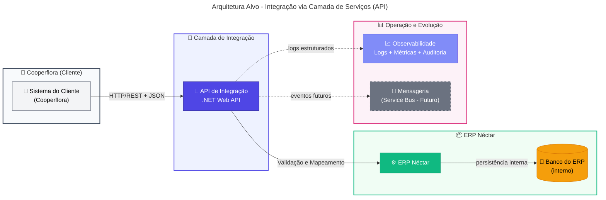
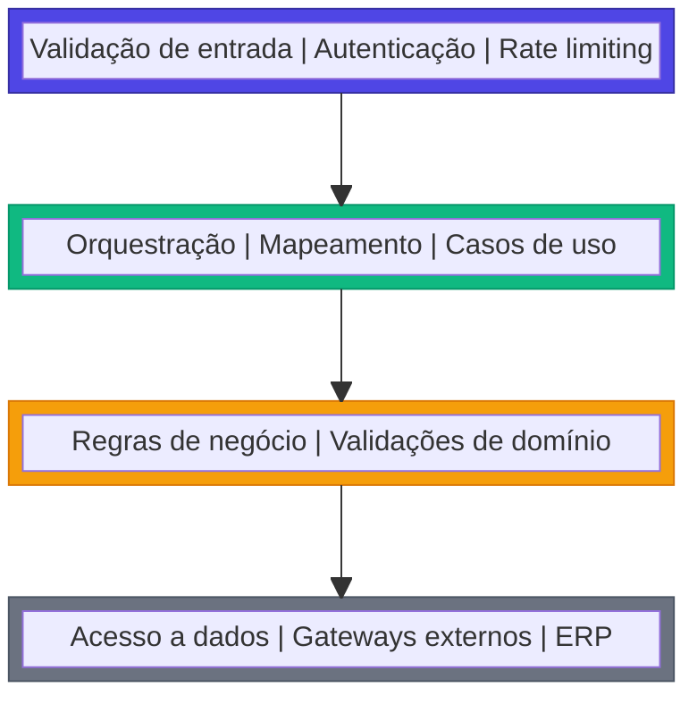
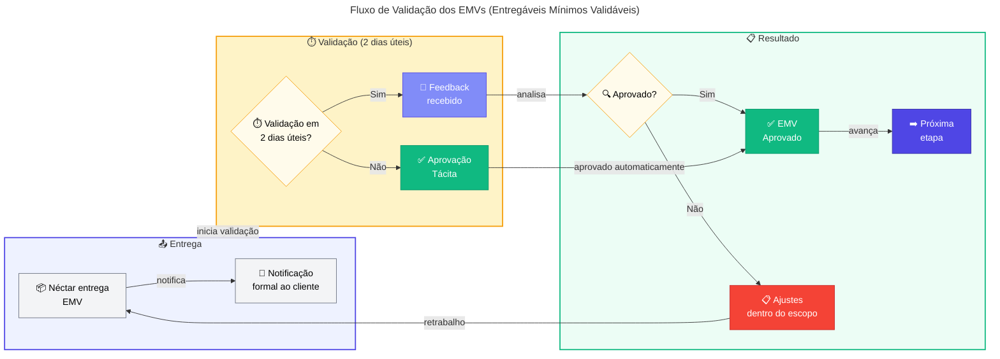

# 🛠️ PARTE III – Fundamentos Técnicos

> 🎯 **Para TDMs**: Esta parte apresenta a arquitetura técnica, princípios e padrões de desenvolvimento. Tempo estimado: 25 minutos.

**Navegação**: [← Voltar ao Índice](./README.md) | [← Visão Executiva](./01-visao-executiva.md) | [Execução do Projeto →](./03-execucao-projeto.md)

---

## 📑 Índice

- [🏗️ Arquitetura e Padrões Técnicos](#️-arquitetura-e-padrões-técnicos)
  - [🟢 Arquitetura alvo](#-arquitetura-alvo)
  - [🔄 Visão geral comparativa](#-visão-geral-comparativa)
- [📜 Princípios arquiteturais](#-princípios-arquiteturais)
  - [💼 Princípios de Negócio (Business)](#-princípios-de-negócio-business)
  - [🗃️ Princípios de Dados (Data)](#️-princípios-de-dados-data)
  - [⚙️ Princípios de Aplicação (Application)](#️-princípios-de-aplicação-application)
  - [💻 Princípios de Tecnologia (Technology)](#-princípios-de-tecnologia-technology)
- [🛠️ Padrões técnicos de integração](#️-padrões-técnicos-de-integração)
  - [📝 Padrão de API e contratos](#-padrão-de-api-e-contratos)
  - [⚠️ Tratamento de erros](#️-tratamento-de-erros)
  - [🔄 Idempotência e reprocessamento](#-idempotência-e-reprocessamento)
  - [🗂️ Propriedade de dados (source of truth)](#️-propriedade-de-dados-source-of-truth)
  - [📡 Evolução para event-driven](#-evolução-para-event-driven)
- [📐 Diretrizes de arquitetura e desenvolvimento](#-diretrizes-de-arquitetura-e-desenvolvimento)
  - [🏛️ Arquitetura em camadas](#️-arquitetura-em-camadas)
  - [🧪 Estratégia de testes](#-estratégia-de-testes)
  - [🚀 DevOps e ambientes](#-devops-e-ambientes)
- [📝 Detalhamento Técnico dos Entregáveis](#-detalhamento-técnico-dos-entregáveis)
- [📦 Entregáveis Mínimos Validáveis (EMV)](#-entregáveis-mínimos-validáveis-emv)
- [📚 Documentos Relacionados](#-documentos-relacionados)

---

## 🏗️ Arquitetura e Padrões Técnicos

### 🟢 Arquitetura alvo

A arquitetura alvo introduz uma **API de Integração (.NET Web API)** como fronteira explícita entre Cooperflora e ERP Néctar, eliminando o banco como mecanismo de integração. O cliente passa a integrar por **HTTP/REST + JSON**, com a API concentrando validação, mapeamento, regras de integração e persistência interna — tudo com **contratos OpenAPI** versionados, idempotência e resiliência (timeouts/retries).

A arquitetura incorpora **observabilidade** (logs estruturados, métricas, correlation-id) e suporta operação híbrida por fluxo (feature flags), permitindo migração incremental com rollback. O princípio central: **a integração não depende de acesso direto ao banco do ERP** e pode operar em cenários segregados/nuvem.



### 🔄 Visão geral comparativa

Esta tabela sintetiza as diferenças entre a arquitetura atual e a arquitetura alvo, destacando os benefícios esperados para cada dimensão.

| Dimensão                                    | Arquitetura Atual                                                                                                                     | Arquitetura Alvo                                                                                                                   | Benefícios Esperados (→ Objetivo)                                                                                                                           |
| ------------------------------------------- | ------------------------------------------------------------------------------------------------------------------------------------- | ---------------------------------------------------------------------------------------------------------------------------------- | ----------------------------------------------------------------------------------------------------------------------------------------------------------- |
| Fronteira de integração e acoplamento       | Banco como interface: dependência direta de schema/tabelas, co-localização e credenciais; mudanças de banco/infra afetam integrações. | API como fronteira: contratos e gateways definidos; banco do ERP permanece interno ao ERP (não é interface externa).               | Reduz acoplamento e risco de ruptura; substitui o "hub" no banco por camada de serviços; habilita operação em cenários segregados/nuvem.                    |
| Mecanismo de execução e orquestração        | Timers/polling no Access/VBA; varredura de "novos" registros; concorrência/duplicidade dependem de convenções e estados em tabelas.   | Integração transacional via REST/JSON; orquestração explícita na API; evolução opcional para assíncrono quando houver ganho claro. | Elimina polling/timers; melhora previsibilidade de execução; controle explícito de concorrência e reprocessamento.                                          |
| Contratos e versionamento                   | Contratos implícitos (colunas/flags/convenções); sem versionamento formal; alto risco de regressão em alterações.                     | OpenAPI como fonte de verdade; versionamento semântico (ex.: `/v1`); taxonomia de erros e validações padronizadas.                 | Elimina ambiguidades e "efeitos colaterais"; habilita testes de contrato automatizados e compatibilidade planejada entre versões.                           |
| Observabilidade e rastreabilidade           | Baixa: rastreio por investigação em Access/SQL, logs esparsos e estados em tabelas; correlação entre etapas é limitada.               | Logs estruturados, correlation-id ponta a ponta, métricas por endpoint/fluxo, dashboards/alertas e auditoria por transação.        | Reduz MTTR; diagnóstico end-to-end via correlation-id; governança operacional com métricas, alertas e trilha de auditoria.                                  |
| Resiliência, idempotência e reprocessamento | Tratamento de falhas "informal": retries manuais/rotinas; risco de duplicidade e inconsistência em reprocessos.                       | Timeouts/retries controlados, idempotência por chave, políticas de erro padronizadas e trilha de reprocessamento auditável.        | Elimina duplicidades e inconsistências; aumenta robustez frente a falhas de rede/ERP; reprocessamento seguro e auditável.                                   |
| Evolução e governança de mudança            | Evolução lenta e arriscada; dependência de especialistas no legado; mudanças no banco podem quebrar integrações sem sinalização.      | Migração incremental (strangler) por fluxo; feature flags e rollback; governança de contrato/escopo e padrões repetíveis.          | Acelera evolução com risco controlado; reduz dependência do legado; centraliza regras em serviços governáveis; viabiliza migração incremental com rollback. |

---

## 📜 Princípios arquiteturais

Os princípios a seguir, organizados conforme o modelo **BDAT** (Business, Data, Application, Technology), orientam todas as decisões técnicas deste projeto. Cada princípio endereça diretamente os problemas da situação atual e sua aderência é **obrigatória** em todas as fases, verificada nos gates de decisão.

Desvios requerem aprovação formal com justificativa documentada e análise de impacto.

### 💼 Princípios de Negócio (Business)

Os princípios de negócio garantem que a modernização preserve a **continuidade operacional** e entregue valor de forma incremental.

| Princípio                    | Descrição                                                           | Justificativa Técnica                                             |
| ---------------------------- | ------------------------------------------------------------------- | ----------------------------------------------------------------- |
| **Continuidade operacional** | A integração deve funcionar sem interrupções durante a modernização | Operação híbrida por fluxo; rollback controlado via feature flags |
| **Evolução incremental**     | Migração fluxo a fluxo (Strangler Pattern), sem "big bang"          | Feature flags; convivência legado/API por fluxo                   |
| **Governança de mudanças**   | Mudanças seguem controle formal com critérios de aceite             | Versionamento de contratos; breaking changes controlados          |

### 🗃️ Princípios de Dados (Data)

Os princípios de dados asseguram **governança clara** sobre quem é dono de cada informação (source of truth).

| Princípio                          | Descrição                                                | Justificativa Técnica                             |
| ---------------------------------- | -------------------------------------------------------- | ------------------------------------------------- |
| **Source of truth definido**       | Cada domínio tem um dono claro (quem é fonte de verdade) | Direção de fluxo explícita; sem dual-write        |
| **Contratos explícitos (OpenAPI)** | Payloads, erros e versões documentados formalmente       | OpenAPI como fonte de verdade; testes de contrato |
| **Rastreabilidade por transação**  | Toda operação é rastreável ponta a ponta                 | Correlation-id propagado; logs estruturados       |

### ⚙️ Princípios de Aplicação (Application)

Os princípios de aplicação definem a estrutura de **desacoplamento e separação de responsabilidades**.

| Princípio                                       | Descrição                                       | Justificativa Técnica                                                   |
| ----------------------------------------------- | ----------------------------------------------- | ----------------------------------------------------------------------- |
| **Desacoplamento (sem acesso direto ao banco)** | Sistema do cliente não depende do schema do ERP | API como fronteira; banco interno ao ERP                                |
| **Separação de responsabilidades**              | UI, regras de integração e domínio separados    | Lógica em serviços testáveis ou stored procedures; legado reduzido a UI |
| **Idempotência e resiliência**                  | Reprocessamentos não corrompem dados            | Chaves de idempotência; retries controlados                             |

### 💻 Princípios de Tecnologia (Technology)

Os princípios de tecnologia garantem que a solução seja **observável, segura e preparável para cenários futuros**.

| Princípio                            | Descrição                                            | Justificativa Técnica                                                    |
| ------------------------------------ | ---------------------------------------------------- | ------------------------------------------------------------------------ |
| **Observabilidade como requisito**   | Tudo que integra deve ser monitorável e auditável    | Logs estruturados; métricas; dashboards/alertas                          |
| **Segurança por design**             | Autenticação, autorização e hardening desde o início | OAuth2/API Key + mTLS (quando aplicável); TLS obrigatório; rate limiting |
| **Preparação para nuvem/segregação** | Integração funciona sem co-localização de banco      | API REST/JSON; sem dependência de rede local                             |

---

## 🛠️ Padrões técnicos de integração

Esta subseção detalha os **padrões técnicos** que operacionalizam os princípios arquiteturais definidos acima. A aderência a esses padrões é verificada nos critérios de aceite de cada fase e nos code reviews.

### 📝 Padrão de API e contratos

| Aspecto           | Padrão Definido                                                                     |
| ----------------- | ----------------------------------------------------------------------------------- |
| **Estilo**        | REST/JSON como protocolo de integração                                              |
| **Contratos**     | OpenAPI/Swagger como fonte de verdade; especificação versionada por fluxo           |
| **Versionamento** | Versão no path (`/v1`, `/v2`); política de compatibilidade e deprecação documentada |
| **Geração**       | Clientes gerados a partir do contrato quando aplicável (SDK, tipos)                 |

### ⚠️ Tratamento de erros

| Código HTTP | Categoria          | Uso                                                      |
| :---------: | ------------------ | -------------------------------------------------------- |
|     4xx     | Erros de validação | Payload inválido, campos obrigatórios, regras de negócio |
|     401     | Autenticação       | Token ausente ou inválido                                |
|     403     | Autorização        | Permissão negada para a operação                         |
|     409     | Conflito           | Violação de idempotência ou estado inconsistente         |
|     503     | Indisponibilidade  | ERP ou dependência fora do ar                            |

**Payload de erro padrão:**

```json
{
  "code": "VALIDATION_ERROR",
  "message": "Descrição legível do erro",
  "details": [{ "field": "campo", "issue": "descrição" }],
  "correlationId": "uuid-da-transacao"
}
```

### 🔄 Idempotência e reprocessamento

| Aspecto           | Padrão                                                                                |
| ----------------- | ------------------------------------------------------------------------------------- |
| **Chave**         | Header `Idempotency-Key` ou chave de negócio + origem (ex.: `pedido-123-cooperflora`) |
| **Comportamento** | Reenvio retorna mesmo resultado sem duplicar efeitos colaterais                       |
| **Auditoria**     | Resultado do reprocessamento registrado com correlation-id                            |
| **Janela**        | Idempotência garantida por período configurável (ex.: 24h)                            |

### 🗂️ Propriedade de dados (source of truth)

| Domínio     | Source of Truth | Direção do Fluxo                       | Observação        |
| ----------- | --------------- | -------------------------------------- | ----------------- |
| Pessoas     | A definir       | Cooperflora → ERP ou ERP → Cooperflora | Validar na Fase 0 |
| Produtos    | A definir       | A definir                              | Validar na Fase 0 |
| Pedidos     | A definir       | A definir                              | Validar na Fase 0 |
| Faturamento | A definir       | A definir                              | Validar na Fase 0 |

> **Regra**: Evitar dual-write. Quando inevitável durante transição, exigir governança explícita e trilha de auditoria.

### 📡 Evolução para event-driven

| Critério para adoção                        | Padrão                             |
| ------------------------------------------- | ---------------------------------- |
| Picos de carga que exigem desacoplamento    | Considerar fila (ex.: Service Bus) |
| Latência tolerável (não crítico tempo-real) | Candidato a assíncrono             |
| Múltiplos consumidores                      | Modelar como evento publicado      |

**Padrões obrigatórios para event-driven:**

- Dead Letter Queue (DLQ) para mensagens não processadas
- Retries com backoff exponencial
- Tratamento de poison messages
- Preservação de correlation-id entre eventos

---

## 📐 Diretrizes de arquitetura e desenvolvimento

### 🏛️ Arquitetura em camadas

A arquitetura em camadas organiza a API de Integração em **quatro níveis de responsabilidade** distintos: API (Controllers), Aplicação (Services), Domínio (Entities) e Infraestrutura (Repositories).



| Diretriz                       | Descrição                                          |
| ------------------------------ | -------------------------------------------------- |
| Validação na borda             | Validar entrada na camada API antes de propagar    |
| Regras de integração testáveis | Lógica em serviços com injeção de dependência      |
| Desacoplamento do ERP          | Acesso ao ERP via gateways/repositórios abstraídos |

### 🧪 Estratégia de testes

| Tipo           | Escopo                           | Ferramenta/Abordagem                    |
| -------------- | -------------------------------- | --------------------------------------- |
| **Unitário**   | Regras de validação e mapeamento | xUnit/NUnit + mocks                     |
| **Integração** | API ↔ ERP (ou mocks controlados) | TestServer + dados de referência        |
| **Contrato**   | Validação do OpenAPI             | Mock server / consumer-driven contracts |
| **E2E**        | Cenários por fluxo               | Auditoria de efeitos + correlation-id   |

### 🚀 DevOps e ambientes

| Ambiente | Propósito                          | Dados                                |
| -------- | ---------------------------------- | ------------------------------------ |
| **DEV**  | Desenvolvimento e testes unitários | Dados sintéticos ou anonimizados     |
| **HML**  | Homologação com stakeholders       | Dados representativos (anonimizados) |
| **PRD**  | Produção                           | Dados reais                          |

**Pipeline CI/CD:**

1. Build + lint
2. Testes unitários
3. Validação de contrato OpenAPI
4. Testes de integração
5. Deploy para ambiente alvo
6. Smoke test pós-deploy

---

## 📝 Detalhamento Técnico dos Entregáveis

| Item de Escopo                                           | Descrição Resumida                                                                                                                                                                                                                                                                                                                                                                                                                                                                                                                                      | Benefícios Esperados (→ Objetivo)                                                                                                         |
| -------------------------------------------------------- | ------------------------------------------------------------------------------------------------------------------------------------------------------------------------------------------------------------------------------------------------------------------------------------------------------------------------------------------------------------------------------------------------------------------------------------------------------------------------------------------------------------------------------------------------------- | ----------------------------------------------------------------------------------------------------------------------------------------- |
| API de Integração (.NET Web API) — fundação técnica      | Implementar a **camada intermediária** responsável por expor endpoints/consumers e centralizar a lógica de integração.<br><br>Inclui (mínimo): estrutura de solução e arquitetura (camadas/limites), validação de entrada, padronização de erros, resiliência (timeouts/retries controlados), health checks, logging estruturado e correlação por transação (correlation-id).<br><br>Integração com o ERP via componentes definidos (ex.: chamadas ao ERP e/ou acesso ao SQL Server do ERP quando aplicável), sem expor o banco como interface externa. | Reduz dependência de co-localização e do banco como "hub", elevando governança e previsibilidade.                                         |
| Contratos OpenAPI — governança e versionamento           | Definir contratos por domínio/fluxo (ex.: pessoas, produtos, pedidos), com **OpenAPI/Swagger** como fonte de verdade.<br><br>Inclui: modelagem de payloads, validações, códigos de retorno, taxonomia de erros, regras de breaking change, estratégia de versionamento (ex.: `/v1`, `/v2`) e requisitos mínimos por fluxo (idempotência, limites e SLAs alvo quando aplicável).<br><br>Artefatos gerados: especificação OpenAPI versionada e checklist de conformidade por endpoint (DoD de contrato).                                                  | Reduz ambiguidades, acelera homologação e viabiliza evolução controlada por versão.                                                       |
| Fluxo piloto end-to-end — "Cadastro de Pessoas"          | Selecionar e implementar um fluxo piloto de alto valor e risco controlado, com execução completa via API.<br><br>Inclui: mapeamento do fluxo no legado (VBA/SQL/SINC), contrato OpenAPI, validações, idempotência, instrumentação (logs/métricas/auditoria), testes (unitário/integração/E2E quando aplicável), e plano de estabilização em produção (janela, métricas de sucesso, rollback).<br><br>Resultado esperado: blueprint repetível para os demais fluxos.                                                                                     | Entrega valor cedo com risco controlado, provando padrões e acelerando a migração por ondas.                                              |
| Operação híbrida por fluxo — roteamento e rollback       | Definir e implementar convivência **por fluxo** (Legado/Híbrido/API), com roteamento explícito e governado.<br><br>Inclui: feature flags por fluxo, critérios de cutover, procedimentos de fallback/rollback, trilha de decisão (quem aprova e quando), e observabilidade comparativa (legado vs API) para detectar desvios.<br><br>Premissa operacional: evitar dual-write e reduzir conflitos com regras claras de propriedade do dado por domínio.                                                                                                   | Mantém continuidade do negócio durante a transição e reduz custo de incidentes em mudanças.                                               |
| Descomissionamento de timers/polling e acessos diretos   | Reduzir progressivamente timers do Access/VBA e rotinas que leem/escrevem direto no SQL do ERP.<br><br>Inclui: inventário e classificação de timers, substituição por chamadas transacionais via API, definição de controles (idempotência/reprocessamento), e roadmap de desligamento com critérios de aceite por fluxo.<br><br>Durante transição, timers remanescentes devem ser tratados como temporários e monitorados (alertas/telemetria).                                                                                                        | Reduz atrasos variáveis, duplicidades e fragilidade por concorrência; aumenta previsibilidade operacional.                                |
| Observabilidade e auditoria por transação                | Implementar capacidade de operação e diagnóstico por fluxo: logs estruturados, métricas (latência, taxa de erro, volume), auditoria por transação e correlação ponta a ponta (correlation-id propagado).<br><br>Inclui: dashboards e alertas operacionais, trilha de reprocessamento e evidências para suporte/auditoria, com visão por ambiente e criticidade.<br><br>Objetivo técnico: reduzir investigação manual em banco/Access e tornar falhas detectáveis rapidamente.                                                                           | Reduz MTTR, melhora governança e dá transparência para gestão e operação.                                                                 |
| Segurança da API — autenticação, autorização e hardening | Definir e implementar autenticação/autorização para consumo da API e padrões de segurança operacional.<br><br>Inclui: mecanismo de auth (ex.: OAuth2, API Key, mTLS conforme restrição), segregação de ambientes/segredos, validação de payload, rate limiting e práticas de hardening de endpoints.<br><br>Também inclui padrões mínimos de acesso a dados internos (princípio do menor privilégio) para reduzir risco de exposição.                                                                                                                   | Reduz risco de exposição e substitui o "acesso ao banco" como mecanismo de integração; habilita cenários com rede/credenciais segregadas. |
| Preparação para evolução event-driven (opcional)         | Planejar (sem implantar obrigatoriamente) a evolução para assíncrono onde fizer sentido.<br><br>Inclui: modelagem de eventos por domínio, critérios para quando usar síncrono vs assíncrono, desenho de padrões (retry, DLQ, idempotência, ordenação), e requisitos para adoção futura de fila (ex.: Service Bus).<br><br>Entregável: guideline técnico e backlog priorizado para evolução, sem desviar do foco do MVP (API + fluxos críticos).                                                                                                         | Evita "becos sem saída" arquiteturais e preserva foco no essencial, mantendo caminho claro para evoluções futuras.                        |

---

## 📦 Entregáveis Mínimos Validáveis (EMV)

Para cada item de escopo, a Néctar produzirá um **Entregável Mínimo Validável (EMV)** que permite à Cooperflora validar e aprovar o item de forma objetiva e imediata.

> **⚠️ Regra de Aprovação Tácita**
>
> A Cooperflora terá **2 (dois) dias úteis** para validar e aprovar cada EMV a partir da data de entrega formal. Após esse prazo:
>
> - O EMV será considerado **automaticamente aprovado** (aprovação tácita)
> - Qualquer solicitação de ajuste posterior será tratada como **mudança de escopo**
> - Mudanças de escopo impactarão **custos e prazos** conforme processo de Change Control

| Item de Escopo                           | Entregável Mínimo Validável (EMV)                                                                 | Critério de Aceite do EMV                                                                     | Fase |
| ---------------------------------------- | ------------------------------------------------------------------------------------------------- | --------------------------------------------------------------------------------------------- | :--: |
| **API de Integração (.NET Web API)**     | Endpoint `/health` funcional em DEV com Swagger, arquitetura em camadas, logging e correlation-id | Health check = 200 OK; Swagger UI acessível; logs com correlation-id; arquitetura documentada |  2   |
| **Contratos OpenAPI**                    | Especificação OpenAPI v1 do fluxo piloto (Pessoas) com payloads, erros e exemplos                 | Especificação válida; payloads documentados; taxonomia de erros; exemplos incluídos           |  1   |
| **Fluxo piloto (Cadastro de Pessoas)**   | Endpoint de cadastro funcional em HML com validação, idempotência, auditoria e testes             | Cadastro cria registro no ERP; reenvio não duplica; auditoria; testes ≥90%                    |  3   |
| **Operação híbrida por fluxo**           | Feature flag do piloto com roteamento Legado/API e rollback testado em HML                        | Flag alterna fluxo; rollback OK em HML; procedimento documentado                              |  3   |
| **Descomissionamento de timers/polling** | Inventário de timers com criticidade e roadmap de desligamento                                    | Lista com descrição, frequência, criticidade; dependências; roadmap com datas                 |  0   |
| **Observabilidade e auditoria**          | Dashboard operacional básico + logs com correlation-id para o piloto                              | Dashboard com métricas; logs por correlation-id; alertas configurados                         |  3   |
| **Segurança da API**                     | Autenticação (API Key/OAuth2) + rate limiting para o piloto                                       | Sem credencial = 401; rate limiting funcional; credenciais segregadas                         |  2   |
| **Preparação event-driven (opcional)**   | Guideline técnico com critérios de adoção, padrões DLQ/retry e backlog de candidatos              | Documento com critérios; padrões definidos; ≥3 candidatos priorizados                         |  4   |

**Fluxo de Validação dos EMVs:**



---

## 📚 Documentos Relacionados

- [01 - Visão Executiva](./01-visao-executiva.md) - Escopo e objetivos
- [03 - Execução do Projeto](./03-execucao-projeto.md) - Fases e cronograma
- [06 - Premissas e Restrições](./06-premissas-restricoes.md) - Premissas específicas por item
- [09 - Glossário](./09-glossario.md) - Termos técnicos

---

<div align="center">

[⬆️ Voltar ao topo](#-parte-ii--fundamentos-técnicos) | [📑 Índice](./README.md) | [Execução do Projeto →](./03-execucao-projeto.md)

</div>
