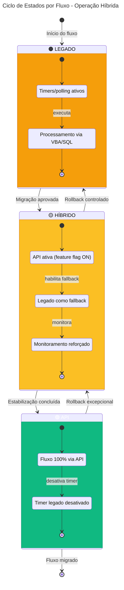
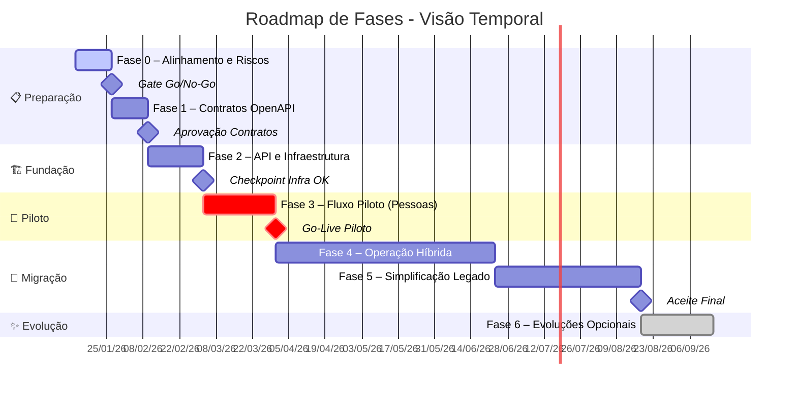

# 📅 PARTE II – Execução do Projeto

> [!NOTE]
> 🎯 **Para BDMs e TDMs**: Esta parte detalha as fases de execução, cronograma e roadmap de migração.  
> ⏱️ **Tempo estimado de leitura:** 20 minutos

📍 <strong>Navegação Rápida</strong>

| Anterior | Índice | Próximo |
|:---------|:------:|--------:|
| [← Fundamentos Técnicos](./02-fundamentos-tecnicos.md) | [📑 Índice](./README.md) | [Gestão do Projeto →](./04-gestao-projeto.md) |

---

## 📑 Índice

- [📅 Fases do Projeto e Cronograma Macro](#-fases-do-projeto-e-cronograma-macro)
- [🔄 Estratégia de modernização: Strangler Pattern](#-estratégia-de-modernização-strangler-pattern)
- [⚖️ Operação híbrida e ciclo de estados](#️-operação-híbrida-e-ciclo-de-estados)
- [🗺️ Visão executiva do roadmap](#️-visão-executiva-do-roadmap)
- [📆 Cronograma macro (referência por semanas)](#-cronograma-macro-referência-por-semanas)
- [0️⃣ Fase 0 – Alinhamento e contenção de riscos](#0️⃣-fase-0--alinhamento-e-contenção-de-riscos-12-semanas)
- [1️⃣ Fase 1 – Definição dos contratos de integração](#1️⃣-fase-1--definição-dos-contratos-de-integração-12-semanas)
- [2️⃣ Fase 2 – Fundação da API](#2️⃣-fase-2--fundação-da-api-23-semanas)
- [3️⃣ Fase 3 – Fluxo Piloto](#3️⃣-fase-3--fluxo-piloto-24-semanas)
- [4️⃣ Fase 4 – Migração por fluxo / Operação híbrida](#4️⃣-fase-4--migração-por-fluxo--operação-híbrida-13-meses)
- [5️⃣ Fase 5 – Simplificação do legado](#5️⃣-fase-5--simplificação-do-legado-12-meses)
- [6️⃣ Fase 6 – Evolução opcional](#6️⃣-fase-6--evolução-opcional-contínuo)
- [📚 Documentos Relacionados](#-documentos-relacionados)

---

## 📅 Fases do Projeto e Cronograma Macro

Esta seção apresenta o **roadmap de execução** do projeto, organizado em 7 fases (Fase 0 a Fase 6), com cronograma estimado, marcos de decisão e critérios de aceite.

Cada fase possui **gates de decisão** que funcionam como checkpoints obrigatórios antes de avançar para a próxima etapa. O modelo incremental permite ajustes de rota com base em aprendizados, sem comprometer as entregas já estabilizadas.

---

## 🔄 Estratégia de modernização: Strangler Pattern

A abordagem adotada é o **Strangler Pattern**, com extração gradual da lógica de integração do legado e introdução de uma camada de serviço moderna. O processo é executado **fluxo a fluxo**, garantindo continuidade operacional e redução de risco.

```mermaid
---
title: Strangler Pattern - Migração Fluxo a Fluxo
---
flowchart LR
    %% ===== DEFINIÇÕES DE ESTILO =====
    classDef primary fill:#4F46E5,stroke:#3730A3,color:#FFFFFF
    classDef secondary fill:#10B981,stroke:#059669,color:#FFFFFF
    classDef datastore fill:#F59E0B,stroke:#D97706,color:#000000
    classDef external fill:#6B7280,stroke:#4B5563,color:#FFFFFF,stroke-dasharray: 5 5
    classDef failed fill:#F44336,stroke:#C62828,color:#FFFFFF
    classDef trigger fill:#818CF8,stroke:#4F46E5,color:#FFFFFF
    classDef decision fill:#FFFBEB,stroke:#F59E0B,color:#000000
    classDef input fill:#F3F4F6,stroke:#6B7280,color:#000000

    %% ===== SUBGRAPH: LEGADO =====
    subgraph legado ["⚠️ ANTES (Legado)"]
        direction LR
        A1["⏱️ Access/VBA<br>Timer"]
        A2["📋 Leitura tabelas<br>'novos dados'"]
        A3["⚙️ Regras de integração<br>no VBA/SQL"]
        A4["💾 Escrita direta<br>no SQL do ERP"]

        A1 -->|"polling"| A2
        A2 -->|"processa"| A3
        A3 -->|"SQL direto"| A4
    end
    style legado fill:#FFF7ED,stroke:#FB923C,stroke-width:2px

    %% ===== SUBGRAPH: MODERNO =====
    subgraph moderno ["✅ DEPOIS (Com API)"]
        direction LR
        B1["📱 Sistema do Cliente<br>ou Access em modo UI"]
        B2["🚀 API de Integração"]
        B3["⚙️ Validação +<br>Mapeamento +<br>Idempotência"]
        B4["📦 ERP Néctar"]

        B1 -->|"HTTP POST/PUT"| B2
        B2 -->|"valida"| B3
        B3 -->|"persiste controlado"| B4
    end
    style moderno fill:#EEF2FF,stroke:#4F46E5,stroke-width:2px

    %% ===== CONEXÃO PRINCIPAL =====
    legado ==>|"Strangler Pattern"| moderno

    %% ===== APLICAÇÃO DE ESTILOS =====
    class A1 trigger
    class A2,A3 datastore
    class A4 failed
    class B1 input
    class B2 primary
    class B3 trigger
    class B4 secondary
```

**Mudança fundamental na direção da integração:**

| Modelo Atual (Legado)                                    | Modelo Alvo (API)                                      |
| -------------------------------------------------------- | ------------------------------------------------------ |
| Access **busca** os dados diretamente nas tabelas do ERP | Sistema do cliente **envia** os dados para a API       |
| Integração disparada por timers (polling)                | Integração transacional (request/response)             |
| Responsabilidade difusa entre sistemas                   | Responsabilidade clara: API é o ponto único de entrada |

**Ciclo de execução por fluxo:**

| Etapa | Ação                                  | Entregável                                      |
| :---: | ------------------------------------- | ----------------------------------------------- |
|   1   | Mapear fluxo e dependências no legado | Diagrama de fluxo + inventário de dependências  |
|   2   | Definir contrato OpenAPI              | Especificação versionada                        |
|   3   | Implementar fluxo na API              | Endpoint com validação, idempotência, auditoria |
|   4   | Roteamento híbrido (legado → API)     | Feature flag ativa + fallback configurado       |
|   5   | Estabilização e desativação do timer  | Métricas OK + timer desligado                   |
|   6   | Repetir para próximo fluxo            | Padrões consolidados                            |

---

## ⚖️ Operação híbrida e ciclo de estados

A convivência é gerenciada **por fluxo**, não por "sistema inteiro". Cada fluxo transita por três estados, com critérios de transição e possibilidade de rollback.

| Estado      | Descrição                                  | Critério de Transição                                 |
| ----------- | ------------------------------------------ | ----------------------------------------------------- |
| **Legado**  | Fluxo operando via timers/polling          | Contrato aprovado + API implementada                  |
| **Híbrido** | API ativa + legado funcional como fallback | Estabilização OK (≥2 semanas sem incidentes críticos) |
| **API**     | Fluxo 100% via API, timer desativado       | Aceite formal + evidência de desativação              |

**Estratégias de rollback:**

- Feature flags por fluxo com roteamento configurável
- Janela de estabilização (ex.: 2 semanas) com monitoramento reforçado
- Reprocessamento via mecanismos de reenvio/replay com idempotência
- Plano de comunicação com critérios de acionamento de rollback

---

## 🗺️ Visão executiva do roadmap

| Fase | Nome                    | Duração Estimada | Marco de Negócio (BDM)                                 | Marco Técnico (TDM)                                    |
| ---: | ----------------------- | :--------------: | ------------------------------------------------------ | ------------------------------------------------------ |
|    0 | Alinhamento e contenção |   1–2 semanas    | Acordo sobre escopo, riscos mapeados                   | Inventário técnico completo, backlog priorizado        |
|    1 | Definição de contratos  |   1–2 semanas    | Contratos aprovados, governança definida               | OpenAPI v1, padrões de integração documentados         |
|    2 | Fundação da API         |   2–3 semanas    | Infraestrutura pronta para piloto                      | API em DEV/HML, pipeline CI/CD, observabilidade básica |
|    3 | Fluxo piloto            |   2–4 semanas    | **Primeiro fluxo em produção**, valor demonstrado      | Piloto estável, padrões validados, lições aprendidas   |
|    4 | Migração por fluxo      |    1–3 meses     | Fluxos críticos migrados, redução de risco operacional | Timers desativados, operação híbrida governada         |
|    5 | Simplificação do legado |    1–2 meses     | Custo de manutenção reduzido, legado estável           | Rotinas de integração removidas, documentação final    |
|    6 | Evolução opcional       |     Contínuo     | Novas capacidades habilitadas (quando justificado)     | Mensageria, eventos, preparação para Nimbus            |

---

## 📆 Cronograma macro (referência por semanas)

### 📊 Visão Detalhada – Diagrama de Gantt

### 📋 Resumo Consolidado de Datas

| Janela (semanas) | Fase   | Dependências  | Gate de Decisão                                                  |
| ---------------: | ------ | ------------- | ---------------------------------------------------------------- |
|              1–2 | Fase 0 | —             | **Go/No-Go**: escopo validado, riscos aceitáveis                 |
|              3–4 | Fase 1 | Fase 0        | **Aprovação**: contratos e governança de mudanças                |
|              5–7 | Fase 2 | Fase 1        | **Checkpoint**: infra pronta, smoke test OK                      |
|             8–11 | Fase 3 | Fase 2        | **Go-Live Piloto**: critérios de estabilização atingidos         |
|            12–24 | Fase 4 | Fase 3        | **Checkpoints por onda**: cada domínio migrado tem aceite formal |
|            20–28 | Fase 5 | Fase 4 (80%+) | **Aceite final**: legado simplificado, operação estável          |
|         Contínuo | Fase 6 | Fase 4/5      | **Por demanda**: aprovação de ROI/valor antes de cada iniciativa |

---

## 0️⃣ Fase 0 – Alinhamento e contenção de riscos (1–2 semanas)

| Aspecto       | Descrição                                                                                        |
| ------------- | ------------------------------------------------------------------------------------------------ |
| **Objetivo**  | Criar base de governança, reduzir riscos imediatos e mapear integralmente dependências do legado |
| **Valor BDM** | Visibilidade de riscos e escopo; decisão informada sobre investimento e prioridades              |
| **Valor TDM** | Inventário técnico completo; base para estimativas e arquitetura                                 |

**Principais atividades**

| Atividade                                              | Responsável         | Entregável                        |
| ------------------------------------------------------ | ------------------- | --------------------------------- |
| Inventário técnico do módulo Access/VBA e rotinas SINC | TDM (Néctar)        | Documento de inventário           |
| Mapeamento de pontos de integração                     | TDM (Néctar)        | Diagrama de fluxos e dependências |
| Matriz de propriedade de dados (source of truth)       | BDM + TDM           | Matriz aprovada por domínio       |
| Requisitos não funcionais e restrições                 | TDM (Néctar + Coop) | Lista de requisitos e restrições  |
| Priorização de fluxos para migração                    | BDM (Cooperflora)   | Backlog priorizado                |

---

## 1️⃣ Fase 1 – Definição dos contratos de integração (1–2 semanas)

| Aspecto       | Descrição                                                                         |
| ------------- | --------------------------------------------------------------------------------- |
| **Objetivo**  | Transformar integrações implícitas em contratos explícitos e governáveis          |
| **Valor BDM** | Redução de ambiguidades; homologação mais rápida; evolução controlada             |
| **Valor TDM** | Contratos como fonte de verdade; base para testes automatizados e compatibilidade |

**Principais atividades**

| Atividade                                     | Responsável         | Entregável                           |
| --------------------------------------------- | ------------------- | ------------------------------------ |
| Definir endpoints e modelos (DTOs) por fluxo  | TDM (Néctar)        | Especificação OpenAPI v1             |
| Padronizar erros (códigos, mensagens, campos) | TDM (Néctar)        | Taxonomia de erros documentada       |
| Definir estratégia de versionamento           | TDM (Néctar)        | Guideline de versionamento           |
| Definir idempotência por fluxo                | TDM (Néctar)        | Documento de padrões de idempotência |
| Definir autenticação/autorização              | TDM (Néctar + Coop) | Requisitos de segurança aprovados    |

---

## 2️⃣ Fase 2 – Fundação da API (2–3 semanas)

| Aspecto       | Descrição                                                                             |
| ------------- | ------------------------------------------------------------------------------------- |
| **Objetivo**  | Disponibilizar a infraestrutura e o esqueleto técnico da API com padrões operacionais |
| **Valor BDM** | Infraestrutura pronta para receber o piloto; redução de risco técnico                 |
| **Valor TDM** | Arquitetura estabelecida; padrões de qualidade definidos; pipeline automatizado       |

**Principais atividades**

| Atividade                                     | Responsável         | Entregável                                 |
| --------------------------------------------- | ------------------- | ------------------------------------------ |
| Estrutura de solução (camadas, DI, validação) | TDM (Néctar)        | Código-fonte da API base                   |
| Logging estruturado e correlação              | TDM (Néctar)        | Padrões de observabilidade implementados   |
| Health checks e métricas                      | TDM (Néctar)        | Endpoints de saúde + métricas expostas     |
| Conectividade segura com ERP                  | TDM (Néctar + Coop) | Conexão validada em DEV/HML                |
| Pipeline CI/CD                                | TDM (Néctar)        | Pipeline funcional com deploy automatizado |
| Configuração de ambientes (DEV/HML/PRD)       | TDM (Néctar + Coop) | Ambientes provisionados e documentados     |

---

## 3️⃣ Fase 3 – Fluxo Piloto (2–4 semanas)

| Aspecto       | Descrição                                                                                |
| ------------- | ---------------------------------------------------------------------------------------- |
| **Objetivo**  | Implementar o primeiro fluxo via API em produção, com governança, rollback e aprendizado |
| **Valor BDM** | **Primeiro valor em produção**; validação da abordagem; redução de risco para escala     |
| **Valor TDM** | Padrões validados em ambiente real; blueprint repetível para demais fluxos               |

> **Recomendação**: O fluxo **Cadastro de Pessoas** é ideal para piloto por ter alto valor, risco controlado e não afetar transações financeiras críticas.

**Principais atividades**

| Atividade                                   | Responsável         | Entregável                                    |
| ------------------------------------------- | ------------------- | --------------------------------------------- |
| Seleção e definição de critérios de sucesso | BDM + TDM           | Critérios de aceite do piloto                 |
| Implementação do fluxo na API               | TDM (Néctar)        | Endpoint funcional com validação/idempotência |
| Ajustes no legado para convivência          | TDM (Néctar)        | Legado adaptado (quando necessário)           |
| Testes de integração e E2E                  | TDM (Néctar + Coop) | Evidências de testes                          |
| Homologação com usuários                    | BDM (Cooperflora)   | Aceite de homologação                         |
| Go-live com janela de estabilização         | TDM + BDM           | Fluxo em produção                             |
| Elaboração de runbook e alertas             | TDM (Néctar)        | Runbook operacional + dashboards              |

---

## 4️⃣ Fase 4 – Migração por fluxo / Operação híbrida (1–3 meses)

| Aspecto       | Descrição                                                                                        |
| ------------- | ------------------------------------------------------------------------------------------------ |
| **Objetivo**  | Escalar migração fluxo a fluxo, mantendo operação contínua e reduzindo progressivamente o legado |
| **Valor BDM** | Fluxos críticos migrados; redução de risco operacional; menor dependência do legado              |
| **Valor TDM** | Timers desativados; operação híbrida governada; padrões consolidados                             |

**Ondas de migração sugeridas**

| Onda | Domínio                 | Fluxos                                 | Prioridade  | Critério de Conclusão                        |
| :--: | ----------------------- | -------------------------------------- | ----------- | -------------------------------------------- |
|  1   | Cadastros (Master Data) | Pessoas (piloto), Produtos, Auxiliares | Alta        | Todos os cadastros via API + timers inativos |
|  2   | Comercial               | Pedidos, Movimentos                    | Média       | Fluxos transacionais via API                 |
|  3   | Fiscal/Faturamento      | Notas, Faturamento                     | Média-Baixa | Compliance validado + auditoria              |
|  4   | Financeiro              | Contas a pagar/receber, Conciliação    | Média-Baixa | Fluxos financeiros via API + auditoria       |
|  5   | Estoque                 | Movimentações, Inventário              | Média-Baixa | Fluxos de estoque via API + timers inativos  |

**Principais atividades**

| Atividade                                 | Responsável  | Entregável                             |
| ----------------------------------------- | ------------ | -------------------------------------- |
| Migração por domínio (backlog priorizado) | TDM (Néctar) | Fluxos implementados por onda          |
| Desativação de timers por fluxo migrado   | TDM (Néctar) | Timers desligados + evidência          |
| Fortalecimento de observabilidade         | TDM (Néctar) | Dashboards e alertas por fluxo         |
| Gestão de mudanças e comunicação por onda | BDM + TDM    | Comunicados + aceite por onda          |
| Atualização da matriz de fluxos           | TDM (Néctar) | Matriz (legado/híbrido/API) atualizada |

---

## 5️⃣ Fase 5 – Simplificação do legado (1–2 meses)

| Aspecto       | Descrição                                                                                      |
| ------------- | ---------------------------------------------------------------------------------------------- |
| **Objetivo**  | Reduzir o módulo Access/VBA ao mínimo necessário, removendo responsabilidades de integração    |
| **Valor BDM** | Custo de manutenção reduzido; menor risco operacional; equipe liberada para outras iniciativas |
| **Valor TDM** | Código legado simplificado; documentação final; menor superfície de suporte                    |

**Responsabilidades do módulo legado após simplificação**

O módulo Access/VBA, após a modernização, **deve** se limitar a:

- Exibir informações ao usuário
- Executar código local (validações de UI)
- Invocar a API de integração quando necessário

O módulo **não deve** mais conter:

- Regras de negócio complexas em eventos de formulário
- Funções longas controlando integração
- Acesso direto ao SQL Server do ERP para integrações
- Timers/polling para sincronização de dados

**Principais atividades**

| Atividade                                              | Responsável  | Entregável                      |
| ------------------------------------------------------ | ------------ | ------------------------------- |
| Remoção de formulários/rotinas de integração obsoletas | TDM (Néctar) | Legado sem código de integração |
| Refatoração do VBA remanescente                        | TDM (Néctar) | Código simplificado             |
| Documentação mínima do legado                          | TDM (Néctar) | Documentação operacional        |
| Ajustes finais de runbooks e alertas                   | TDM (Néctar) | Runbooks atualizados            |
| Treinamento de suporte (se necessário)                 | TDM (Néctar) | Equipe capacitada               |

---

## 6️⃣ Fase 6 – Evolução opcional (contínuo)

| Aspecto       | Descrição                                                                                        |
| ------------- | ------------------------------------------------------------------------------------------------ |
| **Objetivo**  | Evoluir a integração para suportar novos requisitos e maior desacoplamento, conforme necessidade |
| **Valor BDM** | Novas capacidades de negócio habilitadas; preparação para iniciativas estratégicas (ex.: Nimbus) |
| **Valor TDM** | Arquitetura event-driven quando justificado; maior resiliência e escalabilidade                  |

> **Nota**: Esta fase é **opcional** e executada **por demanda**. Cada iniciativa deve ser justificada por ROI/valor de negócio e aprovada em governança antes da execução.

**Possíveis iniciativas**

| Iniciativa                       | Gatilho                                      | Benefício                                     |
| -------------------------------- | -------------------------------------------- | --------------------------------------------- |
| Mensageria (Service Bus)         | Picos de carga ou necessidade de assíncrono  | Desacoplamento; resiliência a falhas          |
| Modelagem de eventos por domínio | Necessidade de integração com novos sistemas | Extensibilidade; consistência eventual        |
| Preparação para Nimbus           | Decisão estratégica de migração              | Roadmap técnico; redução de risco de migração |

---

## 📚 Documentos Relacionados

- [01 - Visão Executiva](./01-visao-executiva.md) - Escopo e objetivos
- [02 - Fundamentos Técnicos](./02-fundamentos-tecnicos.md) - Arquitetura e padrões
- [04 - Gestão do Projeto](./04-gestao-projeto.md) - Governança detalhada
- [05 - Riscos e Mitigações](./05-riscos-mitigacoes.md) - Riscos por fase
- [07 - Investimentos](./07-investimentos.md) - Custos e pagamentos

---

[⬆️ Voltar ao topo](#-parte-ii--execução-do-projeto) | [📑 Índice](./README.md) | [Gestão do Projeto →](./04-gestao-projeto.md)

