# 📊 Gestão do Projeto (Governança, Stakeholders e Controle)

> [!NOTE]
> 🎯 **Para BDMs e TDMs**: Esta seção define a estrutura de governança, papéis, comunicação e controle do projeto.  
> ⏱️ **Tempo estimado de leitura:** 15 minutos

📠<strong>Navegação Rápida</strong>

| Anterior | Índice | Próximo |
|:---------|:------:|--------:|
| [← Execução do Projeto](./03-execucao-projeto.md) | [📑 Índice](./README.md) | [Riscos e Mitigações →](./05-riscos-mitigacoes.md) |

---

## 📑 Índice

- [💼 Stakeholders e Matriz RACI](#-stakeholders-e-matriz-raci)
- [📋 Matriz RACI por Entregável](#-matriz-raci-por-entregável)
- [🏛️ Estrutura de Governança e Fóruns de Decisão](#️-estrutura-de-governança-e-fóruns-de-decisão)
  - [🏛️ Nível Estratégico: Comitê Executivo](#️-nível-estratégico-comitê-executivo-steering-committee)
  - [⚙️ Nível Tático: Comitê de Projeto](#️-nível-tático-comitê-de-projeto)
  - [🎹 Nível Operacional: Cerimônias Ágeis](#-nível-operacional-cerimônias-ágeis)
- [🔄 Gestão de Mudanças (Change Control)](#-gestão-de-mudanças-change-control)
  - [📝 Processo de Change Request](#-processo-de-change-request)
  - [🚨 Critérios para Escalação ao Comitê Executivo](#-critérios-para-escalação-ao-comitê-executivo)
- [📣 Plano de Comunicação](#-plano-de-comunicação)
- [🏆 Critérios de Sucesso do Projeto](#-critérios-de-sucesso-do-projeto)
- [📚 Documentos Relacionados](#-documentos-relacionados)

---

## 💼 Stakeholders e Matriz RACI

A identificação clara dos stakeholders e seus papéis é fundamental para comunicação eficaz e tomada de decisão.

| Stakeholder              | Organização | Papel no Projeto                                          | Interesse Principal                                        |
| ------------------------ | ----------- | --------------------------------------------------------- | ---------------------------------------------------------- |
| **Sponsor Executivo**    | Cooperflora | Patrocinador; aprova investimento e decisões estratégicas | ROI, continuidade do negócio, redução de riscos            |
| **Gerente de Projeto**   | Néctar      | Coordena execução, reporta progresso, gerencia riscos     | Entregas no prazo, qualidade, satisfação do cliente        |
| **Product Owner (PO)**   | Cooperflora | Define prioridades, aceita entregas, representa o negócio | Valor entregue, aderência às necessidades operacionais     |
| **Arquiteto de Solução** | Néctar      | Define padrões técnicos, valida decisões de arquitetura   | Qualidade técnica, aderência aos princípios arquiteturais  |
| **Dev Team**             | Néctar      | Implementa, testa, documenta e entrega os componentes     | Viabilidade técnica, qualidade de código, sustentabilidade |
| **TI Cooperflora**       | Cooperflora | Infraestrutura, acessos, integrações do lado cliente      | Segurança, conformidade, impacto mínimo em outros sistemas |
| **Áreas de Negócio**     | Cooperflora | Cadastro, Comercial, Fiscal/Financeiro — usuários finais  | Continuidade operacional, usabilidade, correção funcional  |

---

## 📋 Matriz RACI por Entregável

A matriz define as responsabilidades para cada entregável do projeto:

|  Código  | Papel           | Descrição                                                 |
| :------: | --------------- | --------------------------------------------------------- |
| **🔴 R** | **Responsible** | Executa a tarefa — quem "põe a mão na massa"              |
| **🟢 A** | **Accountable** | Aprova e responde pelo resultado — apenas **1 por linha** |
| **🟡 C** | **Consulted**   | Consultado antes da execução — comunicação bidirecional   |
| **🔵 I** | **Informed**    | Informado após conclusão — comunicação unidirecional      |

| Entregável / Decisão                 | 👔 Sponsor |  📊 GP   |  🎯 PO   |  🏗️ Arq  |  💻 Dev  | 🖥️ TI Coop |
| ------------------------------------ | :--------: | :------: | :------: | :------: | :------: | :--------: |
| Aprovação de escopo e baseline       |  🟢 **A**  | 🔴 **R** |   🟡 C   |   🟡 C   |   🔵 I   |    🟡 C    |
| Validação de EMVs (2 dias úteis)     |    🔵 I    | 🔴 **R** | 🟢 **A** |   🟡 C   |   🔵 I   |    🟡 C    |
| Definição de contratos OpenAPI       |    🔵 I    |   🟡 C   | 🟢 **A** | 🔴 **R** |   🟡 C   |    🟡 C    |
| Implementação de fluxos              |    🔵 I    |   🟡 C   | 🟢 **A** |   🟡 C   | 🔴 **R** |    🔵 I    |
| Decisões de arquitetura              |    🔵 I    |   🟡 C   |   🟡 C   | 🟢 **A** | 🔴 **R** |    🔵 I    |
| Aprovação de go-live por fluxo       |  🟢 **A**  | 🔴 **R** |   🟡 C   |   🟡 C   |   🟡 C   |    🟡 C    |
| Gestão de mudanças (change requests) |  🟢 **A**  | 🔴 **R** |   🟡 C   |   🟡 C   |   🔵 I   |    🟡 C    |
| Monitoramento e alertas              |    🔵 I    |   🔵 I   |   🔵 I   |   🟡 C   | 🔴 **R** |  🟢 **A**  |
| Rollback e gestão de incidentes      |    🔵 I    |   🟡 C   | 🟢 **A** |   🟡 C   | 🔴 **R** |    🟡 C    |

**Resumo de responsabilidades por papel:**

| Papel                 | Total R | Total A | Foco Principal                                      |
| --------------------- | :-----: | :-----: | --------------------------------------------------- |
| 👔 Sponsor            |    0    |    3    | Aprovações estratégicas (escopo, go-live, mudanças) |
| 📊 Gerente de Projeto |    5    |    0    | Execução e coordenação operacional                  |
| 🎯 Product Owner      |    0    |    4    | Aprovação de entregas e decisões de negócio         |
| 🏗️ Arquiteto          |    1    |    1    | Padrões técnicos e contratos                        |
| 💻 Dev Team           |    3    |    0    | Implementação técnica                               |
| 🖥️ TI Cooperflora     |    0    |    1    | Infraestrutura e monitoramento                      |

---

## 🏛️ Estrutura de Governança e Fóruns de Decisão

A governança do projeto é organizada em três níveis:

### 🏛️ Nível Estratégico: Comitê Executivo (Steering Committee)

| Aspecto           | Definição                                                                                              |
| ----------------- | ------------------------------------------------------------------------------------------------------ |
| **Objetivo**      | Decisões estratégicas, aprovação de mudanças de escopo/prazo/custo, resolução de impedimentos críticos |
| **Participantes** | Sponsor Executivo, Gerente de Projeto, PO, Arquiteto (quando necessário)                               |
| **Frequência**    | Mensal ou sob demanda para decisões urgentes                                                           |
| **Artefatos**     | Ata de reunião, registro de decisões, atualização de riscos estratégicos                               |

### ⚙️ Nível Tático: Comitê de Projeto

| Aspecto           | Definição                                                                                        |
| ----------------- | ------------------------------------------------------------------------------------------------ |
| **Objetivo**      | Acompanhamento de progresso, gestão de riscos, priorização de backlog, coordenação entre equipes |
| **Participantes** | Gerente de Projeto, PO, Arquiteto, Dev Sênior                                                    |
| **Frequência**    | Semanal                                                                                          |
| **Artefatos**     | Status report, burndown/burnup, registro de riscos e issues, backlog atualizado                  |

### 🎹 Nível Operacional: Cerimônias Ágeis

| Cerimônia           | Objetivo                                            | Participantes              | Frequência       |
| ------------------- | --------------------------------------------------- | -------------------------- | ---------------- |
| **Daily Standup**   | Sincronização da equipe, identificação de bloqueios | Dev Team                   | Diária (15 min)  |
| **Sprint Planning** | Planejamento da iteração, compromisso de entrega    | PO, Dev Team, Arquiteto    | Início de sprint |
| **Sprint Review**   | Demonstração de entregas, feedback do PO            | PO, Dev Team, Stakeholders | Fim de sprint    |
| **Retrospectiva**   | Melhoria contínua do processo                       | Dev Team, Arquiteto        | Fim de sprint    |

---

## 🔄 Gestão de Mudanças (Change Control)

O processo de controle de mudanças garante que alterações sejam avaliadas, aprovadas e implementadas de forma controlada.

### 📝 Processo de Change Request

```mermaid
---
title: Processo de Change Request (Controle de Mudanças)
---
flowchart LR
    %% ===== DEFINIÇÕES DE ESTILO =====
    classDef primary fill:#4F46E5,stroke:#3730A3,color:#FFFFFF
    classDef secondary fill:#10B981,stroke:#059669,color:#FFFFFF
    classDef datastore fill:#F59E0B,stroke:#D97706,color:#000000
    classDef external fill:#6B7280,stroke:#4B5563,color:#FFFFFF,stroke-dasharray: 5 5
    classDef failed fill:#F44336,stroke:#C62828,color:#FFFFFF
    classDef trigger fill:#818CF8,stroke:#4F46E5,color:#FFFFFF
    classDef decision fill:#FFFBEB,stroke:#F59E0B,color:#000000
    classDef input fill:#F3F4F6,stroke:#6B7280,color:#000000

    %% ===== SUBGRAPH: SOLICITAÇÃO =====
    subgraph solicitacao ["📥 Solicitação"]
        direction LR
        A["📝 Solicitação<br>de Mudança"]
        B["📊 Análise<br>de Impacto"]
        A -->|"submete"| B
    end
    style solicitacao fill:#EEF2FF,stroke:#4F46E5,stroke-width:2px

    %% ===== SUBGRAPH: TRIAGEM =====
    subgraph triagem ["🔀 Triagem"]
        direction LR
        C{"🔍 Impacto<br>Significativo?"}
        D["👥 Comitê<br>Executivo"]
        E["👤 Gerente<br>de Projeto"]
        C -->|"Sim"| D
        C -->|"Não"| E
    end
    style triagem fill:#FEF3C7,stroke:#F59E0B,stroke-width:2px

    %% ===== SUBGRAPH: DECISÃO =====
    subgraph decisao ["⚖️ Decisão"]
        direction LR
        F{"✅ Aprovado?"}
        H["❌ Registrar<br>Decisão"]
        F -->|"Não"| H
    end
    style decisao fill:#FEE2E2,stroke:#F44336,stroke-width:2px

    %% ===== SUBGRAPH: EXECUÇÃO =====
    subgraph execucao ["🚀 Execução"]
        direction LR
        G["📋 Atualizar<br>Baseline"]
        I["🚀 Implementar"]
        G -->|"inicia"| I
    end
    style execucao fill:#ECFDF5,stroke:#10B981,stroke-width:2px

    %% ===== CONEXÕES ENTRE SUBGRAPHS =====
    solicitacao -->|"analisa"| triagem
    D -->|"decide"| F
    E -->|"decide"| F
    F -->|"Sim"| execucao

    %% ===== APLICAÇÃO DE ESTILOS =====
    class A input
    class B trigger
    class C,F decision
    class D,E primary
    class G secondary
    class H failed
    class I primary
```

| Etapa                   | Responsável                    | Prazo Alvo                | Artefato                                        |
| ----------------------- | ------------------------------ | ------------------------- | ----------------------------------------------- |
| Registro da solicitação | Qualquer stakeholder           | Imediato                  | Formulário de Change Request                    |
| Análise de impacto      | Gerente de Projeto + Arquiteto | 2-5 dias úteis            | Documento de impacto (escopo/prazo/custo/risco) |
| Decisão                 | Comitê apropriado              | Próxima reunião ou ad-hoc | Ata com decisão documentada                     |
| Atualização de baseline | Gerente de Projeto             | 2 dias úteis              | Plano de projeto atualizado                     |
| Comunicação             | Gerente de Projeto             | Imediato                  | Comunicado aos stakeholders afetados            |

### 🚨 Critérios para Escalação ao Comitê Executivo

- Impacto em prazo superior a **2 semanas**
- Impacto em custo superior a **10% do orçamento** da fase
- Mudança em **princípios arquiteturais** ou decisões estratégicas
- Adição de **novos fluxos** não previstos no escopo original
- Conflitos entre stakeholders que não podem ser resolvidos no nível tático

---

## 📣 Plano de Comunicação

| Comunicação                           | Público-Alvo                 | Canal               | Frequência        | Responsável        |
| ------------------------------------- | ---------------------------- | ------------------- | ----------------- | ------------------ |
| **Status Report Executivo**           | Sponsor, Gestão Cooperflora  | E-mail + Reunião    | Mensal            | Gerente de Projeto |
| **Status Report Semanal**             | Comitê de Projeto            | E-mail + Teams/Meet | Semanal           | Gerente de Projeto |
| **Comunicado de Release**             | Todos os stakeholders        | E-mail              | Por release       | Gerente de Projeto |
| **Entrega de EMV (aprovação tácita)** | PO, TI Cooperflora           | E-mail formal       | Por EMV           | Gerente de Projeto |
| **Alerta de Risco/Issue Crítico**     | Sponsor, PO, Gerente         | E-mail + Telefone   | Imediato (ad-hoc) | Gerente de Projeto |
| **Documentação Técnica**              | Dev Team, Arquitetura, TI    | Wiki/Repositório    | Contínuo          | Tech Lead          |
| **Ata de Reunião**                    | Participantes da reunião     | E-mail              | Após cada reunião | Organizador        |
| **Relatório de Incidentes**           | PO, Operação, TI Cooperflora | E-mail + Ticket     | Por incidente     | Operação           |

---

## 🏆 Critérios de Sucesso do Projeto

Os critérios abaixo definem como o sucesso do projeto será medido:

| Critério                             | Meta                                             | Medição                                      |
| ------------------------------------ | ------------------------------------------------ | -------------------------------------------- |
| **Fluxos migrados para API**         | 100% dos fluxos críticos em escopo               | Contagem de fluxos em estado "API" vs total  |
| **Disponibilidade da integração**    | ≥ 99,5% no horário comercial                     | Monitoramento de uptime                      |
| **Taxa de erro em produção**         | < 1% por fluxo após estabilização                | Métricas de erro por endpoint                |
| **Tempo de resposta (p95)**          | < 2 segundos para operações síncronas            | APM / métricas de latência                   |
| **Incidentes críticos pós-migração** | Zero incidentes P1 causados pela nova integração | Registro de incidentes                       |
| **Satisfação do cliente (PO)**       | Aceite formal de todas as entregas               | Termo de aceite por fase                     |
| **EMVs aprovados no prazo**          | ≥ 80% dos EMVs validados em 2 dias úteis         | Contagem de aprovações vs aprovações tácitas |
| **Aderência ao cronograma**          | Desvio máximo de 15% em relação ao baseline      | Comparativo planejado vs realizado           |
| **Aderência ao orçamento**           | Desvio máximo de 10% em relação ao baseline      | Comparativo planejado vs realizado           |

---

## 📚 Documentos Relacionados

- [01 - Visão Executiva](./01-visao-executiva.md) - Escopo e objetivos
- [03 - Execução do Projeto](./03-execucao-projeto.md) - Fases e cronograma
- [05 - Riscos e Mitigações](./05-riscos-mitigacoes.md) - Registro de riscos
- [06 - Premissas e Restrições](./06-premissas-restricoes.md) - Premissas e limitações

---

[⬆️ Voltar ao topo](#-gestão-do-projeto-governança-stakeholders-e-controle) | [📑 Índice](./README.md) | [Riscos e Mitigações →](./05-riscos-mitigacoes.md)

