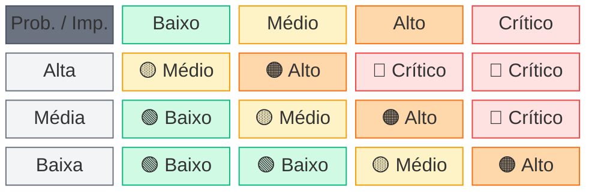

# ⚠️ Riscos (RAID) e Mitigações

> [!NOTE]
> 🎯 **Para BDMs e TDMs**: Esta seção apresenta o registro de riscos, matriz de severidade, planos de contingência e KPIs de monitoramento.  
> ⏱️ **Tempo estimado de leitura:** 10 minutos

📍 <strong>Navegação Rápida</strong>

| Anterior                                      |          Índice          |                                                  Próximo |
| :-------------------------------------------- | :----------------------: | -------------------------------------------------------: |
| [← Gestão do Projeto](./04-gestao-projeto.md) | [📑 Índice](./README.md) | [Premissas e Restrições →](./06-premissas-restricoes.md) |

---

## 📑 Índice

- [📋 Visão Geral](#-visão-geral)
- [🎯 Legenda de Severidade](#-legenda-de-severidade)
- [📝 Registro de Riscos](#-registro-de-riscos)
- [🎯 Matriz de Severidade](#-matriz-de-severidade)
- [🚨 Plano de Contingência para Riscos Críticos](#-plano-de-contingência-para-riscos-críticos)
- [📊 KPIs de Monitoramento do Projeto](#-kpis-de-monitoramento-do-projeto)
- [📋 Riscos por Fase](#-riscos-por-fase)
  - [Fase 0 – Alinhamento e Contenção](#fase-0--alinhamento-e-contenção)
  - [Fase 1 – Definição de Contratos](#fase-1--definição-de-contratos)
  - [Fase 2 – Fundação da API](#fase-2--fundação-da-api)
  - [Fase 3 – Fluxo Piloto](#fase-3--fluxo-piloto)
  - [Fase 4 – Migração por Fluxo](#fase-4--migração-por-fluxo)
  - [Fase 5 – Simplificação do Legado](#fase-5--simplificação-do-legado)
- [📚 Documentos Relacionados](#-documentos-relacionados)

---

## 📋 Visão Geral

O gerenciamento de riscos é contínuo ao longo do projeto. Esta seção apresenta o registro inicial de **Riscos, Ações, Issues e Decisões (RAID)**, que será atualizado nas reuniões semanais do Comitê de Projeto.

---

## 🎯 Legenda de Severidade

A matriz de riscos segue a escala: **Probabilidade** (Baixa/Média/Alta) × **Impacto** (Baixo/Médio/Alto/Crítico):

|   Severidade   | Descrição                                        | Ação Requerida                                           |
| :------------: | ------------------------------------------------ | -------------------------------------------------------- |
| 🔴 **Crítico** | Alta probabilidade × Impacto alto/crítico        | Monitoramento semanal; plano de contingência obrigatório |
|  🟠 **Alto**   | Probabilidade média-alta × Impacto significativo | Acompanhamento quinzenal; mitigação ativa                |
|  🟡 **Médio**  | Probabilidade média × Impacto moderado           | Monitoramento mensal; tratamento quando materializado    |
|  🟢 **Baixo**  | Baixa probabilidade ou impacto controlável       | Revisão periódica; sem ação imediata                     |

---

## 📝 Registro de Riscos

|  ID | Risco                                                         | Probabilidade | Impacto |   Severidade   | Mitigação                                                                            | Responsável        | Status |
| --: | ------------------------------------------------------------- | :-----------: | :-----: | :------------: | ------------------------------------------------------------------------------------ | ------------------ | :----: |
| R01 | Dependências ocultas no legado (VBA/SQL) não documentadas     |     Alta      |  Alto   | 🔴 **Crítico** | Inventário e engenharia reversa na Fase 0; validação com operação                    | Arquiteto          | Aberto |
| R02 | Inconsistência de dados durante operação híbrida              |     Média     |  Alto   |  🟠 **Alto**   | Definir source of truth por domínio; idempotência obrigatória; auditoria comparativa | Tech Lead          | Aberto |
| R03 | Atrasos em homologação por indisponibilidade do negócio       |     Alta      |  Médio  |  🟠 **Alto**   | Cronograma com buffers; janelas pré-acordadas; escalação ao Sponsor se necessário    | Gerente de Projeto | Aberto |
| R04 | Scope creep e priorização instável                            |     Média     |  Alto   |  🟠 **Alto**   | Baseline de escopo; processo de change control; governança formal                    | Gerente de Projeto | Aberto |
| R05 | Comportamento do legado diverge do esperado em produção       |     Média     |  Alto   |  🟠 **Alto**   | Testes E2E extensivos; piloto com monitoramento intensivo; rollback preparado        | Tech Lead          | Aberto |
| R06 | Indisponibilidade de ambiente ou acessos                      |     Média     |  Médio  |  🟡 **Médio**  | Solicitar acessos antecipadamente; ambientes de DEV/HML independentes                | TI Cooperflora     | Aberto |
| R07 | Falhas de comunicação entre equipes                           |     Baixa     |  Médio  |  🟢 **Baixo**  | Plano de comunicação; cerimônias regulares; canais definidos                         | Gerente de Projeto | Aberto |
| R08 | Resistência à mudança por parte dos usuários                  |     Média     |  Médio  |  🟡 **Médio**  | Envolvimento do PO; demonstrações frequentes; treinamento antes do go-live           | PO                 | Aberto |
| R09 | Performance da API inferior ao legado em cenários específicos |     Baixa     |  Alto   |  🟡 **Médio**  | Testes de carga; otimização; cache quando aplicável; métricas de baseline            | Arquiteto          | Aberto |
| R10 | Mudanças no ERP Néctar durante o projeto                      |     Baixa     | Crítico |  🟠 **Alto**   | Comunicação prévia obrigatória; versionamento de contratos; testes de regressão      | Arquiteto          | Aberto |

> [!WARNING]
> **📊 Distribuição de Severidade (R01–R10)**: 🔴 1 Crítico (10%) | 🟠 5 Altos (50%) | 🟡 3 Médios (30%) | 🟢 1 Baixo (10%)

---

## 🎯 Matriz de Severidade

A matriz abaixo ilustra como a combinação de **Probabilidade** e **Impacto** determina a **Severidade**:

> [!TIP]
> **📋 Resumo Visual de Severidade**
>
> | Severidade  | Emoji |    Cor    | Probabilidade × Impacto                       | Ação Requerida                                           |
> | :---------: | :---: | :-------: | :-------------------------------------------- | :------------------------------------------------------- |
> | **Crítico** |  🔴   | `#EF4444` | Alta × Alto/Crítico ou Média × Crítico        | Monitoramento semanal; plano de contingência obrigatório |
> |  **Alto**   |  🟠   | `#F97316` | Alta × Médio, Média × Alto ou Baixa × Crítico | Acompanhamento quinzenal; mitigação ativa                |
> |  **Médio**  |  🟡   | `#F59E0B` | Alta × Baixo, Média × Médio ou Baixa × Alto   | Monitoramento mensal; tratamento quando materializado    |
> |  **Baixo**  |  🟢   | `#10B981` | Média × Baixo ou Baixa × Baixo/Médio          | Revisão periódica; sem ação imediata                     |

---

## 🚨 Plano de Contingência para Riscos Críticos

| Risco | Gatilho de Ativação                               | Plano de Contingência                                                 |
| ----- | ------------------------------------------------- | --------------------------------------------------------------------- |
| R01   | Descoberta de dependência não mapeada em produção | Rollback imediato do fluxo; análise RCA; replanejar migração          |
| R02   | Divergência de dados detectada entre sistemas     | Pausar migração do fluxo; reconciliação manual; correção e re-teste   |
| R05   | Falha crítica em produção pós-migração            | Ativar rollback via feature flag; restaurar fluxo legado; análise RCA |
| R10   | Mudança no ERP quebra contrato existente          | Versionar contrato; manter versão anterior; migração gradual          |

---

## 📊 KPIs de Monitoramento do Projeto

Além dos critérios de sucesso, os seguintes KPIs serão monitorados continuamente:

| KPI                               | Meta                       | Frequência de Medição | Responsável        |
| --------------------------------- | -------------------------- | --------------------- | ------------------ |
| Percentual de fluxos migrados     | Conforme roadmap por fase  | Semanal               | Gerente de Projeto |
| Taxa de erro por fluxo e ambiente | < 1% após estabilização    | Diária                | Operação           |
| Latência p95 por endpoint         | < 2s (síncrono)            | Contínua (APM)        | Operação           |
| Taxa de timeout                   | < 0,1%                     | Contínua              | Operação           |
| Incidentes por mês (P1/P2/P3)     | 0 P1, < 2 P2               | Mensal                | Operação           |
| MTTR (tempo médio de recuperação) | < 1h para P1, < 4h para P2 | Por incidente         | Operação           |
| Burndown/Burnup do sprint         | Tendência estável          | Semanal               | Tech Lead          |
| Desvio de cronograma              | < 15% do baseline          | Semanal               | Gerente de Projeto |
| EMVs com aprovação tácita         | < 20% do total de EMVs     | Por fase              | Gerente de Projeto |

---

## 📋 Riscos por Fase

### Fase 0 – Alinhamento e Contenção

| Risco                                    | Probabilidade | Impacto |   Severidade   | Mitigação                                              |
| ---------------------------------------- | :-----------: | :-----: | :------------: | ------------------------------------------------------ |
| Dependências ocultas no VBA/SQL          |     Alta      |  Alto   | 🔴 **Crítico** | Sessões de engenharia reversa + validação com operação |
| Escopo difuso ou expansão não controlada |     Média     |  Alto   |  🟠 **Alto**   | Baseline de escopo formal + controle de mudanças       |

### Fase 1 – Definição de Contratos

| Risco                             | Probabilidade | Impacto |  Severidade  | Mitigação                                          |
| --------------------------------- | :-----------: | :-----: | :----------: | -------------------------------------------------- |
| Contratos mal definidos           |     Média     |  Alto   | 🟠 **Alto**  | Workshops com exemplos reais + validação com dados |
| Mudanças frequentes nos contratos |     Média     |  Médio  | 🟡 **Médio** | Governança de breaking changes + compatibilidade   |

### Fase 2 – Fundação da API

| Risco                                 | Probabilidade | Impacto | Severidade  | Mitigação                                         |
| ------------------------------------- | :-----------: | :-----: | :---------: | ------------------------------------------------- |
| Atraso em provisão de ambientes/infra |     Média     |  Alto   | 🟠 **Alto** | Iniciar setup em paralelo com Fase 1              |
| Falhas de conectividade com ERP       |     Média     |  Alto   | 🟠 **Alto** | Testes antecipados + alinhamento de rede/firewall |

### Fase 3 – Fluxo Piloto

| Risco                               | Probabilidade | Impacto |  Severidade  | Mitigação                                             |
| ----------------------------------- | :-----------: | :-----: | :----------: | ----------------------------------------------------- |
| Incidentes em produção              |     Média     |  Alto   | 🟠 **Alto**  | Rollout progressivo + feature flags + rollback rápido |
| Divergência de dados entre sistemas |     Média     |  Alto   | 🟠 **Alto**  | Auditoria por transação + reprocessamento idempotente |
| Resistência do usuário              |     Baixa     |  Médio  | 🟢 **Baixo** | Comunicação antecipada + acompanhamento pós-go-live   |

### Fase 4 – Migração por Fluxo

| Risco                                  | Probabilidade | Impacto |  Severidade  | Mitigação                                            |
| -------------------------------------- | :-----------: | :-----: | :----------: | ---------------------------------------------------- |
| Volume/complexidade maior que estimado |     Média     |  Médio  | 🟡 **Médio** | Decomposição do backlog + buffers no cronograma      |
| Fadiga operacional                     |     Média     |  Médio  | 🟡 **Médio** | Cadência de migração com janelas + comunicação clara |
| Regressões em fluxos já migrados       |     Baixa     |  Alto   | 🟡 **Médio** | Testes de regressão + monitoramento contínuo         |

### Fase 5 – Simplificação do Legado

| Risco                                   | Probabilidade | Impacto |  Severidade  | Mitigação                                      |
| --------------------------------------- | :-----------: | :-----: | :----------: | ---------------------------------------------- |
| Dependências remanescentes não mapeadas |     Baixa     |  Alto   | 🟡 **Médio** | Checklist por fluxo antes de remover rotinas   |
| Perda de conhecimento institucional     |     Média     |  Médio  | 🟡 **Médio** | Documentação mínima + sessões de transferência |

---

## 📚 Documentos Relacionados

- [01 - Visão Executiva](./01-visao-executiva.md) - Top 5 riscos
- [03 - Execução do Projeto](./03-execucao-projeto.md) - Fases e cronograma
- [04 - Gestão do Projeto](./04-gestao-projeto.md) - Governança e escalação
- [06 - Premissas e Restrições](./06-premissas-restricoes.md) - Premissas e limitações

---

[⬆️ Voltar ao topo](#️-riscos-raid-e-mitigações) | [📑 Índice](./README.md) | [Premissas e Restrições →](./06-premissas-restricoes.md)

