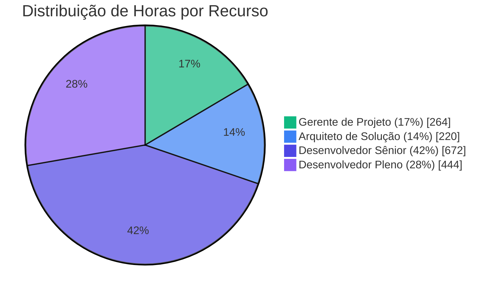
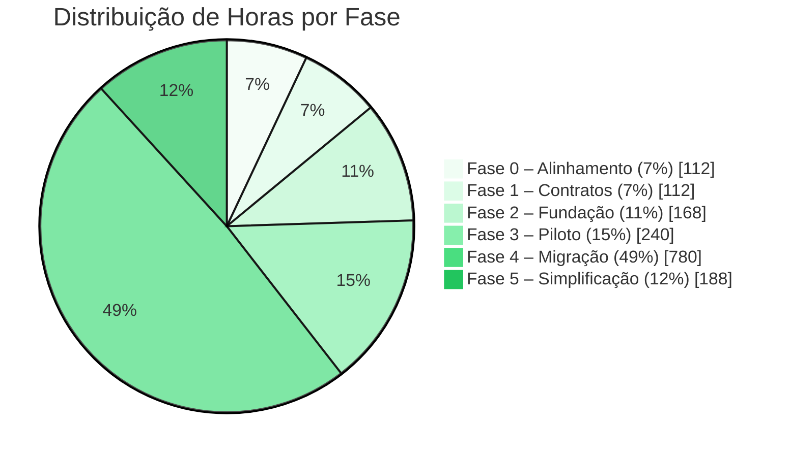
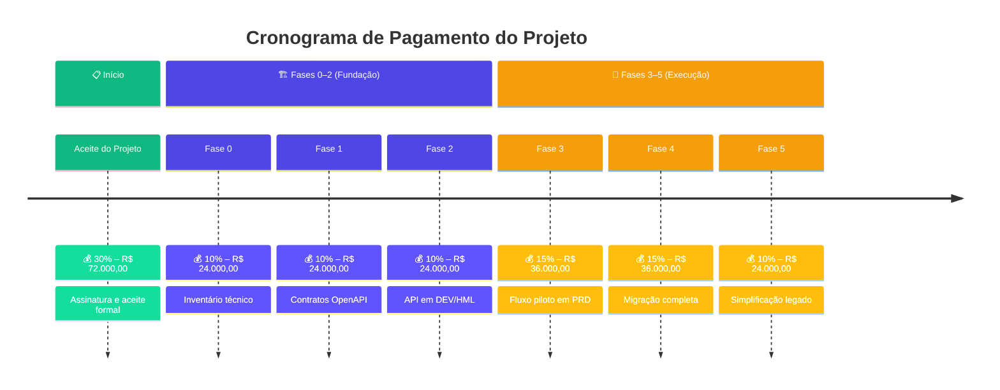
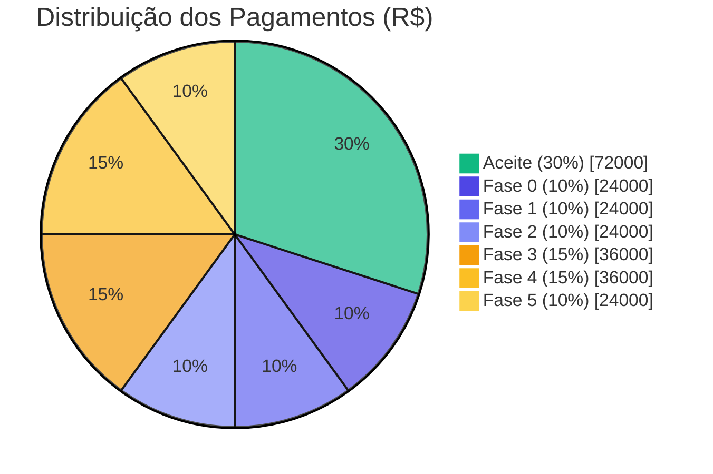

# 💰 Investimentos do Projeto

> 🎯 **Para BDMs**: Esta seção apresenta o detalhamento das estimativas de horas, custos e cronograma de pagamento. Tempo estimado: 15 minutos.

**Navegação**: [← Voltar ao Índice](./README.md) | [← Premissas e Restrições](./06-premissas-restricoes.md) | [Operação e Suporte →](./08-operacao-suporte.md)

---

## 📑 Índice

- [📊 Detalhamento da Estimativa de Horas](#-detalhamento-da-estimativa-de-horas)
  - [🎯 Metodologia de Estimativa](#-metodologia-de-estimativa)
  - [📋 Fase 0 – Alinhamento e Contenção de Riscos (2 semanas)](#-fase-0--alinhamento-e-contenção-de-riscos-2-semanas)
  - [📝 Fase 1 – Definição dos Contratos de Integração (2 semanas)](#-fase-1--definição-dos-contratos-de-integração-2-semanas)
  - [🏗️ Fase 2 – Fundação da API (3 semanas)](#️-fase-2--fundação-da-api-3-semanas)
  - [🚀 Fase 3 – Fluxo Piloto (4 semanas)](#-fase-3--fluxo-piloto-4-semanas)
  - [🔄 Fase 4 – Migração por Fluxo (12 semanas)](#-fase-4--migração-por-fluxo-12-semanas)
  - [🧹 Fase 5 – Simplificação do Legado (5 semanas)](#-fase-5--simplificação-do-legado-5-semanas)
  - [📊 Consolidação da Estimativa de Horas](#-consolidação-da-estimativa-de-horas)
- [🔍 Premissas da Estimativa](#-premissas-da-estimativa)
- [💰 Estimativa de Investimentos do Projeto](#-estimativa-de-investimentos-do-projeto)
  - [👥 Composição do Time Néctar](#-composição-do-time-néctar)
  - [📊 Cálculo do Custo por Recurso](#-cálculo-do-custo-por-recurso)
  - [💵 Resumo Financeiro](#-resumo-financeiro)
  - [📈 Distribuição de Investimentos por Fase](#-distribuição-de-investimentos-por-fase)
  - [💳 Cronograma de Pagamento](#-cronograma-de-pagamento)
- [📚 Documentos Relacionados](#-documentos-relacionados)

---

## 📊 Detalhamento da Estimativa de Horas

Esta seção apresenta a **fundamentação técnica** da estimativa de esforço para o projeto, elaborada pelos recursos da Néctar com base na experiência em projetos similares de modernização e integração.

### 🎯 Metodologia de Estimativa

A estimativa foi construída utilizando a técnica de **decomposição por atividades (WBS)**, combinada com **estimativas de três pontos** (otimista, mais provável, pessimista) para atividades de maior incerteza.

| Critério                   | Descrição                                               |
| :------------------------- | :------------------------------------------------------ |
| **Técnica**                | Work Breakdown Structure (WBS) + Estimativa Paramétrica |
| **Base de referência**     | Projetos anteriores de modernização de legado Néctar    |
| **Fator de complexidade**  | 1.2x (integração com VBA/Access + convivência híbrida)  |
| **Buffer de contingência** | 15–20% recomendado (não incluído na estimativa base)    |

---

### 📋 Fase 0 – Alinhamento e Contenção de Riscos (2 semanas)

**Objetivo:** Criar base de governança, mapear dependências e reduzir riscos imediatos.

| Atividade                                      |      Responsável       |    Horas | Justificativa                            |
| :--------------------------------------------- | :--------------------: | -------: | :--------------------------------------- |
| Kick-off e alinhamento com stakeholders        |        GP + Arq        |       8h | Reuniões iniciais + preparação           |
| Inventário técnico do módulo Access/VBA        | Dev Sênior + Dev Pleno |      24h | Análise de código legado (~3.000 LOC)    |
| Inventário de rotinas SINC                     |       Dev Sênior       |      16h | Mapeamento de jobs e dependências        |
| Mapeamento de pontos de integração             |    Arq + Dev Sênior    |      16h | Diagramas C4 + documentação              |
| Análise de tabelas compartilhadas (SQL Server) | Dev Sênior + Dev Pleno |      16h | Schema, triggers, constraints            |
| Matriz de propriedade de dados                 |        GP + Arq        |       8h | Definição de source of truth por domínio |
| Requisitos não funcionais e restrições         |          Arq           |       8h | SLAs, volumetria, janelas de manutenção  |
| Priorização de fluxos (backlog)                |           GP           |       8h | Critérios MoSCoW + riscos                |
| Documentação e revisão                         |           GP           |       8h | Consolidação de artefatos Fase 0         |
| **Subtotal Fase 0**                            |                        | **112h** |                                          |

**Distribuição por recurso (Fase 0):**

| Recurso              | Horas | % da Fase |
| :------------------- | ----: | --------: |
| Gerente de Projeto   |   24h |       21% |
| Arquiteto de Solução |   32h |       29% |
| Desenvolvedor Sênior |   40h |       36% |
| Desenvolvedor Pleno  |   16h |       14% |

---

### 📝 Fase 1 – Definição dos Contratos de Integração (2 semanas)

**Objetivo:** Transformar integrações implícitas em contratos explícitos e governáveis.

| Atividade                                       |      Responsável       |    Horas | Justificativa                          |
| :---------------------------------------------- | :--------------------: | -------: | :------------------------------------- |
| Workshop de levantamento de regras de negócio   |        GP + Arq        |      12h | 3 sessões de 4h com PO Cooperflora     |
| Modelagem de domínios e entidades               |    Arq + Dev Sênior    |      16h | DTOs, agregados, limites de contexto   |
| Definição de endpoints (fluxo piloto – Pessoas) |    Arq + Dev Sênior    |      12h | CRUD + operações específicas           |
| Especificação OpenAPI v1                        | Dev Sênior + Dev Pleno |      24h | Payloads, validações, exemplos         |
| Taxonomia de erros padronizada                  |          Arq           |       8h | Códigos, mensagens, campos de erro     |
| Política de versionamento                       |          Arq           |       4h | Estratégia /v1, /v2, breaking changes  |
| Definição de idempotência por operação          |    Arq + Dev Sênior    |       8h | Chaves naturais, deduplicação          |
| Requisitos de autenticação/autorização          |        Arq + GP        |       8h | OAuth2 / API Key – decisão com cliente |
| Validação e aprovação dos contratos             |           GP           |       8h | Apresentação + coleta de aceite        |
| Documentação e revisão                          |    GP + Dev Sênior     |      12h | Consolidação de artefatos Fase 1       |
| **Subtotal Fase 1**                             |                        | **112h** |                                        |

**Distribuição por recurso (Fase 1):**

| Recurso              | Horas | % da Fase |
| :------------------- | ----: | --------: |
| Gerente de Projeto   |   28h |       25% |
| Arquiteto de Solução |   40h |       36% |
| Desenvolvedor Sênior |   32h |       29% |
| Desenvolvedor Pleno  |   12h |       11% |

---

### 🏗️ Fase 2 – Fundação da API (3 semanas)

**Objetivo:** Disponibilizar infraestrutura e esqueleto técnico da API com padrões operacionais.

| Atividade                                     |      Responsável       |    Horas | Justificativa                              |
| :-------------------------------------------- | :--------------------: | -------: | :----------------------------------------- |
| Setup de solução .NET (estrutura de projetos) |       Dev Sênior       |       8h | Camadas, DI, organização de código         |
| Implementação de arquitetura base             |    Arq + Dev Sênior    |      24h | Middleware, validação, tratamento de erros |
| Logging estruturado + correlation-id          | Dev Sênior + Dev Pleno |      16h | Serilog/Seq + propagação de contexto       |
| Health checks e métricas                      |       Dev Sênior       |       8h | /health, /ready, métricas Prometheus       |
| Integração com ERP Néctar (conectividade)     | Dev Sênior + Dev Pleno |      24h | Componentes SDK, connection pooling        |
| Swagger/OpenAPI setup                         |       Dev Pleno        |       8h | Documentação auto-gerada                   |
| Pipeline CI/CD                                | Dev Sênior + Dev Pleno |      16h | Build, test, deploy automatizado           |
| Configuração de ambientes (DEV/HML)           |       Dev Sênior       |      12h | Variáveis, secrets, configurações          |
| Testes de conectividade e smoke tests         | Dev Sênior + Dev Pleno |      16h | Validação ponta a ponta                    |
| Code review e ajustes de arquitetura          |          Arq           |      12h | Revisão de padrões e boas práticas         |
| Documentação técnica da fundação              |       Dev Sênior       |       8h | ADRs, README, guias de contribuição        |
| Coordenação e acompanhamento                  |           GP           |      16h | Dailies, gestão de impedimentos            |
| **Subtotal Fase 2**                           |                        | **168h** |                                            |

**Distribuição por recurso (Fase 2):**

| Recurso              | Horas | % da Fase |
| :------------------- | ----: | --------: |
| Gerente de Projeto   |   16h |       10% |
| Arquiteto de Solução |   36h |       21% |
| Desenvolvedor Sênior |   68h |       40% |
| Desenvolvedor Pleno  |   48h |       29% |

---

### 🚀 Fase 3 – Fluxo Piloto (4 semanas)

**Objetivo:** Implementar o primeiro fluxo via API em produção, validando padrões e processos.

| Atividade                                    |      Responsável       |    Horas | Justificativa                          |
| :------------------------------------------- | :--------------------: | -------: | :------------------------------------- |
| Análise detalhada do fluxo Pessoas no legado | Dev Sênior + Dev Pleno |      24h | Mapeamento de regras, edge cases       |
| Implementação de endpoints (CRUD Pessoas)    | Dev Sênior + Dev Pleno |      48h | Controllers, services, repositories    |
| Validações de negócio                        |       Dev Sênior       |      16h | FluentValidation, regras complexas     |
| Idempotência e deduplicação                  |       Dev Sênior       |      12h | Mecanismo de chaves únicas             |
| Auditoria por transação                      |       Dev Pleno        |      12h | Log de operações, rastreabilidade      |
| Testes unitários                             |       Dev Pleno        |      24h | xUnit, cobertura ≥90%                  |
| Testes de integração                         | Dev Sênior + Dev Pleno |      20h | TestContainers, cenários E2E           |
| Implementação de feature flag                |       Dev Sênior       |       8h | Roteamento Legado/API                  |
| Ajustes no legado para convivência           | Dev Sênior + Dev Pleno |      16h | Adaptações mínimas no Access/VBA       |
| Homologação com usuários                     |    GP + Dev Sênior     |      16h | Sessões de validação                   |
| Runbook operacional                          |       Dev Sênior       |       8h | Procedimentos de operação              |
| Dashboards e alertas                         |       Dev Pleno        |      12h | Grafana/Application Insights           |
| Go-live piloto + estabilização               |    GP + Dev Sênior     |      16h | Acompanhamento das 2 primeiras semanas |
| Documentação de lições aprendidas            |           GP           |       8h | Retrospectiva e ajustes de processo    |
| **Subtotal Fase 3**                          |                        | **240h** |                                        |

**Distribuição por recurso (Fase 3):**

| Recurso              | Horas | % da Fase |
| :------------------- | ----: | --------: |
| Gerente de Projeto   |   40h |       17% |
| Arquiteto de Solução |   16h |        7% |
| Desenvolvedor Sênior |  112h |       47% |
| Desenvolvedor Pleno  |   72h |       30% |

---

### 🔄 Fase 4 – Migração por Fluxo (12 semanas)

**Objetivo:** Escalar a migração para os demais fluxos críticos, mantendo operação híbrida governada.

> **Nota:** A estimativa considera a migração de **5 fluxos adicionais** além do piloto, com complexidade variada. O esforço médio por fluxo é de ~120h, considerando reuso de padrões da Fase 3.

| Atividade                              |      Responsável       |    Horas | Justificativa                   |
| :------------------------------------- | :--------------------: | -------: | :------------------------------ |
| **Fluxo 2 – Produtos**                 |                        |          |                                 |
| › Análise e mapeamento                 |       Dev Sênior       |      16h | Catálogo, categorias, atributos |
| › Implementação                        | Dev Sênior + Dev Pleno |      56h | Endpoints + validações          |
| › Testes e homologação                 |     Dev Pleno + GP     |      32h | Unitários, integração, aceite   |
| **Fluxo 3 – Pedidos**                  |                        |          |                                 |
| › Análise e mapeamento                 |       Dev Sênior       |      20h | Fluxo complexo, estados, regras |
| › Implementação                        | Dev Sênior + Dev Pleno |      72h | Endpoints + validações + saga   |
| › Testes e homologação                 |     Dev Pleno + GP     |      40h | Cenários de negócio variados    |
| **Fluxo 4 – Faturamento**              |                        |          |                                 |
| › Análise e mapeamento                 |       Dev Sênior       |      16h | NF-e, integrações fiscais       |
| › Implementação                        | Dev Sênior + Dev Pleno |      56h | Endpoints + validações          |
| › Testes e homologação                 |     Dev Pleno + GP     |      32h | Cenários fiscais críticos       |
| **Fluxo 5 – Financeiro (Contas)**      |                        |          |                                 |
| › Análise e mapeamento                 |       Dev Sênior       |      16h | A pagar, a receber, conciliação |
| › Implementação                        | Dev Sênior + Dev Pleno |      56h | Endpoints + validações          |
| › Testes e homologação                 |     Dev Pleno + GP     |      32h | Integração contábil             |
| **Fluxo 6 – Estoque**                  |                        |          |                                 |
| › Análise e mapeamento                 |       Dev Sênior       |      12h | Movimentações, inventário       |
| › Implementação                        | Dev Sênior + Dev Pleno |      48h | Endpoints + validações          |
| › Testes e homologação                 |     Dev Pleno + GP     |      24h | Cenários de movimentação        |
| **Atividades transversais**            |                        |          |                                 |
| Gestão de feature flags (5 fluxos)     |       Dev Sênior       |      20h | Configuração por fluxo          |
| Monitoramento e ajustes de performance | Dev Sênior + Dev Pleno |      40h | Otimizações, índices, cache     |
| Coordenação e acompanhamento           |           GP           |      96h | Gestão contínua (~8h/sem)       |
| Revisões de arquitetura                |          Arq           |      48h | Validação de padrões (~4h/sem)  |
| Documentação contínua                  |       Dev Pleno        |      24h | Atualização de specs e runbooks |
| Checkpoints por onda (3 ondas)         |        GP + Arq        |      24h | Apresentações e aceites         |
| **Subtotal Fase 4**                    |                        | **780h** |                                 |

**Distribuição por recurso (Fase 4):**

| Recurso              | Horas | % da Fase |
| :------------------- | ----: | --------: |
| Gerente de Projeto   |  120h |       15% |
| Arquiteto de Solução |   72h |        9% |
| Desenvolvedor Sênior |  340h |       44% |
| Desenvolvedor Pleno  |  248h |       32% |

---

### 🧹 Fase 5 – Simplificação do Legado (5 semanas)

**Objetivo:** Descomissionar rotinas de integração legadas e consolidar documentação final.

| Atividade                         |      Responsável       |    Horas | Justificativa                     |
| :-------------------------------- | :--------------------: | -------: | :-------------------------------- |
| Inventário final de timers ativos |       Dev Sênior       |       8h | Validação do que foi migrado      |
| Desativação de timers (por fluxo) | Dev Sênior + Dev Pleno |      24h | 6 fluxos × 4h (com validação)     |
| Remoção de código VBA obsoleto    |       Dev Pleno        |      16h | Limpeza de rotinas não utilizadas |
| Ajustes em tabelas de staging     |       Dev Sênior       |      12h | Remoção de tabelas temporárias    |
| Validação de integridade de dados | Dev Sênior + Dev Pleno |      24h | Reconciliação final               |
| Monitoramento pós-desativação     |       Dev Sênior       |      16h | 2 semanas de observação           |
| Documentação de arquitetura final |    Arq + Dev Sênior    |      24h | Diagramas C4 atualizados          |
| Runbooks de operação consolidados |       Dev Sênior       |      12h | Procedimentos unificados          |
| Guia de troubleshooting           | Dev Sênior + Dev Pleno |      16h | FAQ técnico + scripts             |
| Handover para operação            |    GP + Dev Sênior     |      16h | Sessões de transferência          |
| Relatório de encerramento         |           GP           |      12h | Métricas, lições, recomendações   |
| Aceite final e encerramento       |           GP           |       8h | Apresentação executiva            |
| **Subtotal Fase 5**               |                        | **188h** |                                   |

**Distribuição por recurso (Fase 5):**

| Recurso              | Horas | % da Fase |
| :------------------- | ----: | --------: |
| Gerente de Projeto   |   36h |       19% |
| Arquiteto de Solução |   24h |       13% |
| Desenvolvedor Sênior |   80h |       43% |
| Desenvolvedor Pleno  |   48h |       26% |

---

### 📊 Consolidação da Estimativa de Horas

#### Por Fase

| Fase | Nome                    |  Duração   | Horas Estimadas | % do Total |
| ---: | :---------------------- | :--------: | --------------: | ---------: |
|    0 | Alinhamento e contenção |   2 sem    |            112h |         7% |
|    1 | Definição de contratos  |   2 sem    |            112h |         7% |
|    2 | Fundação da API         |   3 sem    |            168h |        11% |
|    3 | Fluxo piloto            |   4 sem    |            240h |        15% |
|    4 | Migração por fluxo      |   12 sem   |            780h |        49% |
|    5 | Simplificação do legado |   5 sem    |            188h |        12% |
|      | **TOTAL**               | **28 sem** |      **1.600h** |   **100%** |

#### Por Recurso (Total do Projeto)

| Recurso              |   Fase 0 |   Fase 1 |   Fase 2 |   Fase 3 |   Fase 4 |   Fase 5 |  **Total** |    **%** |
| :------------------- | -------: | -------: | -------: | -------: | -------: | -------: | ---------: | -------: |
| Gerente de Projeto   |      24h |      28h |      16h |      40h |     120h |      36h |   **264h** |      17% |
| Arquiteto de Solução |      32h |      40h |      36h |      16h |      72h |      24h |   **220h** |      14% |
| Desenvolvedor Sênior |      40h |      32h |      68h |     112h |     340h |      80h |   **672h** |      42% |
| Desenvolvedor Pleno  |      16h |      12h |      48h |      72h |     248h |      48h |   **444h** |      28% |
| **TOTAL**            | **112h** | **112h** | **168h** | **240h** | **780h** | **188h** | **1.600h** | **100%** |

---

## 🔍 Premissas da Estimativa

| ID  | Premissa                                               | Impacto se Falsa                    |
| :-: | :----------------------------------------------------- | :---------------------------------- |
| E01 | Código legado VBA está acessível e documentável        | +20% em Fase 0                      |
| E02 | Schema do SQL Server está estabilizado (sem mudanças)  | Retrabalho em mapeamentos           |
| E03 | Cooperflora fornece SME para workshops em até 48h      | Atraso em Fase 1                    |
| E04 | Ambientes DEV/HML disponíveis até início da Fase 2     | Bloqueio de desenvolvimento         |
| E05 | Fluxos de migração são independentes (sem acoplamento) | +30% em Fase 4 se acoplados         |
| E06 | Não há mudanças funcionais durante a migração          | Escopo adicional via Change Control |

### ⚠️ Riscos que Podem Afetar a Estimativa

| Risco                                        | Probabilidade | Impacto (Horas) | Mitigação                   |
| :------------------------------------------- | :-----------: | --------------: | :-------------------------- |
| Descoberta de regras não documentadas no VBA |     Alta      |    +80h a +160h | Buffer de 15% recomendado   |
| Fluxos mais complexos que o esperado         |     Média     |  +40h por fluxo | Reavaliação por onda        |
| Indisponibilidade de SMEs do cliente         |     Média     |  +20h em espera | Acordar agenda na Fase 0    |
| Problemas de performance em produção         |     Baixa     |            +40h | Testes de carga antecipados |

---

## 💰 Estimativa de Investimentos do Projeto

Esta seção apresenta a **estimativa de custos** do projeto, derivada diretamente do [Detalhamento da Estimativa de Horas](#📊-detalhamento-da-estimativa-de-horas).

### 👥 Composição do Time Néctar

| Recurso                  | Papel no Projeto                                                  | Horas Estimadas | Justificativa da Alocação                                                      |
| ------------------------ | ----------------------------------------------------------------- | :-------------: | ------------------------------------------------------------------------------ |
| **Gerente de Projeto**   | Coordenação, gestão de riscos, comunicação com stakeholders       |      264h       | Atuação transversal em todas as fases; maior intensidade em gates e cerimônias |
| **Arquiteto de Solução** | Definição de padrões, validação de arquitetura, decisões técnicas |      220h       | Forte atuação nas Fases 0–3; suporte consultivo nas Fases 4–5                  |
| **Desenvolvedor Sênior** | Implementação de endpoints, testes, documentação técnica          |      672h       | Principal executor das entregas técnicas (42% do esforço total)                |
| **Desenvolvedor Pleno**  | Implementação, testes unitários, suporte ao Sênior                |      444h       | Trabalha em par com o Sênior nas implementações                                |

### 📊 Cálculo do Custo por Recurso

**Premissas de cálculo:**

- **Total de horas estimadas (bottom-up):** 1.600 horas
- **Duração do projeto (Fases 0–5):** 28 semanas
- **Valor hora (todos os recursos):** R$ 150,00

| Recurso                  | Horas Estimadas | Valor Hora (R$) | Investimento Total (R$) |
| ------------------------ | :-------------: | :-------------: | ----------------------: |
| **Gerente de Projeto**   |       264       |     150,00      |               39.600,00 |
| **Arquiteto de Solução** |       220       |     150,00      |               33.000,00 |
| **Desenvolvedor Sênior** |       672       |     150,00      |              100.800,00 |
| **Desenvolvedor Pleno**  |       444       |     150,00      |               66.600,00 |
| **TOTAL**                |    **1.600**    |        —        |          **240.000,00** |

### 💵 Resumo Financeiro

| Descrição                                     |        Valor (R$) |
| --------------------------------------------- | ----------------: |
| **Total de Horas Estimadas**                  |   **1.600 horas** |
| **Investimento Total de Recursos Néctar**     | **R$ 240.000,00** |
| **Investimento Médio por Semana**             |       R$ 8.571,43 |
| **Investimento Médio por Mês (4,33 semanas)** |      R$ 37.114,29 |

### 📈 Distribuição de Investimentos por Fase

| Fase | Nome                    | Duração (sem) |   Horas   | % do Custo | Investimento Estimado (R$) |
| ---: | ----------------------- | :-----------: | :-------: | :--------: | -------------------------: |
|    0 | Alinhamento e contenção |       2       |    112    |     7%     |                  16.800,00 |
|    1 | Definição de contratos  |       2       |    112    |     7%     |                  16.800,00 |
|    2 | Fundação da API         |       3       |    168    |    11%     |                  25.200,00 |
|    3 | Fluxo piloto            |       4       |    240    |    15%     |                  36.000,00 |
|    4 | Migração por fluxo      |      12       |    780    |    49%     |                 117.000,00 |
|    5 | Simplificação do legado |       5       |    188    |    12%     |                  28.200,00 |
|      | **TOTAL**               |    **28**     | **1.600** |  **100%**  |          **R$ 240.000,00** |

### 💳 Cronograma de Pagamento

O pagamento do projeto será realizado conforme o fluxo abaixo, vinculado aos marcos de entrega de cada fase:

| Evento de Pagamento                            | % do Total |     Valor (R$) | Condição de Faturamento                                   |
| ---------------------------------------------- | :--------: | -------------: | --------------------------------------------------------- |
| 📋 **Aceite do Projeto**                       |    30%     |      72.000,00 | Imediatamente após assinatura do contrato e aceite formal |
| 🔍 **Conclusão Fase 0** (Alinhamento)          |    10%     |      24.000,00 | Entrega do inventário técnico e backlog priorizado        |
| 📝 **Conclusão Fase 1** (Contratos)            |    10%     |      24.000,00 | Contratos OpenAPI aprovados e governança definida         |
| 🏗️ **Conclusão Fase 2** (Fundação API)         |    10%     |      24.000,00 | API em DEV/HML com pipeline CI/CD funcional               |
| 🚀 **Conclusão Fase 3** (Fluxo Piloto)         |    15%     |      36.000,00 | Primeiro fluxo em produção com critérios de estabilização |
| 🔄 **Conclusão Fase 4** (Migração por Fluxo)   |    15%     |      36.000,00 | Fluxos críticos migrados e operação híbrida governada     |
| ✅ **Conclusão Fase 5** (Simplificação Legado) |    10%     |      24.000,00 | Rotinas de integração removidas e documentação final      |
| 💰 **TOTAL**                                   |  **100%**  | **240.000,00** |                                                           |

#### 📋 Condições Gerais de Pagamento

1. **Prazo de pagamento:** 10 dias úteis após emissão da Nota Fiscal correspondente ao marco.

2. **Faturamento:** A Néctar emitirá a NF após validação formal do marco pela Cooperflora (aceite do EMV correspondente ou aprovação tácita após 2 dias úteis).

3. **Primeiro pagamento (30%):** Devido imediatamente após o aceite formal do projeto, independente do início da execução.

4. **Pagamentos subsequentes:** Condicionados à conclusão e aceite dos critérios de cada fase, conforme definido na seção [Fases do Projeto](./03-execucao-projeto.md).

5. **Atrasos por parte do cliente:** Caso haja atraso na validação de entregas ou fornecimento de insumos pela Cooperflora que impacte o cronograma, os pagamentos seguirão o calendário original, não sendo postergados.

### ⚠️ Observações Importantes

1. **Fase 6 (Evolução opcional)** não está incluída nesta estimativa por ser executada sob demanda, com escopo e custos a serem definidos caso a caso.

2. **Contingência não incluída:** Recomenda-se reserva de 15–20% para contingências, o que elevaria o investimento total para aproximadamente **R$ 276.000,00 a R$ 288.000,00**.

3. **Investimentos não contemplados:**
   - Licenciamento de ferramentas (APM, Service Bus, etc.) — responsabilidade da Cooperflora conforme premissas
   - Infraestrutura de ambientes (DEV/HML/PRD)
   - Eventuais horas extras ou alocação emergencial

4. **Valores válidos para o escopo definido:** Mudanças de escopo podem impactar custos conforme processo de Change Control.

> **📋 Resumo Executivo de Investimento**
>
> | Métrica                    | Valor                 |
> | -------------------------- | --------------------- |
> | **Investimento Total**     | **R$ 240.000,00**     |
> | **Duração**                | 28 semanas (~7 meses) |
> | **Valor Hora Base**        | R$ 150,00             |
> | **Recursos Alocados**      | 4 profissionais       |
> | **Total de Horas**         | 1.600 horas           |
> | **Com Contingência (15%)** | R$ 276.000,00         |
> | **Com Contingência (20%)** | R$ 288.000,00         |

---

## 📚 Documentos Relacionados

| Documento                                            | Descrição                       |
| ---------------------------------------------------- | ------------------------------- |
| [Premissas e Restrições](./06-premissas-restricoes.md) | Premissas e restrições completas |
| [Execução do Projeto](./03-execucao-projeto.md)      | Fases e cronograma detalhado    |
| [Gestão do Projeto](./04-gestao-projeto.md)          | Governança e controle           |
| [Riscos e Mitigações](./05-riscos-mitigacoes.md)     | Registro RAID                   |

---

[⬆️ Voltar ao topo](#-investimentos-do-projeto) | [← Voltar ao Índice](./README.md) | [Operação e Suporte →](./08-operacao-suporte.md)
