# 💰 Investimentos do Projeto

> [!NOTE]
> 🎯 **Para BDMs**: Esta seção apresenta o detalhamento das estimativas de horas, custos e cronograma de pagamento.  
> ⏱️ **Tempo estimado de leitura:** 15 minutos

📠<strong>Navegação Rápida</strong>

| Anterior | Índice | Próximo |
|:---------|:------:|--------:|
| [← Premissas e Restrições](./06-premissas-restricoes.md) | [📑 Índice](./README.md) | [Operação e Suporte →](./08-operacao-suporte.md) |

---

## 📑 Índice

### 📊 Estimativas de Horas

- [Detalhamento da Estimativa de Horas](#-detalhamento-da-estimativa-de-horas)
  - [Metodologia de Estimativa](#-metodologia-de-estimativa)
  - [Fase 0 – Alinhamento e Contenção de Riscos](#-fase-0--alinhamento-e-contenção-de-riscos-2-semanas)
  - [Fase 1 – Definição dos Contratos de Integração](#-fase-1--definição-dos-contratos-de-integração-2-semanas)
  - [Fase 2 – Fundação da API](#️-fase-2--fundação-da-api-3-semanas)
  - [Fase 3 – Fluxo Piloto](#-fase-3--fluxo-piloto-4-semanas)
  - [Fase 4 – Migração por Fluxo](#-fase-4--migração-por-fluxo-12-semanas)
  - [Fase 5 – Simplificação do Legado](#-fase-5--simplificação-do-legado-5-semanas)
  - [Consolidação da Estimativa de Horas](#-consolidação-da-estimativa-de-horas)
- [Premissas da Estimativa](#-premissas-da-estimativa)

### 💰 Custos e Pagamentos

- [Estimativa de Investimentos do Projeto](#-estimativa-de-investimentos-do-projeto)
  - [Composição do Time Néctar](#-composição-do-time-néctar)
  - [Cálculo do Custo por Recurso](#-cálculo-do-custo-por-recurso)
  - [Resumo Financeiro](#-resumo-financeiro)
  - [Distribuição de Investimentos por Fase](#-distribuição-de-investimentos-por-fase)
  - [Cronograma de Pagamento](#-cronograma-de-pagamento)

### 📚 Referências

- [Documentos Relacionados](#-documentos-relacionados)

---

> [!IMPORTANT]
>
> ## 📋 Resumo Executivo
>
> | Métrica | Valor |
> |:--------|------:|
> | **💰 Investimento Total** | **R$ 240.000,00** |
> | **⏱️ Duração** | 28 semanas (~7 meses) |
> | **🕐 Total de Horas** | 1.600 horas |
> | **👥 Recursos** | 4 profissionais |
> | **💵 Valor Hora** | R$ 150,00 |

---

## 📊 Detalhamento da Estimativa de Horas

Esta seção apresenta a **fundamentação técnica** da estimativa de esforço para o projeto, elaborada pelos recursos da Néctar com base na experiência em projetos similares de modernização e integração.

### 🎯 Metodologia de Estimativa

A estimativa foi construída utilizando a técnica de **decomposição por atividades (WBS)**, combinada com **estimativas de três pontos** (otimista, mais provável, pessimista) para atividades de maior incerteza.

| Critério                   | Descrição                                               |
| :------------------------- | :------------------------------------------------------ |
| **Técnica**                | Work Breakdown Structure (WBS) + Estimativa Paramétrica |
| **Base de referência**     | Projetos anteriores de modernização de legado Néctar    |
| **Fator de complexidade**  | 1.2x (integração com VBA/Access + convivência híbrida)  |
| **Buffer de contingência** | 15–20% recomendado (não incluído na estimativa base)    |

---

### 📋 Fase 0 – Alinhamento e Contenção de Riscos (2 semanas)

> **🎯 Objetivo:** Criar base de governança, mapear dependências e reduzir riscos imediatos.
>
> **⏱️ Total:** 112 horas | **📅 Duração:** 2 semanas

<strong>📋 Detalhamento das Atividades</strong>

| Atividade | Responsável | Horas | Justificativa |
|:----------|:-----------:|------:|:--------------|
| Kick-off e alinhamento com stakeholders | GP + Arq | 8h | Reuniões iniciais + preparação |
| Inventário técnico do módulo Access/VBA | Dev Sênior + Dev Pleno | 24h | Análise de código legado (~3.000 LOC) |
| Inventário de rotinas SINC | Dev Sênior | 16h | Mapeamento de jobs e dependências |
| Mapeamento de pontos de integração | Arq + Dev Sênior | 16h | Diagramas C4 + documentação |
| Análise de tabelas compartilhadas (SQL Server) | Dev Sênior + Dev Pleno | 16h | Schema, triggers, constraints |
| Matriz de propriedade de dados | GP + Arq | 8h | Definição de source of truth por domínio |
| Requisitos não funcionais e restrições | Arq | 8h | SLAs, volumetria, janelas de manutenção |
| Priorização de fluxos (backlog) | GP | 8h | Critérios MoSCoW + riscos |
| Documentação e revisão | GP | 8h | Consolidação de artefatos Fase 0 |
| **Subtotal Fase 0** | | **112h** | |

<strong>👥 Distribuição por Recurso</strong>

| Recurso | Horas | % da Fase |
|:--------|------:|----------:|
| Gerente de Projeto | 24h | 21% |
| Arquiteto de Solução | 32h | 29% |
| Desenvolvedor Sênior | 40h | 36% |
| Desenvolvedor Pleno | 16h | 14% |

---

### 📝 Fase 1 – Definição dos Contratos de Integração (2 semanas)

> **🎯 Objetivo:** Transformar integrações implícitas em contratos explícitos e governáveis.
>
> **⏱️ Total:** 112 horas | **📅 Duração:** 2 semanas

<strong>📋 Detalhamento das Atividades</strong>

| Atividade | Responsável | Horas | Justificativa |
|:----------|:-----------:|------:|:--------------|
| Workshop de levantamento de regras de negócio | GP + Arq | 12h | 3 sessões de 4h com PO Cooperflora |
| Modelagem de domínios e entidades | Arq + Dev Sênior | 16h | DTOs, agregados, limites de contexto |
| Definição de endpoints (fluxo piloto – Pessoas) | Arq + Dev Sênior | 12h | CRUD + operações específicas |
| Especificação OpenAPI v1 | Dev Sênior + Dev Pleno | 24h | Payloads, validações, exemplos |
| Taxonomia de erros padronizada | Arq | 8h | Códigos, mensagens, campos de erro |
| Política de versionamento | Arq | 4h | Estratégia /v1, /v2, breaking changes |
| Definição de idempotência por operação | Arq + Dev Sênior | 8h | Chaves naturais, deduplicação |
| Requisitos de autenticação/autorização | Arq + GP | 8h | OAuth2 / API Key – decisão com cliente |
| Validação e aprovação dos contratos | GP | 8h | Apresentação + coleta de aceite |
| Documentação e revisão | GP + Dev Sênior | 12h | Consolidação de artefatos Fase 1 |
| **Subtotal Fase 1** | | **112h** | |

<strong>👥 Distribuição por Recurso</strong>

| Recurso | Horas | % da Fase |
|:--------|------:|----------:|
| Gerente de Projeto | 28h | 25% |
| Arquiteto de Solução | 40h | 36% |
| Desenvolvedor Sênior | 32h | 29% |
| Desenvolvedor Pleno | 12h | 11% |

---

### 🏗️ Fase 2 – Fundação da API (3 semanas)

> **🎯 Objetivo:** Disponibilizar infraestrutura e esqueleto técnico da API com padrões operacionais.
>
> **⏱️ Total:** 168 horas | **📅 Duração:** 3 semanas

<strong>📋 Detalhamento das Atividades</strong>

| Atividade | Responsável | Horas | Justificativa |
|:----------|:-----------:|------:|:--------------|
| Setup de solução .NET (estrutura de projetos) | Dev Sênior | 8h | Camadas, DI, organização de código |
| Implementação de arquitetura base | Arq + Dev Sênior | 24h | Middleware, validação, tratamento de erros |
| Logging estruturado + correlation-id | Dev Sênior + Dev Pleno | 16h | Serilog/Seq + propagação de contexto |
| Health checks e métricas | Dev Sênior | 8h | /health, /ready, métricas Prometheus |
| Integração com ERP Néctar (conectividade) | Dev Sênior + Dev Pleno | 24h | Componentes SDK, connection pooling |
| Swagger/OpenAPI setup | Dev Pleno | 8h | Documentação auto-gerada |
| Pipeline CI/CD | Dev Sênior + Dev Pleno | 16h | Build, test, deploy automatizado |
| Configuração de ambientes (DEV/HML) | Dev Sênior | 12h | Variáveis, secrets, configurações |
| Testes de conectividade e smoke tests | Dev Sênior + Dev Pleno | 16h | Validação ponta a ponta |
| Code review e ajustes de arquitetura | Arq | 12h | Revisão de padrões e boas práticas |
| Documentação técnica da fundação | Dev Sênior | 8h | ADRs, README, guias de contribuição |
| Coordenação e acompanhamento | GP | 16h | Dailies, gestão de impedimentos |
| **Subtotal Fase 2** | | **168h** | |

<strong>👥 Distribuição por Recurso</strong>

| Recurso | Horas | % da Fase |
|:--------|------:|----------:|
| Gerente de Projeto | 16h | 10% |
| Arquiteto de Solução | 36h | 21% |
| Desenvolvedor Sênior | 68h | 40% |
| Desenvolvedor Pleno | 48h | 29% |

---

### 🚀 Fase 3 – Fluxo Piloto (4 semanas)

> **🎯 Objetivo:** Implementar o primeiro fluxo via API em produção, validando padrões e processos.
>
> **⏱️ Total:** 240 horas | **📅 Duração:** 4 semanas

<strong>📋 Detalhamento das Atividades</strong>

| Atividade | Responsável | Horas | Justificativa |
|:----------|:-----------:|------:|:--------------|
| Análise detalhada do fluxo Pessoas no legado | Dev Sênior + Dev Pleno | 24h | Mapeamento de regras, edge cases |
| Implementação de endpoints (CRUD Pessoas) | Dev Sênior + Dev Pleno | 48h | Controllers, services, repositories |
| Validações de negócio | Dev Sênior | 16h | FluentValidation, regras complexas |
| Idempotência e deduplicação | Dev Sênior | 12h | Mecanismo de chaves únicas |
| Auditoria por transação | Dev Pleno | 12h | Log de operações, rastreabilidade |
| Testes unitários | Dev Pleno | 24h | xUnit, cobertura ≥90% |
| Testes de integração | Dev Sênior + Dev Pleno | 20h | TestContainers, cenários E2E |
| Implementação de feature flag | Dev Sênior | 8h | Roteamento Legado/API |
| Ajustes no legado para convivência | Dev Sênior + Dev Pleno | 16h | Adaptações mínimas no Access/VBA |
| Homologação com usuários | GP + Dev Sênior | 16h | Sessões de validação |
| Runbook operacional | Dev Sênior | 8h | Procedimentos de operação |
| Dashboards e alertas | Dev Pleno | 12h | Grafana/Application Insights |
| Go-live piloto + estabilização | GP + Dev Sênior | 16h | Acompanhamento das 2 primeiras semanas |
| Documentação de lições aprendidas | GP | 8h | Retrospectiva e ajustes de processo |
| **Subtotal Fase 3** | | **240h** | |

<strong>👥 Distribuição por Recurso</strong>

| Recurso | Horas | % da Fase |
|:--------|------:|----------:|
| Gerente de Projeto | 40h | 17% |
| Arquiteto de Solução | 16h | 7% |
| Desenvolvedor Sênior | 112h | 47% |
| Desenvolvedor Pleno | 72h | 30% |

---

### 🔄 Fase 4 – Migração por Fluxo (12 semanas)

> **🎯 Objetivo:** Escalar a migração para os demais fluxos críticos, mantendo operação híbrida governada.
>
> **⏱️ Total:** 780 horas | **📅 Duração:** 12 semanas

> [!NOTE]
> A estimativa considera a migração de **5 fluxos adicionais** além do piloto, com complexidade variada. O esforço médio por fluxo é de ~120h, considerando reuso de padrões da Fase 3.

<strong>📦 Fluxo 2 – Produtos</strong>

| Atividade | Responsável | Horas | Justificativa |
|:----------|:-----------:|------:|:--------------|
| Análise e mapeamento | Dev Sênior | 16h | Catálogo, categorias, atributos |
| Implementação | Dev Sênior + Dev Pleno | 56h | Endpoints + validações |
| Testes e homologação | Dev Pleno + GP | 32h | Unitários, integração, aceite |

<strong>📦 Fluxo 3 – Pedidos</strong>

| Atividade | Responsável | Horas | Justificativa |
|:----------|:-----------:|------:|:--------------|
| Análise e mapeamento | Dev Sênior | 20h | Fluxo complexo, estados, regras |
| Implementação | Dev Sênior + Dev Pleno | 72h | Endpoints + validações + saga |
| Testes e homologação | Dev Pleno + GP | 40h | Cenários de negócio variados |

<strong>📦 Fluxo 4 – Faturamento</strong>

| Atividade | Responsável | Horas | Justificativa |
|:----------|:-----------:|------:|:--------------|
| Análise e mapeamento | Dev Sênior | 16h | NF-e, integrações fiscais |
| Implementação | Dev Sênior + Dev Pleno | 56h | Endpoints + validações |
| Testes e homologação | Dev Pleno + GP | 32h | Cenários fiscais críticos |

<strong>📦 Fluxo 5 – Financeiro (Contas)</strong>

| Atividade | Responsável | Horas | Justificativa |
|:----------|:-----------:|------:|:--------------|
| Análise e mapeamento | Dev Sênior | 16h | A pagar, a receber, conciliação |
| Implementação | Dev Sênior + Dev Pleno | 56h | Endpoints + validações |
| Testes e homologação | Dev Pleno + GP | 32h | Integração contábil |

<strong>📦 Fluxo 6 – Estoque</strong>

| Atividade | Responsável | Horas | Justificativa |
|:----------|:-----------:|------:|:--------------|
| Análise e mapeamento | Dev Sênior | 12h | Movimentações, inventário |
| Implementação | Dev Sênior + Dev Pleno | 48h | Endpoints + validações |
| Testes e homologação | Dev Pleno + GP | 24h | Cenários de movimentação |

<strong>🔧 Atividades Transversais</strong>

| Atividade | Responsável | Horas | Justificativa |
|:----------|:-----------:|------:|:--------------|
| Gestão de feature flags (5 fluxos) | Dev Sênior | 20h | Configuração por fluxo |
| Monitoramento e ajustes de performance | Dev Sênior + Dev Pleno | 40h | Otimizações, índices, cache |
| Coordenação e acompanhamento | GP | 96h | Gestão contínua (~8h/sem) |
| Revisões de arquitetura | Arq | 48h | Validação de padrões (~4h/sem) |
| Documentação contínua | Dev Pleno | 24h | Atualização de specs e runbooks |
| Checkpoints por onda (3 ondas) | GP + Arq | 24h | Apresentações e aceites |
| **Subtotal Fase 4** | | **780h** | |

<strong>👥 Distribuição por Recurso</strong>

| Recurso | Horas | % da Fase |
|:--------|------:|----------:|
| Gerente de Projeto | 120h | 15% |
| Arquiteto de Solução | 72h | 9% |
| Desenvolvedor Sênior | 340h | 44% |
| Desenvolvedor Pleno | 248h | 32% |

---

### 🧹 Fase 5 – Simplificação do Legado (5 semanas)

> **🎯 Objetivo:** Descomissionar rotinas de integração legadas e consolidar documentação final.
>
> **⏱️ Total:** 188 horas | **📅 Duração:** 5 semanas

<strong>📋 Detalhamento das Atividades</strong>

| Atividade | Responsável | Horas | Justificativa |
|:----------|:-----------:|------:|:--------------|
| Inventário final de timers ativos | Dev Sênior | 8h | Validação do que foi migrado |
| Desativação de timers (por fluxo) | Dev Sênior + Dev Pleno | 24h | 6 fluxos × 4h (com validação) |
| Remoção de código VBA obsoleto | Dev Pleno | 16h | Limpeza de rotinas não utilizadas |
| Ajustes em tabelas de staging | Dev Sênior | 12h | Remoção de tabelas temporárias |
| Validação de integridade de dados | Dev Sênior + Dev Pleno | 24h | Reconciliação final |
| Monitoramento pós-desativação | Dev Sênior | 16h | 2 semanas de observação |
| Documentação de arquitetura final | Arq + Dev Sênior | 24h | Diagramas C4 atualizados |
| Runbooks de operação consolidados | Dev Sênior | 12h | Procedimentos unificados |
| Guia de troubleshooting | Dev Sênior + Dev Pleno | 16h | FAQ técnico + scripts |
| Handover para operação | GP + Dev Sênior | 16h | Sessões de transferência |
| Relatório de encerramento | GP | 12h | Métricas, lições, recomendações |
| Aceite final e encerramento | GP | 8h | Apresentação executiva |
| **Subtotal Fase 5** | | **188h** | |

<strong>👥 Distribuição por Recurso</strong>

| Recurso | Horas | % da Fase |
|:--------|------:|----------:|
| Gerente de Projeto | 36h | 19% |
| Arquiteto de Solução | 24h | 13% |
| Desenvolvedor Sênior | 80h | 43% |
| Desenvolvedor Pleno | 48h | 26% |

---

### 📊 Consolidação da Estimativa de Horas

#### Por Fase

| Fase | Nome                    |  Duração   | Horas Estimadas | % do Total |
| ---: | :---------------------- | :--------: | --------------: | ---------: |
|    0 | Alinhamento e contenção |   2 sem    |            112h |         7% |
|    1 | Definição de contratos  |   2 sem    |            112h |         7% |
|    2 | Fundação da API         |   3 sem    |            168h |        11% |
|    3 | Fluxo piloto            |   4 sem    |            240h |        15% |
|    4 | Migração por fluxo      |   12 sem   |            780h |        49% |
|    5 | Simplificação do legado |   5 sem    |            188h |        12% |
|      | **TOTAL**               | **28 sem** |      **1.600h** |   **100%** |

#### Por Recurso (Total do Projeto)

| Recurso              |   Fase 0 |   Fase 1 |   Fase 2 |   Fase 3 |   Fase 4 |   Fase 5 |  **Total** |    **%** |
| :------------------- | -------: | -------: | -------: | -------: | -------: | -------: | ---------: | -------: |
| Gerente de Projeto   |      24h |      28h |      16h |      40h |     120h |      36h |   **264h** |      17% |
| Arquiteto de Solução |      32h |      40h |      36h |      16h |      72h |      24h |   **220h** |      14% |
| Desenvolvedor Sênior |      40h |      32h |      68h |     112h |     340h |      80h |   **672h** |      42% |
| Desenvolvedor Pleno  |      16h |      12h |      48h |      72h |     248h |      48h |   **444h** |      28% |
| **TOTAL**            | **112h** | **112h** | **168h** | **240h** | **780h** | **188h** | **1.600h** | **100%** |

```mermaid
---
title: Distribuição de Horas por Recurso
---
%%{init: { 'theme': 'base', 'themeVariables': {
    'pie1': '#10B981',
    'pie2': '#3B82F6',
    'pie3': '#4F46E5',
    'pie4': '#8B5CF6'
} } }%%
pie showData
    %% Gerente de Projeto - 17% das horas totais
    "Gerente de Projeto (17%)" : 264
    %% Arquiteto de Solução - 14% das horas totais
    "Arquiteto de Solução (14%)" : 220
    %% Desenvolvedor Sênior - 42% das horas totais (maior esforço)
    "Desenvolvedor Sênior (42%)" : 672
    %% Desenvolvedor Pleno - 28% das horas totais
    "Desenvolvedor Pleno (28%)" : 444
```

---

## 🔍 Premissas da Estimativa

> [!CAUTION]
> As premissas abaixo são críticas para a validade desta estimativa. Desvios podem impactar significativamente o cronograma e os custos.

| ID | Premissa | Impacto se Falsa |
|:--:|:---------|:-----------------|
| **E01** | Código legado VBA está acessível e documentável | +20% em Fase 0 |
| **E02** | Schema do SQL Server está estabilizado (sem mudanças) | Retrabalho em mapeamentos |
| **E03** | Cooperflora fornece SME para workshops em até 48h | Atraso em Fase 1 |
| **E04** | Ambientes DEV/HML disponíveis até início da Fase 2 | Bloqueio de desenvolvimento |
| **E05** | Fluxos de migração são independentes (sem acoplamento) | +30% em Fase 4 se acoplados |
| **E06** | Não há mudanças funcionais durante a migração | Escopo adicional via Change Control |

### ⚠️ Riscos que Podem Afetar a Estimativa

| Risco | Probabilidade | Impacto (Horas) | Mitigação |
|:------|:-------------:|-----------------:|:---------|
| Descoberta de regras não documentadas no VBA | 🟠 **Alta** | +80h a +160h | Buffer de 15% recomendado |
| Fluxos mais complexos que o esperado | 🟡 Média | +40h por fluxo | Reavaliação por onda |
| Indisponibilidade de SMEs do cliente | 🟡 Média | +20h em espera | Acordar agenda na Fase 0 |
| Problemas de performance em produção | 🟢 Baixa | +40h | Testes de carga antecipados |

---

## 💰 Estimativa de Investimentos do Projeto

Esta seção apresenta a **estimativa de custos** do projeto, derivada diretamente do [Detalhamento da Estimativa de Horas](#-detalhamento-da-estimativa-de-horas).

> [!TIP]
> **Resumo rápido:** R$ 240.000,00 distribuídos em 7 eventos de pagamento vinculados a marcos de entrega.

### 👥 Composição do Time Néctar

| Recurso                  | Papel no Projeto                                                  | Horas Estimadas | Justificativa da Alocação                                                      |
| ------------------------ | ----------------------------------------------------------------- | :-------------: | ------------------------------------------------------------------------------ |
| **Gerente de Projeto**   | Coordenação, gestão de riscos, comunicação com stakeholders       |      264h       | Atuação transversal em todas as fases; maior intensidade em gates e cerimônias |
| **Arquiteto de Solução** | Definição de padrões, validação de arquitetura, decisões técnicas |      220h       | Forte atuação nas Fases 0–3; suporte consultivo nas Fases 4–5                  |
| **Desenvolvedor Sênior** | Implementação de endpoints, testes, documentação técnica          |      672h       | Principal executor das entregas técnicas (42% do esforço total)                |
| **Desenvolvedor Pleno**  | Implementação, testes unitários, suporte ao Sênior                |      444h       | Trabalha em par com o Sênior nas implementações                                |

### 📊 Cálculo do Custo por Recurso

**Premissas de cálculo:**

- **Total de horas estimadas (bottom-up):** 1.600 horas
- **Duração do projeto (Fases 0–5):** 28 semanas
- **Valor hora (todos os recursos):** R$ 150,00

| Recurso                  | Horas Estimadas | Valor Hora (R$) | Investimento Total (R$) |
| ------------------------ | :-------------: | :-------------: | ----------------------: |
| **Gerente de Projeto**   |       264       |     150,00      |               39.600,00 |
| **Arquiteto de Solução** |       220       |     150,00      |               33.000,00 |
| **Desenvolvedor Sênior** |       672       |     150,00      |              100.800,00 |
| **Desenvolvedor Pleno**  |       444       |     150,00      |               66.600,00 |
| **TOTAL**                |    **1.600**    |        —        |          **240.000,00** |

### 💵 Resumo Financeiro

| Descrição                                     |        Valor (R$) |
| --------------------------------------------- | ----------------: |
| **Total de Horas Estimadas**                  |   **1.600 horas** |
| **Investimento Total de Recursos Néctar**     | **R$ 240.000,00** |
| **Investimento Médio por Semana**             |       R$ 8.571,43 |
| **Investimento Médio por Mês (4,33 semanas)** |      R$ 37.114,29 |

### 📈 Distribuição de Investimentos por Fase

| Fase | Nome                    | Duração (sem) |   Horas   | % do Custo | Investimento Estimado (R$) |
| ---: | ----------------------- | :-----------: | :-------: | :--------: | -------------------------: |
|    0 | Alinhamento e contenção |       2       |    112    |     7%     |                  16.800,00 |
|    1 | Definição de contratos  |       2       |    112    |     7%     |                  16.800,00 |
|    2 | Fundação da API         |       3       |    168    |    11%     |                  25.200,00 |
|    3 | Fluxo piloto            |       4       |    240    |    15%     |                  36.000,00 |
|    4 | Migração por fluxo      |      12       |    780    |    49%     |                 117.000,00 |
|    5 | Simplificação do legado |       5       |    188    |    12%     |                  28.200,00 |
|      | **TOTAL**               |    **28**     | **1.600** |  **100%**  |          **R$ 240.000,00** |

### 💳 Cronograma de Pagamento

O pagamento do projeto será realizado conforme o fluxo abaixo, vinculado aos marcos de entrega de cada fase:

| Evento de Pagamento                            | % do Total |     Valor (R$) | Condição de Faturamento                                   |
| ---------------------------------------------- | :--------: | -------------: | --------------------------------------------------------- |
| 📋 **Aceite do Projeto**                       |    30%     |      72.000,00 | Imediatamente após assinatura do contrato e aceite formal |
| 🔍 **Conclusão Fase 0** (Alinhamento)          |    10%     |      24.000,00 | Entrega do inventário técnico e backlog priorizado        |
| 📝 **Conclusão Fase 1** (Contratos)            |    10%     |      24.000,00 | Contratos OpenAPI aprovados e governança definida         |
| 🏗️ **Conclusão Fase 2** (Fundação API)         |    10%     |      24.000,00 | API em DEV/HML com pipeline CI/CD funcional               |
| 🚀 **Conclusão Fase 3** (Fluxo Piloto)         |    15%     |      36.000,00 | Primeiro fluxo em produção com critérios de estabilização |
| 🔄 **Conclusão Fase 4** (Migração por Fluxo)   |    15%     |      36.000,00 | Fluxos críticos migrados e operação híbrida governada     |
| ✅ **Conclusão Fase 5** (Simplificação Legado) |    10%     |      24.000,00 | Rotinas de integração removidas e documentação final      |
| 💰 **TOTAL**                                   |  **100%**  | **240.000,00** |                                                           |

#### 📋 Condições Gerais de Pagamento

> [!IMPORTANT]
> **Termos contratuais de pagamento**

| # | Condição |
|:-:|:---------|
| 1️⃣ | **Prazo de pagamento:** 10 dias úteis após emissão da Nota Fiscal correspondente ao marco. |
| 2️⃣ | **Faturamento:** A Néctar emitirá a NF após validação formal do marco pela Cooperflora (aceite do EMV correspondente ou aprovação tácita após 2 dias úteis). |
| 3️⃣ | **Primeiro pagamento (30%):** Devido imediatamente após o aceite formal do projeto, independente do início da execução. |
| 4️⃣ | **Pagamentos subsequentes:** Condicionados à conclusão e aceite dos critérios de cada fase, conforme definido na seção [Fases do Projeto](./03-execucao-projeto.md). |
| 5️⃣ | **Atrasos por parte do cliente:** Caso haja atraso na validação de entregas ou fornecimento de insumos pela Cooperflora que impacte o cronograma, os pagamentos seguirão o calendário original, não sendo postergados. |

```mermaid
---
title: Cronograma de Pagamento do Projeto
---
%%{init: { 'theme': 'base', 'themeVariables': {
    'cScale0': '#10B981', 'cScaleLabel0': '#ffffff',
    'cScale1': '#4F46E5', 'cScaleLabel1': '#ffffff',
    'cScale2': '#F59E0B', 'cScaleLabel2': '#ffffff'
} } }%%
timeline
    %% ===== SEÇÃO: INÍCIO DO PROJETO =====
    section 📋 Início
        Aceite do Projeto : 💰 30% – R$ 72.000,00 : Assinatura e aceite formal
    %% ===== SEÇÃO: FASES DE FUNDAÇÃO =====
    section 🏗️ Fases 0–2 (Fundação)
        Fase 0 : 💰 10% – R$ 24.000,00 : Inventário técnico
        Fase 1 : 💰 10% – R$ 24.000,00 : Contratos OpenAPI
        Fase 2 : 💰 10% – R$ 24.000,00 : API em DEV/HML
    %% ===== SEÇÃO: FASES DE EXECUÇÃO =====
    section 🚀 Fases 3–5 (Execução)
        Fase 3 : 💰 15% – R$ 36.000,00 : Fluxo piloto em PRD
        Fase 4 : 💰 15% – R$ 36.000,00 : Migração completa
        Fase 5 : 💰 10% – R$ 24.000,00 : Simplificação legado
```

```mermaid
---
title: Distribuição dos Pagamentos (R$)
---
%%{init: { 'theme': 'base', 'themeVariables': {
    'pie1': '#10B981',
    'pie2': '#4F46E5',
    'pie3': '#6366F1',
    'pie4': '#818CF8',
    'pie5': '#F59E0B',
    'pie6': '#FBBF24',
    'pie7': '#FCD34D'
} } }%%
pie showData
    %% Pagamento inicial - maior parcela
    "Aceite (30%)" : 72000
    %% Pagamentos das fases de fundação
    "Fase 0 (10%)" : 24000
    "Fase 1 (10%)" : 24000
    "Fase 2 (10%)" : 24000
    %% Pagamentos das fases de execução
    "Fase 3 (15%)" : 36000
    "Fase 4 (15%)" : 36000
    "Fase 5 (10%)" : 24000
```

### ⚠️ Observações Importantes

> [!WARNING]
> **Exclusões e limitações do escopo financeiro**

<strong>📌 Itens Não Contemplados</strong>

| Item | Observação |
|:-----|:----------|
| **Fase 6 (Evolução opcional)** | Não está incluída nesta estimativa por ser executada sob demanda, com escopo e custos a serem definidos caso a caso. |
| **Contingência** | Não incluída. Recomenda-se reserva de 15–20%, o que elevaria o investimento total para **R$ 276.000,00 a R$ 288.000,00**. |
| **Licenciamento de ferramentas** | APM, Service Bus, etc. — responsabilidade da Cooperflora conforme premissas. |
| **Infraestrutura de ambientes** | DEV/HML/PRD não contemplados. |
| **Horas extras ou alocação emergencial** | Sob demanda e negociação separada. |

> [!NOTE]
> **Valores válidos para o escopo definido:** Mudanças de escopo podem impactar custos conforme processo de Change Control.

> [!TIP]
>
> ### 📋 Resumo Executivo de Investimento
>
> | Métrica | Valor |
> |:--------|------:|
> | **Investimento Total** | **R$ 240.000,00** |
> | **Duração** | 28 semanas (~7 meses) |
> | **Valor Hora Base** | R$ 150,00 |
> | **Recursos Alocados** | 4 profissionais |
> | **Total de Horas** | 1.600 horas |
> | **Com Contingência (15%)** | R$ 276.000,00 |
> | **Com Contingência (20%)** | R$ 288.000,00 |

---

## 📚 Documentos Relacionados

| Documento                                            | Descrição                       |
| ---------------------------------------------------- | ------------------------------- |
| [Premissas e Restrições](./06-premissas-restricoes.md) | Premissas e restrições completas |
| [Execução do Projeto](./03-execucao-projeto.md)      | Fases e cronograma detalhado    |
| [Gestão do Projeto](./04-gestao-projeto.md)          | Governança e controle           |
| [Riscos e Mitigações](./05-riscos-mitigacoes.md)     | Registro RAID                   |

---

[⬆️ Voltar ao topo](#-investimentos-do-projeto) | [📑 Índice](./README.md) | [Operação e Suporte →](./08-operacao-suporte.md)

